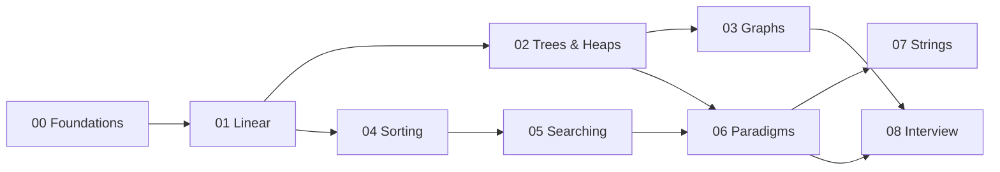

# How to Use This Repo

## 🧠 The Idea

This repo is a **course**, not a dictionary. The folders are numbered `00 → 08` on purpose:
each module assumes you've understood the ones before it. If you read it in order, you never
hit a concept that hasn't been explained yet.

You don't need any DSA background. You only need to be able to read basic code (loops, `if`,
functions). The examples are in **C#**, but every topic explains the idea in plain English and
pseudocode first, so the language barely matters.

## 🗺️ The Path

The straight path is `00 → 01 → 02 → 03 → 04 → 05 → 06 → 07 → 08`. The arrows above just show
*why* the order is what it is (e.g. Graphs leans on Trees and Queues; Paradigms leans on
Recursion and Trees).

## 📖 How to Read a Topic File

Every file has the same sections. Use them differently depending on your goal:

| Your goal | Read these sections |
|-----------|---------------------|
| First time learning it | 🧠 Intuition → 📐 How It Works → 🧾 Pseudocode |
| Implementing it | 🧾 Pseudocode → 💻 C# → 🚫 Common Mistakes |
| Interview review | ⏱️ Complexity → ⚖️ When to Use → ✅ Key Takeaways |
| Practicing | 🎯 Practice (try first, then read the solution) |

## ✅ How to Actually Learn It (not just read it)

1. **Active recall over re-reading.** After the Intuition section, close your eyes and explain
   the idea out loud. If you can't, re-read.
2. **Write the pseudocode from memory** before looking at the C#.
3. **Attempt every 🎯 Practice problem yourself first.** The full solution is right below it —
   but looking too early robs you of the learning. Struggle for ~15 minutes, then peek.
4. **Use the self-check questions** at the bottom of each file as your gate. Can't answer
   them? You're not done with that topic yet.
5. **Space it out.** Revisit a module a few days later. The [Study Plan](../08-Interview-and-Patterns/02.Study-Plan.md)
   has a schedule.

## 🧭 If You're Short on Time

- **One evening before an interview:** [Interview Cheat Sheet](../INTERVIEW_CHEATSHEET.md) +
  [Problem-Solving Patterns](../08-Interview-and-Patterns/01.Problem-Solving-Patterns.md).
- **A weekend:** Foundations + skim each module's README tables + do the Practice in Module 06.
- **Doing it properly:** follow the [Study Plan](../08-Interview-and-Patterns/02.Study-Plan.md).

## 🛠️ Running the C#

The code is written to be readable, not packaged. To try a snippet, drop it into a console
project (`dotnet new console`) or paste it into an online C# playground. Method signatures are
self-contained so you can test them in isolation.

---
◀ Prev: [Module index](README.md) · ▲ [Module index](README.md) · ▶ Next: [Big-O and Complexity](02.Big-O-and-Complexity.md)
