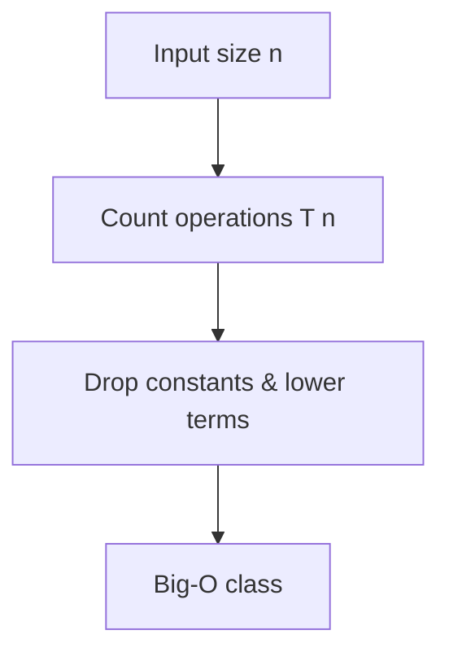

# Big-O & Complexity: Measuring How Algorithms Scale

## 🧠 Intuition

Imagine two ways to find a name in a phone book:

- **Flip page by page** from the start. A 1,000-page book takes up to 1,000 flips. A 2,000-page
  book takes up to 2,000. Double the book, double the work.
- **Open to the middle, decide which half, repeat.** A 1,000-page book takes ~10 steps. A
  *4-billion*-page book takes ~32. Doubling the book adds just **one** step.

Big-O is the language for that difference. It ignores stopwatch seconds (those depend on your
laptop) and instead describes **how the work grows as the input grows**. The first method is
**O(n)**; the second is **O(log n)**. That gap is the whole game.

> 💡 We care about *growth*, not exact counts, because at large scale the growth rate is the
> only thing that matters. An O(n) algorithm beats an O(n²) one for big inputs no matter how
> clever the constants are.

## 📐 How It Works

For an input of size `n`, we count the number of basic operations as a function of `n`, then
**keep only the dominant term and drop constants**.

```
T(n) = 3n² + 50n + 200   →   O(n²)
```

Why? As `n` grows, `n²` dwarfs everything else. At n = 1,000,000 the `3n²` term is a trillion;
the `50n` term is 50 million — a rounding error by comparison.



### The complexity classes, best to worst

| Class | Name | Doubling n does this to the work | Example |
|-------|------|----------------------------------|---------|
| O(1) | Constant | nothing | Array index, hash lookup |
| O(log n) | Logarithmic | adds one step | Binary search |
| O(n) | Linear | doubles | Scan an array |
| O(n log n) | Linearithmic | a bit more than doubles | Merge/heap/quick sort |
| O(n²) | Quadratic | ×4 | Nested loops, bubble sort |
| O(2ⁿ) | Exponential | squares | Brute-force subsets |
| O(n!) | Factorial | explodes | Brute-force permutations |

A feel for the numbers (operations at n = 20 vs n = 40):

| n | n | n log n | n² | 2ⁿ |
|---|---|---------|----|----|
| 20 | 20 | ~86 | 400 | ~1 million |
| 40 | 40 | ~213 | 1,600 | ~1 trillion |

That last column is why an O(2ⁿ) algorithm is unusable past ~n = 40.

## 🧾 Pseudocode (how to analyze any code)

```
1. Identify the input size(s) — usually array length n (sometimes two: n and m).
2. Walk the code:
     - a simple statement      → O(1)
     - a loop over n           → multiply the body by n
     - nested loops            → multiply them together
     - sequential blocks       → add them, then keep the biggest
     - halving each step       → O(log n)
     - recursion               → solve its recurrence (see Recursion)
3. Drop constants and non-dominant terms.
```

## 💻 C# Implementation (each class in code)

```csharp
// O(1) — independent of n
int First(int[] a) => a[0];

// O(log n) — halves the range each step
int BinarySearch(int[] a, int target) {
    int lo = 0, hi = a.Length - 1;
    while (lo <= hi) {
        int mid = lo + (hi - lo) / 2;          // avoids overflow vs (lo+hi)/2
        if (a[mid] == target) return mid;
        if (a[mid] < target) lo = mid + 1; else hi = mid - 1;
    }
    return -1;
}

// O(n) — one pass
int Sum(int[] a) {
    int s = 0;
    foreach (int x in a) s += x;
    return s;
}

// O(n²) — nested loops over the same input
bool HasDuplicateNaive(int[] a) {
    for (int i = 0; i < a.Length; i++)
        for (int j = i + 1; j < a.Length; j++)
            if (a[i] == a[j]) return true;
    return false;
}

// O(n) space, O(n) time — trading memory for speed (vs the O(n²) above)
bool HasDuplicateFast(int[] a) {
    var seen = new HashSet<int>();
    foreach (int x in a)
        if (!seen.Add(x)) return true;   // Add returns false if already present
    return false;
}
```

That last pair is the most important lesson on this page: **you can often trade space for
time.** The hash set turns O(n²) into O(n) by spending O(n) memory.

## ⏱️ Complexity — three cases and amortized

- **Best / Average / Worst case.** Big-O usually describes the **worst case** (the guarantee).
  Linear search is best-case O(1) (item is first) but worst-case O(n).
- **Space complexity** uses the same rules but counts *extra* memory, not the input. A merge
  sort is O(n) space (needs a temp array); an in-place sort is O(1) *auxiliary* space.
- **Amortized complexity** = average cost *per operation over a long sequence*, even if one
  operation is occasionally expensive. Classic example: appending to a dynamic array
  (`List<T>`). Most appends are O(1); occasionally it must double its buffer and copy
  everything (O(n)). Spread over many appends, each costs **O(1) amortized**. (More in
  [Arrays](../01-Linear-Structures/01.Arrays.md).)

| | Time | Space | Why |
|--|------|-------|-----|
| `List<T>.Add` | O(1) amortized | — | Doubling makes the rare O(n) copy average out |
| Binary search | O(log n) | O(1) | Range halves each step |
| Merge sort | O(n log n) | O(n) | log n levels × O(n) merging; temp array |

## ⚖️ When to Use It

Big-O is a *scaling* tool — use it to compare algorithms and predict behavior at large `n`.
But it hides constant factors and real-world effects:

- For **small `n`**, a "worse" algorithm can win (insertion sort beats quick sort under ~16
  elements — that's why real sorts hybridize).
- **Cache locality** matters: O(n) over a contiguous array often beats O(n) over a linked list.
- **Don't optimize blindly** — profile first. Big-O tells you *where* it'll hurt at scale; it
  doesn't tell you it's hurting *today*.

## 🚫 Common Mistakes

```csharp
// ❌ Thinking this is O(n) — string concatenation in a loop is O(n²)
string Build(string[] parts) {
    string r = "";
    foreach (var p in parts) r += p;   // each += copies the whole string so far
    return r;
}

// ✅ O(n) with StringBuilder
string BuildFast(string[] parts) {
    var sb = new System.Text.StringBuilder();
    foreach (var p in parts) sb.Append(p);
    return sb.ToString();
}
```

Other traps:
- **Hidden costs inside library calls** (`.Contains` on a `List<T>` is O(n), on a `HashSet<T>`
  is O(1)).
- **Two different inputs** → keep both variables: iterating an `n`-array then an `m`-array is
  **O(n + m)**, *not* O(n). Don't collapse independent sizes.
- **Forgetting recursion's hidden stack space** — recursive Fibonacci is O(2ⁿ) time *and* O(n)
  stack space.

## 🌍 Real-World Applications

- Choosing a data structure (array vs hash table vs tree) is a Big-O decision.
- Database index design: an index turns an O(n) table scan into an O(log n) lookup.
- Spotting why a feature "works in testing but melts in production" — usually an O(n²) that was
  invisible at small `n`.

## 🎯 Practice (with full solutions)

### 1. State the complexity — `Easy`
**Problem:** What is the time complexity of this function?
```csharp
void F(int[] a) {
    for (int i = 0; i < a.Length; i++)        // n
        for (int j = 0; j < a.Length; j++)    // n
            Console.WriteLine(a[i] + a[j]);   // O(1)
}
```
**Approach:** Two independent loops, each over `n`, nested → multiply. Body is O(1).
**Answer:** **O(n²)** time, O(1) extra space.
**Why this fits:** Nested loops over the same input is the canonical quadratic shape.

### 2. Spot the trap — `Easy`
**Problem:** Is this O(n) or O(n²)?
```csharp
void G(int[] a) {
    for (int i = 0; i < a.Length; i++) {      // n iterations
        if (new List<int>(a).Contains(a[i]))  // O(n) copy + O(n) search, each iteration
            Console.WriteLine("found");
    }
}
```
**Approach:** The loop runs `n` times. *Inside* it, building a `List` is O(n) and `Contains`
scans O(n). So each iteration is O(n), times `n` iterations.
**Answer:** **O(n²)** — the hidden O(n) work inside the loop is the culprit.
**Why this fits:** Trains you to look *inside* library calls, the #1 analysis mistake.

### 3. Two inputs — `Medium`
**Problem:** Complexity of merging two sorted arrays of sizes `n` and `m` into one sorted array?
**Approach:** A single pass with two pointers walks each element once.
```csharp
int[] Merge(int[] a, int[] b) {
    var r = new int[a.Length + b.Length];
    int i = 0, j = 0, k = 0;
    while (i < a.Length && j < b.Length)
        r[k++] = a[i] <= b[j] ? a[i++] : b[j++];
    while (i < a.Length) r[k++] = a[i++];
    while (j < b.Length) r[k++] = b[j++];
    return r;
}
```
**Answer:** **O(n + m)** time, **O(n + m)** space. Don't write O(n) — the sizes are independent.
**Why this fits:** Reinforces keeping separate variables for independent inputs (and previews
the merge step of [Merge Sort](../04-Sorting/04.Merge-Sort.md)).

### 4. Reduce the complexity — `Medium`
**Problem:** Given an array, return `true` if any two numbers sum to a target. Beat O(n²).
**Approach:** For each `x`, the partner you need is `target - x`. Remember everything you've
seen in a hash set so the lookup is O(1).
```csharp
bool TwoSumExists(int[] a, int target) {
    var seen = new HashSet<int>();
    foreach (int x in a) {
        if (seen.Contains(target - x)) return true;
        seen.Add(x);
    }
    return false;
}
```
**Answer:** **O(n)** time, **O(n)** space — down from the obvious O(n²) double loop.
**Why this fits:** The fundamental space-for-time trade, the engine behind countless O(n) tricks.

## ✅ Key Takeaways

- Big-O describes **growth**, not seconds; drop constants and lower-order terms.
- Worst-case is the usual guarantee; know best/average/amortized too.
- Nested loops multiply; sequential blocks add; halving is log; recursion needs a recurrence.
- **You can trade space for time** — hashing and caching turn O(n²) into O(n).
- Look *inside* library calls; account for hidden costs and recursion stack space.

**Self-check:**
1. Why is `List<T>.Add` O(1) *amortized* but O(n) worst-case?
2. An algorithm loops over array `a` (size n), then separately over array `b` (size m). What's
   its complexity, and why isn't it O(n)?
3. Name one situation where an O(n²) algorithm beats an O(n log n) one.

---
◀ Prev: [How to Use This Repo](01.How-To-Use-This-Repo.md) · ▲ [Module index](README.md) · ▶ Next: [Recursion](03.Recursion.md)
