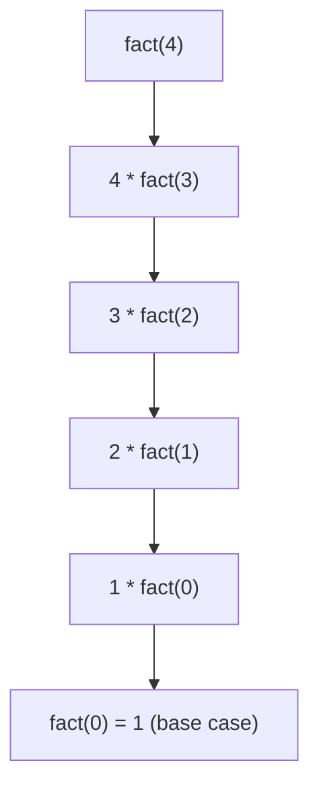

# Recursion: Solving a Problem in Terms of Itself

## 🧠 Intuition

Recursion is when a function **calls itself** on a smaller version of the same problem, until
the problem is small enough to answer directly.

> 💡 **Analogy — Russian nesting dolls.** To count the dolls, you open one, and to count what's
> inside you do the *same thing again* on the smaller doll, until you hit the tiny solid doll
> that can't open (the **base case**). The count is "1 + however many are inside."

Every recursion has two parts:
1. **Base case** — the smallest input you can answer without recursing. *Without this, you
   recurse forever (stack overflow).*
2. **Recursive case** — solve a smaller piece, trust the function to handle the rest, combine.

The hardest mental shift: **stop trying to trace every call.** Assume the recursive call
already returns the correct answer for the smaller input (the "recursive leap of faith"), and
just make sure you (a) shrink toward the base case and (b) combine results correctly.

## 📐 How It Works

Take factorial: `n! = n × (n-1)!`, with `0! = 1`.



Calls **wind up** until the base case, then **unwind** as each multiplication resolves:

```
fact(0)=1 → fact(1)=1 → fact(2)=2 → fact(3)=6 → fact(4)=24
```

### The call stack

Each call gets its own frame (its own local variables, paused mid-line) pushed on the **call
stack**. The base case lets the stack start popping. This is why deep recursion can
**overflow the stack** — there's a finite number of frames you can stack up (typically a few
thousand to tens of thousands).

### Recursion trees and recurrences

To find a recursive algorithm's complexity, write a **recurrence**: the cost of size `n` in
terms of smaller sizes.

- Factorial: `T(n) = T(n-1) + O(1)` → unrolls to n steps → **O(n)**.
- Binary search: `T(n) = T(n/2) + O(1)` → **O(log n)**.
- Merge sort: `T(n) = 2T(n/2) + O(n)` → **O(n log n)** (n work on each of log n levels).
- Naive Fibonacci: `T(n) = T(n-1) + T(n-2) + O(1)` → **O(2ⁿ)** (the tree branches in two
  every level — wildly wasteful, see Mistakes).

## 🧾 Pseudocode

```
function solve(problem):
    if problem is small enough:        # base case — MUST exist and be reachable
        return direct answer
    smaller = reduce(problem)          # move toward the base case
    return combine(solve(smaller))     # trust the recursive call, combine
```

## 💻 C# Implementation

```csharp
// Factorial — linear recursion
long Factorial(int n) {
    if (n <= 1) return 1;              // base case
    return n * Factorial(n - 1);      // recursive case
}

// Sum of an array, recursively (index marks the "smaller" subproblem)
int SumFrom(int[] a, int i) {
    if (i == a.Length) return 0;      // base: nothing left
    return a[i] + SumFrom(a, i + 1);  // first element + sum of the rest
}

// Reverse a string by peeling the first character
string Reverse(string s) {
    if (s.Length <= 1) return s;                  // base
    return Reverse(s.Substring(1)) + s[0];        // reverse the rest, append first
}

// Fibonacci done RIGHT — memoized so each value is computed once → O(n)
long Fib(int n, Dictionary<int, long> memo = null) {
    memo ??= new Dictionary<int, long>();
    if (n <= 1) return n;
    if (memo.TryGetValue(n, out long cached)) return cached;
    long result = Fib(n - 1, memo) + Fib(n - 2, memo);
    memo[n] = result;
    return result;
}
```

> Memoization is the bridge from recursion to [Dynamic Programming](../06-Algorithm-Paradigms/06.Dynamic-Programming.md).

## ⏱️ Complexity

| Pattern | Recurrence | Time | Space (stack) |
|---------|-----------|------|---------------|
| Linear (factorial, sum) | T(n)=T(n-1)+O(1) | O(n) | O(n) frames |
| Halving (binary search) | T(n)=T(n/2)+O(1) | O(log n) | O(log n) |
| Divide & conquer (merge sort) | T(n)=2T(n/2)+O(n) | O(n log n) | O(log n) |
| Branching, no memo (naive Fib) | T(n)=T(n-1)+T(n-2) | O(2ⁿ) | O(n) |
| Branching **with memo** | each state once | O(n) | O(n) |

Recursion always costs **stack space** proportional to its maximum depth — easy to forget.

## ⚖️ When to Use It

- **Use recursion** when the problem is naturally self-similar: trees, graphs, divide &
  conquer, backtracking, generating combinations. The code is often far shorter and clearer.
- **Prefer iteration** when depth can be huge (risk of stack overflow) or the problem is a
  simple linear loop. Any recursion *can* be rewritten with an explicit stack/loop.
- **Tail recursion** (the recursive call is the last thing done) can be turned into a loop;
  note C#/.NET does **not** guarantee tail-call optimization, so deep tail recursion can still
  overflow — convert it to a loop yourself when depth is large.

## 🚫 Common Mistakes

```csharp
// ❌ No base case (or unreachable) → infinite recursion → StackOverflowException
int Bad(int n) => Bad(n - 1);          // never stops

// ✅ Always have a reachable base case
int Good(int n) => n <= 0 ? 0 : n + Good(n - 1);
```

```csharp
// ❌ Exponential recomputation — Fib(40) makes ~2 billion calls
long FibSlow(int n) => n <= 1 ? n : FibSlow(n - 1) + FibSlow(n - 2);
// ✅ Memoize (see Fib above) — O(n)
```

Other traps:
- **Not shrinking the input** — recursing on the same or *larger* problem never terminates.
- **Wrong base case** (off by one) — e.g. `n < 1` vs `n <= 1` changes the result.
- **Deep recursion on large input** — a recursion of depth 1,000,000 overflows; use a loop.

## 🌍 Real-World Applications

- Walking trees and file systems (directories within directories).
- Parsers / interpreters (expressions contain sub-expressions).
- Divide & conquer: [Merge Sort](../04-Sorting/04.Merge-Sort.md), [Quick Sort](../04-Sorting/05.Quick-Sort.md).
- [Backtracking](../06-Algorithm-Paradigms/04.Backtracking.md) (sudoku, mazes, permutations).
- Graph traversal: [DFS](../03-Graphs/02.BFS-and-DFS.md).

## 🎯 Practice (with full solutions)

### 1. Power function — `Easy`
**Problem:** Compute `x^n` for non-negative `n` recursively.
**Approach:** `x^n = x · x^(n-1)`, base `x^0 = 1`.
```csharp
double Power(double x, int n) => n == 0 ? 1 : x * Power(x, n - 1);
```
**Complexity:** O(n) time/stack. **Why this fits:** the simplest "reduce by one" recursion.
*Bonus:* `x^n = (x^(n/2))²` gives an **O(log n)** version — a divide-and-conquer warm-up.

### 2. Sum of digits — `Easy`
**Problem:** Sum the digits of a non-negative integer (e.g. 1234 → 10).
**Approach:** Last digit is `n % 10`; the rest is `n / 10`. Base: a single digit (`n < 10`).
```csharp
int DigitSum(int n) => n < 10 ? n : n % 10 + DigitSum(n / 10);
```
**Complexity:** O(d) where d = number of digits. **Why this fits:** shrinking via integer
division is a recurring trick.

### 3. Generate all subsets — `Medium`
**Problem:** Return every subset of `[1,2,3]` (the power set).
**Approach:** For each element, branch two ways — *include it* or *exclude it* — and recurse on
the rest. This binary choice tree is the heart of backtracking.
```csharp
IList<IList<int>> Subsets(int[] nums) {
    var result = new List<IList<int>>();
    void Recurse(int i, List<int> current) {
        if (i == nums.Length) {                 // base: decided every element
            result.Add(new List<int>(current)); // copy! current keeps mutating
            return;
        }
        Recurse(i + 1, current);                // exclude nums[i]
        current.Add(nums[i]);                   // include nums[i]
        Recurse(i + 1, current);
        current.RemoveAt(current.Count - 1);    // undo (backtrack)
    }
    Recurse(0, new List<int>());
    return result;
}
```
**Complexity:** O(2ⁿ) subsets × O(n) to copy each → O(n·2ⁿ). **Why this fits:** the
include/exclude pattern is the template for [Backtracking](../06-Algorithm-Paradigms/04.Backtracking.md).

### 4. Tower of Hanoi — `Medium`
**Problem:** Move `n` disks from peg A to C using B, never placing a larger disk on a smaller.
**Approach:** Move top `n-1` to the spare, move the big disk, move the `n-1` back on top. The
recursive leap of faith in pure form.
```csharp
void Hanoi(int n, char from, char to, char spare) {
    if (n == 0) return;
    Hanoi(n - 1, from, spare, to);                       // n-1 out of the way
    Console.WriteLine($"Move disk {n} from {from} to {to}");
    Hanoi(n - 1, spare, to, from);                       // n-1 back on top
}
```
**Complexity:** O(2ⁿ) moves — provably minimal. **Why this fits:** shows recursion expressing a
solution that's painful to write iteratively.

## ✅ Key Takeaways

- Every recursion needs a **reachable base case** + a step that **shrinks toward it**.
- Take the **recursive leap of faith**: trust the smaller call, focus on combining.
- Find complexity by writing the **recurrence** / drawing the recursion tree.
- Recursion costs **stack space** = its depth; deep recursion can overflow.
- **Overlapping subproblems? Memoize** — that's the doorway to dynamic programming.

**Self-check:**
1. What two parts must every recursive function have?
2. Why is naive recursive Fibonacci O(2ⁿ), and what one change makes it O(n)?
3. When would you rewrite a recursion as a loop instead?

---
◀ Prev: [Big-O and Complexity](02.Big-O-and-Complexity.md) · ▲ [Module index](README.md) · ▶ Next: [Bit Manipulation](04.Bit-Manipulation.md)
