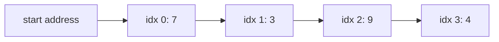
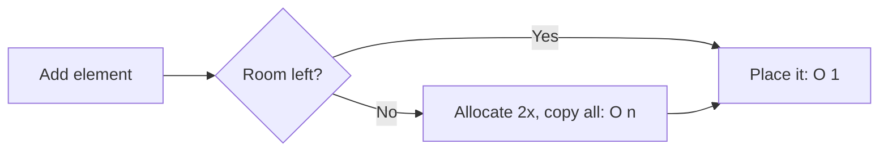

# Arrays: Contiguous Memory, Instant Access

## 🧠 Intuition

An array is a row of boxes sitting **side by side in memory**, all the same size, numbered from
0. Because they're contiguous and equal-sized, the computer can jump straight to box `i` with
one multiplication: `address = start + i × box_size`. No searching — that's why array access is
**O(1)**.

> 💡 **Analogy — a street of identical houses.** If you know house #0's address and each house
> is the same width, you can compute exactly where house #237 is without walking the street.
> But *inserting* a new house in the middle means shifting every house after it down one — slow.

That single trade-off defines arrays: **instant read by index, expensive insert/delete in the
middle** (you must shift everything over).

## 📐 How It Works



### Static vs dynamic arrays

- **Static array** (`int[5]`): fixed capacity, chosen at creation. Can't grow.
- **Dynamic array** (`List<T>`): wraps a static array and **grows automatically**. When it
  fills up, it allocates a bigger array (typically **double** the size) and copies everything
  over. That copy is O(n), but it happens rarely — so `Add` is **O(1) amortized** (see
  [Big-O](../00-Foundations/02.Big-O-and-Complexity.md#-complexity--three-cases-and-amortized)).



### Multi-dimensional & jagged

- **Rectangular** `int[,]` — a true 2D grid, one memory block (great cache behavior).
- **Jagged** `int[][]` — an array of arrays; each row can have a different length.

## 🧾 Pseudocode

```
access(arr, i):        return arr[i]                 # O(1)
insert_at(arr, i, x):  shift arr[i..end] right by 1  # O(n)
                       arr[i] = x
delete_at(arr, i):     shift arr[i+1..end] left by 1 # O(n)
```

## 💻 C# Implementation

```csharp
// Static array — fixed size
int[] a = new int[5];          // [0,0,0,0,0]
a[2] = 9;                      // O(1) write
int x = a[2];                  // O(1) read

// 2D and jagged
int[,] grid = new int[3, 4];   // 3x4 rectangular
int[][] jagged = new int[3][]; // rows sized independently
jagged[0] = new int[2];

// Dynamic array
var list = new List<int>(capacity: 1000);  // pre-size to avoid regrowth
list.Add(10);                  // O(1) amortized
list.Insert(0, 5);             // O(n) — shifts everything right
list.RemoveAt(0);              // O(n) — shifts everything left

// Deep copy (NOT `int[] b = a;` — that shares the same array!)
int[] copy = new int[a.Length];
Array.Copy(a, copy, a.Length);
```

## ⏱️ Complexity

| Operation | Time | Why |
|-----------|------|-----|
| Access / update by index | O(1) | Direct address arithmetic |
| Search (unsorted) | O(n) | Must scan |
| Search (sorted) | O(log n) | [Binary search](../05-Searching/02.Binary-Search.md) |
| Insert / delete at end (dynamic) | O(1) amortized | Occasional doubling copy averages out |
| Insert / delete in middle | O(n) | Shift the tail |
| Space | O(n) | No per-element pointer overhead |

> **Cache locality bonus:** because elements are contiguous, scanning an array is much faster
> in practice than scanning a [linked list](03.Linked-Lists.md) of the same length, even though
> both are "O(n)." The CPU fetches memory in blocks, so neighbors come along for free.

## ⚖️ When to Use It

- **Use an array when** you need fast index access, you iterate a lot (cache-friendly), or the
  size is known/stable.
- **Avoid when** you insert/delete in the middle frequently → a [linked list](03.Linked-Lists.md)
  or different structure may fit better.
- **Default in practice:** `List<T>`. Reach for raw `T[]` only when size is fixed or for
  performance-critical, tight loops.

## 🚫 Common Mistakes

```csharp
// ❌ Off-by-one: <= goes one past the end → IndexOutOfRangeException
for (int i = 0; i <= a.Length; i++) { }
// ✅
for (int i = 0; i < a.Length; i++) { }

// ❌ "Copy" that actually shares the same array
int[] b = a;
b[0] = 99;          // also changes a[0]!
// ✅ real copy
int[] b2 = (int[])a.Clone();

// ❌ Growing a List in a hot loop without pre-sizing → many O(n) resizes
var l = new List<int>();
for (int i = 0; i < 1_000_000; i++) l.Add(i);
// ✅ pre-allocate
var l2 = new List<int>(1_000_000);
```

## 🌍 Real-World Applications

- Image buffers (pixels as a 2D array), audio samples.
- Feature vectors in machine learning.
- The backing store for almost everything else: [stacks](04.Stacks.md), [queues](05.Queues-and-Deques.md),
  [heaps](../02-Trees-and-Heaps/04.Heaps-and-Priority-Queues.md), dynamic strings.
- Lookup/state tables in OS and database internals.

## 🎯 Practice (with full solutions)

### 1. Two Sum — `Easy`
**Problem:** Return indices of the two numbers that add up to `target`.
**Approach:** One pass; remember each value's index in a hash map and look for its complement.
(See [Hash Tables](06.Hash-Tables.md).)
```csharp
int[] TwoSum(int[] nums, int target) {
    var seen = new Dictionary<int, int>();
    for (int i = 0; i < nums.Length; i++) {
        if (seen.TryGetValue(target - nums[i], out int j))
            return new[] { j, i };
        seen[nums[i]] = i;
    }
    return Array.Empty<int>();
}
```
**Complexity:** O(n) time, O(n) space. **Why this fits:** the array→hash trade that beats the
O(n²) double loop.

### 2. Remove Duplicates from Sorted Array — `Easy`
**Problem:** In-place, keep each unique value once; return the new length.
**Approach:** Two pointers — `write` marks where the next unique goes, `read` scans ahead.
```csharp
int RemoveDuplicates(int[] nums) {
    if (nums.Length == 0) return 0;
    int write = 0;
    for (int read = 1; read < nums.Length; read++)
        if (nums[read] != nums[write])
            nums[++write] = nums[read];
    return write + 1;
}
```
**Complexity:** O(n) time, O(1) space. **Why this fits:** the in-place [two-pointer](../06-Algorithm-Paradigms/01.Two-Pointers-and-Sliding-Window.md) pattern.

### 3. Rotate Array by k — `Medium`
**Problem:** Shift elements right by `k`, in place, using O(1) extra space.
**Approach:** The reversal trick — reverse the whole array, then reverse the first `k` and the
rest. Three reversals leave it rotated.
```csharp
void Rotate(int[] nums, int k) {
    int n = nums.Length; k %= n;
    Reverse(nums, 0, n - 1);
    Reverse(nums, 0, k - 1);
    Reverse(nums, k, n - 1);
}
void Reverse(int[] a, int i, int j) {
    while (i < j) { (a[i], a[j]) = (a[j], a[i]); i++; j--; }
}
```
**Complexity:** O(n) time, O(1) space. **Why this fits:** a clever in-place manipulation that
avoids an O(n) extra buffer.

### 4. Product of Array Except Self — `Medium`
**Problem:** Return `out[i] = product of all elements except nums[i]`, **without division**.
**Approach:** Two passes — prefix products left-to-right, then multiply by suffix products
right-to-left. (Previews [Prefix Sums](../06-Algorithm-Paradigms/02.Prefix-Sums.md).)
```csharp
int[] ProductExceptSelf(int[] nums) {
    int n = nums.Length;
    var res = new int[n];
    res[0] = 1;
    for (int i = 1; i < n; i++) res[i] = res[i - 1] * nums[i - 1]; // prefix
    int suffix = 1;
    for (int i = n - 1; i >= 0; i--) { res[i] *= suffix; suffix *= nums[i]; }
    return res;
}
```
**Complexity:** O(n) time, O(1) extra (output aside). **Why this fits:** precomputation turning
an O(n²) brute force into O(n).

## ✅ Key Takeaways

- Arrays give **O(1) indexed access** via address arithmetic; middle insert/delete is **O(n)**.
- Dynamic arrays (`List<T>`) grow by doubling → **amortized O(1)** append; pre-size hot loops.
- Contiguity makes arrays **cache-friendly** — often faster than linked lists in practice.
- `int[] b = a;` shares the array — use `Clone()`/`Array.Copy` to truly copy.
- The **two-pointer** and **prefix** patterns turn many array problems from O(n²) to O(n).

**Self-check:**
1. Why is array access O(1) but middle insertion O(n)?
2. Why is `List<T>.Add` O(1) amortized despite occasional resizing?
3. What does `int[] b = a;` actually do, and how do you make a real copy?

---
◀ Prev: [Module index](README.md) · ▲ [Module index](README.md) · ▶ Next: [Strings](02.Strings.md)
