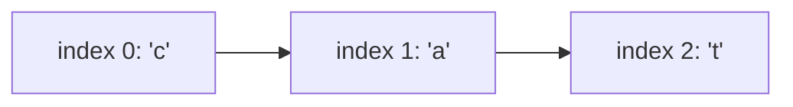

# Strings: Arrays of Characters, with a Twist

## 🧠 Intuition

A string is just an **array of characters** — `"cat"` is `['c','a','t']`. Everything you know
about arrays applies: indexing is O(1), length is known, you can scan it.

The twist that trips people up: in most modern languages (C#, Java, Python, JavaScript),
strings are **immutable** — once created, they can't be changed. "Modifying" a string actually
builds a *brand new* string. That's invisible until you do it in a loop, where it quietly turns
O(n) work into O(n²).

> 💡 **Analogy — printed pages vs a whiteboard.** A string is a printed page: to "edit" it you
> reprint the whole page. If you reprint after every word, printing a 1,000-word document costs
> a fortune. A `StringBuilder` is the whiteboard — write, erase, rewrite cheaply, and print
> *once* at the end.

## 📐 How It Works



### Immutability in action

```csharp
string s = "cat";
s += "s";   // does NOT edit "cat". Allocates a new "cats", copies 4 chars, points s at it.
```

Do that `n` times and you copy 1 + 2 + 3 + ... + n ≈ n²/2 characters → **O(n²)**. The fix is
`StringBuilder`, a mutable, internally-resizing character buffer (a dynamic array of chars).

### Characters and encoding (the honest version)

A C# `char` is a 16-bit UTF-16 code unit. For everyday ASCII/BMP text, "one char = one letter"
holds. But some symbols (emoji, rare scripts) take **two** chars (a surrogate pair), so
`s.Length` counts code units, not always human-perceived characters. For interview/DSA
problems you can assume one char = one symbol unless told otherwise — just know the caveat
exists.

## 🧾 Pseudocode

```
build_string(parts):
    buffer = empty growable char buffer
    for p in parts:
        buffer.append(p)        # cheap, amortized O(1)
    return buffer.to_string()   # one final O(n) materialization

is_palindrome(s):
    i = 0, j = len(s) - 1
    while i < j:
        if s[i] != s[j]: return false
        i++, j--
    return true
```

## 💻 C# Implementation

```csharp
string s = "hello";
char c = s[0];                 // 'h' — O(1) index
int n = s.Length;              // 5
bool starts = s.StartsWith("he");
string sub = s.Substring(1, 3);// "ell" — allocates a new string (O(length))

// ❌ O(n²): concatenation in a loop
string Bad(string[] words) {
    string r = "";
    foreach (var w in words) r += w;   // new string every iteration
    return r;
}

// ✅ O(n): StringBuilder
string Good(string[] words) {
    var sb = new System.Text.StringBuilder();
    foreach (var w in words) sb.Append(w);
    return sb.ToString();
}

// Mutating "in place" requires a char array
char[] chars = s.ToCharArray();
Array.Reverse(chars);
string reversed = new string(chars);   // "olleh"

// Frequency map of characters — bread and butter of string problems
int[] freq = new int[26];              // for lowercase a–z
foreach (char ch in "banana") freq[ch - 'a']++;
```

> `ch - 'a'` maps `'a'..'z'` to `0..25` — a tiny, fast hash for lowercase letters that replaces
> a `Dictionary<char,int>` when the alphabet is fixed.

## ⏱️ Complexity

| Operation | Time | Note |
|-----------|------|------|
| Index `s[i]`, `Length` | O(1) | Backed by an array |
| Concatenate `a + b` | O(len a + len b) | Allocates a new string |
| `Substring`, `ToUpper`, etc. | O(length) | New string each time (immutable) |
| Loop of `n` concatenations | **O(n²)** | The classic trap — use StringBuilder |
| `StringBuilder.Append` | O(1) amortized | Mutable buffer that doubles |
| Compare / search | O(n·m) naive | See [Pattern Matching](../07-String-Algorithms/01.Pattern-Matching.md) for O(n+m) |

## ⚖️ When to Use It

- Use plain `string` for fixed or rarely-changed text — immutability makes it safe to share and
  use as a hash/dictionary key.
- Use `StringBuilder` whenever you assemble text in a **loop** or across many steps.
- For heavy character-level algorithms, convert to `char[]` once, work in place, convert back.

## 🚫 Common Mistakes

```csharp
// ❌ Comparing strings with == ... is actually fine in C# (value equality),
//    but reference equality bites you in some languages — know your language.
//    The real C# trap is case/culture:
"İ".ToLower() // culture-dependent! Use ToLowerInvariant() for ordinal logic.

// ❌ Indexing assuming one char == one symbol with emoji
string e = "😀";
int len = e.Length;   // 2, not 1 (surrogate pair)

// ❌ Building strings in a loop with +
// ✅ StringBuilder (see Good() above)
```

## 🌍 Real-World Applications

- Text processing, parsing, tokenization, log analysis.
- DNA/protein sequences (strings over a tiny alphabet).
- URLs, file paths, serialization formats (JSON/CSV).
- Search engines and autocomplete (→ [Tries](../02-Trees-and-Heaps/05.Tries.md), [pattern matching](../07-String-Algorithms/01.Pattern-Matching.md)).

## 🎯 Practice (with full solutions)

### 1. Valid Palindrome — `Easy`
**Problem:** Is the string a palindrome, ignoring non-alphanumerics and case?
**Approach:** Two pointers from both ends, skipping junk characters.
```csharp
bool IsPalindrome(string s) {
    int i = 0, j = s.Length - 1;
    while (i < j) {
        while (i < j && !char.IsLetterOrDigit(s[i])) i++;
        while (i < j && !char.IsLetterOrDigit(s[j])) j--;
        if (char.ToLowerInvariant(s[i]) != char.ToLowerInvariant(s[j])) return false;
        i++; j--;
    }
    return true;
}
```
**Complexity:** O(n) time, O(1) space. **Why this fits:** [two pointers](../06-Algorithm-Paradigms/01.Two-Pointers-and-Sliding-Window.md) on a char sequence.

### 2. Valid Anagram — `Easy`
**Problem:** Are `s` and `t` anagrams of each other?
**Approach:** Count characters in `s`, subtract for `t`; all counts must end at zero.
```csharp
bool IsAnagram(string s, string t) {
    if (s.Length != t.Length) return false;
    int[] count = new int[26];
    foreach (char c in s) count[c - 'a']++;
    foreach (char c in t) if (--count[c - 'a'] < 0) return false;
    return true;
}
```
**Complexity:** O(n) time, O(1) space (fixed 26-slot array). **Why this fits:** the frequency-
array trick for a fixed alphabet.

### 3. Longest Substring Without Repeating Characters — `Medium`
**Problem:** Length of the longest substring with all-distinct characters.
**Approach:** Sliding window; track the last index of each char and jump the left edge past any
repeat. (Core [sliding-window](../06-Algorithm-Paradigms/01.Two-Pointers-and-Sliding-Window.md) problem.)
```csharp
int LengthOfLongestSubstring(string s) {
    var last = new Dictionary<char, int>();
    int left = 0, best = 0;
    for (int right = 0; right < s.Length; right++) {
        if (last.TryGetValue(s[right], out int idx) && idx >= left)
            left = idx + 1;
        last[s[right]] = right;
        best = Math.Max(best, right - left + 1);
    }
    return best;
}
```
**Complexity:** O(n) time, O(min(n, alphabet)) space. **Why this fits:** windows + hashing,
together.

### 4. Group Anagrams — `Medium`
**Problem:** Group words that are anagrams of one another.
**Approach:** Two anagrams share a *canonical form* (their sorted letters). Use it as a map key.
```csharp
IList<IList<string>> GroupAnagrams(string[] strs) {
    var groups = new Dictionary<string, List<string>>();
    foreach (var s in strs) {
        char[] key = s.ToCharArray();
        Array.Sort(key);
        string k = new string(key);
        if (!groups.TryGetValue(k, out var list)) groups[k] = list = new List<string>();
        list.Add(s);
    }
    return new List<IList<string>>(groups.Values);
}
```
**Complexity:** O(N · k log k) for N words of length k. **Why this fits:** designing a hash
*key* to bucket related items — a recurring [hash-table](06.Hash-Tables.md) skill.

## ✅ Key Takeaways

- A string is an array of chars: **O(1) indexing**, O(n) to copy/substring.
- Strings are **immutable** — concatenating in a loop is **O(n²)**; use `StringBuilder`.
- For a fixed alphabet, a **frequency array** (`count[c - 'a']`) beats a dictionary.
- Many string problems are really [two-pointer](../06-Algorithm-Paradigms/01.Two-Pointers-and-Sliding-Window.md) or sliding-window problems.
- Mind culture/case (`ToLowerInvariant`) and that one symbol isn't always one `char`.

**Self-check:**
1. Why does concatenating in a loop cost O(n²), and what fixes it?
2. How does `count[c - 'a']` work as a character counter, and when can't you use it?
3. What canonical key groups anagrams together?

---
◀ Prev: [Arrays](01.Arrays.md) · ▲ [Module index](README.md) · ▶ Next: [Linked Lists](03.Linked-Lists.md)
