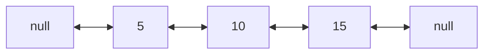

# Linked Lists: A Chain of Nodes

## 🧠 Intuition

An array keeps its elements side by side in memory. A **linked list** scatters them anywhere,
and each element (a **node**) holds a **pointer** to the next one. To traverse, you follow the
chain: this node says "the next one is over there," and so on, until a node points at nothing
(`null`).

> 💡 **Analogy — a treasure hunt.** Each clue tells you where the *next* clue is. You can't skip
> to clue #5 — you must follow #1 → #2 → ... That's why access is **O(n)**: no shortcuts. But
> inserting a new clue is trivial — just rewrite two clues to point at it. That's why insertion
> at a known spot is **O(1)**.

The trade-off is the mirror image of arrays: **slow to find, fast to splice.**

## 📐 How It Works

A node = `{ data, next }`. The list keeps a `Head` reference to the first node.

```mermaid
graph LR
    H[Head] --> A[5 | next]
    A --> B[10 | next]
    B --> C[15 | null]
```

### Variants

- **Singly linked:** each node points to `next` only. (The default.)
- **Doubly linked:** each node also points to `prev` — lets you walk backward and delete a node
  in O(1) given just that node. (C#'s built-in `LinkedList<T>` is doubly linked.)
- **Circular:** the last node points back to the head — handy for round-robin scheduling.



## 🧾 Pseudocode

```
prepend(value):                 # O(1)
    node = Node(value)
    node.next = head
    head = node

reverse():                      # O(n), O(1) space
    prev = null
    cur = head
    while cur != null:
        nxt = cur.next
        cur.next = prev
        prev = cur
        cur = nxt
    head = prev
```

## 💻 C# Implementation

```csharp
public class Node<T> {
    public T Data;
    public Node<T> Next;
    public Node(T data) { Data = data; }
}

public class LinkedList<T> {
    private Node<T> head;

    public void Prepend(T data) {                 // O(1)
        head = new Node<T>(data) { Next = head };
    }

    public void Append(T data) {                  // O(n) without a tail pointer
        var node = new Node<T>(data);
        if (head == null) { head = node; return; }
        var cur = head;
        while (cur.Next != null) cur = cur.Next;
        cur.Next = node;
    }

    public bool Delete(T data) {                   // O(n)
        if (head == null) return false;
        if (head.Data.Equals(data)) { head = head.Next; return true; }
        var cur = head;
        while (cur.Next != null) {
            if (cur.Next.Data.Equals(data)) { cur.Next = cur.Next.Next; return true; }
            cur = cur.Next;
        }
        return false;
    }

    public void Reverse() {                         // O(n) time, O(1) space
        Node<T> prev = null, cur = head;
        while (cur != null) {
            var next = cur.Next;
            cur.Next = prev;
            prev = cur;
            cur = next;
        }
        head = prev;
    }
}
```

### Floyd's cycle detection (the "two runners" trick)

```csharp
bool HasCycle(Node<T> head) {
    var slow = head; var fast = head;
    while (fast != null && fast.Next != null) {
        slow = slow.Next;          // 1 step
        fast = fast.Next.Next;     // 2 steps
        if (slow == fast) return true;   // they meet ⇒ loop
    }
    return false;
}
```

If there's a loop, the fast pointer laps the slow one and they collide; if not, fast hits
`null`. O(n) time, O(1) space.

## ⏱️ Complexity

| Operation | Time | Why |
|-----------|------|-----|
| Access / search by value | O(n) | Must walk the chain |
| Insert / delete at head | O(1) | Re-point head |
| Insert / delete at tail | O(1) with tail ptr, else O(n) | Need to reach the end |
| Insert / delete at known node (doubly) | O(1) | Re-point neighbors |
| Space | O(n) + pointer overhead | Each node stores extra reference(s) |

## ⚖️ When to Use It

- **Use a linked list when** you insert/delete at the ends or at known positions a lot, and you
  rarely need random access — e.g. an LRU cache's recency list, an undo stack, a queue.
- **Prefer an array/`List<T>` when** you need indexing or you iterate heavily — arrays win on
  **cache locality** (nodes scattered in memory cause cache misses, so a "O(n)" list scan is
  slower than an "O(n)" array scan).
- It's the foundation under [stacks](04.Stacks.md), [queues](05.Queues-and-Deques.md), and
  adjacency lists in [graphs](../03-Graphs/01.Graph-Representations.md).

## 🚫 Common Mistakes

```csharp
// ❌ Skipping two nodes can dereference null
while (cur != null) { Console.WriteLine(cur.Data); cur = cur.Next.Next; }
// ✅
while (cur != null) { Console.WriteLine(cur.Data); cur = cur.Next; }

// ❌ Losing the rest of the list when re-pointing
head = head.Next;          // fine to advance, but if you meant to insert, save refs first
// ✅ during insertion, capture next BEFORE overwriting
var next = cur.Next;
cur.Next = newNode;
newNode.Next = next;
```

Other traps: forgetting the **tail/empty-list edge cases**, and re-pointing in the wrong order
during a reverse (always save `cur.Next` before you overwrite it).

## 🌍 Real-World Applications

- Music playlists / browser history (next & previous → doubly linked).
- Undo/redo stacks in editors.
- LRU cache (doubly linked list + hash map).
- Adjacency lists for graphs; the chaining buckets in a [hash table](06.Hash-Tables.md).

## 🎯 Practice (with full solutions)

### 1. Reverse a Linked List — `Easy`
**Problem:** Reverse a singly linked list and return the new head.
**Approach:** Walk once, flipping each `next` pointer backward; keep `prev`, `cur`, `next`.
```csharp
Node<T> Reverse(Node<T> head) {
    Node<T> prev = null;
    while (head != null) {
        var next = head.Next;
        head.Next = prev;
        prev = head;
        head = next;
    }
    return prev;
}
```
**Complexity:** O(n) time, O(1) space. **Why this fits:** the canonical pointer-rewiring drill.

### 2. Middle of the Linked List — `Easy`
**Problem:** Return the middle node (second middle if even length).
**Approach:** Fast/slow pointers; when fast reaches the end, slow is at the middle.
```csharp
Node<T> Middle(Node<T> head) {
    var slow = head; var fast = head;
    while (fast != null && fast.Next != null) { slow = slow.Next; fast = fast.Next.Next; }
    return slow;
}
```
**Complexity:** O(n) time, O(1) space. **Why this fits:** the two-speed pointer idea, also used
in cycle detection.

### 3. Merge Two Sorted Lists — `Easy`
**Problem:** Merge two sorted lists into one sorted list.
**Approach:** A dummy head simplifies edge cases; splice the smaller front node each step.
```csharp
Node<int> Merge(Node<int> a, Node<int> b) {
    var dummy = new Node<int>(0);
    var tail = dummy;
    while (a != null && b != null) {
        if (a.Data <= b.Data) { tail.Next = a; a = a.Next; }
        else { tail.Next = b; b = b.Next; }
        tail = tail.Next;
    }
    tail.Next = a ?? b;          // attach whatever remains
    return dummy.Next;
}
```
**Complexity:** O(n + m) time, O(1) space. **Why this fits:** the **dummy head** technique that
removes head-pointer special cases.

### 4. Detect Cycle & Find Its Start — `Medium`
**Problem:** Return the node where the cycle begins, or `null`.
**Approach:** Floyd's: detect the meeting point, then move one pointer to the head and advance
both one step at a time — they meet at the cycle's start (a neat number-theory result).
```csharp
Node<T> DetectCycleStart(Node<T> head) {
    var slow = head; var fast = head;
    while (fast != null && fast.Next != null) {
        slow = slow.Next; fast = fast.Next.Next;
        if (slow == fast) {                 // cycle found
            var p = head;
            while (p != slow) { p = p.Next; slow = slow.Next; }
            return p;                        // start of the cycle
        }
    }
    return null;
}
```
**Complexity:** O(n) time, O(1) space. **Why this fits:** extends the two-runner trick to a
classic, surprising result.

## ✅ Key Takeaways

- Nodes linked by pointers: **O(n) to find, O(1) to splice** at a known spot — the inverse of arrays.
- Singly vs doubly vs circular — pick based on whether you need backward walking / O(1) deletion.
- A **dummy head** removes annoying head/empty-list edge cases.
- **Fast/slow pointers** solve middle-finding and cycle detection in O(1) space.
- Arrays beat lists on **cache locality** — don't reach for a list just because "insertion is O(1)."

**Self-check:**
1. Why is access O(n) but head insertion O(1)?
2. How do fast/slow pointers detect a cycle, and why must they meet?
3. When is an array a better choice than a linked list even though list insertion is O(1)?

---
◀ Prev: [Strings](02.Strings.md) · ▲ [Module index](README.md) · ▶ Next: [Stacks](04.Stacks.md)
