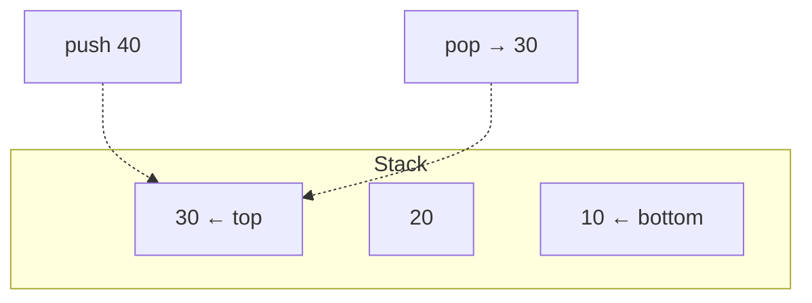

# Stacks: Last In, First Out (LIFO)

## 🧠 Intuition

A stack is a pile where you only ever touch the **top**. You **push** an item onto the top and
**pop** the top item off. The last thing you put in is the first thing you take out — **LIFO**.

> 💡 **Analogy — a stack of plates.** You add a clean plate on top and take the top plate to
> use. You never pull one from the middle. Or think of your browser's Back button: it pops the
> most recently visited page.

That restriction sounds limiting, but it's exactly what you want for anything involving
**nesting or reversal** — matched brackets, undo history, function calls, depth-first
exploration.

## 📐 How It Works



Only three core operations, all touching the top: **push**, **pop**, **peek** (look without
removing). All O(1).

## 🧾 Pseudocode

```
push(x):  store x at top
pop():    remove and return top (error if empty)
peek():   return top without removing
isEmpty(): top == none
```

## 💻 C# Implementation

### Using the built-in `Stack<T>`

```csharp
var stack = new Stack<int>();
stack.Push(10);
stack.Push(20);
int top = stack.Peek();   // 20, not removed
int x = stack.Pop();      // 20, removed
bool empty = stack.Count == 0;
```

### From scratch (array-backed)

```csharp
public class Stack<T> {
    private T[] items = new T[4];
    private int count = 0;

    public int Count => count;
    public bool IsEmpty => count == 0;

    public void Push(T item) {
        if (count == items.Length) Array.Resize(ref items, items.Length * 2); // amortized O(1)
        items[count++] = item;
    }

    public T Pop() {
        if (count == 0) throw new InvalidOperationException("Stack empty");
        T item = items[--count];
        items[count] = default;       // release reference for GC
        return item;
    }

    public T Peek() {
        if (count == 0) throw new InvalidOperationException("Stack empty");
        return items[count - 1];
    }
}
```

> A stack can equally be built on a [linked list](03.Linked-Lists.md) by pushing/popping at the
> head — both give O(1) operations. Array-backed wins on cache locality; list-backed never
> needs to resize-copy.

## ⏱️ Complexity

| Operation | Time | Why |
|-----------|------|-----|
| Push | O(1) amortized | Append to top (occasional resize) |
| Pop | O(1) | Remove top |
| Peek | O(1) | Read top |
| Search | O(n) | Must pop through it (not what stacks are for) |
| Space | O(n) | n elements |

## ⚖️ When to Use It

- **Use a stack when** the natural order is "undo the most recent thing first": expression
  parsing, backtracking, DFS, undo/redo, the call stack.
- **Don't use it when** you need FIFO order (→ [Queue](05.Queues-and-Deques.md)) or random
  access (→ array).
- **Recursion is an implicit stack** — any recursive algorithm can be rewritten with an
  explicit stack to avoid stack-overflow on deep inputs.

## 🚫 Common Mistakes

```csharp
// ❌ Popping/peeking without checking empty → throws
int x = stack.Pop();
// ✅ guard first
if (stack.Count > 0) x = stack.Pop();
//   or use the safe API:
if (stack.TryPop(out int v)) { /* use v */ }

// ❌ Treating a stack like it has indexes
// stack[2]  // no such thing — only the top is accessible
```

## 🌍 Real-World Applications

- **Function call stack** — how the runtime tracks nested calls and local variables.
- **Undo/redo** in editors (two stacks).
- **Expression evaluation & syntax checking** — matching `()[]{}`, infix→postfix.
- **Backtracking / DFS** — the explicit-stack version of recursion.
- **Browser Back button**, "navigate up" history.

## 🎯 Practice (with full solutions)

### 1. Valid Parentheses — `Easy`
**Problem:** Given a string of `()[]{}`, are all brackets correctly matched and nested?
**Approach:** Push openers; on a closer, the top must be the matching opener. Empty stack at
the end ⇒ valid. This is *the* textbook stack problem.
```csharp
bool IsValid(string s) {
    var st = new Stack<char>();
    var pairs = new Dictionary<char, char> { [')']='(', [']']='[', ['}']='{' };
    foreach (char c in s) {
        if (c == '(' || c == '[' || c == '{') st.Push(c);
        else {
            if (st.Count == 0 || st.Pop() != pairs[c]) return false;
        }
    }
    return st.Count == 0;
}
```
**Complexity:** O(n) time, O(n) space. **Why this fits:** matching nested pairs is inherently LIFO.

### 2. Min Stack — `Medium`
**Problem:** Design a stack that also returns its minimum in O(1).
**Approach:** Keep a second stack of "min so far"; push the smaller of (new value, current min).
```csharp
public class MinStack {
    private readonly Stack<int> data = new();
    private readonly Stack<int> mins = new();
    public void Push(int x) {
        data.Push(x);
        mins.Push(mins.Count == 0 ? x : Math.Min(x, mins.Peek()));
    }
    public void Pop() { data.Pop(); mins.Pop(); }
    public int Top() => data.Peek();
    public int GetMin() => mins.Peek();
}
```
**Complexity:** O(1) per operation, O(n) space. **Why this fits:** augmenting a stack with extra
bookkeeping that respects LIFO.

### 3. Evaluate Reverse Polish Notation — `Medium`
**Problem:** Evaluate a postfix expression like `["2","1","+","3","*"]` → 9.
**Approach:** Push numbers; on an operator, pop the top two operands, apply, push the result.
```csharp
int EvalRPN(string[] tokens) {
    var st = new Stack<int>();
    foreach (var t in tokens) {
        if (int.TryParse(t, out int n)) st.Push(n);
        else {
            int b = st.Pop(), a = st.Pop();
            st.Push(t switch { "+" => a + b, "-" => a - b, "*" => a * b, _ => a / b });
        }
    }
    return st.Pop();
}
```
**Complexity:** O(n) time, O(n) space. **Why this fits:** postfix evaluation is the reason
stacks exist in compilers.

### 4. Daily Temperatures (monotonic stack) — `Medium`
**Problem:** For each day, how many days until a warmer temperature? (0 if none.)
**Approach:** Keep a stack of indices with *decreasing* temperatures. When today is warmer, pop
each colder day and record the gap. This "monotonic stack" pattern answers many "next greater
element" questions in O(n).
```csharp
int[] DailyTemperatures(int[] t) {
    var res = new int[t.Length];
    var st = new Stack<int>();        // indices, temps decreasing down the stack
    for (int i = 0; i < t.Length; i++) {
        while (st.Count > 0 && t[i] > t[st.Peek()]) {
            int j = st.Pop();
            res[j] = i - j;
        }
        st.Push(i);
    }
    return res;
}
```
**Complexity:** O(n) time (each index pushed/popped once), O(n) space. **Why this fits:**
introduces the **monotonic stack**, a powerful pattern worth memorizing.

## ✅ Key Takeaways

- Stack = **LIFO**; only the top is accessible; push/pop/peek are **O(1)**.
- Perfect for **nesting and reversal**: brackets, parsing, undo, DFS, the call stack.
- Back it with an array (cache-friendly) or a linked list (no resize) — both O(1).
- **Always check empty** before pop/peek.
- The **monotonic stack** turns many "next greater/smaller" problems into O(n).

**Self-check:**
1. What does LIFO mean, and which operations are O(1)?
2. Why is a stack the natural tool for checking balanced brackets?
3. What does a monotonic stack maintain, and what problems does it solve?

---
◀ Prev: [Linked Lists](03.Linked-Lists.md) · ▲ [Module index](README.md) · ▶ Next: [Queues & Deques](05.Queues-and-Deques.md)
