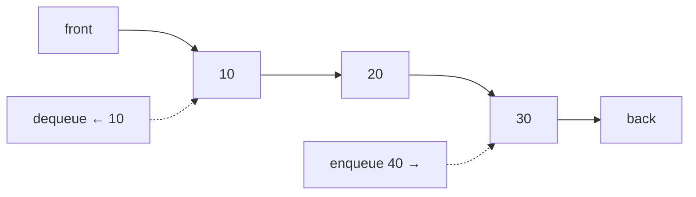
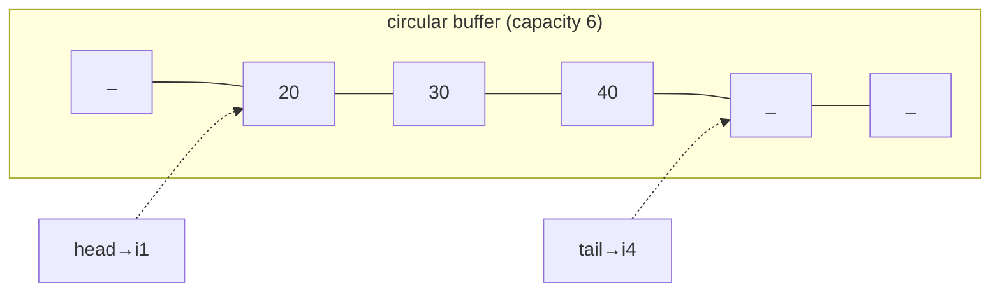

# Queues & Deques: First In, First Out (and Both Ends)

## 🧠 Intuition

A **queue** is a line at a checkout: you join at the **back** (enqueue) and you're served from
the **front** (dequeue). First in, first out — **FIFO**. It's the opposite discipline of a
[stack](04.Stacks.md).

> 💡 **Analogy — a ticket line.** Fair order: whoever waited longest goes next. That fairness is
> exactly what you want for task scheduling, print jobs, and breadth-first exploration (process
> things in the order you discovered them).

A **deque** ("deck", double-ended queue) relaxes the rule: you can add/remove at **both** ends.
It's a superset — a deque can act as a stack *or* a queue, plus it powers sliding-window tricks.

## 📐 How It Works



### Why a naive array queue is bad — and the circular fix

If you dequeue by removing index 0 of an array, every other element shifts left — **O(n)** per
dequeue. The fix is a **circular buffer**: keep `head` and `tail` indices that wrap around with
`% capacity`, so both ends are O(1) and no shifting happens.



## 🧾 Pseudocode

```
enqueue(x):  buffer[tail] = x; tail = (tail + 1) % cap; count++
dequeue():   x = buffer[head]; head = (head + 1) % cap; count--; return x
```

## 💻 C# Implementation

### Built-ins

```csharp
var q = new Queue<int>();
q.Enqueue(10); q.Enqueue(20);
int front = q.Peek();    // 10
int x = q.Dequeue();     // 10

// Deque: use LinkedList<T> or the newer System.Collections.Generic? -> use LinkedList<T>
var dq = new LinkedList<int>();
dq.AddLast(1);   dq.AddFirst(0);     // push both ends
dq.RemoveFirst(); dq.RemoveLast();   // pop both ends — all O(1)
```

### Circular-buffer queue from scratch

```csharp
public class CircularQueue<T> {
    private T[] buffer;
    private int head, tail, count;

    public CircularQueue(int capacity) { buffer = new T[capacity]; }
    public int Count => count;

    public void Enqueue(T item) {
        if (count == buffer.Length) Grow();
        buffer[tail] = item;
        tail = (tail + 1) % buffer.Length;
        count++;
    }

    public T Dequeue() {
        if (count == 0) throw new InvalidOperationException("Queue empty");
        T item = buffer[head];
        buffer[head] = default;
        head = (head + 1) % buffer.Length;
        count--;
        return item;
    }

    private void Grow() {
        var bigger = new T[buffer.Length * 2];
        for (int i = 0; i < count; i++) bigger[i] = buffer[(head + i) % buffer.Length];
        buffer = bigger; head = 0; tail = count;
    }
}
```

## ⏱️ Complexity

| Operation | Queue | Deque | Why |
|-----------|-------|-------|-----|
| Enqueue / add | O(1) amortized | O(1) | Append at back/either end |
| Dequeue / remove | O(1) | O(1) | Advance head (circular) |
| Peek | O(1) | O(1) | Read an end |
| Search | O(n) | O(n) | Not the point |
| Space | O(n) | O(n) | n elements |

## ⚖️ When to Use It

- **Queue:** anything order-preserving and fair — **[BFS](../03-Graphs/02.BFS-and-DFS.md)**, task
  schedulers, producer/consumer buffers, rate limiting.
- **Deque:** when you need both ends — sliding-window maximum, a work-stealing scheduler, or as
  a flexible stack-or-queue.
- **Priority Queue** (next section's neighbor — see [Heaps](../02-Trees-and-Heaps/04.Heaps-and-Priority-Queues.md)):
  when "first out" should be the *highest priority*, not the oldest. Backed by a heap, not a line.

## 🚫 Common Mistakes

```csharp
// ❌ Building a queue on a List and removing index 0 → O(n) per dequeue
list.RemoveAt(0);
// ✅ use Queue<T> (circular buffer under the hood) → O(1)

// ❌ Forgetting modulo wrap-around in a hand-rolled circular buffer
tail = tail + 1;                 // overflows the array
// ✅
tail = (tail + 1) % buffer.Length;

// ❌ Dequeue without empty check → throws
```

## 🌍 Real-World Applications

- **BFS** over graphs/trees (the queue *is* the algorithm).
- CPU/process scheduling, print spoolers, message queues (Kafka/RabbitMQ conceptually).
- Buffering streams (keyboard input, network packets).
- Deque: sliding-window analytics, undo with bounded history.

## 🎯 Practice (with full solutions)

### 1. Implement Stack using Queues — `Easy`
**Problem:** Build a LIFO stack using only queue operations.
**Approach:** On push, enqueue then rotate the queue so the new element sits at the front.
```csharp
public class MyStack {
    private readonly Queue<int> q = new();
    public void Push(int x) {
        q.Enqueue(x);
        for (int i = 1; i < q.Count; i++) q.Enqueue(q.Dequeue()); // rotate
    }
    public int Pop() => q.Dequeue();
    public int Top() => q.Peek();
    public bool Empty() => q.Count == 0;
}
```
**Complexity:** push O(n), pop O(1). **Why this fits:** cements the FIFO-vs-LIFO distinction by
converting one into the other.

### 2. Number of Recent Calls — `Easy`
**Problem:** Count requests in the last 3000 ms; `ping(t)` arrives with increasing `t`.
**Approach:** Keep timestamps in a queue; drop everything older than `t - 3000` from the front.
```csharp
public class RecentCounter {
    private readonly Queue<int> q = new();
    public int Ping(int t) {
        q.Enqueue(t);
        while (q.Peek() < t - 3000) q.Dequeue();
        return q.Count;
    }
}
```
**Complexity:** amortized O(1) per ping. **Why this fits:** a sliding *time* window — a queue's
sweet spot.

### 3. Binary Tree Level-Order Traversal — `Medium`
**Problem:** Return node values level by level (top to bottom).
**Approach:** BFS with a queue: process the current level's count, enqueue children for the next.
(Full treatment in [Tree Traversals](../02-Trees-and-Heaps/02.Tree-Traversals.md).)
```csharp
IList<IList<int>> LevelOrder(TreeNode root) {
    var res = new List<IList<int>>();
    if (root == null) return res;
    var q = new Queue<TreeNode>();
    q.Enqueue(root);
    while (q.Count > 0) {
        int size = q.Count;
        var level = new List<int>();
        for (int i = 0; i < size; i++) {
            var node = q.Dequeue();
            level.Add(node.Val);
            if (node.Left != null) q.Enqueue(node.Left);
            if (node.Right != null) q.Enqueue(node.Right);
        }
        res.Add(level);
    }
    return res;
}
```
**Complexity:** O(n) time, O(n) space. **Why this fits:** BFS *is* a queue — the defining
application.

### 4. Sliding Window Maximum (deque) — `Hard`
**Problem:** Return the max of every window of size `k` as it slides across the array.
**Approach:** Keep a deque of **indices** whose values are decreasing. The front is always the
window's max; pop smaller values from the back and out-of-window indices from the front.
```csharp
int[] MaxSlidingWindow(int[] nums, int k) {
    var dq = new LinkedList<int>();          // indices, values decreasing front→back
    var res = new int[nums.Length - k + 1];
    for (int i = 0; i < nums.Length; i++) {
        if (dq.Count > 0 && dq.First.Value <= i - k) dq.RemoveFirst();   // out of window
        while (dq.Count > 0 && nums[dq.Last.Value] <= nums[i]) dq.RemoveLast(); // smaller
        dq.AddLast(i);
        if (i >= k - 1) res[i - k + 1] = nums[dq.First.Value];
    }
    return res;
}
```
**Complexity:** O(n) time (each index added/removed once), O(k) space. **Why this fits:** the
monotonic **deque** — the two-ended cousin of the monotonic stack.

## ✅ Key Takeaways

- Queue = **FIFO**; deque = both ends. Core ops are **O(1)**.
- Implement a queue as a **circular buffer** to keep dequeue O(1) (never shift an array).
- A queue **is** [BFS](../03-Graphs/02.BFS-and-DFS.md); reach for it whenever order/fairness matters.
- A **monotonic deque** solves sliding-window max/min in O(n).
- For "highest priority out next," use a [priority queue / heap](../02-Trees-and-Heaps/04.Heaps-and-Priority-Queues.md), not a plain queue.

**Self-check:**
1. How does FIFO differ from LIFO, and which problems suit each?
2. Why does a circular buffer make dequeue O(1) where a plain array makes it O(n)?
3. What invariant does the deque maintain in sliding-window maximum?

---
◀ Prev: [Stacks](04.Stacks.md) · ▲ [Module index](README.md) · ▶ Next: [Hash Tables](06.Hash-Tables.md)
