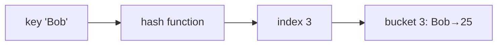

# Hash Tables: O(1) Lookup by Key

## 🧠 Intuition

A hash table answers "do I have this key, and what's its value?" in **constant time on
average** — no scanning. The trick: a **hash function** turns your key into an array index, so
you jump straight to where the value lives.

> 💡 **Analogy — a coat check.** You hand over a coat and get ticket #47. To retrieve it, the
> attendant goes directly to slot 47 — they don't search every hook. The hash function is the
> ticket-numbering scheme: it maps each coat to a slot.

This is the single most useful data structure for problem-solving. "Can I make this O(n)
instead of O(n²)?" almost always means "can a hash table remember what I've seen?"

## 📐 How It Works



1. **Hash** the key to a number, then **mod** by the array size to get a bucket index.
2. Store the key+value in that bucket.
3. **Collisions** (two keys → same bucket) are unavoidable. Two fixes:
   - **Chaining:** each bucket holds a small list of entries (what we implement below, and what
     conceptually backs Java/.NET dictionaries).
   - **Open addressing:** on collision, probe the next slot until you find a free one.
4. **Load factor** = entries ÷ buckets. When it crosses ~0.75, the table **resizes** (doubles)
   and rehashes everything, keeping chains short and operations near O(1).

> Worst case is **O(n)**: if every key hashes to the same bucket (a terrible hash or an
> adversarial input), it degrades to a linked list. Good hash functions + resizing keep this
> rare.

## 🧾 Pseudocode

```
put(key, value):
    i = hash(key) mod capacity
    if key exists in bucket[i]: update it
    else: append (key, value) to bucket[i]
    if loadFactor > 0.75: resize and rehash

get(key):
    i = hash(key) mod capacity
    scan bucket[i] for key → return value or "not found"
```

## 💻 C# Implementation

### Built-ins (use these in real code)

```csharp
var ages = new Dictionary<string, int> { ["Alice"] = 30, ["Bob"] = 25 };
ages["Charlie"] = 28;                 // insert / update
if (ages.TryGetValue("Bob", out int a)) { /* a == 25 */ }   // safe lookup
ages.Remove("Charlie");

var seen = new HashSet<int>();         // a set = keys only, no values
bool isNew = seen.Add(5);              // false if 5 was already there
```

### Chaining hash table from scratch

```csharp
public class HashMap<TKey, TValue> {
    private LinkedList<(TKey Key, TValue Val)>[] buckets = new LinkedList<(TKey, TValue)>[16];
    private int count;

    private int IndexFor(TKey key) =>
        (key.GetHashCode() & 0x7FFFFFFF) % buckets.Length;   // mask sign, then mod

    public void Put(TKey key, TValue val) {
        if (count + 1 > buckets.Length * 0.75) Resize();
        int i = IndexFor(key);
        buckets[i] ??= new LinkedList<(TKey, TValue)>();
        for (var node = buckets[i].First; node != null; node = node.Next)
            if (node.Value.Key.Equals(key)) { node.Value = (key, val); return; } // update
        buckets[i].AddLast((key, val));
        count++;
    }

    public bool TryGet(TKey key, out TValue val) {
        var bucket = buckets[IndexFor(key)];
        if (bucket != null)
            foreach (var entry in bucket)
                if (entry.Key.Equals(key)) { val = entry.Val; return true; }
        val = default; return false;
    }

    private void Resize() {
        var old = buckets;
        buckets = new LinkedList<(TKey, TValue)>[old.Length * 2];
        count = 0;
        foreach (var bucket in old)
            if (bucket != null) foreach (var e in bucket) Put(e.Key, e.Val);
    }
}
```

## ⏱️ Complexity

| Operation | Average | Worst | Why |
|-----------|---------|-------|-----|
| Insert | O(1) | O(n) | Direct bucket; worst = all collide |
| Lookup | O(1) | O(n) | Scan one (hopefully tiny) bucket |
| Delete | O(1) | O(n) | Same |
| Space | O(n) | O(n) | Entries + bucket array |

Resizing is O(n) but amortizes away, like a [dynamic array](01.Arrays.md). A **HashSet** has the
same costs — it's a hash table storing only keys.

## ⚖️ When to Use It

- **Use a hash table when** you need fast membership/lookup by key and **don't care about
  order** — deduplication, counting, caching, "have I seen this?".
- **Avoid when** you need sorted order or range queries → use a balanced tree / `SortedDictionary`
  (O(log n) but ordered). Or when keys are small dense integers → a plain array index is faster.
- **Keys must be immutable** and have consistent `GetHashCode`/`Equals`. Mutating a key after
  inserting it corrupts the table.

## 🚫 Common Mistakes

```csharp
// ❌ Indexing a missing key throws
int v = dict["missing"];              // KeyNotFoundException
// ✅ TryGetValue or ContainsKey
if (dict.TryGetValue("missing", out int val)) { }

// ❌ Mutable reference type as a key
var d = new Dictionary<List<int>, string>();   // list's hash changes if you edit it → lost entry
// ✅ use immutable keys (string, int, records, tuples)

// ❌ A custom class overriding Equals but NOT GetHashCode (or vice versa)
// → equal objects land in different buckets. Always override BOTH together.

// ❌ Assuming iteration order is insertion order — it is NOT guaranteed.
```

## 🌍 Real-World Applications

- Database indexes, in-memory caches (Redis, memoization).
- Compiler symbol tables; routers' lookup tables.
- Deduplication, frequency counting, joins.
- Sets for visited-tracking in [graph](../03-Graphs/02.BFS-and-DFS.md) algorithms.

## 🎯 Practice (with full solutions)

### 1. Two Sum — `Easy`
**Problem:** Indices of two numbers summing to `target`.
**Approach:** Remember each value→index; for each `x`, look up `target - x`.
```csharp
int[] TwoSum(int[] nums, int target) {
    var seen = new Dictionary<int, int>();
    for (int i = 0; i < nums.Length; i++) {
        if (seen.TryGetValue(target - nums[i], out int j)) return new[] { j, i };
        seen[nums[i]] = i;
    }
    return Array.Empty<int>();
}
```
**Complexity:** O(n) / O(n). **Why this fits:** the archetypal "hash remembers what you've seen."

### 2. First Unique Character — `Easy`
**Problem:** Index of the first non-repeating character in a string.
**Approach:** Count all chars in one pass, then find the first with count 1.
```csharp
int FirstUniqChar(string s) {
    var count = new Dictionary<char, int>();
    foreach (char c in s) count[c] = count.GetValueOrDefault(c) + 1;
    for (int i = 0; i < s.Length; i++) if (count[s[i]] == 1) return i;
    return -1;
}
```
**Complexity:** O(n) / O(1) (≤26 keys). **Why this fits:** frequency counting via a map.

### 3. Subarray Sum Equals K — `Medium`
**Problem:** Count contiguous subarrays summing to `k`.
**Approach:** Running prefix sum; a subarray sums to `k` iff `prefix - k` was seen before. Store
counts of each prefix sum in a map. (Combines hashing with [prefix sums](../06-Algorithm-Paradigms/02.Prefix-Sums.md).)
```csharp
int SubarraySum(int[] nums, int k) {
    var seen = new Dictionary<int, int> { [0] = 1 };  // empty prefix
    int sum = 0, count = 0;
    foreach (int x in nums) {
        sum += x;
        count += seen.GetValueOrDefault(sum - k);
        seen[sum] = seen.GetValueOrDefault(sum) + 1;
    }
    return count;
}
```
**Complexity:** O(n) / O(n). **Why this fits:** hashing prefix sums beats the O(n²) double loop —
a genuinely clever, common pattern.

### 4. LRU Cache — `Medium`
**Problem:** Fixed-capacity cache with O(1) `get`/`put`, evicting the least-recently-used.
**Approach:** Hash map (key → node) for O(1) lookup + a doubly [linked list](03.Linked-Lists.md)
for recency order (most-recent at front, evict from back).
```csharp
public class LRUCache {
    private readonly int cap;
    private readonly Dictionary<int, LinkedListNode<(int Key, int Val)>> map = new();
    private readonly LinkedList<(int Key, int Val)> order = new();   // front = most recent
    public LRUCache(int capacity) { cap = capacity; }

    public int Get(int key) {
        if (!map.TryGetValue(key, out var node)) return -1;
        order.Remove(node); order.AddFirst(node);          // mark as recently used
        return node.Value.Val;
    }
    public void Put(int key, int value) {
        if (map.TryGetValue(key, out var node)) { order.Remove(node); }
        else if (map.Count == cap) {
            var lru = order.Last;                          // evict least recent
            order.RemoveLast(); map.Remove(lru.Value.Key);
        }
        var fresh = new LinkedListNode<(int, int)>((key, value));
        order.AddFirst(fresh); map[key] = fresh;
    }
}
```
**Complexity:** O(1) per op. **Why this fits:** the canonical "hash map + linked list" combo —
a favorite interview design question.

## ✅ Key Takeaways

- Hash tables give **O(1) average** insert/lookup/delete by mapping keys to buckets.
- **Collisions** are handled by chaining/open addressing; **resizing** keeps it fast (load factor ≤ ~0.75).
- Worst case is **O(n)** with bad hashing — and order is **not** preserved.
- Use **immutable keys**; override `Equals` and `GetHashCode` **together**.
- The go-to tool for turning O(n²) into O(n): *remember what you've seen.*

**Self-check:**
1. How does a hash function give O(1) lookup, and when does it degrade to O(n)?
2. What is the load factor and why does crossing it trigger a resize?
3. Why must hash keys be immutable, and why override `Equals`/`GetHashCode` together?

---
◀ Prev: [Queues & Deques](05.Queues-and-Deques.md) · ▲ [Module index](README.md) · ▶ Next module: [02 — Trees & Heaps](../02-Trees-and-Heaps/01.Binary-Trees-and-BST.md)
