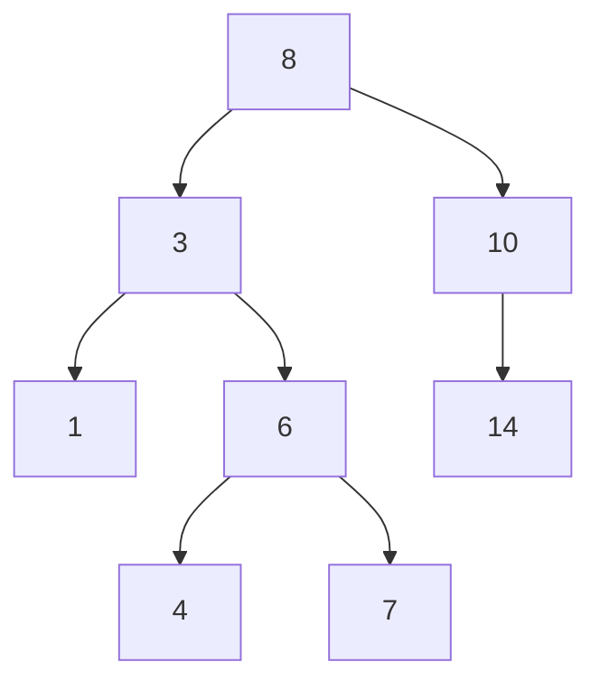

# Binary Trees & BST: Hierarchy and Ordered Search

## 🧠 Intuition

Linear structures put data in a line. A **tree** puts it in a *hierarchy* — like a family tree
or a folder structure. A **binary tree** is the simplest useful kind: every node has at most
**two** children (left and right).

A **Binary Search Tree (BST)** adds one rule that makes it powerful: for every node,
**everything in its left subtree is smaller, everything in its right subtree is larger.** That
rule means searching is like binary search — at each node you go left or right, halving what's
left to check. In a balanced BST that's **O(log n)**.

> 💡 **Analogy — a guess-the-number game.** "Is it less than 50? Yes. Less than 25? No..." Each
> question eliminates half the possibilities. A BST physically arranges data so every step is
> one of those halving questions.

The catch: that O(log n) only holds if the tree stays **balanced**. Insert sorted data into a
plain BST and it degenerates into a [linked list](../01-Linear-Structures/03.Linked-Lists.md)
— O(n). Fixing that is the job of [AVL/Red-Black trees](03.Balanced-Trees-AVL.md).

## 📐 How It Works



To **search for 7**: 7 < 8 → go left to 3; 7 > 3 → go right to 6; 7 > 6 → go right to 7. Found
in 3 steps instead of scanning all nodes.

### Vocabulary (you'll see these everywhere)

- **Root** — the top node. **Leaf** — a node with no children.
- **Height** — longest root-to-leaf path (a balanced tree of n nodes has height ~log n).
- **Subtree** — a node together with all its descendants (trees are recursive!).
- **Full / complete / perfect / balanced** — shape classifications; *balanced* (subtree heights
  differ by ≤1) is the one that keeps operations fast.

## 🧾 Pseudocode

```
search(node, key):
    if node is null: return null
    if key == node.value: return node
    if key <  node.value: return search(node.left, key)
    else:                 return search(node.right, key)

insert(node, key):
    if node is null: return new Node(key)
    if key < node.value:  node.left  = insert(node.left, key)
    else:                 node.right = insert(node.right, key)
    return node
```

## 💻 C# Implementation

```csharp
public class TreeNode {
    public int Val;
    public TreeNode Left, Right;
    public TreeNode(int val) { Val = val; }
}

public class BST {
    public TreeNode Root;

    public void Insert(int val) => Root = Insert(Root, val);
    private TreeNode Insert(TreeNode node, int val) {
        if (node == null) return new TreeNode(val);
        if (val < node.Val) node.Left = Insert(node.Left, val);
        else if (val > node.Val) node.Right = Insert(node.Right, val);  // ignore duplicates
        return node;
    }

    public bool Contains(int val) {
        var cur = Root;
        while (cur != null) {
            if (val == cur.Val) return true;
            cur = val < cur.Val ? cur.Left : cur.Right;
        }
        return false;
    }

    // Delete: 3 cases — leaf, one child, two children (replace with in-order successor)
    public void Delete(int val) => Root = Delete(Root, val);
    private TreeNode Delete(TreeNode node, int val) {
        if (node == null) return null;
        if (val < node.Val) node.Left = Delete(node.Left, val);
        else if (val > node.Val) node.Right = Delete(node.Right, val);
        else {
            if (node.Left == null) return node.Right;     // 0 or 1 child
            if (node.Right == null) return node.Left;
            TreeNode succ = Min(node.Right);              // smallest in right subtree
            node.Val = succ.Val;
            node.Right = Delete(node.Right, succ.Val);
        }
        return node;
    }
    private TreeNode Min(TreeNode n) { while (n.Left != null) n = n.Left; return n; }
}
```

> **In-order traversal of a BST visits values in sorted order** — a property you'll use
> constantly. Full traversal coverage is in [Tree Traversals](02.Tree-Traversals.md).

## ⏱️ Complexity

| Operation | Balanced BST | Degenerate (skewed) | Why |
|-----------|--------------|---------------------|-----|
| Search | O(log n) | O(n) | Height = log n vs n |
| Insert | O(log n) | O(n) | Walk down to a leaf |
| Delete | O(log n) | O(n) | Find + relink |
| In-order traversal | O(n) | O(n) | Visits every node |
| Space | O(n) | O(n) | One node per value |

The whole story is **height**. Balanced ⇒ log n. Skewed ⇒ n. That's why balancing matters.

## ⚖️ When to Use It

- **Use a BST when** you need **ordered** operations: sorted iteration, "next bigger key,"
  range queries, floor/ceiling — things a [hash table](../01-Linear-Structures/06.Hash-Tables.md)
  can't do. In .NET: `SortedDictionary`/`SortedSet` (balanced trees under the hood).
- **Use a hash table instead when** you only need membership/lookup and don't care about order
  (O(1) beats O(log n)).
- **Always prefer a self-balancing variant** ([AVL](03.Balanced-Trees-AVL.md)/Red-Black) in
  production so adversarial/sorted input can't make it O(n).

## 🚫 Common Mistakes

```csharp
// ❌ Validating a BST by only checking immediate children
bool BadValid(TreeNode n) =>
    n == null || ((n.Left == null || n.Left.Val < n.Val)
               && (n.Right == null || n.Right.Val > n.Val));
// This passes invalid trees! A deep-left descendant could still exceed an ancestor.
// ✅ carry down a valid (min, max) range — see Practice #2.
```

Other traps: forgetting the **two-children delete case** (must use the in-order successor/
predecessor), and **stack overflow** on deep skewed trees with recursion (use iterative
traversal or a balanced tree).

## 🌍 Real-World Applications

- Database indexes (B-trees/B+trees are tree generalizations) for fast range queries.
- File-system directory hierarchies; scene graphs in games.
- `SortedSet`/`SortedDictionary`, ordered maps, interval scheduling.
- Compiler abstract syntax trees (ASTs).

## 🎯 Practice (with full solutions)

### 1. Maximum Depth of Binary Tree — `Easy`
**Problem:** Return the height (number of nodes on the longest root-to-leaf path).
**Approach:** Depth = 1 + max(depth of left, depth of right). Pure recursion.
```csharp
int MaxDepth(TreeNode root) =>
    root == null ? 0 : 1 + Math.Max(MaxDepth(root.Left), MaxDepth(root.Right));
```
**Complexity:** O(n) time, O(h) stack. **Why this fits:** the simplest "trust the subtree"
recursion — the mental model for all tree problems.

### 2. Validate BST — `Medium`
**Problem:** Is a binary tree a valid BST?
**Approach:** Each node must lie within an allowed `(low, high)` range that tightens as you
descend. Going left lowers the upper bound; going right raises the lower bound.
```csharp
bool IsValidBST(TreeNode root) => Valid(root, long.MinValue, long.MaxValue);
bool Valid(TreeNode n, long low, long high) {
    if (n == null) return true;
    if (n.Val <= low || n.Val >= high) return false;
    return Valid(n.Left, low, n.Val) && Valid(n.Right, n.Val, high);
}
```
**Complexity:** O(n) time, O(h) stack. **Why this fits:** the classic correction to the
"only-check-children" mistake — propagate constraints down.

### 3. Lowest Common Ancestor in a BST — `Medium`
**Problem:** Find the lowest node that is an ancestor of both `p` and `q`.
**Approach:** Use the BST order: if both are smaller, go left; both bigger, go right; otherwise
this node is where they split — the LCA.
```csharp
TreeNode LCA(TreeNode root, TreeNode p, TreeNode q) {
    var cur = root;
    while (cur != null) {
        if (p.Val < cur.Val && q.Val < cur.Val) cur = cur.Left;
        else if (p.Val > cur.Val && q.Val > cur.Val) cur = cur.Right;
        else return cur;          // split point
    }
    return null;
}
```
**Complexity:** O(h) time, O(1) space. **Why this fits:** shows how the BST invariant turns a
search into a few comparisons.

### 4. Kth Smallest Element in a BST — `Medium`
**Problem:** Return the k-th smallest value.
**Approach:** In-order traversal yields sorted order; stop at the k-th node. Iterative with an
explicit stack avoids visiting the whole tree.
```csharp
int KthSmallest(TreeNode root, int k) {
    var st = new Stack<TreeNode>();
    var cur = root;
    while (cur != null || st.Count > 0) {
        while (cur != null) { st.Push(cur); cur = cur.Left; }
        cur = st.Pop();
        if (--k == 0) return cur.Val;
        cur = cur.Right;
    }
    return -1;
}
```
**Complexity:** O(h + k) time, O(h) space. **Why this fits:** ties together the BST order and
iterative in-order traversal.

## ✅ Key Takeaways

- A BST keeps **left < node < right**, enabling **O(log n)** search/insert/delete *when balanced*.
- Performance is governed by **height**: balanced = log n, skewed = n.
- **In-order traversal of a BST = sorted order.**
- Validate a BST with a propagated `(min, max)` range, not just child checks.
- Use a BST (or `SortedSet`) for **ordered** queries; use a hash table when order doesn't matter.

**Self-check:**
1. What invariant defines a BST, and how does it make search O(log n)?
2. Why can a BST degrade to O(n), and what prevents it?
3. What traversal gives a BST's values in sorted order?

---
◀ Prev: [Module index](README.md) · ▲ [Module index](README.md) · ▶ Next: [Tree Traversals](02.Tree-Traversals.md)
