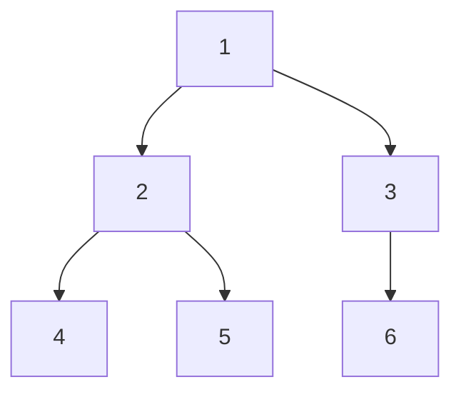

# Tree Traversals: Every Way to Visit Every Node

## 🧠 Intuition

To *do* anything with a tree — print it, sum it, copy it, search it — you need to **visit every
node** in some order. There are two broad strategies:

- **Depth-First (DFS):** plunge down one branch all the way before backing up. Comes in three
  flavors depending on *when* you process the current node relative to its children:
  **pre-order**, **in-order**, **post-order**.
- **Breadth-First (BFS) / level-order:** visit all nodes at depth 0, then depth 1, then depth 2…
  level by level.

> 💡 **Analogy — exploring a building.** DFS is one person walking as deep as possible down a
> hallway, then backtracking. BFS is a flood filling the building floor by floor. Which you want
> depends on the question: "deepest path?" → DFS; "nearest exit?" → BFS.

## 📐 How It Works

For this tree:



| Traversal | Rule (relative to root) | Order produced |
|-----------|-------------------------|----------------|
| **Pre-order** | **Root** → Left → Right | 1, 2, 4, 5, 3, 6 |
| **In-order** | Left → **Root** → Right | 4, 2, 5, 1, 6, 3 |
| **Post-order** | Left → Right → **Root** | 4, 5, 2, 6, 3, 1 |
| **Level-order** | Top to bottom, left to right | 1, 2, 3, 4, 5, 6 |

**When to use which:**
- **Pre-order** — copying/serializing a tree (you create the node before its children).
- **In-order** — on a [BST](01.Binary-Trees-and-BST.md), produces **sorted** output.
- **Post-order** — deleting/freeing a tree, or computing a value that depends on children first
  (e.g. subtree sums, height).
- **Level-order (BFS)** — anything about depth/levels, or shortest path in an unweighted tree.

## 🧾 Pseudocode

```
DFS (recursive):
    visit(node):
        if node is null: return
        # pre-order:  process(node)
        visit(node.left)
        # in-order:   process(node)
        visit(node.right)
        # post-order: process(node)

BFS:
    queue = [root]
    while queue not empty:
        node = queue.dequeue()
        process(node)
        enqueue node.left, node.right (if not null)
```

## 💻 C# Implementation

```csharp
// --- Recursive DFS ---
void PreOrder(TreeNode n, List<int> outp) {
    if (n == null) return;
    outp.Add(n.Val);            // process BEFORE children
    PreOrder(n.Left, outp);
    PreOrder(n.Right, outp);
}
void InOrder(TreeNode n, List<int> outp) {
    if (n == null) return;
    InOrder(n.Left, outp);
    outp.Add(n.Val);            // process BETWEEN children
    InOrder(n.Right, outp);
}
void PostOrder(TreeNode n, List<int> outp) {
    if (n == null) return;
    PostOrder(n.Left, outp);
    PostOrder(n.Right, outp);
    outp.Add(n.Val);            // process AFTER children
}

// --- Iterative in-order (no recursion → no stack-overflow on deep trees) ---
IList<int> InOrderIterative(TreeNode root) {
    var res = new List<int>();
    var st = new Stack<TreeNode>();
    var cur = root;
    while (cur != null || st.Count > 0) {
        while (cur != null) { st.Push(cur); cur = cur.Left; }  // go as left as possible
        cur = st.Pop();
        res.Add(cur.Val);
        cur = cur.Right;
    }
    return res;
}

// --- BFS / level-order with a queue ---
IList<IList<int>> LevelOrder(TreeNode root) {
    var res = new List<IList<int>>();
    if (root == null) return res;
    var q = new Queue<TreeNode>();
    q.Enqueue(root);
    while (q.Count > 0) {
        int size = q.Count;                 // freeze this level's size
        var level = new List<int>();
        for (int i = 0; i < size; i++) {
            var n = q.Dequeue();
            level.Add(n.Val);
            if (n.Left != null) q.Enqueue(n.Left);
            if (n.Right != null) q.Enqueue(n.Right);
        }
        res.Add(level);
    }
    return res;
}
```

## ⏱️ Complexity

| Traversal | Time | Space | Why |
|-----------|------|-------|-----|
| Any DFS (recursive) | O(n) | O(h) stack | Visit each node once; stack = height |
| Any DFS (iterative) | O(n) | O(h) explicit stack | Same, but no call-stack risk |
| BFS (level-order) | O(n) | O(w) queue | w = max width (up to n/2 at the bottom) |

`h` (height) is O(log n) when balanced, O(n) when skewed. So DFS on a deep skewed tree can use
O(n) stack — the reason to know the iterative version.

## ⚖️ When to Use It

- **DFS** when the problem is about paths, subtree properties, or you want low memory on a wide
  tree (stack ~ height, not width).
- **BFS** when the problem is about levels/distance, or "closest" in an unweighted setting.
- **Recursive** for clarity; **iterative** when recursion depth could overflow (very deep tree).

## 🚫 Common Mistakes

```csharp
// ❌ Forgetting the null check → NullReferenceException at the leaves
void Bad(TreeNode n) { Visit(n); Bad(n.Left); Bad(n.Right); }
// ✅ base case first
void Good(TreeNode n) { if (n == null) return; Visit(n); Good(n.Left); Good(n.Right); }

// ❌ In BFS, reading q.Count INSIDE the loop after enqueuing children → mixes levels
// ✅ snapshot `int size = q.Count;` before processing the level (as above)
```

## 🌍 Real-World Applications

- Serializing/deserializing trees and JSON/XML documents (pre-order).
- Evaluating expression trees and computing aggregates (post-order).
- Rendering UI trees, file-system walks, dependency resolution.
- Shortest path / nearest node in unweighted structures (BFS → see [Graphs](../03-Graphs/02.BFS-and-DFS.md)).

## 🎯 Practice (with full solutions)

### 1. Binary Tree Inorder Traversal — `Easy`
**Problem:** Return the in-order values.
**Approach:** Either the recursive `InOrder` above or the iterative stack version. Iterative is
worth practicing because it generalizes.
```csharp
IList<int> InorderTraversal(TreeNode root) {
    var res = new List<int>(); var st = new Stack<TreeNode>(); var cur = root;
    while (cur != null || st.Count > 0) {
        while (cur != null) { st.Push(cur); cur = cur.Left; }
        cur = st.Pop(); res.Add(cur.Val); cur = cur.Right;
    }
    return res;
}
```
**Complexity:** O(n) / O(h). **Why this fits:** the canonical traversal, both forms.

### 2. Maximum Depth (post-order) — `Easy`
**Problem:** Height of the tree.
**Approach:** A node's depth needs its children's depths first → post-order shape.
```csharp
int MaxDepth(TreeNode n) =>
    n == null ? 0 : 1 + Math.Max(MaxDepth(n.Left), MaxDepth(n.Right));
```
**Complexity:** O(n) / O(h). **Why this fits:** shows "process after children" computing an
aggregate.

### 3. Binary Tree Level-Order Traversal — `Medium`
**Problem:** Values grouped by level.
**Approach:** BFS, snapshotting each level's size (the `LevelOrder` above).
**Complexity:** O(n) / O(w). **Why this fits:** the defining BFS-on-a-tree exercise.

### 4. Binary Tree Right Side View — `Medium`
**Problem:** Return the values visible from the right (last node of each level).
**Approach:** BFS; take the last node dequeued at each level.
```csharp
IList<int> RightSideView(TreeNode root) {
    var res = new List<int>();
    if (root == null) return res;
    var q = new Queue<TreeNode>(); q.Enqueue(root);
    while (q.Count > 0) {
        int size = q.Count;
        for (int i = 0; i < size; i++) {
            var n = q.Dequeue();
            if (i == size - 1) res.Add(n.Val);          // rightmost of this level
            if (n.Left != null) q.Enqueue(n.Left);
            if (n.Right != null) q.Enqueue(n.Right);
        }
    }
    return res;
}
```
**Complexity:** O(n) / O(w). **Why this fits:** a small twist on level-order that shows BFS's
level-awareness.

## ✅ Key Takeaways

- **DFS** has three flavors by *when* you process the node: **pre** (copy), **in** (BST→sorted),
  **post** (aggregate/delete).
- **BFS / level-order** uses a [queue](../01-Linear-Structures/05.Queues-and-Deques.md) and suits depth/level questions.
- All traversals are **O(n) time**; DFS uses **O(h)** space, BFS uses **O(w)**.
- Know the **iterative** in-order to dodge stack overflow on deep trees.
- Snapshot the level size in BFS to keep levels separate.

**Self-check:**
1. Which DFS order yields sorted values on a BST, and why?
2. When would post-order be the only correct choice?
3. Why does BFS use O(w) space while DFS uses O(h)?

---
◀ Prev: [Binary Trees & BST](01.Binary-Trees-and-BST.md) · ▲ [Module index](README.md) · ▶ Next: [Balanced Trees (AVL)](03.Balanced-Trees-AVL.md)
