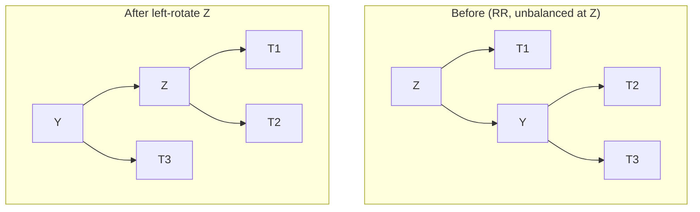

# Balanced Trees (AVL): Keeping a BST From Going Bad

## 🧠 Intuition

A plain [BST](01.Binary-Trees-and-BST.md) is only fast when it's *bushy*. Feed it sorted data
and it grows into a straight line — a [linked list](../01-Linear-Structures/03.Linked-Lists.md)
in disguise, O(n) per operation. A **self-balancing** tree fixes this automatically: after every
insert/delete, it checks whether any part has grown lopsided and **rotates** nodes to restore
balance.

> 💡 **Analogy — a mobile (the hanging art).** Add a weight to one side and the mobile tilts.
> AVL keeps re-hanging the pieces so it always hangs level — no matter what order weights are
> added. That guaranteed levelness keeps the height ~log n forever.

An **AVL tree** enforces a strict rule: at every node, the heights of the left and right
subtrees differ by **at most 1**. That guarantee bounds the height to ~1.44·log n, so all
operations stay **O(log n)** even in the worst case.

## 📐 How It Works

Each node tracks its **height**. The **balance factor** = `height(left) − height(right)`. If it
ever falls outside `[-1, +1]`, the tree rotates to fix it. There are four cases:

| Case | Shape | Fix |
|------|-------|-----|
| **LL** (left-heavy, left child left-heavy) | `/` | one **right** rotation |
| **RR** (right-heavy, right child right-heavy) | `\` | one **left** rotation |
| **LR** (left-heavy, left child right-heavy) | `<` | left-rotate child, then right-rotate |
| **RL** (right-heavy, right child left-heavy) | `>` | right-rotate child, then left-rotate |

A rotation just re-points a few references — it's **O(1)** and preserves the BST ordering.



## 🧾 Pseudocode

```
insert(node, key):
    do normal BST insert
    update node.height
    bf = balanceFactor(node)
    if bf > 1 and key < node.left.key:   return rotateRight(node)        # LL
    if bf < -1 and key > node.right.key:  return rotateLeft(node)        # RR
    if bf > 1 and key > node.left.key:   node.left = rotateLeft(node.left);  return rotateRight(node)  # LR
    if bf < -1 and key < node.right.key:  node.right = rotateRight(node.right); return rotateLeft(node) # RL
    return node
```

## 💻 C# Implementation

```csharp
public class AvlNode {
    public int Val, Height = 1;
    public AvlNode Left, Right;
    public AvlNode(int val) { Val = val; }
}

public class AvlTree {
    private AvlNode root;
    public void Insert(int val) => root = Insert(root, val);

    private int H(AvlNode n) => n?.Height ?? 0;
    private int BF(AvlNode n) => H(n.Left) - H(n.Right);
    private void Update(AvlNode n) => n.Height = 1 + Math.Max(H(n.Left), H(n.Right));

    private AvlNode RotateRight(AvlNode z) {
        AvlNode y = z.Left, t = y.Right;
        y.Right = z; z.Left = t;
        Update(z); Update(y);          // order matters: z first (now lower), then y
        return y;
    }
    private AvlNode RotateLeft(AvlNode z) {
        AvlNode y = z.Right, t = y.Left;
        y.Left = z; z.Right = t;
        Update(z); Update(y);
        return y;
    }

    private AvlNode Insert(AvlNode node, int val) {
        if (node == null) return new AvlNode(val);
        if (val < node.Val) node.Left = Insert(node.Left, val);
        else if (val > node.Val) node.Right = Insert(node.Right, val);
        else return node;              // no duplicates

        Update(node);
        int bf = BF(node);
        if (bf > 1 && val < node.Left.Val) return RotateRight(node);              // LL
        if (bf < -1 && val > node.Right.Val) return RotateLeft(node);             // RR
        if (bf > 1 && val > node.Left.Val) {                                      // LR
            node.Left = RotateLeft(node.Left); return RotateRight(node);
        }
        if (bf < -1 && val < node.Right.Val) {                                    // RL
            node.Right = RotateRight(node.Right); return RotateLeft(node);
        }
        return node;
    }
}
```

## ⏱️ Complexity

| Operation | Time | Why |
|-----------|------|-----|
| Search / Insert / Delete | O(log n) | Height is bounded to ~1.44 log n |
| Rotation | O(1) | A handful of pointer reassignments |
| Space | O(n) | One node per value (+ a height int) |

The point of all this machinery: turn the BST's *worst case* (O(n)) into a *guarantee* (O(log n)).

## ⚖️ When to Use It / AVL vs Red-Black

You rarely hand-roll a balanced tree — `SortedDictionary`/`SortedSet` (a Red-Black tree in .NET)
gives you one. But know the trade-offs:

| | AVL | Red-Black |
|--|-----|-----------|
| Balance | **Stricter** (shorter trees) | Looser |
| Lookups | Slightly **faster** | Slightly slower |
| Insert/Delete | More rotations | **Fewer** rotations |
| Best for | **Read-heavy** workloads | **Write-heavy** workloads |

**Red-Black trees** (used in most standard libraries) keep balance with node "colors" and at
most a constant number of rotations per update — a great default. AVL wins when you read far
more than you write. Both are O(log n).

## 🚫 Common Mistakes

```csharp
// ❌ Updating heights in the wrong order after a rotation
//    (parent before child) → wrong heights → wrong balance decisions
// ✅ update the node that moved DOWN first, then the one that moved UP (see rotations above)

// ❌ Forgetting to rebalance after DELETE (people remember insert, forget delete)
// ✅ run the same Update + rebalance logic on the way back up from a delete
```

## 🌍 Real-World Applications

- Ordered maps/sets in standard libraries (`std::map`, `TreeMap`, `SortedDictionary`).
- Database and filesystem indexes (B-trees are the disk-friendly cousins).
- In-memory range queries and "nearest key" lookups.

## 🎯 Practice (with full solutions)

### 1. Balanced Binary Tree — `Easy`
**Problem:** Determine whether a binary tree is height-balanced (every node's subtrees differ
in height by ≤ 1) — the AVL invariant itself.
**Approach:** Compute height bottom-up; return a sentinel `-1` the moment imbalance is found so
you don't recompute heights (the naive version is O(n²)).
```csharp
bool IsBalanced(TreeNode root) => Check(root) != -1;
int Check(TreeNode n) {
    if (n == null) return 0;
    int l = Check(n.Left);  if (l == -1) return -1;
    int r = Check(n.Right); if (r == -1) return -1;
    if (Math.Abs(l - r) > 1) return -1;
    return 1 + Math.Max(l, r);
}
```
**Complexity:** O(n) time, O(h) space. **Why this fits:** directly tests the balance condition
AVL maintains, and shows the O(n) bottom-up trick.

### 2. Convert Sorted Array to Balanced BST — `Easy`
**Problem:** Build a height-balanced BST from a sorted array.
**Approach:** The middle element is the root (equal halves on each side); recurse on both
halves. This is exactly what balancing tries to achieve — for free, because the input is sorted.
```csharp
TreeNode SortedArrayToBST(int[] nums) => Build(nums, 0, nums.Length - 1);
TreeNode Build(int[] a, int lo, int hi) {
    if (lo > hi) return null;
    int mid = lo + (hi - lo) / 2;
    return new TreeNode(a[mid]) { Left = Build(a, lo, mid - 1), Right = Build(a, mid + 1, hi) };
}
```
**Complexity:** O(n) time, O(log n) stack. **Why this fits:** illuminates *why* balance = log n
height (picking the middle splits evenly).

### 3. Insert into an AVL and keep it balanced — `Medium`
**Problem:** Implement AVL insertion (the code above) and verify the tree stays balanced after a
worst-case sorted insertion sequence `1,2,3,4,5,6,7`.
**Approach:** Trace it: inserting `1,2,3` triggers an RR rotation at the root, yielding `2` as
root with children `1` and `3`; continued inserts keep rotating, never letting height exceed
~log n.
**Complexity:** O(log n) per insert. **Why this fits:** proves balancing defeats the BST's
worst case — the whole reason AVL exists.

## ✅ Key Takeaways

- AVL keeps every node's subtree heights within **1**, guaranteeing **O(log n)** operations.
- It detects imbalance via the **balance factor** and fixes it with **O(1) rotations** (LL/RR/LR/RL).
- **Rebalance after deletes too**, not just inserts; update heights in the right order.
- **Red-Black** trees (looser balance, fewer rotations) are the common library default; AVL
  shines on read-heavy loads.
- In practice, reach for `SortedSet`/`SortedDictionary` — but understand what's underneath.

**Self-check:**
1. What is the balance factor, and what range keeps an AVL valid?
2. Why does bounding the height guarantee O(log n) operations?
3. When would you prefer AVL over a Red-Black tree, and vice versa?

---
◀ Prev: [Tree Traversals](02.Tree-Traversals.md) · ▲ [Module index](README.md) · ▶ Next: [Heaps & Priority Queues](04.Heaps-and-Priority-Queues.md)
