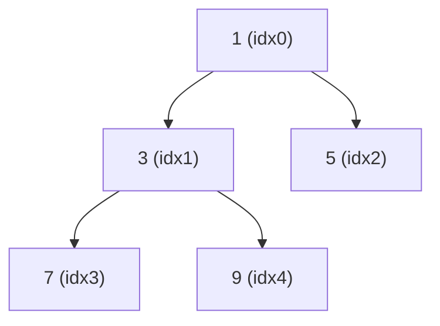

# Heaps & Priority Queues: Always Grab the Best Element

## 🧠 Intuition

Sometimes you don't need *all* your data sorted — you just need the **single most important
item, right now, fast**, over and over. A heap gives you exactly that: the min (or max) is
always at the root, retrievable in **O(1)**, and re-establishing the heap after removing it
takes only **O(log n)**.

> 💡 **Analogy — a hospital ER.** Patients aren't seen in arrival order; they're seen by
> severity. A new critical patient jumps ahead. You never need the *full* sorted list — you just
> need "who's most urgent next?" instantly. That's a **priority queue**, and a heap is how it's
> built.

A **heap** is a clever array that *behaves* like a tree without any pointers. A **priority
queue** is the abstract idea ("give me the highest-priority item"); a heap is the usual
implementation.

## 📐 How It Works

A **binary heap** is a *complete* binary tree (every level full except the last, filled
left-to-right) with the **heap property**:
- **Min-heap:** every parent ≤ its children → smallest at the root.
- **Max-heap:** every parent ≥ its children → largest at the root.

Because it's complete, you can store it in a plain array and compute relationships with
arithmetic — no node objects:

```
parent(i) = (i - 1) / 2
left(i)   = 2*i + 1
right(i)  = 2*i + 2
```


Array: `[1, 3, 5, 7, 9]` — a min-heap.

- **Insert:** put the new value at the end, then **sift up** — swap it with its parent while
  it's out of order. O(log n) (height of the tree).
- **Extract-min/max:** take the root, move the last element to the root, then **sift down** —
  swap with the smaller/larger child until the property holds. O(log n).
- **Build-heap** from an array: sift down from the last parent to the root — surprisingly
  **O(n)**, not O(n log n).

## 🧾 Pseudocode

```
push(x):  a.append(x); siftUp(len-1)
pop():    swap(a[0], a[last]); x = a.removeLast(); siftDown(0); return x

siftUp(i):   while i>0 and a[i] < a[parent(i)]: swap; i = parent(i)
siftDown(i): loop: pick smallest of (i, left, right); if i is smallest stop; else swap & descend
```

## 💻 C# Implementation

### Built-in `PriorityQueue<TElement, TPriority>` (.NET 6+)

```csharp
var pq = new PriorityQueue<string, int>();   // min-priority by default (lowest int first)
pq.Enqueue("low", 5);
pq.Enqueue("urgent", 1);
pq.Enqueue("mid", 3);
string next = pq.Dequeue();      // "urgent" (priority 1)

// Max-heap behavior: negate the priority, or pass a custom comparer
var maxPq = new PriorityQueue<int, int>(Comparer<int>.Create((a, b) => b - a));
```

### Min-heap from scratch

```csharp
public class MinHeap {
    private readonly List<int> a = new();
    public int Count => a.Count;
    public int Peek() => a[0];

    public void Push(int x) {
        a.Add(x);
        int i = a.Count - 1;
        while (i > 0) {                          // sift up
            int p = (i - 1) / 2;
            if (a[i] >= a[p]) break;
            (a[i], a[p]) = (a[p], a[i]);
            i = p;
        }
    }

    public int Pop() {
        int min = a[0];
        a[0] = a[^1];
        a.RemoveAt(a.Count - 1);
        int i = 0, n = a.Count;
        while (true) {                           // sift down
            int l = 2*i + 1, r = 2*i + 2, smallest = i;
            if (l < n && a[l] < a[smallest]) smallest = l;
            if (r < n && a[r] < a[smallest]) smallest = r;
            if (smallest == i) break;
            (a[i], a[smallest]) = (a[smallest], a[i]);
            i = smallest;
        }
        return min;
    }
}
```

## ⏱️ Complexity

| Operation | Time | Why |
|-----------|------|-----|
| Peek (min/max) | O(1) | It's the root = `a[0]` |
| Push (insert) | O(log n) | Sift up ≤ height |
| Pop (extract) | O(log n) | Sift down ≤ height |
| Build heap from array | O(n) | Tight bound — most nodes sift down very little |
| Search arbitrary element | O(n) | Heaps aren't for searching |
| Space | O(n) | Just the array |

> A heap is *partially* ordered, not fully sorted — that's why peek is O(1) but arbitrary search
> is O(n). If you need full order or search, use a [BST](01.Binary-Trees-and-BST.md).

## ⚖️ When to Use It

- **Use a heap when** you repeatedly need the min/max of a changing set: top-K problems,
  schedulers, [Dijkstra](../03-Graphs/04.Shortest-Paths.md) and [Prim's MST](../03-Graphs/05.Minimum-Spanning-Trees.md),
  merging k sorted lists, streaming medians.
- **Don't use it for** arbitrary lookups or sorted iteration (→ BST / sorted structures), or
  when you need the *k-th* element by index (→ array).
- **[Heap Sort](../04-Sorting/06.Heap-Sort.md)** falls right out of it: build a heap, pop n times.

## 🚫 Common Mistakes

```csharp
// ❌ Wrong child index (a frequent off-by-one)
int left = 2 * i;          // that's the 1-based formula
// ✅ for 0-based arrays:
int left = 2 * i + 1;

// ❌ Inserting without sifting (or popping without re-heapifying) → heap property broken
// ✅ always sift up after push, sift down after pop

// ❌ Using a heap to "get the k-th smallest by index" — heaps don't support indexing
```

## 🌍 Real-World Applications

- OS task/process scheduling; event-driven simulations (next event = min timestamp).
- Dijkstra's shortest path, Prim's MST (pick the cheapest edge/next node).
- Top-K / streaming analytics ("trending now"), Huffman coding.
- Median maintenance with two heaps.

## 🎯 Practice (with full solutions)

### 1. Kth Largest Element in an Array — `Medium`
**Problem:** Return the k-th largest element.
**Approach:** Keep a **min-heap of size k**. The smallest of the k largest sits at the root;
pop whenever the heap exceeds k. The root at the end is the answer. (Beats fully sorting.)
```csharp
int FindKthLargest(int[] nums, int k) {
    var heap = new PriorityQueue<int, int>();   // min-heap
    foreach (int x in nums) {
        heap.Enqueue(x, x);
        if (heap.Count > k) heap.Dequeue();     // drop the smallest
    }
    return heap.Peek();
}
```
**Complexity:** O(n log k) time, O(k) space. **Why this fits:** the size-k heap is the
quintessential top-K technique.

### 2. Last Stone Weight — `Easy`
**Problem:** Repeatedly smash the two heaviest stones; return the last remaining weight (or 0).
**Approach:** A max-heap; pop two, push the difference, repeat.
```csharp
int LastStoneWeight(int[] stones) {
    var pq = new PriorityQueue<int, int>(Comparer<int>.Create((a, b) => b - a)); // max-heap
    foreach (int s in stones) pq.Enqueue(s, s);
    while (pq.Count > 1) {
        int a = pq.Dequeue(), b = pq.Dequeue();
        if (a != b) pq.Enqueue(a - b, a - b);
    }
    return pq.Count == 1 ? pq.Peek() : 0;
}
```
**Complexity:** O(n log n). **Why this fits:** "repeatedly take the extreme(s)" = textbook heap.

### 3. Merge k Sorted Lists — `Hard`
**Problem:** Merge `k` sorted linked lists into one sorted list.
**Approach:** Put the head of each list in a min-heap; repeatedly pop the smallest, append it,
and push its successor. The heap always holds the current front of each list.
```csharp
ListNode MergeKLists(ListNode[] lists) {
    var pq = new PriorityQueue<ListNode, int>();
    foreach (var node in lists) if (node != null) pq.Enqueue(node, node.val);
    var dummy = new ListNode(0); var tail = dummy;
    while (pq.Count > 0) {
        var smallest = pq.Dequeue();
        tail.next = smallest; tail = smallest;
        if (smallest.next != null) pq.Enqueue(smallest.next, smallest.next.val);
    }
    return dummy.next;
}
```
**Complexity:** O(N log k) for N total nodes. **Why this fits:** the heap reduces a k-way merge
to repeated "smallest of k" queries.

### 4. Find Median from Data Stream — `Hard`
**Problem:** Support `addNum` and `findMedian` on a growing stream.
**Approach:** Two heaps — a max-heap for the lower half, a min-heap for the upper half, kept
balanced in size. The median is the top of one (odd count) or the average of both tops (even).
```csharp
public class MedianFinder {
    private readonly PriorityQueue<int,int> lo = new(Comparer<int>.Create((a,b)=>b-a)); // max-heap
    private readonly PriorityQueue<int,int> hi = new();                                  // min-heap
    public void AddNum(int num) {
        lo.Enqueue(num, num);
        int top = lo.Dequeue(); hi.Enqueue(top, top);          // move max of lo to hi
        if (hi.Count > lo.Count) { int t = hi.Dequeue(); lo.Enqueue(t, t); } // rebalance
    }
    public double FindMedian() =>
        lo.Count > hi.Count ? lo.Peek() : (lo.Peek() + hi.Peek()) / 2.0;
}
```
**Complexity:** O(log n) per add, O(1) median. **Why this fits:** the elegant two-heap trick —
a classic that shows heaps composing beautifully.

## ✅ Key Takeaways

- A heap is an array-backed **complete tree**; min/max at the root in **O(1)**, push/pop **O(log n)**.
- Index math (`2i+1`, `2i+2`, `(i-1)/2`) replaces pointers — cache-friendly and compact.
- It's **partially ordered**: great for "best next," useless for arbitrary search.
- **Building** a heap from an array is **O(n)**; it underpins [heap sort](../04-Sorting/06.Heap-Sort.md).
- Reach for it for **top-K**, schedulers, [Dijkstra](../03-Graphs/04.Shortest-Paths.md)/[Prim](../03-Graphs/05.Minimum-Spanning-Trees.md), and streaming medians.

**Self-check:**
1. Why can a complete tree be stored in an array, and what are the child/parent formulas?
2. Why is peek O(1) but searching for an arbitrary value O(n)?
3. How does a size-k min-heap find the k-th largest element?

---
◀ Prev: [Balanced Trees (AVL)](03.Balanced-Trees-AVL.md) · ▲ [Module index](README.md) · ▶ Next: [Tries](05.Tries.md)
