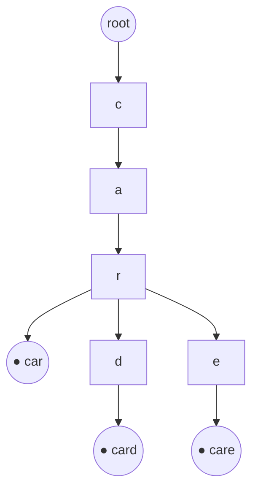

# Tries: The Prefix Tree for Strings

## 🧠 Intuition

A trie (pronounced "try", from re**trie**val) stores a set of strings as a tree where **each
edge is a character** and each path from the root spells out a prefix. Words that share a
prefix share the same path — so "car", "card", and "care" all start down the same `c-a-r`
branch before diverging.

> 💡 **Analogy — a table of contents that branches.** To find everything under "Chapter 3 →
> Section 2," you follow that path; everything beneath it is the matching content. A trie does
> this for letters: follow `a-p-p` and every word beneath shares the prefix "app".

This makes tries unbeatable for **prefix queries** — autocomplete, "does any word start
with…", spell-check — where a [hash table](../01-Linear-Structures/06.Hash-Tables.md) (which
hashes the *whole* key) can't help.

## 📐 How It Works



- Each node has a map of child characters and a boolean **isEndOfWord** marking that a complete
  word ends here (note "car" is a word *and* a prefix of "card").
- **Insert / search / startsWith** all walk `L` edges for a key of length `L` → **O(L)**,
  independent of how many words are stored.
- **Collecting all words with a prefix** = walk to the prefix node, then DFS the subtree.

## 🧾 Pseudocode

```
insert(word):
    node = root
    for ch in word:
        node = node.children.getOrCreate(ch)
    node.isEnd = true

search(word):   walk edges; return node != null AND node.isEnd
startsWith(p):  walk edges; return node != null
```

## 💻 C# Implementation

```csharp
public class TrieNode {
    public Dictionary<char, TrieNode> Children = new();
    public bool IsEnd;
}

public class Trie {
    private readonly TrieNode root = new();

    public void Insert(string word) {
        var node = root;
        foreach (char c in word) {
            if (!node.Children.TryGetValue(c, out var next))
                node.Children[c] = next = new TrieNode();
            node = next;
        }
        node.IsEnd = true;
    }

    public bool Search(string word) {
        var node = Walk(word);
        return node != null && node.IsEnd;
    }

    public bool StartsWith(string prefix) => Walk(prefix) != null;

    private TrieNode Walk(string s) {
        var node = root;
        foreach (char c in s) {
            if (!node.Children.TryGetValue(c, out var next)) return null;
            node = next;
        }
        return node;
    }

    // Autocomplete: every stored word beginning with `prefix`
    public List<string> WordsWithPrefix(string prefix) {
        var results = new List<string>();
        var start = Walk(prefix);
        if (start != null) Collect(start, prefix, results);
        return results;
    }
    private void Collect(TrieNode node, string path, List<string> outp) {
        if (node.IsEnd) outp.Add(path);
        foreach (var (c, child) in node.Children) Collect(child, path + c, outp);
    }
}
```

> **Memory tip:** for a fixed alphabet (e.g. lowercase a–z), replace the `Dictionary` with a
> `TrieNode[26]` indexed by `c - 'a'` — faster and smaller per node.

## ⏱️ Complexity

| Operation | Time | Space | Why |
|-----------|------|-------|-----|
| Insert / Search / StartsWith | O(L) | — | Walk one edge per character |
| Collect words with prefix | O(matches × avg length) | — | DFS the subtree |
| Whole structure | — | O(total characters × alphabet) | Shared prefixes save space |

`L` = key length. Crucially, lookup time **does not depend on `n`** (the number of stored
words) — only on the query length.

## ⚖️ When to Use It

- **Use a trie when** you need **prefix** operations: autocomplete, "is this a valid prefix?",
  longest-prefix matching (IP routing), or grouping by shared prefixes.
- **Use a hash set instead when** you only need exact whole-word membership and don't care about
  prefixes — a `HashSet<string>` is simpler and often less memory.
- **Variants:** a **compressed trie / radix tree** merges single-child chains to save space; a
  **suffix tree/array** indexes all suffixes for substring search (advanced).

## 🚫 Common Mistakes

```csharp
// ❌ Forgetting IsEnd → "car" wouldn't count as a word even if "card" exists
//    Search("car") must distinguish a stored word from a mere prefix.
node.IsEnd = true;   // ✅ set it when a word ends

// ❌ Case sensitivity mismatch
trie.Insert("Apple"); trie.Search("apple");   // false!
// ✅ normalize case on both insert and query

// ❌ Using a Dictionary node for a tiny fixed alphabet (wasteful)
// ✅ TrieNode[26] for a–z
```

## 🌍 Real-World Applications

- Search-engine and IDE **autocomplete**; spell-checkers and dictionaries.
- **IP routing** tables (longest-prefix match) and phone-number routing.
- T9 / predictive text; genome k-mer indexing.
- Word games (Boggle/Scrabble validation) — prune dead branches early.

## 🎯 Practice (with full solutions)

### 1. Implement Trie (Prefix Tree) — `Medium`
**Problem:** Implement `insert`, `search`, and `startsWith`.
**Approach:** Exactly the `Trie` class above.
**Complexity:** O(L) per op. **Why this fits:** the foundational exercise — everything else builds
on it.

### 2. Add and Search Word (with `.` wildcard) — `Medium`
**Problem:** Support `search` where `.` matches any single character.
**Approach:** When you hit `.`, branch into **all** children recursively; otherwise follow the
single edge.
```csharp
public class WordDictionary {
    private readonly TrieNode root = new();
    public void AddWord(string w) {
        var n = root;
        foreach (char c in w) { if (!n.Children.TryGetValue(c, out var x)) n.Children[c] = x = new TrieNode(); n = x; }
        n.IsEnd = true;
    }
    public bool Search(string w) => Dfs(w, 0, root);
    private bool Dfs(string w, int i, TrieNode node) {
        if (node == null) return false;
        if (i == w.Length) return node.IsEnd;
        char c = w[i];
        if (c == '.')
            return node.Children.Values.Any(child => Dfs(w, i + 1, child));   // try all
        return node.Children.TryGetValue(c, out var next) && Dfs(w, i + 1, next);
    }
}
```
**Complexity:** O(L) typical, up to O(26^(dots)) with many wildcards. **Why this fits:** combines
trie walking with [backtracking](../06-Algorithm-Paradigms/04.Backtracking.md).

### 3. Longest Common Prefix — `Easy`
**Problem:** Find the longest prefix shared by all strings in an array.
**Approach:** Insert all; walk down while there's exactly one child and no word ends — the
shared spine *is* the common prefix.
```csharp
string LongestCommonPrefix(string[] strs) {
    if (strs.Length == 0) return "";
    var trie = new Trie();
    foreach (var s in strs) trie.Insert(s);
    var sb = new System.Text.StringBuilder();
    var node = trie.RootForLcp();                 // expose root for this walk
    while (node.Children.Count == 1 && !node.IsEnd) {
        var (c, child) = node.Children.First();
        sb.Append(c); node = child;
    }
    return sb.ToString();
}
```
**Complexity:** O(total chars). **Why this fits:** shows the "shared spine" intuition concretely.

### 4. Word Search II — `Hard`
**Problem:** Given a board of letters and a word list, return all words found on the board.
**Approach:** Build a trie of the words, then DFS the board following trie edges — the trie
**prunes** instantly when no word continues down a path (vastly faster than searching each word).
```csharp
IList<string> FindWords(char[][] board, string[] words) {
    var root = new TrieNode();
    foreach (var w in words) {                    // build trie
        var n = root;
        foreach (char c in w) { if (!n.Children.TryGetValue(c, out var x)) n.Children[c] = x = new TrieNode(); n = x; }
        n.IsEnd = true; n.Word = w;
    }
    var found = new List<string>();
    void Dfs(int r, int c, TrieNode node) {
        if (r < 0 || c < 0 || r >= board.Length || c >= board[0].Length) return;
        char ch = board[r][c];
        if (ch == '#' || !node.Children.TryGetValue(ch, out var next)) return;
        if (next.Word != null) { found.Add(next.Word); next.Word = null; }   // dedupe
        board[r][c] = '#';                        // mark visited
        Dfs(r+1,c,next); Dfs(r-1,c,next); Dfs(r,c+1,next); Dfs(r,c-1,next);
        board[r][c] = ch;                         // restore (backtrack)
    }
    for (int r = 0; r < board.Length; r++)
        for (int c = 0; c < board[0].Length; c++)
            Dfs(r, c, root);
    return found;
}
// (TrieNode here also has: public string Word;)
```
**Complexity:** roughly O(cells × 4^L). **Why this fits:** the headline trie application —
trie-guided DFS that prunes dead ends, combining tries + backtracking + grids.

## ✅ Key Takeaways

- A trie stores strings by **shared prefix**; operations are **O(L)**, independent of word count.
- Mark complete words with **`isEnd`** — a prefix isn't necessarily a word.
- It beats hash sets specifically for **prefix** queries (autocomplete, longest-prefix match).
- For fixed alphabets, use a `TrieNode[26]` to cut memory and speed lookups.
- Trie-guided DFS **prunes** search spaces (Word Search II) — a powerful combo with [backtracking](../06-Algorithm-Paradigms/04.Backtracking.md).

**Self-check:**
1. Why is trie lookup O(L) regardless of how many words are stored?
2. What does `isEnd` distinguish, and why is it necessary?
3. When is a trie clearly better than a `HashSet<string>`?

---
◀ Prev: [Heaps & Priority Queues](04.Heaps-and-Priority-Queues.md) · ▲ [Module index](README.md) · ▶ Next: [Union-Find (DSU)](06.Union-Find-DSU.md)
