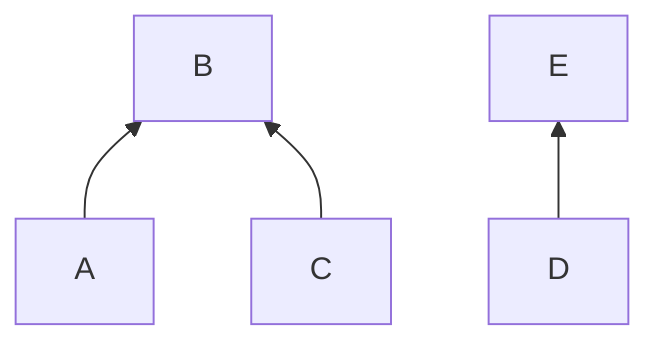

# Union-Find (Disjoint Set Union): "Are These Two Connected?"

## 🧠 Intuition

Imagine a bunch of people, and over time you learn "A knows B," "C knows D," "B knows C." At any
moment you want to answer: **are X and Y in the same friend group?** Union-Find answers that —
and merges groups — in **almost O(1)** time.

> 💡 **Analogy — clubs with a president.** Each group picks one member as its "representative"
> (the president). To check if two people are in the same group, ask each "who's your
> president?" Same president ⇒ same group. To merge two groups, point one president at the
> other. That's the entire idea.

It tracks a **partition** of items into disjoint sets, supporting two operations:
- **find(x):** which set is `x` in? (returns its representative/root)
- **union(x, y):** merge the sets containing `x` and `y`.

It's the secret weapon for connectivity problems and the engine inside [Kruskal's MST](../03-Graphs/05.Minimum-Spanning-Trees.md).

## 📐 How It Works

Each element points to a **parent**; following parents leads to the set's **root**. Initially
every element is its own root (n singleton sets).


Here `{A, C, B}` form one set (root **B**) and `{D, E}` another (root **E**).

Two optimizations turn this from O(n) to nearly O(1):
1. **Union by rank/size:** always attach the *smaller/shorter* tree under the larger one, so
   trees stay shallow.
2. **Path compression:** during `find`, re-point every node you visit directly to the root, so
   future queries are instant.

Together they give **O(α(n))** amortized per operation — where α is the inverse Ackermann
function, which is ≤ 4 for any number you'll ever use. Effectively constant.

## 🧾 Pseudocode

```
find(x):
    if parent[x] != x:
        parent[x] = find(parent[x])   # path compression
    return parent[x]

union(x, y):
    rx, ry = find(x), find(y)
    if rx == ry: return false          # already connected
    attach smaller-rank root under larger-rank root  # union by rank
    return true
```

## 💻 C# Implementation

```csharp
public class UnionFind {
    private readonly int[] parent;
    private readonly int[] rank;       // approx tree height
    public int Count { get; private set; }   // number of disjoint sets

    public UnionFind(int n) {
        parent = new int[n];
        rank = new int[n];
        Count = n;
        for (int i = 0; i < n; i++) parent[i] = i;   // each its own set
    }

    public int Find(int x) {
        while (parent[x] != x) {
            parent[x] = parent[parent[x]];   // path halving — flattens as we go
            x = parent[x];
        }
        return x;
    }

    public bool Union(int x, int y) {
        int rx = Find(x), ry = Find(y);
        if (rx == ry) return false;          // already in the same set
        if (rank[rx] < rank[ry]) (rx, ry) = (ry, rx);  // rx is the taller root
        parent[ry] = rx;
        if (rank[rx] == rank[ry]) rank[rx]++;
        Count--;
        return true;
    }

    public bool Connected(int x, int y) => Find(x) == Find(y);
}
```

## ⏱️ Complexity

| Operation | Time | Why |
|-----------|------|-----|
| Find | O(α(n)) amortized | Path compression flattens trees |
| Union | O(α(n)) amortized | One find each + a pointer update |
| Build (n singletons) | O(n) | Initialize arrays |
| Space | O(n) | Two int arrays |

α(n) ≤ 4 for all practical `n`, so treat these as **effectively O(1)**.

## ⚖️ When to Use It

- **Use Union-Find when** the problem is about **grouping / connectivity** with incremental
  merges: connected components, cycle detection in an **undirected** graph, [Kruskal's MST](../03-Graphs/05.Minimum-Spanning-Trees.md),
  "number of islands" variants, account/email merging, percolation.
- **Don't use it when** you need to *remove* connections or query *paths* — DSU only merges, it
  can't split, and it doesn't store the actual paths. For those, use graph traversal.
- It often replaces a [BFS/DFS](../03-Graphs/02.BFS-and-DFS.md) connectivity pass with something
  simpler and faster when edges arrive incrementally.

## 🚫 Common Mistakes

```csharp
// ❌ Comparing raw elements instead of their roots
if (x == y) ...                 // wrong — they could be in the same set via different ids
// ✅ compare roots
if (Find(x) == Find(y)) ...

// ❌ Skipping path compression / union by rank → trees grow tall → O(n) per op
// ✅ keep both optimizations (above)

// ❌ Using DSU on a DIRECTED graph for cycle detection — it detects undirected cycles only
```

## 🌍 Real-World Applications

- Network connectivity (are two computers on the same network?).
- Image processing: connected-component labeling of pixels.
- Kruskal's minimum spanning tree.
- Merging duplicate records (accounts, emails); social-network friend circles.
- Game maps / percolation (does liquid flow top to bottom?).

## 🎯 Practice (with full solutions)

### 1. Number of Connected Components — `Medium`
**Problem:** Given `n` nodes and an edge list, count the connected components.
**Approach:** Union every edge; each successful union merges two groups into one (decrement the
count). The remaining count is the answer.
```csharp
int CountComponents(int n, int[][] edges) {
    var uf = new UnionFind(n);
    foreach (var e in edges) uf.Union(e[0], e[1]);
    return uf.Count;
}
```
**Complexity:** O((n + E)·α(n)). **Why this fits:** the most direct DSU application — counting
groups.

### 2. Redundant Connection (find the cycle edge) — `Medium`
**Problem:** A tree had one extra edge added, forming a cycle. Return that edge.
**Approach:** Union edges one by one; the first edge whose endpoints are **already connected**
is the redundant one.
```csharp
int[] FindRedundantConnection(int[][] edges) {
    var uf = new UnionFind(edges.Length + 1);
    foreach (var e in edges)
        if (!uf.Union(e[0], e[1])) return e;   // union failed ⇒ both already connected ⇒ cycle
    return Array.Empty<int>();
}
```
**Complexity:** O(E·α(n)). **Why this fits:** DSU detects an undirected cycle the instant a union
fails — elegant and O(1) per edge.

### 3. Number of Islands (grid) — `Medium`
**Problem:** Count islands of `'1'`s in a grid (4-directional).
**Approach:** Treat each land cell as a node; union it with land neighbors to the right and
below. The number of distinct land roots is the island count.
```csharp
int NumIslands(char[][] grid) {
    int rows = grid.Length, cols = grid[0].Length;
    var uf = new UnionFind(rows * cols);
    int water = 0;
    for (int r = 0; r < rows; r++)
        for (int c = 0; c < cols; c++) {
            if (grid[r][c] == '0') { water++; continue; }
            int id = r * cols + c;
            if (r + 1 < rows && grid[r+1][c] == '1') uf.Union(id, (r+1)*cols + c);
            if (c + 1 < cols && grid[r][c+1] == '1') uf.Union(id, r*cols + (c+1));
        }
    return uf.Count - water;     // subtract water cells (each its own trivial set)
}
```
**Complexity:** O(rows·cols·α). **Why this fits:** maps a 2D grid onto DSU by flattening
coordinates — a common modeling trick.

### 4. Accounts Merge — `Medium`
**Problem:** Merge accounts that share any email (same person).
**Approach:** Union accounts that share an email (via an email→account map), then group emails by
their account's root. Shows DSU on a *derived* relation.
**Sketch:** For each account index, map every email to that index; when an email is seen again,
`Union` the two account indices. Finally bucket emails under `Find(index)`.
**Complexity:** ~O(total emails · α). **Why this fits:** demonstrates choosing *what* to union —
the real skill in applying DSU.

## ✅ Key Takeaways

- Union-Find maintains **disjoint sets** with `find` and `union` in **≈O(1)** (inverse Ackermann).
- **Path compression** + **union by rank/size** are what make it fast — always include both.
- It answers **connectivity** and detects **undirected cycles** by checking whether a union
  succeeds.
- It **merges only** — it can't split sets or report paths.
- It's the engine inside [Kruskal's MST](../03-Graphs/05.Minimum-Spanning-Trees.md) and many
  grid/graph grouping problems.

**Self-check:**
1. What do `find` and `union` do, and why compare roots rather than elements?
2. How do path compression and union by rank keep operations near-constant?
3. How does a *failed* union reveal a cycle?

---
◀ Prev: [Tries](05.Tries.md) · ▲ [Module index](README.md) · ▶ Next: [Segment & Fenwick Trees](07.Segment-and-Fenwick-Trees.md)
