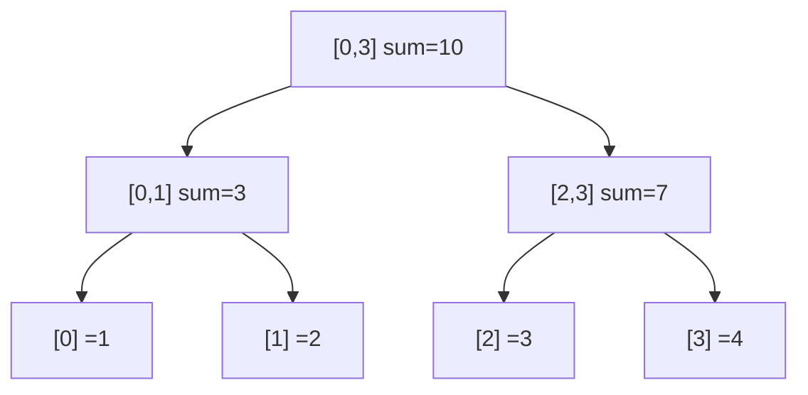

# Segment & Fenwick Trees: Fast Range Queries with Updates

> **Expert topic.** Make sure [arrays](../01-Linear-Structures/01.Arrays.md),
> [prefix sums](../06-Algorithm-Paradigms/02.Prefix-Sums.md), and [recursion](../00-Foundations/03.Recursion.md)
> are solid first.

## 🧠 Intuition

Suppose you have an array and you keep asking *"what's the sum of elements from index i to j?"*
**and** *"now change element k."* A [prefix-sum](../06-Algorithm-Paradigms/02.Prefix-Sums.md)
array answers queries in O(1) — but a single update forces you to rebuild it in O(n). When
updates and queries are both frequent, you need something that does **both in O(log n)**.

> 💡 **Analogy — nested account summaries.** Instead of summing every transaction each time, a
> bank keeps a running total per day, per month, per year. Ask for "this year" → read one
> number. Change one transaction → update just the day, month, and year totals it rolls up
> into — a handful of updates, not all of them. Segment and Fenwick trees are that hierarchy of
> partial sums.

- **Segment tree:** a binary tree where each node stores an aggregate (sum/min/max/…) of a
  *range*. Flexible — handles min, max, gcd, and "range update" variants.
- **Fenwick tree (Binary Indexed Tree / BIT):** a compact array using clever bit tricks. Less
  flexible (mainly prefix aggregates) but tiny and fast to code.

## 📐 How It Works

### Segment tree

Each leaf is one element; each internal node covers the union of its children's ranges and
stores their combined aggregate. The root covers the whole array.



- **Query [i, j]:** recurse from the root; fully-covered nodes contribute directly, partial
  ones split — only O(log n) nodes are touched.
- **Update k:** update the leaf and recombine up to the root — O(log n) nodes.

### Fenwick tree (BIT)

Stored in a 1-indexed array `tree[]` where index `i` is responsible for a range of length equal
to its **lowest set bit** (`i & -i`). Moving by `i & -i` jumps between the partial sums that
cover any prefix.

## 🧾 Pseudocode

```
# Fenwick (prefix sums)
update(i, delta):  while i <= n: tree[i] += delta; i += i & (-i)
prefix(i):         s = 0; while i > 0: s += tree[i]; i -= i & (-i); return s
range(l, r):       return prefix(r) - prefix(l - 1)
```

## 💻 C# Implementation

### Fenwick Tree (sum, 1-indexed) — compact and the usual go-to

```csharp
public class Fenwick {
    private readonly long[] tree;
    private readonly int n;
    public Fenwick(int size) { n = size; tree = new long[n + 1]; }

    public void Update(int i, long delta) {        // add delta at index i (1-based)
        for (; i <= n; i += i & (-i)) tree[i] += delta;
    }
    public long Prefix(int i) {                     // sum of [1..i]
        long s = 0;
        for (; i > 0; i -= i & (-i)) s += tree[i];
        return s;
    }
    public long RangeSum(int l, int r) => Prefix(r) - Prefix(l - 1);
}
```

### Segment Tree (sum, supports point update + range query)

```csharp
public class SegmentTree {
    private readonly int n;
    private readonly long[] tree;     // size 2n: leaves in [n, 2n), internal in [1, n)

    public SegmentTree(int[] a) {
        n = a.Length;
        tree = new long[2 * n];
        for (int i = 0; i < n; i++) tree[n + i] = a[i];          // fill leaves
        for (int i = n - 1; i > 0; i--) tree[i] = tree[2*i] + tree[2*i + 1]; // build up
    }

    public void Update(int idx, long val) {         // set a[idx] = val
        int i = idx + n;
        tree[i] = val;
        for (i >>= 1; i >= 1; i >>= 1)              // recombine ancestors
            tree[i] = tree[2*i] + tree[2*i + 1];
    }

    public long Query(int l, int r) {               // sum of [l, r] inclusive
        long sum = 0;
        for (int lo = l + n, hi = r + n + 1; lo < hi; lo >>= 1, hi >>= 1) {
            if ((lo & 1) == 1) sum += tree[lo++];   // lo is a right child → include it
            if ((hi & 1) == 1) sum += tree[--hi];   // hi is a right child → include left neighbor
        }
        return sum;
    }
}
```

> This iterative segment tree generalizes by swapping `+` for `Math.Min`/`Math.Max`/gcd to get
> range-min/max/gcd queries — that flexibility is the segment tree's edge over Fenwick.

## ⏱️ Complexity

| Operation | Segment Tree | Fenwick | Plain prefix-sum array |
|-----------|-------------|---------|------------------------|
| Build | O(n) | O(n log n) (or O(n)) | O(n) |
| Point update | O(log n) | O(log n) | **O(n)** |
| Range query | O(log n) | O(log n) (prefix) | O(1) |
| Space | O(n) (2n) | O(n) | O(n) |

When there are **no updates**, a prefix-sum array beats both (O(1) queries). Segment/Fenwick win
precisely when **updates interleave with queries**.

## ⚖️ When to Use It

- **Fenwick** when you need prefix/range **sums** with point updates and want minimal code — the
  default for "sum + update."
- **Segment tree** when you need **min/max/gcd**, range *updates* (with lazy propagation), or
  other associative combinations Fenwick can't easily do.
- **Neither** if the array is static (no updates) → plain [prefix sums](../06-Algorithm-Paradigms/02.Prefix-Sums.md);
  or if you only need *whole-array* aggregates → just keep a running value.

## 🚫 Common Mistakes

```csharp
// ❌ Mixing 0-based and 1-based indexing in Fenwick (it's 1-based!)
fenwick.Update(0, 5);          // index 0 → infinite/incorrect (i += i & -i with i=0 never moves)
// ✅ shift to 1-based: fenwick.Update(idx + 1, 5);

// ❌ Forgetting to propagate an update all the way to the root in a segment tree
// ✅ keep halving the index up to 1 (as in Update above)

// ❌ Reaching for a segment tree when there are no updates (overkill) — use prefix sums
```

## 🌍 Real-World Applications

- Range-sum / range-min queries in competitive programming and analytics dashboards.
- Counting inversions while merging; "how many smaller elements to the right."
- Interval scheduling and stabbing queries; 2D versions for image/region sums.
- Database engines computing aggregates over changing data.

## 🎯 Practice (with full solutions)

### 1. Range Sum Query — Mutable — `Medium`
**Problem:** Support `update(index, val)` and `sumRange(i, j)` on an array.
**Approach:** A Fenwick or segment tree gives both in O(log n). Fenwick stores **deltas**, so to
*set* a value, add `(newVal - oldVal)`.
```csharp
public class NumArray {
    private readonly Fenwick fen;
    private readonly int[] nums;
    public NumArray(int[] a) {
        nums = (int[])a.Clone();
        fen = new Fenwick(a.Length);
        for (int i = 0; i < a.Length; i++) fen.Update(i + 1, a[i]);   // 1-based
    }
    public void Update(int index, int val) {
        fen.Update(index + 1, val - nums[index]);   // apply the delta
        nums[index] = val;
    }
    public int SumRange(int i, int j) => (int)fen.RangeSum(i + 1, j + 1);
}
```
**Complexity:** O(log n) per op. **Why this fits:** the canonical "update + range query" problem
that motivates these structures.

### 2. Count of Smaller Numbers After Self — `Hard`
**Problem:** For each element, count how many elements to its **right** are smaller.
**Approach:** Walk right-to-left; for each value, query "how many already-seen values are
smaller" via a Fenwick indexed by value (coordinate-compress first), then insert it.
```csharp
IList<int> CountSmaller(int[] nums) {
    var sorted = nums.Distinct().OrderBy(x => x).ToArray();
    int Rank(int v) => Array.BinarySearch(sorted, v) + 1;   // 1-based rank
    var fen = new Fenwick(sorted.Length);
    var res = new int[nums.Length];
    for (int i = nums.Length - 1; i >= 0; i--) {
        int r = Rank(nums[i]);
        res[i] = (int)fen.Prefix(r - 1);     // count of strictly smaller seen so far
        fen.Update(r, 1);                    // record this value
    }
    return res;
}
```
**Complexity:** O(n log n). **Why this fits:** the showcase Fenwick application — counting via a
frequency-over-values BIT.

### 3. Range Minimum Query (segment tree) — `Medium`
**Problem:** Support point updates and "minimum over [l, r]".
**Approach:** Same segment tree, but each node stores the **min** of its children instead of the
sum (initialize the identity to `int.MaxValue`).
**Sketch:** Replace `tree[i] = tree[2i] + tree[2i+1]` with `Math.Min(...)`, and accumulate with
`Math.Min` in `Query`. **Complexity:** O(log n) per op. **Why this fits:** demonstrates the
segment tree's flexibility that Fenwick lacks.

## ✅ Key Takeaways

- These structures give **O(log n) range queries AND O(log n) updates** — beating prefix sums
  when both interleave.
- **Fenwick (BIT):** tiny, 1-indexed, uses `i & -i`; best for prefix/range **sums**.
- **Segment tree:** more code but handles **min/max/gcd** and range updates (lazy propagation).
- If there are **no updates**, use plain [prefix sums](../06-Algorithm-Paradigms/02.Prefix-Sums.md) (O(1) queries).
- Watch Fenwick's **1-based** indexing — the #1 bug.

**Self-check:**
1. When is a plain prefix-sum array better than a Fenwick/segment tree, and when worse?
2. What does `i & -i` compute, and how does Fenwick use it?
3. What can a segment tree do that a Fenwick tree cannot easily?

---
◀ Prev: [Union-Find (DSU)](06.Union-Find-DSU.md) · ▲ [Module index](README.md) · ▶ Next module: [03 — Graphs](../03-Graphs/01.Graph-Representations.md)
