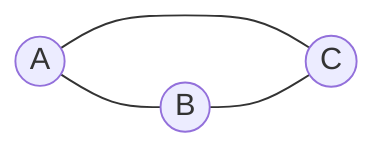

# Graph Representations: Modeling Relationships

## 🧠 Intuition

A **graph** is the most general data structure: a set of **vertices** (nodes) connected by
**edges** (relationships). Friends on a social network, cities joined by roads, web pages linked
by hyperlinks, tasks with dependencies — all graphs. A [tree](../02-Trees-and-Heaps/01.Binary-Trees-and-BST.md)
is just a special graph (connected, no cycles).

> 💡 **Analogy — a map of cities and roads.** Cities are vertices; roads are edges. Some roads
> are one-way (**directed**), some two-way (**undirected**). Some have a length/toll
> (**weighted**), some don't. Before you can *route* anything, you need a way to write the map
> down — that's what "representation" means.

The whole graph toolkit (BFS, DFS, shortest paths, MST) sits on top of *how you store the
graph*. Pick the right representation and everything else gets easier.

## 📐 How It Works

### The vocabulary

- **Directed vs undirected:** does an edge A→B imply B→A? (Twitter follows = directed;
  Facebook friends = undirected.)
- **Weighted vs unweighted:** do edges carry a cost/distance?
- **Cyclic vs acyclic:** can you return to where you started? A **DAG** (directed acyclic graph)
  is special and powers [topological sort](03.Topological-Sort.md).
- **Degree:** how many edges touch a vertex (in-degree / out-degree for directed).

### Two ways to store it

**Adjacency list** — each vertex maps to a list of its neighbors. Compact; the standard choice.


```
A → [B, C]
B → [A, C]
C → [A, B]
```

**Adjacency matrix** — a V×V grid where `m[i][j] = 1` (or the weight) if there's an edge. Fast
edge lookup, but O(V²) space even when there are few edges.

```
   A B C
A  0 1 1
B  1 0 1
C  1 1 0
```

## 🧾 Pseudocode

```
add_undirected_edge(u, v):    adj[u].add(v); adj[v].add(u)
add_directed_edge(u, v):      adj[u].add(v)
add_weighted_edge(u, v, w):   adj[u].add((v, w))   # store neighbor + cost
neighbors(u):                 return adj[u]
```

## 💻 C# Implementation

```csharp
// Adjacency list — the workhorse representation
public class Graph {
    private readonly Dictionary<int, List<int>> adj = new();
    private readonly bool directed;
    public Graph(bool directed = false) { this.directed = directed; }

    public void AddEdge(int u, int v) {
        if (!adj.ContainsKey(u)) adj[u] = new List<int>();
        if (!adj.ContainsKey(v)) adj[v] = new List<int>();
        adj[u].Add(v);
        if (!directed) adj[v].Add(u);     // undirected ⇒ both directions
    }

    public IReadOnlyList<int> Neighbors(int u) =>
        adj.TryGetValue(u, out var list) ? list : (IReadOnlyList<int>)Array.Empty<int>();

    public IEnumerable<int> Vertices => adj.Keys;
}

// Weighted adjacency list — neighbor + edge cost (used by Dijkstra/Prim)
public class WeightedGraph {
    public readonly Dictionary<int, List<(int to, int weight)>> Adj = new();
    public void AddEdge(int u, int v, int w, bool directed = false) {
        if (!Adj.ContainsKey(u)) Adj[u] = new();
        if (!Adj.ContainsKey(v)) Adj[v] = new();
        Adj[u].Add((v, w));
        if (!directed) Adj[v].Add((u, w));
    }
}

// Adjacency matrix — when the graph is dense or you need O(1) edge checks
int[,] matrix = new int[n, n];          // matrix[u, v] = weight or 0/1
```

## ⏱️ Complexity

| Operation | Adjacency List | Adjacency Matrix |
|-----------|----------------|------------------|
| Space | **O(V + E)** | O(V²) |
| Add edge | O(1) | O(1) |
| Has edge (u,v)? | O(degree) | **O(1)** |
| Iterate a vertex's neighbors | O(degree) | O(V) |
| Remove edge | O(degree) | O(1) |

`V` = vertices, `E` = edges. Most real graphs are **sparse** (E ≪ V²), so the adjacency list's
O(V + E) wins — it's the default unless you have a dense graph or need constant-time edge checks.

## ⚖️ When to Use It

- **Adjacency list:** the default. Sparse graphs, traversals that iterate neighbors (BFS/DFS,
  Dijkstra). O(V + E) space.
- **Adjacency matrix:** dense graphs, frequent "is there an edge u→v?" checks, or algorithms like
  [Floyd-Warshall](04.Shortest-Paths.md) that are inherently V³ anyway.
- **Edge list** (just a list of `(u, v, w)`): simplest of all; perfect for [Kruskal's MST](05.Minimum-Spanning-Trees.md)
  and Bellman-Ford, which iterate over edges.

## 🚫 Common Mistakes

```csharp
// ❌ Treating an undirected graph as directed (adding only one direction)
adj[u].Add(v);                       // forgot adj[v].Add(u)
// ✅ add both for undirected (see AddEdge above)

// ❌ Using an adjacency matrix for a huge sparse graph → O(V²) memory blows up
//    A graph of 1,000,000 vertices needs a 10^12-cell matrix. Use a list.

// ❌ Forgetting isolated vertices (no edges) — make sure they're still in `adj`
```

## 🌍 Real-World Applications

- Social networks (friends/follows), web link graphs (PageRank).
- Road / flight / transit networks; GPS routing.
- Dependency graphs (build systems, package managers) → DAGs.
- Recommendation systems; circuit and network design.

## 🎯 Practice (with full solutions)

### 1. Build an Adjacency List from an Edge List — `Easy`
**Problem:** Given `n` nodes and `edges`, build a neighbor lookup.
**Approach:** Initialize a list per node, then add both endpoints (undirected).
```csharp
List<int>[] BuildGraph(int n, int[][] edges) {
    var adj = new List<int>[n];
    for (int i = 0; i < n; i++) adj[i] = new List<int>();
    foreach (var e in edges) { adj[e[0]].Add(e[1]); adj[e[1]].Add(e[0]); }
    return adj;
}
```
**Complexity:** O(V + E). **Why this fits:** every graph problem starts here — internalize it.

### 2. Find the Town Judge — `Easy`
**Problem:** The judge is trusted by everyone else and trusts no one. Find them using
in/out-degree.
**Approach:** Track `degree[x] += 1` for being trusted, `-= 1` for trusting. The judge has
`degree == n - 1`.
```csharp
int FindJudge(int n, int[][] trust) {
    var degree = new int[n + 1];
    foreach (var t in trust) { degree[t[0]]--; degree[t[1]]++; }
    for (int i = 1; i <= n; i++) if (degree[i] == n - 1) return i;
    return -1;
}
```
**Complexity:** O(E). **Why this fits:** shows that **degree** alone solves some directed-graph
problems without traversal.

### 3. Find if Path Exists in Graph — `Medium`
**Problem:** Is there a path between `source` and `destination`?
**Approach:** Build the adjacency list, then BFS/DFS from the source. (Full traversal detail in
[BFS & DFS](02.BFS-and-DFS.md).)
```csharp
bool ValidPath(int n, int[][] edges, int source, int dest) {
    var adj = BuildGraph(n, edges);
    var seen = new bool[n];
    var stack = new Stack<int>(); stack.Push(source); seen[source] = true;
    while (stack.Count > 0) {
        int u = stack.Pop();
        if (u == dest) return true;
        foreach (int v in adj[u]) if (!seen[v]) { seen[v] = true; stack.Push(v); }
    }
    return false;
}
```
**Complexity:** O(V + E). **Why this fits:** connects representation to its first real use —
traversal.

## ✅ Key Takeaways

- A graph = **vertices + edges**; classify by directed/undirected, weighted/unweighted, cyclic/acyclic.
- **Adjacency list (O(V + E))** is the default; **matrix (O(V²))** suits dense graphs / O(1) edge
  checks; **edge list** suits Kruskal/Bellman-Ford.
- For **undirected** graphs, add **both** directions.
- A **DAG** unlocks [topological sort](03.Topological-Sort.md); weights unlock [shortest paths](04.Shortest-Paths.md)/[MST](05.Minimum-Spanning-Trees.md).
- Most real graphs are **sparse** — don't waste O(V²) memory on a matrix.

**Self-check:**
1. When is an adjacency matrix the right choice over an adjacency list?
2. What changes in your edge-adding code between directed and undirected graphs?
3. What's the space complexity of each representation, and why does sparsity matter?

---
◀ Prev: [Module index](README.md) · ▲ [Module index](README.md) · ▶ Next: [BFS & DFS](02.BFS-and-DFS.md)
