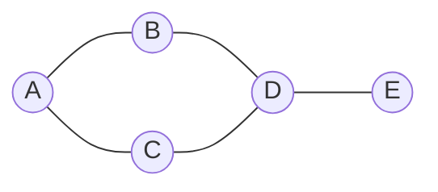

# BFS & DFS: The Two Ways to Explore a Graph

## 🧠 Intuition

Almost every graph algorithm is a variation of "visit the nodes in some order." There are two
fundamental orders:

- **BFS (Breadth-First Search):** explore in rings — all nodes 1 step away, then 2 steps, then
  3… Like ripples spreading from a stone dropped in water. Uses a **[queue](../01-Linear-Structures/05.Queues-and-Deques.md)**.
- **DFS (Depth-First Search):** plunge down one path as far as you can, then back up and try
  another. Like exploring a maze by always taking the next unexplored corridor. Uses a
  **[stack](../01-Linear-Structures/04.Stacks.md)** (or recursion, which is an implicit stack).

> 💡 **The key difference:** BFS finds the **shortest path in an unweighted graph** (fewest
> edges) because it reaches nodes in order of distance. DFS doesn't — but it's perfect for
> "explore everything," cycle detection, topological ordering, and path/backtracking problems.

The one rule both must obey: **track visited nodes**, or you'll loop forever on cycles.

## 📐 How It Works



Starting at **A**:
- **BFS** order: A, then B & C (distance 1), then D (distance 2), then E (distance 3).
- **DFS** order (one possibility): A → B → D → C → … → E, going deep before wide.

| | BFS | DFS |
|--|-----|-----|
| Data structure | Queue (FIFO) | Stack / recursion (LIFO) |
| Explores | Level by level | Branch by branch |
| Finds shortest path (unweighted)? | **Yes** | No |
| Memory | O(width) — can be large | O(depth) |
| Natural for | Distance, "nearest" | Connectivity, cycles, ordering, backtracking |

## 🧾 Pseudocode

```
BFS(start):
    queue = [start]; visited = {start}
    while queue not empty:
        u = queue.dequeue()
        process(u)
        for v in neighbors(u):
            if v not visited: visited.add(v); queue.enqueue(v)

DFS(u):
    visited.add(u); process(u)
    for v in neighbors(u):
        if v not visited: DFS(v)
```

## 💻 C# Implementation

```csharp
// BFS — also computes shortest #edges from start to every node
IList<int> Bfs(List<int>[] adj, int start) {
    var order = new List<int>();
    var visited = new bool[adj.Length];
    var q = new Queue<int>();
    q.Enqueue(start); visited[start] = true;
    while (q.Count > 0) {
        int u = q.Dequeue();
        order.Add(u);
        foreach (int v in adj[u])
            if (!visited[v]) { visited[v] = true; q.Enqueue(v); }   // mark on enqueue!
    }
    return order;
}

// DFS — recursive
void Dfs(List<int>[] adj, int u, bool[] visited, List<int> order) {
    visited[u] = true;
    order.Add(u);
    foreach (int v in adj[u])
        if (!visited[v]) Dfs(adj, v, visited, order);
}

// DFS — iterative (no recursion, safe for deep graphs)
IList<int> DfsIterative(List<int>[] adj, int start) {
    var order = new List<int>();
    var visited = new bool[adj.Length];
    var st = new Stack<int>(); st.Push(start);
    while (st.Count > 0) {
        int u = st.Pop();
        if (visited[u]) continue;
        visited[u] = true; order.Add(u);
        foreach (int v in adj[u]) if (!visited[v]) st.Push(v);
    }
    return order;
}

// Counting connected components (handles disconnected graphs)
int CountComponents(List<int>[] adj) {
    var visited = new bool[adj.Length];
    int count = 0;
    for (int i = 0; i < adj.Length; i++)
        if (!visited[i]) { count++; Dfs(adj, i, visited, new List<int>()); }
    return count;
}
```

> **Mark visited at enqueue (BFS) / before recursing (DFS)**, not when you process — otherwise a
> node can be added to the frontier multiple times.

## ⏱️ Complexity

| | Time | Space |
|--|------|-------|
| BFS | O(V + E) | O(V) — queue + visited (up to O(width)) |
| DFS | O(V + E) | O(V) — stack/recursion depth + visited |

Both visit each vertex once and each edge once → **O(V + E)**. The difference is *frontier
shape*: BFS can hold a whole level (wide), DFS holds a path (deep).

## ⚖️ When to Use It

- **BFS:** shortest path / minimum steps in an **unweighted** graph, "nearest" queries,
  level-order processing, web crawling by distance. (For *weighted* shortest paths, use
  [Dijkstra](04.Shortest-Paths.md).)
- **DFS:** detecting cycles, [topological sort](03.Topological-Sort.md), finding connected
  components, flood fill, and anything recursive/backtracking (mazes, islands).
- **Either** works for plain reachability/connectivity — pick by memory shape (deep vs wide).

## 🚫 Common Mistakes

```csharp
// ❌ No visited set → infinite loop on any cycle
// ✅ always track visited

// ❌ Marking visited when DEQUEUING in BFS → a node gets enqueued many times (still correct
//    distances, but wasteful and can blow up memory)
// ✅ mark visited at the moment you ENQUEUE

// ❌ Recursive DFS on a graph with millions of nodes → stack overflow
// ✅ use the iterative stack version for very deep/large graphs

// ❌ Forgetting disconnected components — loop over all start vertices (see CountComponents)
```

## 🌍 Real-World Applications

- BFS: shortest route in unweighted maps, social "degrees of separation," web crawlers,
  network broadcast.
- DFS: dependency resolution, deadlock/cycle detection, maze solving, garbage collection
  reachability, connected-component labeling.

## 🎯 Practice (with full solutions)

### 1. Number of Islands — `Medium`
**Problem:** Count islands of `'1'` in a grid (4-directional connectivity).
**Approach:** Each unvisited land cell starts a DFS/BFS that sinks the whole island; count how
many times you start.
```csharp
int NumIslands(char[][] grid) {
    int rows = grid.Length, cols = grid[0].Length, count = 0;
    void Sink(int r, int c) {
        if (r < 0 || c < 0 || r >= rows || c >= cols || grid[r][c] != '1') return;
        grid[r][c] = '0';                          // mark visited
        Sink(r+1,c); Sink(r-1,c); Sink(r,c+1); Sink(r,c-1);
    }
    for (int r = 0; r < rows; r++)
        for (int c = 0; c < cols; c++)
            if (grid[r][c] == '1') { count++; Sink(r, c); }
    return count;
}
```
**Complexity:** O(rows·cols). **Why this fits:** flood fill = DFS on an implicit grid graph.

### 2. Shortest Path in Binary Matrix — `Medium`
**Problem:** Shortest clear path from top-left to bottom-right (8-directional), or -1.
**Approach:** **BFS** — because every step has equal cost, the first time you reach the goal is
the shortest. Track distance as you expand rings.
```csharp
int ShortestPathBinaryMatrix(int[][] grid) {
    int n = grid.Length;
    if (grid[0][0] != 0 || grid[n-1][n-1] != 0) return -1;
    int[][] dirs = {new[]{1,0},new[]{-1,0},new[]{0,1},new[]{0,-1},
                    new[]{1,1},new[]{1,-1},new[]{-1,1},new[]{-1,-1}};
    var q = new Queue<(int r, int c, int d)>();
    q.Enqueue((0, 0, 1)); grid[0][0] = 1;          // reuse grid as visited
    while (q.Count > 0) {
        var (r, c, d) = q.Dequeue();
        if (r == n-1 && c == n-1) return d;
        foreach (var dir in dirs) {
            int nr = r + dir[0], nc = c + dir[1];
            if (nr>=0 && nc>=0 && nr<n && nc<n && grid[nr][nc]==0) {
                grid[nr][nc] = 1; q.Enqueue((nr, nc, d + 1));
            }
        }
    }
    return -1;
}
```
**Complexity:** O(n²). **Why this fits:** the defining use of BFS — shortest steps in an
unweighted grid.

### 3. Clone Graph — `Medium`
**Problem:** Deep-copy a connected undirected graph.
**Approach:** DFS/BFS while keeping a map from original node → its clone, so shared neighbors are
copied once.
```csharp
Node CloneGraph(Node node) {
    if (node == null) return null;
    var clones = new Dictionary<Node, Node>();
    Node Dfs(Node n) {
        if (clones.TryGetValue(n, out var existing)) return existing;
        var copy = new Node(n.val);
        clones[n] = copy;
        foreach (var nb in n.neighbors) copy.neighbors.Add(Dfs(nb));
        return copy;
    }
    return Dfs(node);
}
```
**Complexity:** O(V + E). **Why this fits:** shows the visited-map pattern that prevents infinite
recursion on cycles.

### 4. Rotting Oranges (multi-source BFS) — `Medium`
**Problem:** Each minute, rotten oranges rot adjacent fresh ones. Minutes until none fresh, or -1.
**Approach:** **Multi-source BFS** — start the queue with *all* rotten oranges at once; each BFS
level is one minute.
```csharp
int OrangesRotting(int[][] grid) {
    int rows = grid.Length, cols = grid[0].Length, fresh = 0, minutes = 0;
    var q = new Queue<(int,int)>();
    for (int r = 0; r < rows; r++)
        for (int c = 0; c < cols; c++) {
            if (grid[r][c] == 2) q.Enqueue((r, c));
            else if (grid[r][c] == 1) fresh++;
        }
    int[][] dirs = {new[]{1,0},new[]{-1,0},new[]{0,1},new[]{0,-1}};
    while (q.Count > 0 && fresh > 0) {
        minutes++;
        for (int i = q.Count; i > 0; i--) {
            var (r, c) = q.Dequeue();
            foreach (var d in dirs) {
                int nr = r+d[0], nc = c+d[1];
                if (nr>=0&&nc>=0&&nr<rows&&nc<cols&&grid[nr][nc]==1) {
                    grid[nr][nc] = 2; fresh--; q.Enqueue((nr, nc));
                }
            }
        }
    }
    return fresh == 0 ? minutes : -1;
}
```
**Complexity:** O(rows·cols). **Why this fits:** introduces **multi-source BFS**, a powerful
generalization (seed the queue with many starts).

## ✅ Key Takeaways

- BFS (queue) explores **level by level** → shortest path in **unweighted** graphs; DFS
  (stack/recursion) explores **deep** → connectivity, cycles, ordering.
- Both are **O(V + E)**; always **track visited** to handle cycles.
- Mark visited at **enqueue** (BFS) / before recursing (DFS).
- Use the **iterative** DFS for very deep graphs to avoid stack overflow.
- **Multi-source BFS** (many starts) elegantly handles "spreading" problems.

**Self-check:**
1. Why does BFS find shortest paths in unweighted graphs but DFS doesn't?
2. Which data structure backs each, and what frontier shape (deep vs wide) results?
3. When you must mark a node visited in BFS, and why not at dequeue?

---
◀ Prev: [Graph Representations](01.Graph-Representations.md) · ▲ [Module index](README.md) · ▶ Next: [Topological Sort](03.Topological-Sort.md)
