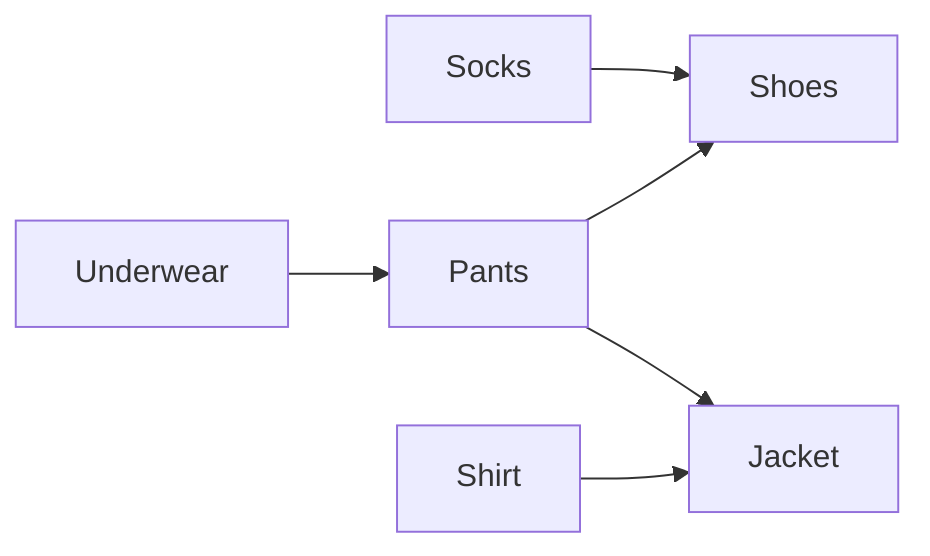

# Topological Sort: Ordering Things With Dependencies

## 🧠 Intuition

Some tasks must happen before others. You can't put on shoes before socks; you can't take
"Advanced Algorithms" before "Intro to Programming." A **topological sort** takes a set of items
with "must-come-before" rules and produces a valid linear order — every prerequisite appears
before the thing that needs it.

> 💡 **Analogy — getting dressed.** Socks before shoes, shirt before jacket, underwear before
> pants. There are several valid orders, but all respect the rules. Topological sort finds one
> such order (or tells you it's impossible because of a contradiction — a cycle).

This only makes sense on a **DAG** (Directed Acyclic Graph): directed (rules have a direction)
and acyclic (no "A before B before A" contradictions). If there's a cycle, **no valid order
exists** — and detecting that is half of what these algorithms do.

## 📐 How It Works


A valid order: `Socks, Underwear, Shirt, Pants, Shoes, Jacket` (one of many).

Two standard algorithms:

**1. Kahn's algorithm (BFS-based).** Repeatedly take any node with **in-degree 0** (no remaining
prerequisites), output it, and remove its outgoing edges (decrementing neighbors' in-degrees).
If you process all nodes, you have an order; if some remain, there's a **cycle**.

**2. DFS-based.** DFS the graph; when a node *finishes* (all its descendants done), push it onto
a stack. The reversed finish order is a topological order. A node revisited while still "in
progress" signals a cycle.

## 🧾 Pseudocode

```
Kahn:
    compute in-degree of every node
    queue = all nodes with in-degree 0
    while queue not empty:
        u = dequeue; append u to order
        for v in neighbors(u):
            in-degree[v] -= 1
            if in-degree[v] == 0: enqueue v
    if order has all nodes: return order  else: cycle exists
```

## 💻 C# Implementation

### Kahn's algorithm (BFS) — also detects cycles

```csharp
// Returns a topological order, or empty list if a cycle exists.
IList<int> TopoSort(int n, int[][] edges) {   // edge [a, b] means a must come before b
    var adj = new List<int>[n];
    var indeg = new int[n];
    for (int i = 0; i < n; i++) adj[i] = new List<int>();
    foreach (var e in edges) { adj[e[0]].Add(e[1]); indeg[e[1]]++; }

    var q = new Queue<int>();
    for (int i = 0; i < n; i++) if (indeg[i] == 0) q.Enqueue(i);

    var order = new List<int>();
    while (q.Count > 0) {
        int u = q.Dequeue();
        order.Add(u);
        foreach (int v in adj[u])
            if (--indeg[v] == 0) q.Enqueue(v);
    }
    return order.Count == n ? order : new List<int>();   // incomplete ⇒ cycle
}
```

### DFS-based with cycle detection

```csharp
IList<int> TopoSortDfs(int n, List<int>[] adj) {
    var state = new int[n];          // 0=unvisited, 1=in-progress, 2=done
    var order = new List<int>();
    bool hasCycle = false;

    void Dfs(int u) {
        state[u] = 1;                // in progress
        foreach (int v in adj[u]) {
            if (state[v] == 1) { hasCycle = true; return; }   // back edge ⇒ cycle
            if (state[v] == 0) Dfs(v);
        }
        state[u] = 2;                // finished
        order.Add(u);                // push on finish
    }

    for (int i = 0; i < n; i++) if (state[i] == 0) Dfs(i);
    if (hasCycle) return new List<int>();
    order.Reverse();                 // finish order reversed = topo order
    return order;
}
```

## ⏱️ Complexity

| Algorithm | Time | Space | Notes |
|-----------|------|-------|-------|
| Kahn (BFS) | O(V + E) | O(V) | Easy cycle detection (leftover nodes) |
| DFS-based | O(V + E) | O(V) | Cycle = "in-progress" node revisited |

Both are linear in the graph size. Choose by taste; Kahn's makes the cycle check especially
clean.

## ⚖️ When to Use It

- **Use it when** items have a partial order of dependencies and you need a valid linear
  sequence: build systems, task schedulers, course prerequisites, package/install ordering,
  spreadsheet formula evaluation.
- **It also answers "is there a cycle in a directed graph?"** — if a full topo order doesn't
  exist, there's a cycle.
- **Not applicable to** undirected graphs or graphs where order is irrelevant.

## 🚫 Common Mistakes

```csharp
// ❌ Running topo sort on a graph with a cycle and trusting the result
//    Always check order.Count == n (Kahn) or the in-progress flag (DFS).

// ❌ Mixing up edge direction: [a, b] = "a before b" means adj[a].Add(b), indeg[b]++
//    Reversing this silently produces a reversed/invalid order.

// ❌ DFS topo order WITHOUT reversing — finish order is the reverse of topo order
order.Reverse();   // ✅ don't forget
```

## 🌍 Real-World Applications

- Build tools (Make, Bazel) ordering compilation by dependency.
- Package managers resolving install order (apt, npm).
- Task/job schedulers; spreadsheet recalculation order.
- Course planning; resolving symbol/type dependencies in compilers.

## 🎯 Practice (with full solutions)

### 1. Course Schedule — `Medium`
**Problem:** Given course prerequisites, can you finish all courses? (i.e., is the graph a DAG?)
**Approach:** Run Kahn's; if you can process every course (no cycle), it's possible.
```csharp
bool CanFinish(int numCourses, int[][] prerequisites) {
    var adj = new List<int>[numCourses];
    var indeg = new int[numCourses];
    for (int i = 0; i < numCourses; i++) adj[i] = new List<int>();
    foreach (var p in prerequisites) { adj[p[1]].Add(p[0]); indeg[p[0]]++; }  // p[1] before p[0]
    var q = new Queue<int>();
    for (int i = 0; i < numCourses; i++) if (indeg[i] == 0) q.Enqueue(i);
    int done = 0;
    while (q.Count > 0) {
        int u = q.Dequeue(); done++;
        foreach (int v in adj[u]) if (--indeg[v] == 0) q.Enqueue(v);
    }
    return done == numCourses;
}
```
**Complexity:** O(V + E). **Why this fits:** topo sort *as* cycle detection — the classic framing.

### 2. Course Schedule II — `Medium`
**Problem:** Return a valid order to take all courses (or empty if impossible).
**Approach:** Same Kahn's, but collect the processed order; return it only if complete.
```csharp
int[] FindOrder(int numCourses, int[][] prerequisites) {
    var adj = new List<int>[numCourses];
    var indeg = new int[numCourses];
    for (int i = 0; i < numCourses; i++) adj[i] = new List<int>();
    foreach (var p in prerequisites) { adj[p[1]].Add(p[0]); indeg[p[0]]++; }
    var q = new Queue<int>();
    for (int i = 0; i < numCourses; i++) if (indeg[i] == 0) q.Enqueue(i);
    var order = new List<int>();
    while (q.Count > 0) {
        int u = q.Dequeue(); order.Add(u);
        foreach (int v in adj[u]) if (--indeg[v] == 0) q.Enqueue(v);
    }
    return order.Count == numCourses ? order.ToArray() : Array.Empty<int>();
}
```
**Complexity:** O(V + E). **Why this fits:** produces the actual ordering, the core deliverable.

### 3. Alien Dictionary — `Hard`
**Problem:** Given words sorted in an unknown alphabet's order, deduce a valid letter order.
**Approach:** Compare adjacent words to find the first differing character → that gives an edge
"earlier letter before later letter." Topo-sort the letters. Detect contradictions (cycle) and
the invalid-prefix case.
**Sketch:** Build edges from adjacent-word comparisons, then run Kahn's over the distinct
letters; an incomplete order means an inconsistent dictionary.
**Complexity:** O(total characters). **Why this fits:** shows how to *derive* a dependency graph
from data, then topo-sort it — the real-world skill.

## ✅ Key Takeaways

- Topological sort linearizes a **DAG** so every dependency precedes its dependents.
- **Kahn's** (BFS on in-degrees) and **DFS** (reverse finish order) both run in **O(V + E)**.
- An incomplete result means a **cycle** ⇒ no valid order exists; this doubles as directed-cycle
  detection.
- Get the **edge direction right**: "a before b" ⇒ `adj[a]→b`, `indeg[b]++`.
- Use it for builds, schedulers, prerequisites, and formula evaluation.

**Self-check:**
1. Why does topological sort require a DAG, and what happens on a cycle?
2. How does Kahn's algorithm detect that no valid order exists?
3. Why must you reverse the DFS finish order to get a topological order?

---
◀ Prev: [BFS & DFS](02.BFS-and-DFS.md) · ▲ [Module index](README.md) · ▶ Next: [Shortest Paths](04.Shortest-Paths.md)
