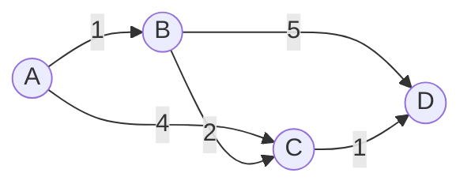

# Shortest Paths: Cheapest Routes Through a Weighted Graph

## 🧠 Intuition

[BFS](02.BFS-and-DFS.md) finds the path with the **fewest edges**. But what if edges have
different *costs* — road distances, flight prices, network latencies? Then "fewest hops" ≠
"cheapest." Shortest-path algorithms find the **minimum total weight** route.

> 💡 **Analogy — a GPS.** It doesn't route you over the fewest roads; it routes you over the
> *fastest* combination, weighing each segment's time. Three short fast roads beat one long slow
> one.

There's no single "best" algorithm — you pick based on the graph:

| Algorithm | Solves | Needs | Time |
|-----------|--------|-------|------|
| **BFS** | Single source, **unweighted** | — | O(V + E) |
| **Dijkstra** | Single source, **non-negative** weights | a [heap](../02-Trees-and-Heaps/04.Heaps-and-Priority-Queues.md) | O(E log V) |
| **Bellman-Ford** | Single source, **negative** weights OK | — | O(V·E) |
| **Floyd-Warshall** | **All pairs** | small V | O(V³) |

## 📐 How It Works

### Dijkstra — greedy expansion by cheapest

Keep a tentative distance to every node (∞ at first, 0 for the source). Repeatedly pick the
**unfinalized node with the smallest distance**, finalize it, and **relax** its edges (if going
through it is cheaper, update the neighbor). A [min-heap](../02-Trees-and-Heaps/04.Heaps-and-Priority-Queues.md)
makes "pick the cheapest" fast.


From A: dist(B)=1, dist(C)=min(4, 1+2)=3, dist(D)=min(1+5, 3+1)=4 (A→B→C→D).

**Why non-negative only:** Dijkstra finalizes a node the first time it's popped, assuming no
later path can beat it. A negative edge could make a "longer" route cheaper, breaking that
assumption.

### Bellman-Ford — relax every edge, V−1 times

It doesn't trust greed. It just relaxes **all** edges repeatedly; after `V−1` rounds, all
shortest paths are settled. A V-th round that *still* improves something reveals a **negative
cycle** (a loop you could ride forever to get cheaper).

### Floyd-Warshall — try every node as a midpoint

For all pairs (i, j), check whether going through some node k is shorter: `dist[i][j] =
min(dist[i][j], dist[i][k] + dist[k][j])`. Three nested loops → O(V³). Great for small dense
graphs / all-pairs.

## 🧾 Pseudocode

```
Dijkstra(source):
    dist[*] = ∞; dist[source] = 0
    heap = {(0, source)}
    while heap not empty:
        (d, u) = pop-min(heap)
        if d > dist[u]: continue          # stale entry
        for (v, w) in neighbors(u):
            if dist[u] + w < dist[v]:
                dist[v] = dist[u] + w
                push(heap, (dist[v], v))
```

## 💻 C# Implementation

### Dijkstra (with a priority queue)

```csharp
int[] Dijkstra(int n, Dictionary<int, List<(int to, int w)>> adj, int source) {
    var dist = new int[n];
    Array.Fill(dist, int.MaxValue);
    dist[source] = 0;
    var pq = new PriorityQueue<int, int>();      // node, priority = distance
    pq.Enqueue(source, 0);
    while (pq.Count > 0) {
        pq.TryDequeue(out int u, out int d);
        if (d > dist[u]) continue;               // outdated entry, skip
        if (!adj.TryGetValue(u, out var nbrs)) continue;
        foreach (var (v, w) in nbrs) {
            int nd = d + w;
            if (nd < dist[v]) { dist[v] = nd; pq.Enqueue(v, nd); }   // relax
        }
    }
    return dist;
}
```

### Bellman-Ford (handles negative edges, detects negative cycles)

```csharp
// edges: array of [u, v, w]; returns dist[], or null if a negative cycle exists
int[] BellmanFord(int n, int[][] edges, int source) {
    var dist = new long[n];
    Array.Fill(dist, long.MaxValue);
    dist[source] = 0;
    for (int i = 0; i < n - 1; i++)               // V-1 rounds
        foreach (var e in edges) {
            if (dist[e[0]] != long.MaxValue && dist[e[0]] + e[2] < dist[e[1]])
                dist[e[1]] = dist[e[0]] + e[2];
        }
    foreach (var e in edges)                       // V-th round detects negative cycle
        if (dist[e[0]] != long.MaxValue && dist[e[0]] + e[2] < dist[e[1]])
            return null;                           // negative cycle reachable
    return dist.Select(d => (int)d).ToArray();
}
```

### Floyd-Warshall (all pairs)

```csharp
void FloydWarshall(int[,] dist, int n) {          // dist[i,j] = weight or "infinity"
    for (int k = 0; k < n; k++)
        for (int i = 0; i < n; i++)
            for (int j = 0; j < n; j++)
                if (dist[i,k] != int.MaxValue && dist[k,j] != int.MaxValue
                    && dist[i,k] + dist[k,j] < dist[i,j])
                    dist[i,j] = dist[i,k] + dist[k,j];
}
```

## ⏱️ Complexity

| Algorithm | Time | Space | Negative weights? |
|-----------|------|-------|-------------------|
| BFS (unweighted) | O(V + E) | O(V) | n/a |
| Dijkstra (heap) | O(E log V) | O(V) | **No** |
| Bellman-Ford | O(V·E) | O(V) | **Yes** (+ detects neg cycles) |
| Floyd-Warshall | O(V³) | O(V²) | Yes (no neg cycles) |

## ⚖️ When to Use It

- **Unweighted?** Just [BFS](02.BFS-and-DFS.md) — don't over-engineer.
- **Non-negative weights, one source?** **Dijkstra** — the everyday default (maps, networks).
- **Negative weights, or need cycle detection?** **Bellman-Ford** (e.g. currency arbitrage).
- **Need every pair's distance and V is small (≤ ~400)?** **Floyd-Warshall** for its simplicity.

## 🚫 Common Mistakes

```csharp
// ❌ Using Dijkstra with negative edges → silently wrong answers
// ✅ switch to Bellman-Ford when weights can be negative

// ❌ Not skipping stale heap entries → slower, sometimes wrong
if (d > dist[u]) continue;        // ✅ ignore outdated distances

// ❌ Integer overflow when adding to int.MaxValue (∞ + w wraps negative)
// ✅ guard `dist[u] != MaxValue` before relaxing, or use long
```

## 🌍 Real-World Applications

- GPS / map routing, flight and transit planners.
- Network packet routing (OSPF uses Dijkstra-like link-state).
- Currency arbitrage detection (negative cycles → Bellman-Ford).
- Game pathfinding (A* is Dijkstra + a heuristic).

## 🎯 Practice (with full solutions)

### 1. Network Delay Time — `Medium`
**Problem:** Signal starts at node `k`; how long until **all** nodes receive it? (-1 if some
can't.)
**Approach:** Dijkstra from `k`; the answer is the **maximum** finalized distance (or -1 if any is
still ∞).
```csharp
int NetworkDelayTime(int[][] times, int n, int k) {
    var adj = new Dictionary<int, List<(int,int)>>();
    foreach (var t in times) {
        if (!adj.ContainsKey(t[0])) adj[t[0]] = new();
        adj[t[0]].Add((t[1], t[2]));
    }
    var dist = Dijkstra(n + 1, adj, k);            // nodes are 1..n
    int max = 0;
    for (int i = 1; i <= n; i++) {
        if (dist[i] == int.MaxValue) return -1;
        max = Math.Max(max, dist[i]);
    }
    return max;
}
```
**Complexity:** O(E log V). **Why this fits:** textbook single-source Dijkstra with a twist
(take the max).

### 2. Cheapest Flights Within K Stops — `Medium`
**Problem:** Cheapest price from `src` to `dst` using at most `k` stops.
**Approach:** **Bellman-Ford limited to k+1 rounds** — each round allows one more edge (stop). Use
a snapshot of distances per round so you don't use an edge twice in one round.
```csharp
int FindCheapestPrice(int n, int[][] flights, int src, int dst, int k) {
    var dist = new int[n];
    Array.Fill(dist, int.MaxValue);
    dist[src] = 0;
    for (int i = 0; i <= k; i++) {                 // at most k stops ⇒ k+1 edges
        var next = (int[])dist.Clone();
        foreach (var f in flights) {
            if (dist[f[0]] != int.MaxValue)
                next[f[1]] = Math.Min(next[f[1]], dist[f[0]] + f[2]);
        }
        dist = next;
    }
    return dist[dst] == int.MaxValue ? -1 : dist[dst];
}
```
**Complexity:** O(k·E). **Why this fits:** shows Bellman-Ford's round structure encoding a "hop
limit" — a constraint Dijkstra can't express directly.

### 3. Find the City With Smallest Number of Neighbors — `Medium`
**Problem:** Among all cities, find the one that can reach the fewest others within a distance
threshold.
**Approach:** **Floyd-Warshall** for all-pairs distances (V is small), then count reachable
cities per source.
```csharp
int FindTheCity(int n, int[][] edges, int distanceThreshold) {
    var d = new int[n, n];
    for (int i = 0; i < n; i++) for (int j = 0; j < n; j++) d[i,j] = i==j ? 0 : 100000000;
    foreach (var e in edges) { d[e[0],e[1]] = e[2]; d[e[1],e[0]] = e[2]; }
    FloydWarshall(d, n);
    int best = -1, fewest = int.MaxValue;
    for (int i = 0; i < n; i++) {
        int reach = 0;
        for (int j = 0; j < n; j++) if (i != j && d[i,j] <= distanceThreshold) reach++;
        if (reach <= fewest) { fewest = reach; best = i; }   // tie ⇒ larger index
    }
    return best;
}
```
**Complexity:** O(V³). **Why this fits:** the natural all-pairs use case where Floyd-Warshall's
simplicity beats running Dijkstra V times.

## ✅ Key Takeaways

- Match the algorithm to the graph: **BFS** (unweighted) · **Dijkstra** (non-negative) ·
  **Bellman-Ford** (negative OK, detects neg cycles) · **Floyd-Warshall** (all pairs, small V).
- **Relaxation** ("is going through u cheaper for v?") is the shared core of all of them.
- Dijkstra is greedy + a [min-heap](../02-Trees-and-Heaps/04.Heaps-and-Priority-Queues.md); it
  breaks on negative edges.
- Bellman-Ford's `V−1` rounds settle all paths; a V-th improvement = negative cycle.
- Guard against **overflow** when relaxing against an "infinity" sentinel.

**Self-check:**
1. Why can't Dijkstra handle negative edge weights?
2. What does "relaxing an edge" mean, and which algorithms use it?
3. When would you choose Floyd-Warshall over running Dijkstra from every node?

---
◀ Prev: [Topological Sort](03.Topological-Sort.md) · ▲ [Module index](README.md) · ▶ Next: [Minimum Spanning Trees](05.Minimum-Spanning-Trees.md)
