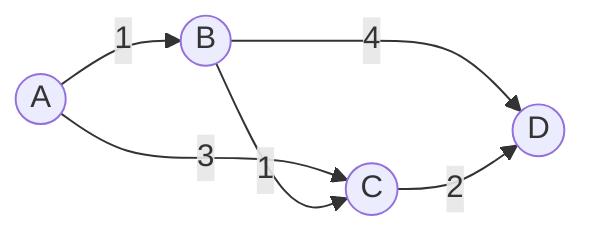

# Minimum Spanning Trees: Connect Everything for the Least Cost

## 🧠 Intuition

You have a set of points (towns) and possible links between them (roads), each with a cost. You
want to connect **all** of them so everyone is reachable, **spending as little as possible**, with
no wasteful redundant links. The result is a **Minimum Spanning Tree (MST)**: it touches every
vertex (*spanning*), has no cycles (it's a *tree*), and has the minimum total edge weight.

> 💡 **Analogy — wiring a neighborhood.** A utility company must run cable to every house. They
> don't need a cable between every pair of houses — just enough to connect them all, choosing the
> cheapest combination. Adding any extra cable would create a redundant loop. That cheapest
> loop-free connecting set is the MST.

An MST of `V` vertices always has exactly `V − 1` edges. Two classic greedy algorithms find it,
and both rely on a beautiful fact: **always taking the cheapest "safe" edge gives the optimum.**

## 📐 How It Works


MST picks edges A-B(1), B-C(1), C-D(2) = total **4** (skipping the pricier A-C and B-D).

### Kruskal — sort edges, add the cheapest that doesn't form a cycle

Sort all edges by weight. Walk them cheapest-first, adding an edge **only if its endpoints
aren't already connected** (checked with [Union-Find](../02-Trees-and-Heaps/06.Union-Find-DSU.md)).
Stop at `V − 1` edges. Edge-centric — great for sparse graphs / edge lists.

### Prim — grow one tree outward, always adding the cheapest frontier edge

Start from any vertex. Repeatedly add the **cheapest edge that connects the tree to a new
vertex** (found with a [min-heap](../02-Trees-and-Heaps/04.Heaps-and-Priority-Queues.md)). Like
Dijkstra, but the priority is "edge weight to reach this node," not "total distance." Vertex-
centric — great for dense graphs / adjacency lists.

## 🧾 Pseudocode

```
Kruskal:
    sort edges by weight
    uf = UnionFind(V); mst = []
    for (u, v, w) in edges:
        if uf.union(u, v):           # they weren't connected ⇒ safe to add
            mst.add((u, v, w))
            if mst.size == V-1: break
    return mst
```

## 💻 C# Implementation

### Kruskal (uses Union-Find)

```csharp
// edges: array of [u, v, w]. Returns total MST weight (or -1 if disconnected).
int KruskalMST(int n, int[][] edges) {
    Array.Sort(edges, (a, b) => a[2] - b[2]);     // cheapest first
    var uf = new UnionFind(n);                     // from the Union-Find chapter
    int total = 0, used = 0;
    foreach (var e in edges) {
        if (uf.Union(e[0], e[1])) {                // union succeeds ⇒ no cycle formed
            total += e[2];
            if (++used == n - 1) break;            // tree complete
        }
    }
    return used == n - 1 ? total : -1;             // couldn't connect all ⇒ disconnected
}
```

### Prim (uses a min-heap)

```csharp
int PrimMST(int n, Dictionary<int, List<(int to, int w)>> adj) {
    var inTree = new bool[n];
    var pq = new PriorityQueue<int, int>();        // node, priority = edge weight to reach it
    pq.Enqueue(0, 0);                              // start from vertex 0
    int total = 0, count = 0;
    while (pq.Count > 0 && count < n) {
        pq.TryDequeue(out int u, out int w);
        if (inTree[u]) continue;                   // already connected, skip
        inTree[u] = true; total += w; count++;
        if (adj.TryGetValue(u, out var nbrs))
            foreach (var (v, weight) in nbrs)
                if (!inTree[v]) pq.Enqueue(v, weight);
    }
    return count == n ? total : -1;                // -1 if graph is disconnected
}
```

## ⏱️ Complexity

| Algorithm | Time | Space | Best for |
|-----------|------|-------|----------|
| Kruskal | O(E log E) | O(V) | **Sparse** graphs, edge lists |
| Prim (heap) | O(E log V) | O(V) | **Dense** graphs, adjacency lists |

The dominant cost in Kruskal is **sorting** the edges; the Union-Find checks are near-O(1). Both
produce the same minimum total weight (though possibly different edge sets when weights tie).

## ⚖️ When to Use It

- **Use an MST when** you must connect everything at minimum cost with no redundancy: network/
  utility layout, clustering, approximate TSP, image segmentation, designing circuits.
- **Kruskal** if edges are already a list / the graph is sparse; **Prim** if you have an
  adjacency list / the graph is dense.
- **Not** for shortest *path* between two specific nodes — that's [shortest paths](04.Shortest-Paths.md).
  (MST minimizes total tree weight, *not* pairwise distances.)

## 🚫 Common Mistakes

```csharp
// ❌ Confusing MST with shortest paths — the MST path between two nodes is NOT
//    necessarily their shortest path. Different problems, different algorithms.

// ❌ Kruskal without a cycle check → you build a cheap subgraph with loops, not a tree
if (uf.Union(u, v)) { ... }      // ✅ Union-Find guards against cycles

// ❌ Forgetting the disconnected case — if you can't reach V-1 edges, there's no spanning tree
```

## 🌍 Real-World Applications

- Laying out networks: electrical grids, fiber/cable, water pipes, road connections.
- Clustering (cut the most expensive MST edges to form groups); image segmentation.
- Approximation algorithms for the Traveling Salesman Problem.
- Designing low-cost, redundancy-free distribution systems.

## 🎯 Practice (with full solutions)

### 1. Min Cost to Connect All Points — `Medium`
**Problem:** Connect all 2D points; the cost between two points is their Manhattan distance.
Minimize total cost.
**Approach:** It's a complete weighted graph → run **Prim** (dense graph favors it). Edge weight
= |x1−x2| + |y1−y2|.
```csharp
int MinCostConnectPoints(int[][] points) {
    int n = points.Length;
    var inTree = new bool[n];
    var minEdge = new int[n];
    Array.Fill(minEdge, int.MaxValue);
    minEdge[0] = 0;
    int total = 0;
    for (int iter = 0; iter < n; iter++) {
        int u = -1;
        for (int i = 0; i < n; i++)                 // pick cheapest unconnected node
            if (!inTree[i] && (u == -1 || minEdge[i] < minEdge[u])) u = i;
        inTree[u] = true; total += minEdge[u];
        for (int v = 0; v < n; v++) {               // relax frontier
            if (!inTree[v]) {
                int d = Math.Abs(points[u][0]-points[v][0]) + Math.Abs(points[u][1]-points[v][1]);
                if (d < minEdge[v]) minEdge[v] = d;
            }
        }
    }
    return total;
}
```
**Complexity:** O(V²) (dense Prim). **Why this fits:** the archetypal MST problem on an implicit
complete graph.

### 2. Connecting Cities With Minimum Cost — `Medium`
**Problem:** Given weighted connections, find the minimum cost to connect all cities, or -1.
**Approach:** **Kruskal** with Union-Find — sort connections, add non-cycling ones until n−1 used.
```csharp
int MinimumCost(int n, int[][] connections) {
    Array.Sort(connections, (a, b) => a[2] - b[2]);
    var uf = new UnionFind(n + 1);                  // cities 1..n
    int total = 0, used = 0;
    foreach (var c in connections)
        if (uf.Union(c[0], c[1])) { total += c[2]; used++; }
    return used == n - 1 ? total : -1;
}
```
**Complexity:** O(E log E). **Why this fits:** Kruskal + Union-Find in their purest form,
including the disconnected check.

### 3. Optimize Water Distribution in a Village — `Hard`
**Problem:** Each house can either dig its own well (a cost) or be connected by pipe to others
(edge costs). Minimize total cost.
**Approach:** Clever modeling — add a **virtual node 0** with an edge to each house weighted by
its well cost. Now "dig a well" = "connect to the virtual source," and the whole thing is one
**MST** over n+1 nodes.
**Sketch:** Build edges = pipes ∪ {(0, house, wellCost)}, then run Kruskal.
**Complexity:** O(E log E). **Why this fits:** teaches the powerful trick of a **virtual node** to
fold a second kind of cost into a single MST.

## ✅ Key Takeaways

- An **MST** connects all V vertices with **V−1 edges** at **minimum total weight**, no cycles.
- Both algorithms are **greedy**: repeatedly take the cheapest safe edge.
- **Kruskal** (sort edges + [Union-Find](../02-Trees-and-Heaps/06.Union-Find-DSU.md)) suits sparse
  graphs; **Prim** ([min-heap](../02-Trees-and-Heaps/04.Heaps-and-Priority-Queues.md)) suits dense ones.
- MST ≠ shortest paths — don't confuse the two.
- A **virtual node** can fold extra costs (like "build a well") into one MST.

**Self-check:**
1. Why does an MST of V vertices have exactly V−1 edges?
2. How does Union-Find let Kruskal avoid cycles, and why is that the "safe" edge rule?
3. When would you choose Prim over Kruskal?

---
◀ Prev: [Shortest Paths](04.Shortest-Paths.md) · ▲ [Module index](README.md) · ▶ Next module: [04 — Sorting](../04-Sorting/01.Bubble-Sort.md)
