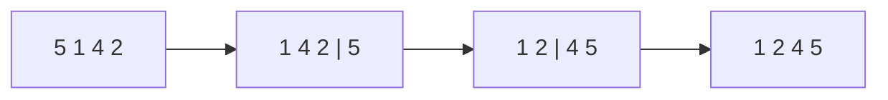

# Bubble Sort: The Simplest (and Slowest) Sort

> Teaching tool, not a production sort. But it's the clearest introduction to *what sorting is*.

## 🧠 Intuition

Walk through the list comparing each **adjacent pair**; if they're out of order, swap them.
After one full pass, the largest element has "bubbled" to the end. Repeat for the rest. Keep
going until a pass makes no swaps — then it's sorted.

> 💡 **Analogy — bubbles rising in water.** The biggest bubble rises to the top first. Each pass
> floats the next-biggest into place.

## 📐 How It Works

`[5, 1, 4, 2]` (one pass): compare 5,1 → swap `[1,5,4,2]`; 5,4 → swap `[1,4,5,2]`; 5,2 → swap
`[1,4,2,5]`. Largest (5) is now parked at the end. Repeat on the first three.



## 🧾 Pseudocode

```
for i in 0 .. n-1:
    swapped = false
    for j in 0 .. n-2-i:           # last i elements already in place
        if a[j] > a[j+1]: swap; swapped = true
    if not swapped: break          # early exit: already sorted
```

## 💻 C# Implementation

```csharp
void BubbleSort(int[] a) {
    for (int i = 0; i < a.Length - 1; i++) {
        bool swapped = false;
        for (int j = 0; j < a.Length - 1 - i; j++)      // shrink the unsorted region
            if (a[j] > a[j + 1]) {
                (a[j], a[j + 1]) = (a[j + 1], a[j]);
                swapped = true;
            }
        if (!swapped) break;                            // already sorted → O(n) best case
    }
}
```

## ⏱️ Complexity

| Case | Time | Space | Stable |
|------|------|-------|--------|
| Best (already sorted, with early exit) | O(n) | O(1) | ✅ |
| Average / Worst | O(n²) | O(1) | ✅ |

Quadratic because every element may be compared with every other. The `swapped` flag gives the
O(n) best case on nearly-sorted input.

## ⚖️ When to Use It

- **Almost never** in practice — [insertion sort](03.Insertion-Sort.md) is strictly better for
  the same simplicity. Use bubble sort **to learn** comparison sorting, and as a baseline.
- It *is* **stable** and **in-place**, which are nice properties — just not enough to overcome O(n²).

## 🚫 Common Mistakes

```csharp
// ❌ Looping the inner pass to the full length every time (re-checks sorted tail)
for (int j = 0; j < a.Length - 1; j++)
// ✅ shrink by i — the last i elements are already final
for (int j = 0; j < a.Length - 1 - i; j++)

// ❌ Dropping the swapped-flag early exit → always O(n²), even on sorted input
```

## 🌍 Real-World Applications

- Education (it's the "hello world" of sorting).
- Detecting whether a tiny list is *almost* sorted (one pass, check the flag).

## 🎯 Practice (with full solutions)

### 1. Sort an array (warm-up) — `Easy`
**Problem:** Sort with bubble sort and count the swaps.
**Approach:** The implementation above with a counter.
```csharp
int BubbleSortCountSwaps(int[] a) {
    int swaps = 0;
    for (int i = 0; i < a.Length - 1; i++)
        for (int j = 0; j < a.Length - 1 - i; j++)
            if (a[j] > a[j + 1]) { (a[j], a[j+1]) = (a[j+1], a[j]); swaps++; }
    return swaps;
}
```
**Complexity:** O(n²). **Why this fits:** the swap count equals the number of inversions — a nice
bridge to *why* nearly-sorted data is cheap.

### 2. Is the array sorted? — `Easy`
**Problem:** Detect "already sorted" in one bubble pass.
**Approach:** Run a single pass; if no swap happened, it was sorted.
```csharp
bool OnePassSorted(int[] a) {
    for (int j = 0; j < a.Length - 1; j++) if (a[j] > a[j + 1]) return false;
    return true;
}
```
**Complexity:** O(n). **Why this fits:** shows the early-exit insight that gives bubble sort its
only redeeming case.

## ✅ Key Takeaways

- Repeatedly swap adjacent out-of-order pairs; the largest "bubbles" up each pass.
- **O(n²)** average/worst, **O(n)** best with the swapped-flag; **stable**, **in-place**.
- Educational only — prefer [insertion sort](03.Insertion-Sort.md) for small inputs.

**Self-check:**
1. Why is the best case O(n), and what enables it?
2. Why can you shrink the inner loop by `i` each pass?

---
◀ Prev: [Module index](README.md) · ▲ [Module index](README.md) · ▶ Next: [Selection Sort](02.Selection-Sort.md)
