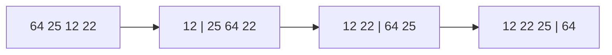

# Selection Sort: Find the Minimum, Place It, Repeat

## 🧠 Intuition

Scan the whole unsorted part for the **smallest** element and swap it into the first unsorted
position. Now that position is done. Repeat for position 2, 3, and so on. You're *selecting* the
minimum each round — hence the name.

> 💡 **Analogy — picking a sports team.** You scan everyone, pick the best remaining player, add
> them to the lineup, and repeat. The lineup grows sorted from the front.

Its claim to fame: it does the **fewest swaps** of any simple sort — exactly `n−1`. Useful when a
swap (write) is far more expensive than a comparison (read).

## 📐 How It Works

`[64, 25, 12, 22]`: min is 12 → swap to front `[12, 25, 64, 22]`; min of rest is 22 → `[12, 22,
64, 25]`; min of rest is 25 → `[12, 22, 25, 64]`. Done.



## 🧾 Pseudocode

```
for i in 0 .. n-1:
    min = i
    for j in i+1 .. n-1:
        if a[j] < a[min]: min = j
    swap a[i], a[min]
```

## 💻 C# Implementation

```csharp
void SelectionSort(int[] a) {
    for (int i = 0; i < a.Length - 1; i++) {
        int min = i;
        for (int j = i + 1; j < a.Length; j++)
            if (a[j] < a[min]) min = j;             // find the smallest remaining
        if (min != i) (a[i], a[min]) = (a[min], a[i]);   // one swap per round
    }
}
```

## ⏱️ Complexity

| Case | Time | Space | Stable |
|------|------|-------|--------|
| Best / Average / Worst | O(n²) | O(1) | ❌ (by default) |
| Swaps | **O(n)** | — | — |

Always O(n²) comparisons (it scans the rest every round, even if sorted) — but only **n−1 swaps**.
The standard swapping version is **not stable**; a careful shifting variant can be.

## ⚖️ When to Use It

- **When writes are expensive** (e.g. flash memory wear, or swapping large records) and you want
  to minimize them — selection sort's `n−1` swaps is the draw.
- Otherwise prefer [insertion sort](03.Insertion-Sort.md) (faster on nearly-sorted data, stable).

## 🚫 Common Mistakes

```csharp
// ❌ Swapping on every comparison instead of once per round → loses the "fewest swaps" benefit
// ✅ track the min index, swap once after the inner loop

// ❌ Expecting an early-exit best case — there isn't one; it always scans fully → O(n²)
```

## 🌍 Real-World Applications

- Niche: minimizing write operations on write-limited media.
- Teaching the "selection" idea that underpins [heap sort](06.Heap-Sort.md) (a heap just makes
  "find the min/max" O(log n) instead of O(n)).

## 🎯 Practice (with full solutions)

### 1. Sort with minimum swaps — `Easy`
**Problem:** Sort and report the number of swaps (should be ≤ n−1).
**Approach:** Standard selection sort, counting actual swaps.
```csharp
int SelectionSortSwaps(int[] a) {
    int swaps = 0;
    for (int i = 0; i < a.Length - 1; i++) {
        int min = i;
        for (int j = i + 1; j < a.Length; j++) if (a[j] < a[min]) min = j;
        if (min != i) { (a[i], a[min]) = (a[min], a[i]); swaps++; }
    }
    return swaps;
}
```
**Complexity:** O(n²) time, O(n) swaps. **Why this fits:** highlights the algorithm's defining
property.

### 2. Find the k-th smallest via partial selection — `Medium`
**Problem:** Find the k-th smallest element by running only k rounds of selection.
**Approach:** Selection sort naturally places the smallest, 2nd smallest, … so stop after k.
```csharp
int KthSmallest(int[] a, int k) {
    var b = (int[])a.Clone();
    for (int i = 0; i < k; i++) {
        int min = i;
        for (int j = i + 1; j < b.Length; j++) if (b[j] < b[min]) min = j;
        (b[i], b[min]) = (b[min], b[i]);
    }
    return b[k - 1];
}
```
**Complexity:** O(n·k). **Why this fits:** shows "partial sorting" — you don't always need the
whole thing sorted (a [heap](../02-Trees-and-Heaps/04.Heaps-and-Priority-Queues.md) does this
better for large k).

## ✅ Key Takeaways

- Repeatedly select the minimum of the unsorted region and place it next.
- Always **O(n²)** comparisons but only **n−1 swaps** — its one advantage.
- **Not stable** by default; no early-exit best case.

**Self-check:**
1. Why does selection sort minimize swaps, and when does that matter?
2. Why is there no O(n) best case like bubble/insertion sort?

---
◀ Prev: [Bubble Sort](01.Bubble-Sort.md) · ▲ [Module index](README.md) · ▶ Next: [Insertion Sort](03.Insertion-Sort.md)
