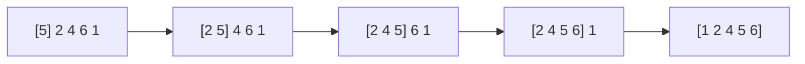

# Insertion Sort: Build a Sorted Region One Card at a Time

## 🧠 Intuition

Take each element and **insert it into its correct place** among the elements you've already
sorted, shifting larger ones out of the way. The front of the array grows sorted; the rest waits.

> 💡 **Analogy — sorting a hand of playing cards.** You pick up cards one at a time and slide each
> into the right spot in your already-sorted hand. That's literally insertion sort.

Despite being O(n²), it's the **fastest simple sort in practice** for small or nearly-sorted
arrays — so fast that real libraries (including .NET's) switch to it for tiny subarrays inside
[quicksort](05.Quick-Sort.md).

## 📐 How It Works

`[5, 2, 4, 6, 1]`: 2 inserts before 5 → `[2,5,4,6,1]`; 4 inserts between 2,5 → `[2,4,5,6,1]`; 6
stays → `[2,4,5,6,1]`; 1 slides to front → `[1,2,4,5,6]`.



## 🧾 Pseudocode

```
for i in 1 .. n-1:
    key = a[i]
    j = i - 1
    while j >= 0 and a[j] > key:    # shift bigger elements right
        a[j+1] = a[j]; j -= 1
    a[j+1] = key                    # drop key into the gap
```

## 💻 C# Implementation

```csharp
void InsertionSort(int[] a) {
    for (int i = 1; i < a.Length; i++) {
        int key = a[i];
        int j = i - 1;
        while (j >= 0 && a[j] > key) {      // make room by shifting right
            a[j + 1] = a[j];
            j--;
        }
        a[j + 1] = key;                     // insert
    }
}
```

## ⏱️ Complexity

| Case | Time | Space | Stable |
|------|------|-------|--------|
| Best (already sorted) | O(n) | O(1) | ✅ |
| Average / Worst (reverse sorted) | O(n²) | O(1) | ✅ |

The `while` does little work when data is nearly sorted (few shifts) → near-linear. That's why
it shines on small/almost-sorted inputs. It's **stable** (equal elements keep their order) and
**in-place**, and it sorts **online** (can absorb new elements as they arrive).

## ⚖️ When to Use It

- **Small arrays** (≲ 16 elements) — the low constant factor beats O(n log n) sorts here.
- **Nearly-sorted** data — approaches O(n).
- **Streaming / online** sorting — insert each new item as it comes.
- As the **base case** inside merge/quick sort. For large random data, use O(n log n) sorts.

## 🚫 Common Mistakes

```csharp
// ❌ Using a[i] inside the loop after starting to overwrite — capture key first
int key = a[i];                 // ✅ save before shifting

// ❌ Off-by-one: inserting at a[j] instead of a[j+1] after the loop
a[j + 1] = key;                 // ✅ the gap is one past where we stopped
```

## 🌍 Real-World Applications

- The small-subarray base case in industrial sorts (Timsort, introsort).
- Keeping a small leaderboard / live-sorted list as entries arrive.

## 🎯 Practice (with full solutions)

### 1. Insertion Sort List (linked list) — `Medium`
**Problem:** Insertion-sort a singly [linked list](../01-Linear-Structures/03.Linked-Lists.md).
**Approach:** Maintain a sorted list with a dummy head; for each node, walk to its insertion spot
and splice it in.
```csharp
ListNode InsertionSortList(ListNode head) {
    var dummy = new ListNode(0);
    while (head != null) {
        var next = head.next;
        var p = dummy;
        while (p.next != null && p.next.val < head.val) p = p.next;  // find spot
        head.next = p.next; p.next = head;                           // splice
        head = next;
    }
    return dummy.next;
}
```
**Complexity:** O(n²) worst, O(1) extra. **Why this fits:** shows insertion sort adapting to a
structure without random access.

### 2. Sort a nearly-sorted (k-sorted) array — `Medium`
**Problem:** Each element is at most `k` positions from its sorted spot. Sort efficiently.
**Approach:** Insertion sort is naturally great here (each element shifts ≤ k) → O(n·k). (A
[min-heap](../02-Trees-and-Heaps/04.Heaps-and-Priority-Queues.md) of size k does O(n log k).)
```csharp
void SortKSorted(int[] a, int k) {
    for (int i = 1; i < a.Length; i++) {
        int key = a[i], j = i - 1;
        while (j >= 0 && a[j] > key) { a[j + 1] = a[j]; j--; }
        a[j + 1] = key;
    }
}
```
**Complexity:** O(n·k). **Why this fits:** demonstrates insertion sort's adaptivity — its killer
feature.

## ✅ Key Takeaways

- Insert each element into the sorted prefix, shifting larger ones right.
- **O(n) best**, **O(n²) worst**; **stable**, **in-place**, **online**, **adaptive**.
- The go-to simple sort: used as the base case inside [merge](04.Merge-Sort.md)/[quick](05.Quick-Sort.md) sort.

**Self-check:**
1. Why is insertion sort O(n) on already-sorted data?
2. Why do real-world sorts fall back to it for small subarrays?

---
◀ Prev: [Selection Sort](02.Selection-Sort.md) · ▲ [Module index](README.md) · ▶ Next: [Merge Sort](04.Merge-Sort.md)
