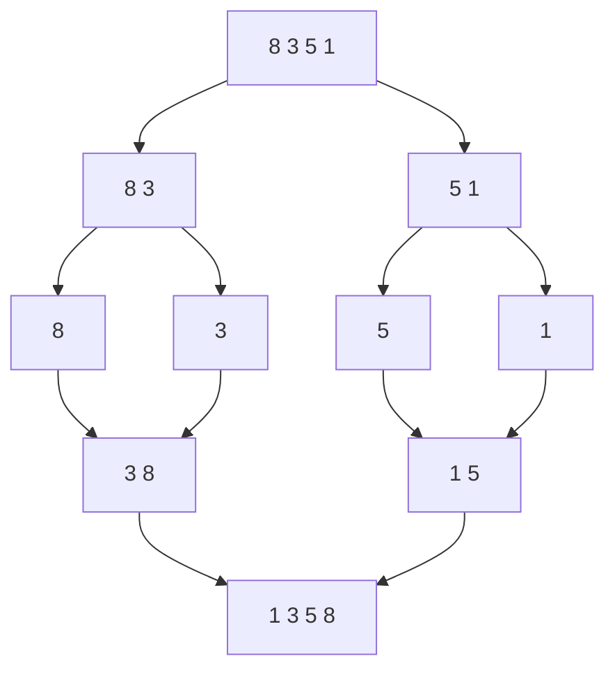

# Merge Sort: Divide, Sort Halves, Merge

> Your first true **O(n log n)** sort and the cleanest example of [divide & conquer](../06-Algorithm-Paradigms/03.Divide-and-Conquer.md).

## 🧠 Intuition

Sorting a big list is hard; sorting two already-sorted small lists into one is *easy* (just
compare fronts). Merge sort exploits this: **split** the array in half, **sort each half**
(recursively), then **merge** the two sorted halves. Splitting bottoms out at single elements,
which are trivially sorted.

> 💡 **Analogy — merging two sorted stacks of paper.** With both stacks sorted, you repeatedly
> take the smaller top sheet. Building each sorted stack is the same problem on half the size —
> so you recurse.

It guarantees **O(n log n)** in *all* cases (no bad input) and is **stable** — at the cost of
O(n) extra memory.

## 📐 How It Works



`log n` levels of splitting; each level merges a total of `n` elements → **n × log n** work.

## 🧾 Pseudocode

```
mergeSort(a, lo, hi):
    if lo >= hi: return            # single element
    mid = (lo + hi) / 2
    mergeSort(a, lo, mid)
    mergeSort(a, mid+1, hi)
    merge(a, lo, mid, hi)          # combine two sorted halves

merge: walk both halves with two pointers, copying the smaller front each step
```

## 💻 C# Implementation

```csharp
void MergeSort(int[] a) => MergeSort(a, 0, a.Length - 1, new int[a.Length]);

void MergeSort(int[] a, int lo, int hi, int[] temp) {
    if (lo >= hi) return;
    int mid = lo + (hi - lo) / 2;
    MergeSort(a, lo, mid, temp);
    MergeSort(a, mid + 1, hi, temp);
    Merge(a, lo, mid, hi, temp);
}

void Merge(int[] a, int lo, int mid, int hi, int[] temp) {
    int i = lo, j = mid + 1, k = lo;
    while (i <= mid && j <= hi)
        temp[k++] = a[i] <= a[j] ? a[i++] : a[j++];   // <= keeps it STABLE
    while (i <= mid) temp[k++] = a[i++];
    while (j <= hi) temp[k++] = a[j++];
    Array.Copy(temp, lo, a, lo, hi - lo + 1);
}
```

> Reusing one `temp` array avoids allocating on every merge. Using `<=` (not `<`) in the compare
> is what preserves stability.

## ⏱️ Complexity

| Case | Time | Space | Stable |
|------|------|-------|--------|
| Best / Average / Worst | **O(n log n)** | O(n) | ✅ |

Rock-solid O(n log n) regardless of input (unlike [quicksort](05.Quick-Sort.md)'s O(n²) worst
case). The O(n) extra space is its main downside.

## ⚖️ When to Use It

- **When you need a guarantee** — predictable O(n log n) with no bad cases.
- **When stability matters** (e.g. sorting records by a secondary key without disturbing the
  primary order).
- **External sorting** — sorting data too big for RAM (merge sorted chunks from disk) and sorting
  [linked lists](../01-Linear-Structures/03.Linked-Lists.md) (no random access needed, O(1) extra).
- **Avoid when** memory is tight and average speed matters more → [quicksort](05.Quick-Sort.md);
  or when O(1) space is required → [heap sort](06.Heap-Sort.md).

## 🚫 Common Mistakes

```csharp
// ❌ mid = (lo + hi) / 2 can overflow for huge indices
int mid = lo + (hi - lo) / 2;        // ✅ overflow-safe

// ❌ Using < instead of <= in the merge compare → loses stability
temp[k++] = a[i] <= a[j] ? a[i++] : a[j++];   // ✅

// ❌ Allocating a fresh temp array inside every Merge call → extra GC churn
// ✅ pass one shared temp buffer down the recursion
```

## 🌍 Real-World Applications

- External / disk-based sorting of huge datasets; database sort-merge joins.
- Stable sorts in standard libraries (Java's `Arrays.sort` for objects uses Timsort, a merge-sort
  variant).
- Counting inversions; sorting linked lists.

## 🎯 Practice (with full solutions)

### 1. Sort an Array — `Medium`
**Problem:** Sort an integer array in O(n log n).
**Approach:** The merge sort above. (Also a safe answer when an interviewer bans the built-in
sort.)
**Complexity:** O(n log n) / O(n). **Why this fits:** the canonical implementation drill.

### 2. Merge Two Sorted Arrays — `Easy`
**Problem:** Merge sorted `a` and `b` into one sorted array.
**Approach:** Exactly the merge step — two pointers, take the smaller front.
```csharp
int[] MergeSorted(int[] a, int[] b) {
    var r = new int[a.Length + b.Length];
    int i = 0, j = 0, k = 0;
    while (i < a.Length && j < b.Length) r[k++] = a[i] <= b[j] ? a[i++] : b[j++];
    while (i < a.Length) r[k++] = a[i++];
    while (j < b.Length) r[k++] = b[j++];
    return r;
}
```
**Complexity:** O(n + m). **Why this fits:** isolates the merge — the heart of the algorithm.

### 3. Count Inversions — `Hard`
**Problem:** Count pairs `(i, j)` with `i < j` and `a[i] > a[j]` (how "unsorted" the array is).
**Approach:** Modify merge sort: when an element from the **right** half is taken before
remaining left-half elements, those left elements all form inversions with it.
```csharp
long CountInversions(int[] a) {
    var temp = new int[a.Length];
    long Sort(int lo, int hi) {
        if (lo >= hi) return 0;
        int mid = lo + (hi - lo) / 2;
        long count = Sort(lo, mid) + Sort(mid + 1, hi);
        int i = lo, j = mid + 1, k = lo;
        while (i <= mid && j <= hi) {
            if (a[i] <= a[j]) temp[k++] = a[i++];
            else { temp[k++] = a[j++]; count += mid - i + 1; }   // all remaining left > a[j]
        }
        while (i <= mid) temp[k++] = a[i++];
        while (j <= hi) temp[k++] = a[j++];
        Array.Copy(temp, lo, a, lo, hi - lo + 1);
        return count;
    }
    return Sort(0, a.Length - 1);
}
```
**Complexity:** O(n log n). **Why this fits:** the famous "piggyback on merge sort" trick that
beats the O(n²) brute force.

## ✅ Key Takeaways

- Split → recursively sort halves → **merge** sorted halves. The merge is the easy part.
- Guaranteed **O(n log n)** in all cases; **stable**; needs **O(n)** extra space.
- Best when you need predictability, stability, external sorting, or list sorting.
- Use `<=` in the merge to stay stable; reuse one temp buffer.
- It's the model example of [divide & conquer](../06-Algorithm-Paradigms/03.Divide-and-Conquer.md).

**Self-check:**
1. Why is merge sort O(n log n) in *every* case, unlike quicksort?
2. What makes it stable, and what's its space cost?
3. How does merge sort count inversions for free?

---
◀ Prev: [Insertion Sort](03.Insertion-Sort.md) · ▲ [Module index](README.md) · ▶ Next: [Quick Sort](05.Quick-Sort.md)
