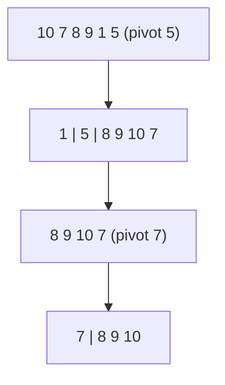

# Quick Sort: The Fastest Sort in Practice

## 🧠 Intuition

Pick an element called the **pivot**. Rearrange the array so everything smaller is on its left
and everything larger on its right — now the pivot is in its **final sorted position**. Then
recursively quicksort the left and right parts.

> 💡 **Analogy — organizing a bookshelf by one reference book.** Put every shorter book to its
> left, every taller to its right. That book is now correctly placed. Repeat within each side.

Like [merge sort](04.Merge-Sort.md) it's [divide & conquer](../06-Algorithm-Paradigms/03.Divide-and-Conquer.md),
but it does its work *before* recursing (the partition) rather than after (the merge), and it
sorts **in place**. With good pivots it's the **fastest general-purpose sort** — which is why
language standard libraries are built on it.

## 📐 How It Works

`[10, 7, 8, 9, 1, 5]`, pivot = 5 (last). Partition moves everything ≤ 5 left: pivot lands at
index 1 → `[1, 5, 8, 9, 10, 7]`. Recurse on `[1]` and `[8, 9, 10, 7]`.



**The danger:** if the pivot is always the smallest/largest (e.g. last element on already-sorted
data), partitions are maximally unbalanced → **O(n²)**. Fix it with a **random** or
**median-of-three** pivot.

## 🧾 Pseudocode

```
quicksort(a, lo, hi):
    if lo < hi:
        p = partition(a, lo, hi)     # pivot ends at index p, in final place
        quicksort(a, lo, p-1)
        quicksort(a, p+1, hi)
```

## 💻 C# Implementation

```csharp
void QuickSort(int[] a) => QuickSort(a, 0, a.Length - 1);

void QuickSort(int[] a, int lo, int hi) {
    while (lo < hi) {
        int p = Partition(a, lo, hi);
        // recurse into the SMALLER side, loop on the larger → O(log n) stack worst case
        if (p - lo < hi - p) { QuickSort(a, lo, p - 1); lo = p + 1; }
        else { QuickSort(a, p + 1, hi); hi = p - 1; }
    }
}

// Lomuto partition with a randomized pivot (guards against the O(n²) case)
int Partition(int[] a, int lo, int hi) {
    int r = lo + new Random().Next(hi - lo + 1);   // random pivot
    (a[r], a[hi]) = (a[hi], a[r]);                  // move it to the end
    int pivot = a[hi], i = lo - 1;
    for (int j = lo; j < hi; j++)
        if (a[j] <= pivot) { i++; (a[i], a[j]) = (a[j], a[i]); }
    (a[i + 1], a[hi]) = (a[hi], a[i + 1]);          // pivot to its final spot
    return i + 1;
}
```

> Two improvements real libraries use: (1) **median-of-three** pivots, and (2) switching to
> [insertion sort](03.Insertion-Sort.md) for tiny subarrays (≤ ~16). This hybrid is "introsort."

## ⏱️ Complexity

| Case | Time | Space | Stable |
|------|------|-------|--------|
| Best / Average | O(n log n) | O(log n) stack | ❌ |
| Worst (bad pivots) | O(n²) | O(log n) | ❌ |

Average O(n log n) with a small constant factor + great **cache locality** (it works on
contiguous ranges) makes it faster than merge/heap sort in practice. It's **in-place** but **not
stable**.

## ⚖️ When to Use It

- **General-purpose sorting of arrays/primitives** — the default fast choice; what `Array.Sort`
  uses for primitives.
- **When O(1)-ish extra space matters** (only the recursion stack).
- **Avoid when** you need a worst-case guarantee (→ [heap sort](06.Heap-Sort.md) or [merge sort](04.Merge-Sort.md))
  or **stability** (→ merge sort).

## 🚫 Common Mistakes

```csharp
// ❌ Always using the first/last element as pivot → O(n²) on sorted/reverse-sorted input
// ✅ randomize or use median-of-three (above)

// ❌ Recursing into the larger side first → O(n) stack depth worst case
// ✅ recurse into the smaller side, loop on the larger (tail-call style, above)

// ❌ Expecting stability — equal elements can be reordered by partitioning
```

## 🌍 Real-World Applications

- The engine behind most standard-library sorts (introsort = quicksort + heapsort fallback).
- **Quickselect** (a quicksort cousin) finds the k-th smallest in **O(n) average** without full
  sorting — see Practice #2.

## 🎯 Practice (with full solutions)

### 1. Sort an Array — `Medium`
**Problem:** Sort in O(n log n) average using quicksort with a randomized pivot.
**Approach:** The implementation above.
**Complexity:** O(n log n) avg. **Why this fits:** the core skill — and remembering *why*
randomization matters.

### 2. Kth Largest Element (Quickselect) — `Medium`
**Problem:** Find the k-th largest element in **O(n) average** — no full sort.
**Approach:** Partition like quicksort, but only recurse into the side containing the target
index. Each step discards a chunk → linear on average.
```csharp
int FindKthLargest(int[] a, int k) {
    int target = a.Length - k;                  // k-th largest = index (n-k) when ascending
    int lo = 0, hi = a.Length - 1;
    var rnd = new Random();
    while (true) {
        int r = lo + rnd.Next(hi - lo + 1);
        (a[r], a[hi]) = (a[hi], a[r]);
        int pivot = a[hi], i = lo;
        for (int j = lo; j < hi; j++) if (a[j] < pivot) { (a[i], a[j]) = (a[j], a[i]); i++; }
        (a[i], a[hi]) = (a[hi], a[i]);
        if (i == target) return a[i];
        if (i < target) lo = i + 1; else hi = i - 1;   // recurse ONE side only
    }
}
```
**Complexity:** O(n) average, O(n²) worst. **Why this fits:** quickselect — partitioning's most
elegant payoff, finding order statistics without sorting.

### 3. Sort Colors (Dutch National Flag) — `Medium`
**Problem:** Sort an array of 0s, 1s, 2s in one pass, in place.
**Approach:** Three-way partition with pointers `low`, `mid`, `high` — a quicksort partitioning
idea specialized to three values.
```csharp
void SortColors(int[] a) {
    int low = 0, mid = 0, high = a.Length - 1;
    while (mid <= high) {
        if (a[mid] == 0) { (a[low], a[mid]) = (a[mid], a[low]); low++; mid++; }
        else if (a[mid] == 1) mid++;
        else { (a[mid], a[high]) = (a[high], a[mid]); high--; }   // don't advance mid
    }
}
```
**Complexity:** O(n) time, O(1) space. **Why this fits:** three-way partitioning, also how
quicksort handles many duplicate keys efficiently.

## ✅ Key Takeaways

- Partition around a **pivot** (which lands in its final spot), then recurse on both sides.
- **O(n log n) average**, **O(n²) worst** — defeat the worst case with a **random/median-of-three** pivot.
- **In-place**, excellent cache locality, **not stable** — the practical default for arrays.
- **Quickselect** reuses partitioning to find the k-th element in O(n) average.
- Recurse the smaller side to bound stack depth.

**Self-check:**
1. What causes quicksort's O(n²) worst case, and how do you avoid it?
2. Why is quicksort often faster than merge sort despite the same average complexity?
3. How does quickselect find the k-th element without fully sorting?

---
◀ Prev: [Merge Sort](04.Merge-Sort.md) · ▲ [Module index](README.md) · ▶ Next: [Heap Sort](06.Heap-Sort.md)
