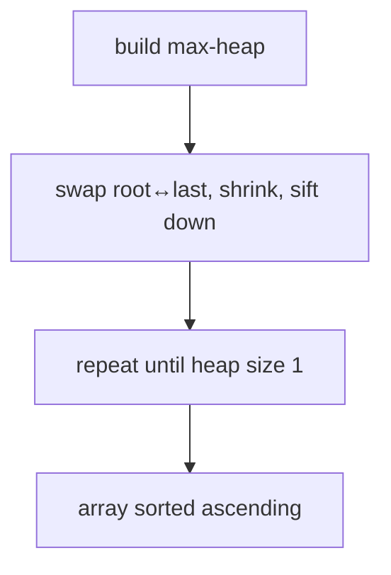

# Heap Sort: Sort by Repeatedly Extracting the Max

> Build on [Heaps & Priority Queues](../02-Trees-and-Heaps/04.Heaps-and-Priority-Queues.md) first.

## 🧠 Intuition

A [heap](../02-Trees-and-Heaps/04.Heaps-and-Priority-Queues.md) hands you the maximum in O(1)
and re-heapifies in O(log n). So sorting is easy: turn the array into a max-heap, then
repeatedly **pull the max and put it at the end**. After n extractions, the array is sorted —
and it all happens **in place**.

> 💡 **Analogy — auctioning items high-to-low.** Build a "biggest-first" pile (the heap), then
> repeatedly take the biggest item and set it aside at the back of the sorted line.

Its selling point: **guaranteed O(n log n)** *and* **O(1) extra space** — the only common sort
with both. The trade-off is poor cache behavior (it jumps around the array), so it's usually a
bit slower than [quicksort](05.Quick-Sort.md) in practice.

## 📐 How It Works

1. **Build a max-heap** from the array in O(n) (sift down from the last parent to the root).
2. **Swap** the root (max) with the last element; shrink the heap by one; **sift down** the new
   root. Repeat.



## 🧾 Pseudocode

```
heapSort(a):
    for i = n/2 - 1 down to 0: siftDown(a, i, n)     # build max-heap, O(n)
    for end = n-1 down to 1:
        swap(a[0], a[end])                            # max goes to the back
        siftDown(a, 0, end)                           # restore heap on a[0..end)
```

## 💻 C# Implementation

```csharp
void HeapSort(int[] a) {
    int n = a.Length;
    for (int i = n / 2 - 1; i >= 0; i--) SiftDown(a, i, n);   // build max-heap
    for (int end = n - 1; end > 0; end--) {
        (a[0], a[end]) = (a[end], a[0]);                     // largest to its final place
        SiftDown(a, 0, end);                                 // heapify the shrunk heap
    }
}

void SiftDown(int[] a, int i, int size) {
    while (true) {
        int largest = i, l = 2*i + 1, r = 2*i + 2;
        if (l < size && a[l] > a[largest]) largest = l;
        if (r < size && a[r] > a[largest]) largest = r;
        if (largest == i) break;
        (a[i], a[largest]) = (a[largest], a[i]);
        i = largest;
    }
}
```

## ⏱️ Complexity

| Phase | Time | Space |
|-------|------|-------|
| Build heap | O(n) | O(1) |
| n extractions × sift down | O(n log n) | O(1) |
| **Total** | **O(n log n)** (all cases) | **O(1)** |

Not stable. Worst case is still O(n log n) — no bad input exists, unlike quicksort.

## ⚖️ When to Use It

- **When you need a worst-case O(n log n) guarantee with O(1) space** — e.g. real-time/embedded
  systems, or as the **fallback** inside introsort when quicksort recurses too deep.
- **Avoid when** raw speed on typical data matters (quicksort's cache locality wins) or you need
  **stability** (→ [merge sort](04.Merge-Sort.md)).

## 🚫 Common Mistakes

```csharp
// ❌ Wrong child indices (1-based formula on a 0-based array)
int l = 2 * i;                  // wrong
int l = 2 * i + 1;              // ✅ 0-based

// ❌ Sifting down over the full array after shrinking → re-disturbs sorted tail
SiftDown(a, 0, end);            // ✅ pass the shrinking `end` as the heap size

// ❌ Building a max-heap but expecting descending output — max-heap → ascending array
```

## 🌍 Real-World Applications

- The guaranteed-O(n log n) safety net inside hybrid library sorts (introsort).
- Systems needing bounded worst-case time and minimal memory.
- Conceptually, any "repeatedly take the extreme" task (→ a [priority queue](../02-Trees-and-Heaps/04.Heaps-and-Priority-Queues.md)).

## 🎯 Practice (with full solutions)

### 1. Sort an Array with Heap Sort — `Medium`
**Problem:** Sort in O(n log n) worst case, O(1) extra space.
**Approach:** The implementation above.
**Complexity:** O(n log n) / O(1). **Why this fits:** the defining exercise; cements sift-down.

### 2. Kth Largest Element — `Medium`
**Problem:** Find the k-th largest.
**Approach:** A size-k **min-heap** (priority queue): keep only the k largest seen; the root is
the answer. (Cheaper than full heap sort when k ≪ n.)
```csharp
int FindKthLargest(int[] nums, int k) {
    var pq = new PriorityQueue<int, int>();   // min-heap
    foreach (int x in nums) { pq.Enqueue(x, x); if (pq.Count > k) pq.Dequeue(); }
    return pq.Peek();
}
```
**Complexity:** O(n log k). **Why this fits:** shows you often want *partial* heap work, not a
full sort.

### 3. K Closest Points to Origin — `Medium`
**Problem:** Return the k points nearest the origin.
**Approach:** A size-k **max-heap** keyed by squared distance; evict the farthest when over k.
```csharp
int[][] KClosest(int[][] points, int k) {
    var pq = new PriorityQueue<int[], int>(Comparer<int>.Create((a, b) => b - a)); // max-heap
    foreach (var p in points) {
        int d = p[0]*p[0] + p[1]*p[1];
        pq.Enqueue(p, d);
        if (pq.Count > k) pq.Dequeue();        // drop the farthest
    }
    var res = new int[k][];
    for (int i = 0; i < k; i++) res[i] = pq.Dequeue();
    return res;
}
```
**Complexity:** O(n log k). **Why this fits:** the size-k heap pattern generalizing "top-K by a
key."

## ✅ Key Takeaways

- Build a max-heap, then repeatedly swap the root to the back and sift down.
- **O(n log n) in all cases** and **O(1) extra space** — its unique combo.
- **Not stable**; slower than quicksort in practice due to cache misses.
- Building the heap is **O(n)**; it's the worst-case safety net in hybrid sorts.

**Self-check:**
1. Why is heap sort O(n log n) even in the worst case?
2. Why is it often slower than quicksort despite identical asymptotics?
3. When is a size-k heap better than fully sorting?

---
◀ Prev: [Quick Sort](05.Quick-Sort.md) · ▲ [Module index](README.md) · ▶ Next: [Counting Sort](07.Counting-Sort.md)
