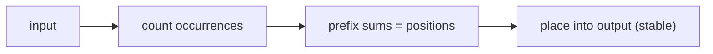

# Counting Sort: Sorting Without Comparing

## 🧠 Intuition

Every sort so far *compares* elements — and comparison sorts can't beat **O(n log n)** (a proven
lower bound). Counting sort sidesteps that wall entirely: if your values are integers in a small
known range, just **count how many times each value appears**, then write them back out in
order. No comparisons at all → **O(n + k)**.

> 💡 **Analogy — sorting exam scores 0–100.** Don't compare papers. Make 101 mailbox slots, drop
> each paper in its score's slot, then read the slots left to right. Done.

The catch: it only works when values are integers (or mappable to integers) in a range `k` that
isn't much bigger than `n`. Sort a few integers spanning 0…1,000,000,000 and you'd allocate a
billion counters — useless.

## 📐 How It Works

`[2, 5, 3, 2, 0]`, range 0–5:
1. Count: `[1, 0, 2, 1, 0, 1]` (one 0, two 2s, …).
2. Prefix-sum the counts to get **output positions** (this is what makes it **stable**).
3. Place each element at its position, walking the input right-to-left to preserve order.



## 🧾 Pseudocode

```
countingSort(a, k):                # values in 0..k
    count[0..k] = 0
    for x in a: count[x] += 1
    for i in 1..k: count[i] += count[i-1]    # prefix sums → end positions
    for x in a reversed:                      # right-to-left keeps it stable
        output[--count[x]] = x
    return output
```

## 💻 C# Implementation

```csharp
int[] CountingSort(int[] a) {
    if (a.Length == 0) return a;
    int min = a.Min(), max = a.Max();
    int k = max - min + 1;                      // range size
    var count = new int[k];
    foreach (int x in a) count[x - min]++;      // shift by min to handle negatives/offsets

    for (int i = 1; i < k; i++) count[i] += count[i - 1];   // prefix sums

    var output = new int[a.Length];
    for (int i = a.Length - 1; i >= 0; i--)     // reverse pass → stable
        output[--count[a[i] - min]] = a[i];
    return output;
}
```

## ⏱️ Complexity

| Case | Time | Space | Stable |
|------|------|-------|--------|
| All cases | **O(n + k)** | O(n + k) | ✅ |

When `k = O(n)`, this is **linear** — faster than any comparison sort. When `k ≫ n`, it's
wasteful. `k` = size of the value range.

## ⚖️ When to Use It

- **Integers (or integer-mappable keys) in a small, known range** — ages, grades, ASCII chars,
  digits. It's the engine inside [radix sort](08.Radix-Sort.md).
- **Avoid for** large ranges, floating-point, or arbitrary objects → use a comparison sort.

## 🚫 Common Mistakes

```csharp
// ❌ Forgetting to offset by min → negative indices crash
count[x]++;                     // breaks if x can be negative
count[x - min]++;               // ✅

// ❌ A left-to-right placement pass → NOT stable (reverses equal elements)
// ✅ iterate the input right-to-left when placing (above)

// ❌ Using it when max-min is huge (e.g. 1e9) → enormous count array
```

## 🌍 Real-World Applications

- Sorting by a bounded key: grades, ages, histogram bucketing.
- The stable per-digit subroutine inside [radix sort](08.Radix-Sort.md).
- Frequency counting / histograms generally.

## 🎯 Practice (with full solutions)

### 1. Sort an Array of small integers — `Easy`
**Problem:** Sort values known to be in 0…1000.
**Approach:** Counting sort — linear time since k is tiny.
**Complexity:** O(n + k). **Why this fits:** the direct application when the range is small.

### 2. Sort Characters by Frequency — `Medium`
**Problem:** Reorder a string so characters appear in decreasing frequency.
**Approach:** Count frequencies (a counting-sort idea over the 0–255 char range), then emit
characters from most to least frequent.
```csharp
string FrequencySort(string s) {
    var count = new int[128];
    foreach (char c in s) count[c]++;
    var chars = Enumerable.Range(0, 128)
        .Where(c => count[c] > 0)
        .OrderByDescending(c => count[c]);
    var sb = new System.Text.StringBuilder();
    foreach (int c in chars) sb.Append((char)c, count[c]);
    return sb.ToString();
}
```
**Complexity:** O(n + 128 log 128). **Why this fits:** counting over a fixed alphabet — counting
sort's spirit.

### 3. Maximum Gap (bucket idea) — `Hard`
**Problem:** Largest gap between successive elements in the sorted order, in O(n).
**Approach:** Distribute into buckets by value range (a counting/[bucket](09.Bucket-Sort.md)
hybrid); the max gap must straddle two buckets, so you compare bucket boundaries — no full sort
needed.
**Sketch:** With n elements and n+1 buckets over [min, max], by pigeonhole the answer spans empty
buckets; track each bucket's min/max and scan. **Complexity:** O(n). **Why this fits:** shows how
non-comparison bucketing achieves linear time where comparison sorts can't.

## ✅ Key Takeaways

- Counting sort **doesn't compare** — it tallies occurrences, beating the O(n log n) wall.
- **O(n + k)** time/space; **stable** (with the reverse placement pass + prefix sums).
- Only for **integers in a small range**; offset by `min` to handle negatives.
- It's the stable subroutine that makes [radix sort](08.Radix-Sort.md) work.

**Self-check:**
1. How does counting sort beat the O(n log n) comparison-sort lower bound?
2. What role do the prefix sums and the reverse pass play in stability?
3. When is counting sort a bad choice?

---
◀ Prev: [Heap Sort](06.Heap-Sort.md) · ▲ [Module index](README.md) · ▶ Next: [Radix Sort](08.Radix-Sort.md)
