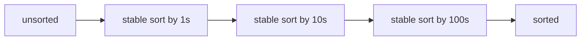

# Radix Sort: Sort Digit by Digit

> New topic. Builds directly on [Counting Sort](07.Counting-Sort.md) — read that first.

## 🧠 Intuition

[Counting sort](07.Counting-Sort.md) is linear but dies when the value range is huge. Radix sort
fixes that: instead of sorting by the whole number at once, sort by **one digit at a time** —
least significant first — using a stable counting sort for each digit. After processing every
digit, the array is fully sorted.

> 💡 **Analogy — sorting a deck of cards by suit then rank, or library cards by each letter.**
> Old card-sorting machines did exactly this: pass the cards once per column, dropping each into
> a bin by that column's value, restacking in order, and repeating. After the last column,
> everything's sorted.

The magic relies on the per-digit sort being **stable**: sorting by a higher digit never undoes
the ordering established by lower digits.

## 📐 How It Works

`[170, 45, 75, 90, 802, 24, 2, 66]`:
- by 1s digit → `[170, 90, 802, 2, 24, 45, 75, 66]`
- by 10s digit → `[802, 2, 24, 45, 66, 170, 75, 90]`
- by 100s digit → `[2, 24, 45, 66, 75, 90, 170, 802]` ✓



## 🧾 Pseudocode

```
radixSort(a):
    max = maximum value in a
    for exp = 1; max / exp > 0; exp *= 10:     # each digit place
        countingSortByDigit(a, exp)            # STABLE sort on (x / exp) % 10
```

## 💻 C# Implementation

```csharp
void RadixSort(int[] a) {              // non-negative integers
    if (a.Length == 0) return;
    int max = a.Max();
    for (int exp = 1; max / exp > 0; exp *= 10)   // 1s, 10s, 100s, ...
        CountingSortByDigit(a, exp);
}

void CountingSortByDigit(int[] a, int exp) {
    int n = a.Length;
    var output = new int[n];
    var count = new int[10];                       // digits 0–9

    foreach (int x in a) count[(x / exp) % 10]++;  // tally this digit
    for (int i = 1; i < 10; i++) count[i] += count[i - 1];   // prefix sums

    for (int i = n - 1; i >= 0; i--) {             // right-to-left ⇒ stable
        int digit = (a[i] / exp) % 10;
        output[--count[digit]] = a[i];
    }
    Array.Copy(output, a, n);
}
```

> For negative numbers, sort by absolute value with a sign split, or use a bit-flip trick; the
> base-10 version above assumes non-negative ints.

## ⏱️ Complexity

| Case | Time | Space | Stable |
|------|------|-------|--------|
| All cases | **O(d · (n + b))** | O(n + b) | ✅ |

`d` = number of digits, `b` = base (10 here). For fixed-width integers (`d` constant), this is
effectively **O(n)** — beating O(n log n). Choosing a larger base (e.g. 256) reduces `d` at the
cost of bigger count arrays.

## ⚖️ When to Use It

- **Fixed-width integer or string keys** in bulk — IDs, fixed-length codes, IP addresses — where
  it can beat comparison sorts.
- **Avoid for** variable-length keys with huge ranges, floating-point (needs special encoding),
  or small `n` where the constant factors don't pay off.

## 🚫 Common Mistakes

```csharp
// ❌ Sorting most-significant digit first with a naive approach → ordering breaks
//    (LSD radix sort must go least-significant first, with a STABLE per-digit sort)

// ❌ Using an unstable per-digit sort → the whole thing produces wrong results
// ✅ counting sort with the reverse placement pass keeps each pass stable

// ❌ Forgetting negatives — base-10 LSD as written handles non-negative only
```

## 🌍 Real-World Applications

- Sorting large volumes of fixed-width keys (database keys, IDs, postal codes).
- Suffix-array construction; some string-sorting pipelines.
- Historically, punch-card and mail sorting machines.

## 🎯 Practice (with full solutions)

### 1. Sort integers in O(n) — `Medium`
**Problem:** Sort non-negative integers faster than O(n log n) when they're fixed-width.
**Approach:** The radix sort above.
**Complexity:** O(d·n). **Why this fits:** the canonical use — linear sorting of integers.

### 2. Maximum Gap — `Hard`
**Problem:** Maximum difference between successive sorted elements, in linear time.
**Approach:** Radix-sort the array (O(n)), then a single scan finds the max adjacent gap —
achieving the linear bound a comparison sort can't.
```csharp
int MaximumGap(int[] nums) {
    if (nums.Length < 2) return 0;
    RadixSort(nums);
    int gap = 0;
    for (int i = 1; i < nums.Length; i++) gap = Math.Max(gap, nums[i] - nums[i - 1]);
    return gap;
}
```
**Complexity:** O(d·n). **Why this fits:** shows a problem whose linear-time solution *requires* a
non-comparison sort.

### 3. Sort fixed-length strings — `Medium`
**Problem:** Sort equal-length lowercase strings lexicographically in O(L·n).
**Approach:** LSD radix sort over characters — stable counting sort by the last char, then the
previous, … to the first.
**Sketch:** Replace digit extraction with `s[pos]`, count over 26 letters, iterate positions from
last to first. **Complexity:** O(L·n). **Why this fits:** generalizes radix from digits to any
fixed-width symbol alphabet.

## ✅ Key Takeaways

- Radix sort sorts by **one digit at a time**, least-significant first, via a **stable**
  [counting sort](07.Counting-Sort.md) per digit.
- **O(d·(n + b))** — effectively **O(n)** for fixed-width keys; **stable**.
- Stability per pass is essential; larger bases trade memory for fewer passes.
- Best for **bulk fixed-width integer/string keys**, not small or wildly-ranged data.

**Self-check:**
1. Why must each per-digit pass be stable, and why least-significant-digit first?
2. When does radix sort beat O(n log n), and when does it not pay off?
3. How would you extend it to fixed-length strings?

---
◀ Prev: [Counting Sort](07.Counting-Sort.md) · ▲ [Module index](README.md) · ▶ Next: [Bucket Sort](09.Bucket-Sort.md)
