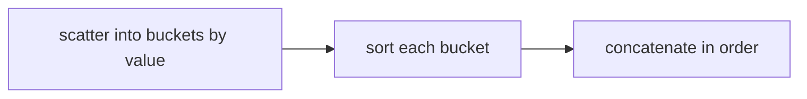

# Bucket Sort: Distribute, Sort Buckets, Concatenate

## 🧠 Intuition

If your data is spread fairly **evenly** over a range, you can scatter elements into several
"buckets" by value, sort each (small) bucket, then read the buckets in order. Because each
bucket holds only a few elements, sorting them is cheap — and the whole thing runs in **O(n)**
on average.

> 💡 **Analogy — sorting coins into trays by value.** Drop pennies, nickels, dimes into separate
> trays, tidy each tray, then stack the trays in order. Far faster than comparing every coin.

Bucket sort is the natural choice for **uniformly distributed floats** (e.g. values in [0, 1)) —
a case where counting/radix sort don't directly apply.

## 📐 How It Works

`[0.42, 0.32, 0.73, 0.12, 0.99, 0.55]` with 6 buckets over [0, 1):
1. Bucket index = `floor(value × bucketCount)`.
2. Each element drops into its bucket.
3. Sort each bucket (insertion sort — buckets are tiny).
4. Concatenate buckets in order.



## 🧾 Pseudocode

```
bucketSort(a):
    create m empty buckets
    for x in a: buckets[bucketIndex(x)].add(x)
    for each bucket: insertionSort(bucket)
    concatenate all buckets in order
```

## 💻 C# Implementation

```csharp
// For floats uniformly distributed in [0, 1)
void BucketSort(double[] a) {
    int n = a.Length;
    if (n <= 1) return;
    var buckets = new List<double>[n];
    for (int i = 0; i < n; i++) buckets[i] = new List<double>();

    foreach (double x in a) {
        int idx = (int)(x * n);                  // map value → bucket
        if (idx == n) idx = n - 1;               // guard x == 1.0 edge
        buckets[idx].Add(x);
    }

    int k = 0;
    foreach (var bucket in buckets) {
        bucket.Sort();                           // small bucket → cheap (insertion-like)
        foreach (double x in bucket) a[k++] = x; // concatenate in order
    }
}
```

## ⏱️ Complexity

| Case | Time | Space | Stable |
|------|------|-------|--------|
| Best / Average (uniform data) | **O(n + k)** | O(n + k) | ✅ (with stable bucket sort) |
| Worst (all in one bucket) | O(n²) | O(n) | — |

Average linear *only if* elements spread evenly so each bucket stays small. Skewed data piles
into one bucket → it degrades to whatever sorts that bucket (O(n²) with insertion sort). `k` =
number of buckets.

## ⚖️ When to Use It

- **Uniformly distributed numeric data**, especially floats in a known range.
- **Avoid when** the distribution is unknown or skewed (one fat bucket kills it) → comparison
  sorts; or for integers in a small range → [counting](07.Counting-Sort.md)/[radix](08.Radix-Sort.md) sort.

## 🚫 Common Mistakes

```csharp
// ❌ Not handling the boundary value (x == 1.0 → idx == n → out of range)
int idx = (int)(x * n); if (idx == n) idx = n - 1;   // ✅

// ❌ Assuming O(n) on arbitrary data — only uniform distributions give linear time
// ❌ Too few buckets (one giant bucket) or too many (overhead) — tune the count
```

## 🌍 Real-World Applications

- Sorting sensor readings / normalized scores that are roughly uniform.
- A preprocessing step in some external/parallel sorts (distribute, sort buckets in parallel).
- Histogram-based binning.

## 🎯 Practice (with full solutions)

### 1. Sort uniform floats in [0,1) — `Medium`
**Problem:** Sort an array of uniformly distributed doubles in average O(n).
**Approach:** The bucket sort above.
**Complexity:** O(n) average. **Why this fits:** the textbook scenario where bucketing pays off.

### 2. Maximum Gap — `Hard`
**Problem:** Maximum gap between successive sorted values, in O(n).
**Approach:** Pigeonhole bucketing: with n elements spread over [min, max] into n+1 buckets, the
largest gap must lie *between* buckets, so track each bucket's min/max and compare adjacent
non-empty buckets — no need to sort within buckets.
```csharp
int MaximumGap(int[] nums) {
    int n = nums.Length;
    if (n < 2) return 0;
    int min = nums.Min(), max = nums.Max();
    if (min == max) return 0;
    int bucketSize = Math.Max(1, (max - min) / (n - 1));
    int bucketCount = (max - min) / bucketSize + 1;
    var bMin = new int[bucketCount]; var bMax = new int[bucketCount];
    Array.Fill(bMin, int.MaxValue); Array.Fill(bMax, int.MinValue);
    foreach (int x in nums) {
        int b = (x - min) / bucketSize;
        bMin[b] = Math.Min(bMin[b], x);
        bMax[b] = Math.Max(bMax[b], x);
    }
    int gap = 0, prevMax = min;
    for (int i = 0; i < bucketCount; i++) {
        if (bMin[i] == int.MaxValue) continue;        // empty bucket
        gap = Math.Max(gap, bMin[i] - prevMax);       // gap straddles buckets
        prevMax = bMax[i];
    }
    return gap;
}
```
**Complexity:** O(n) time, O(n) space. **Why this fits:** the bucketing insight (gaps live
between buckets) achieves linear time elegantly.

### 3. Sort an Array (general fallback) — `Medium`
**Problem:** Sort integers by mapping them into value-range buckets, then sorting each.
**Approach:** Choose `m ≈ n` buckets over [min, max], scatter, insertion-sort each, concatenate.
**Complexity:** O(n) average for uniform input, O(n²) worst. **Why this fits:** reinforces the
distribute-sort-concatenate template and its dependence on distribution.

## ✅ Key Takeaways

- Distribute into buckets by value, sort each small bucket, concatenate — **O(n) average** on
  **uniform** data.
- Degrades to **O(n²)** when data clumps into one bucket — distribution is everything.
- Complements [counting](07.Counting-Sort.md)/[radix](08.Radix-Sort.md): bucket sort handles
  **floats / continuous** ranges they can't.
- Handle the upper-boundary value and tune the bucket count.

**Self-check:**
1. Why does bucket sort need a roughly uniform distribution for O(n)?
2. How does bucketing solve Maximum Gap in linear time without sorting within buckets?
3. When would you pick bucket sort over radix or counting sort?

---
◀ Prev: [Radix Sort](08.Radix-Sort.md) · ▲ [Module index](README.md) · ▶ Next module: [05 — Searching](../05-Searching/01.Linear-Search.md)
