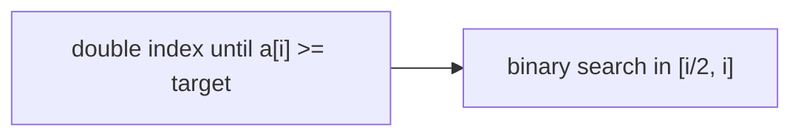

# Exponential Search: Find the Range, Then Binary Search

## 🧠 Intuition

What if you don't know the array's size — it's unbounded, or huge, and the target is near the
front? Exponential search finds a **bounding range** by doubling an index (1, 2, 4, 8, 16…) until
it passes the target, then runs [binary search](02.Binary-Search.md) within that range.

> 💡 **Analogy — finding how deep a pool is by doubling.** Check 1m, 2m, 4m, 8m… as soon as
> you've gone too far, you know the depth is in the last interval, and you can zero in (binary
> search) there.

It's ideal for **unbounded/infinite** sorted sequences and when the target is likely early — the
range-finding is O(log position), independent of total size.

## 📐 How It Works

1. If `a[0]` is the target, done.
2. Double `bound` (1, 2, 4, …) while `a[bound] < target`.
3. Binary-search between `bound/2` and `min(bound, n−1)`.



## 🧾 Pseudocode

```
if a[0] == target: return 0
bound = 1
while bound < n and a[bound] < target: bound *= 2
return binarySearch(a, target, bound/2, min(bound, n-1))
```

## 💻 C# Implementation

```csharp
int ExponentialSearch(int[] a, int target) {
    int n = a.Length;
    if (n == 0) return -1;
    if (a[0] == target) return 0;

    int bound = 1;
    while (bound < n && a[bound] < target) bound *= 2;     // find the range by doubling

    int lo = bound / 2, hi = Math.Min(bound, n - 1);       // binary search inside it
    while (lo <= hi) {
        int mid = lo + (hi - lo) / 2;
        if (a[mid] == target) return mid;
        if (a[mid] < target) lo = mid + 1; else hi = mid - 1;
    }
    return -1;
}
```

## ⏱️ Complexity

| Case | Time | Space |
|------|------|-------|
| Worst | O(log i) where i = target's index | O(1) |

Doubling to reach position `i` takes ~log i steps; the binary search over that range is also
~log i. If the target is near the front, this is far faster than binary search over the whole
array.

## ⚖️ When to Use It

- **Unbounded / unknown-size sorted streams** (you can't compute `n`).
- **Target expected near the beginning** of a large sorted array.
- **Otherwise** plain [binary search](02.Binary-Search.md) is simpler.

## 🚫 Common Mistakes

```csharp
// ❌ Letting `bound` index past the end
while (bound < n && a[bound] < target) bound *= 2;   // ✅ guard bound < n

// ❌ Re-searching from 0 instead of bound/2 (wastes the range info you just found)
int lo = bound / 2;                                   // ✅
```

## 🌍 Real-World Applications

- Searching unbounded data sources / lazy sequences / "find where a sorted log starts exceeding
  X."
- Galloping search inside merge routines (e.g. Timsort uses an exponential/galloping step).

## 🎯 Practice (with full solutions)

### 1. Search in an unbounded sorted array — `Medium`
**Problem:** A sorted array of unknown length (out-of-range reads return +∞). Find `target`.
**Approach:** Double the index until the value ≥ target (or +∞), then binary-search the last
interval.
```csharp
int SearchUnbounded(Func<int,int> read, int target) {   // read(i) = a[i] or int.MaxValue
    if (read(0) == target) return 0;
    int bound = 1;
    while (read(bound) < target) bound *= 2;
    int lo = bound / 2, hi = bound;
    while (lo <= hi) {
        int mid = lo + (hi - lo) / 2;
        int v = read(mid);
        if (v == target) return mid;
        if (v < target) lo = mid + 1; else hi = mid - 1;
    }
    return -1;
}
```
**Complexity:** O(log i). **Why this fits:** the defining unbounded-search scenario.

### 2. Find range bound by doubling — `Easy`
**Problem:** Find the smallest power-of-two index whose value ≥ target.
**Approach:** The doubling loop alone.
**Complexity:** O(log i). **Why this fits:** isolates the range-finding half of the algorithm.

## ✅ Key Takeaways

- Double an index to **bracket** the target, then **binary search** the bracket → **O(log i)**.
- Perfect for **unbounded** sorted data or targets near the front.
- Combines doubling (range finding) with binary search (precision).

**Self-check:**
1. Why does exponential search help when the array size is unknown?
2. Why binary-search only between `bound/2` and `bound`?

---
◀ Prev: [Jump Search](03.Jump-Search.md) · ▲ [Module index](README.md) · ▶ Next: [Ternary Search](05.Ternary-Search.md)
