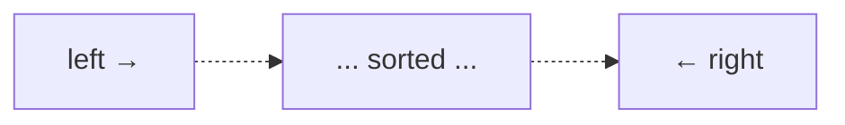
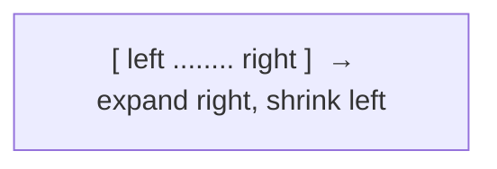

# Two Pointers & Sliding Window: Replace Nested Loops with Smart Indices

## 🧠 Intuition

A huge number of array/string problems have an obvious O(n²) brute force: try every pair, or
every subarray. Two pointers and sliding window collapse that to **O(n)** by moving one or two
indices *intelligently* instead of restarting inner loops.

> 💡 **Two pointers — squeezing from both ends.** On sorted data, a pointer at each end can decide
> which to move based on whether the current pair is too big or too small — no need to try all
> pairs.
>
> 💡 **Sliding window — a stretchy frame over the array.** Keep a contiguous window `[left,
> right]`; expand `right` to include more, shrink `left` when the window breaks a rule. Each
> index enters and leaves the window once → O(n).

These two patterns together solve an enormous slice of interview problems. Recognizing *when* a
problem is "really" a two-pointer or window problem is the skill.

## 📐 How It Works

### Two pointers (opposite ends)


Sum too small? Move `left` right (increase). Too big? Move `right` left (decrease).

### Sliding window (same direction)


Grow `right` each step; while the window violates a constraint, advance `left`. Track the best
window seen.

## 🧾 Pseudocode

```
# Two pointers on sorted array for a target pair sum
left = 0; right = n-1
while left < right:
    s = a[left] + a[right]
    if s == target: return (left, right)
    if s < target:  left += 1
    else:           right -= 1

# Variable sliding window
left = 0
for right in 0 .. n-1:
    add a[right] to window
    while window is invalid:
        remove a[left]; left += 1
    update answer with window [left, right]
```

## 💻 C# Implementation

```csharp
// Two pointers: does a SORTED array contain a pair summing to target?
bool HasPairWithSum(int[] a, int target) {
    int left = 0, right = a.Length - 1;
    while (left < right) {
        int s = a[left] + a[right];
        if (s == target) return true;
        if (s < target) left++; else right--;
    }
    return false;
}

// Fixed-size sliding window: max sum of any k consecutive elements
int MaxSumWindow(int[] a, int k) {
    int sum = 0;
    for (int i = 0; i < k; i++) sum += a[i];     // first window
    int best = sum;
    for (int i = k; i < a.Length; i++) {
        sum += a[i] - a[i - k];                   // slide: add new, drop old
        best = Math.Max(best, sum);
    }
    return best;
}

// Variable sliding window: smallest subarray with sum >= target (positives)
int MinSubarrayLen(int target, int[] a) {
    int left = 0, sum = 0, best = int.MaxValue;
    for (int right = 0; right < a.Length; right++) {
        sum += a[right];
        while (sum >= target) {                   // shrink while still valid
            best = Math.Min(best, right - left + 1);
            sum -= a[left++];
        }
    }
    return best == int.MaxValue ? 0 : best;
}
```

## ⏱️ Complexity

| Pattern | Time | Space | Why |
|---------|------|-------|-----|
| Two pointers | O(n) | O(1) | Each pointer moves ≤ n total |
| Fixed window | O(n) | O(1) | One add + one remove per step |
| Variable window | O(n) | O(1)–O(k) | Each index enters/leaves once (amortized) |

The amortized insight: even with a nested `while` to shrink, `left` only ever moves forward, so
across the whole run it advances at most `n` times → still O(n).

## ⚖️ When to Use It

- **Two pointers:** sorted arrays, pair/triplet sums, palindrome checks, merging, partitioning,
  removing duplicates in place.
- **Sliding window:** "longest/shortest/contains-exactly **contiguous** subarray/substring
  with property X" — the word *contiguous* is the tell.
- **Not** when elements can be reordered freely or the subset needn't be contiguous (then think
  sorting, hashing, or DP).

## 🚫 Common Mistakes

```csharp
// ❌ Using two-pointer end-squeeze on UNSORTED data — the move decision relies on order
// ✅ sort first (if allowed), or use a hash set instead

// ❌ Forgetting to shrink the window → it only grows → wrong answer / O(n²)
while (invalid) { remove a[left]; left++; }   // ✅ always have a shrink step

// ❌ Updating the answer at the wrong moment (before/after shrinking) — be deliberate
```

## 🌍 Real-World Applications

- Network throughput over a moving time window; rate limiting.
- Streaming analytics ("max requests in any 60s window").
- Text processing (longest substring with a property), diffing, merging sorted streams.

## 🎯 Practice (with full solutions)

### 1. Two Sum II (sorted input) — `Easy`
**Problem:** Sorted array; return the 1-based indices of the pair summing to `target`.
**Approach:** Opposite-end two pointers.
```csharp
int[] TwoSum(int[] a, int target) {
    int l = 0, r = a.Length - 1;
    while (l < r) {
        int s = a[l] + a[r];
        if (s == target) return new[] { l + 1, r + 1 };
        if (s < target) l++; else r--;
    }
    return Array.Empty<int>();
}
```
**Complexity:** O(n) / O(1). **Why this fits:** the cleanest two-pointer demo.

### 2. Longest Substring Without Repeating Characters — `Medium`
**Problem:** Length of the longest substring with all-distinct characters.
**Approach:** Variable window; a set tracks the window's chars, shrink from the left on a repeat.
```csharp
int LengthOfLongestSubstring(string s) {
    var inWindow = new HashSet<char>();
    int left = 0, best = 0;
    for (int right = 0; right < s.Length; right++) {
        while (inWindow.Contains(s[right])) inWindow.Remove(s[left++]);  // shrink
        inWindow.Add(s[right]);
        best = Math.Max(best, right - left + 1);
    }
    return best;
}
```
**Complexity:** O(n) / O(min(n, alphabet)). **Why this fits:** the archetypal variable window.

### 3. 3Sum — `Medium`
**Problem:** All unique triplets summing to zero.
**Approach:** Sort; fix one element, two-pointer the rest; skip duplicates.
```csharp
IList<IList<int>> ThreeSum(int[] nums) {
    Array.Sort(nums);
    var res = new List<IList<int>>();
    for (int i = 0; i < nums.Length - 2; i++) {
        if (i > 0 && nums[i] == nums[i - 1]) continue;          // skip dup anchors
        int l = i + 1, r = nums.Length - 1;
        while (l < r) {
            int s = nums[i] + nums[l] + nums[r];
            if (s == 0) {
                res.Add(new[] { nums[i], nums[l], nums[r] });
                while (l < r && nums[l] == nums[l + 1]) l++;     // skip dups
                while (l < r && nums[r] == nums[r - 1]) r--;
                l++; r--;
            } else if (s < 0) l++; else r--;
        }
    }
    return res;
}
```
**Complexity:** O(n²) / O(1) extra. **Why this fits:** combining sorting + two pointers to beat
the O(n³) brute force.

### 4. Minimum Window Substring — `Hard`
**Problem:** Smallest substring of `s` containing all characters of `t` (with multiplicity).
**Approach:** Expand `right` until the window covers `t`; then shrink `left` as far as still valid,
recording the best. Track required vs satisfied character counts.
```csharp
string MinWindow(string s, string t) {
    if (t.Length > s.Length) return "";
    var need = new Dictionary<char, int>();
    foreach (char c in t) need[c] = need.GetValueOrDefault(c) + 1;
    int required = need.Count, formed = 0, left = 0, bestLen = int.MaxValue, bestL = 0;
    var window = new Dictionary<char, int>();
    for (int right = 0; right < s.Length; right++) {
        char c = s[right];
        window[c] = window.GetValueOrDefault(c) + 1;
        if (need.ContainsKey(c) && window[c] == need[c]) formed++;
        while (formed == required) {                       // valid → try to shrink
            if (right - left + 1 < bestLen) { bestLen = right - left + 1; bestL = left; }
            char lc = s[left++];
            window[lc]--;
            if (need.ContainsKey(lc) && window[lc] < need[lc]) formed--;
        }
    }
    return bestLen == int.MaxValue ? "" : s.Substring(bestL, bestLen);
}
```
**Complexity:** O(|s| + |t|). **Why this fits:** the hard-mode sliding window with a validity
counter — a pattern that generalizes to many "window contains required set" problems.

## ✅ Key Takeaways

- Two pointers and sliding window turn many **O(n²)** scans into **O(n)** by moving indices
  smartly instead of restarting loops.
- **Two pointers** love **sorted** data and pair/partition problems.
- **Sliding window** owns **contiguous** subarray/substring "longest/shortest/exactly" problems.
- Amortized O(n): each index enters and leaves the window at most once.
- Always include a **shrink** step and update the answer at the right moment.

**Self-check:**
1. What word in a problem statement hints "sliding window"?
2. Why does the opposite-end two-pointer trick require sorted data?
3. Why is a window with a nested shrink loop still O(n)?

---
◀ Prev: [Module index](README.md) · ▲ [Module index](README.md) · ▶ Next: [Prefix Sums](02.Prefix-Sums.md)
