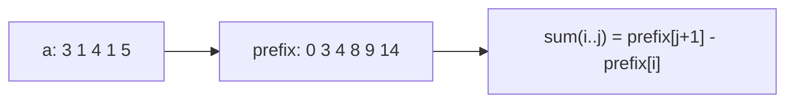

# Prefix Sums: Precompute Once, Answer Range Queries in O(1)

## 🧠 Intuition

If you'll be asked "what's the sum of elements from index i to j?" many times, recomputing each
range is wasteful (O(n) per query). Instead, precompute a running total: `prefix[k]` = sum of the
first `k` elements. Then **any** range sum is one subtraction: `sum(i..j) = prefix[j+1] −
prefix[i]`.

> 💡 **Analogy — mile markers on a highway.** To find the distance between exit 12 and exit 47,
> you don't re-measure the road — you subtract the two mile markers. Prefix sums are mile markers
> for cumulative totals.

It's a tiny idea with outsized impact: one O(n) precomputation makes range queries O(1). Combined
with [hashing](../01-Linear-Structures/06.Hash-Tables.md), it solves many "subarray with sum X"
problems in linear time.

## 📐 How It Works

Array `[3, 1, 4, 1, 5]` → prefix `[0, 3, 4, 8, 9, 14]` (prefix[0]=0, then cumulative).

`sum(1..3)` (elements 1,4,1 = 6) = `prefix[4] − prefix[1]` = 9 − 3 = 6. ✓



The same idea extends to **2D** (sum over a sub-rectangle via inclusion-exclusion) and to
**difference arrays** (apply many range *updates* cheaply, then prefix-sum once).

## 🧾 Pseudocode

```
build:  prefix[0] = 0; for i in 0..n-1: prefix[i+1] = prefix[i] + a[i]
query:  rangeSum(i, j) = prefix[j+1] - prefix[i]
```

## 💻 C# Implementation

```csharp
public class PrefixSum {
    private readonly long[] prefix;
    public PrefixSum(int[] a) {
        prefix = new long[a.Length + 1];
        for (int i = 0; i < a.Length; i++) prefix[i + 1] = prefix[i] + a[i];
    }
    public long RangeSum(int i, int j) => prefix[j + 1] - prefix[i];   // inclusive i..j
}

// 2D prefix sum for sub-rectangle queries
public class PrefixSum2D {
    private readonly long[,] p;
    public PrefixSum2D(int[][] m) {
        int rows = m.Length, cols = m[0].Length;
        p = new long[rows + 1, cols + 1];
        for (int r = 0; r < rows; r++)
            for (int c = 0; c < cols; c++)
                p[r+1, c+1] = m[r][c] + p[r, c+1] + p[r+1, c] - p[r, c];  // inclusion-exclusion
    }
    public long Region(int r1, int c1, int r2, int c2) =>
        p[r2+1, c2+1] - p[r1, c2+1] - p[r2+1, c1] + p[r1, c1];
}

// Difference array: apply range additions in O(1) each, materialize once
int[] ApplyRangeUpdates(int n, int[][] updates) {     // updates: [l, r, val]
    var diff = new int[n + 1];
    foreach (var u in updates) { diff[u[0]] += u[2]; diff[u[1] + 1] -= u[2]; }
    var result = new int[n];
    int running = 0;
    for (int i = 0; i < n; i++) { running += diff[i]; result[i] = running; }
    return result;
}
```

## ⏱️ Complexity

| Operation | Time | Space |
|-----------|------|-------|
| Build prefix | O(n) | O(n) |
| Range sum query | **O(1)** | — |
| 2D build / query | O(rows·cols) / O(1) | O(rows·cols) |
| Difference-array updates | O(1) each + O(n) finalize | O(n) |

The trade: O(n) memory + a one-time O(n) pass buys O(1) queries. Worth it whenever there are many
queries. (If the array also **changes** between queries, use a [Fenwick/segment tree](../02-Trees-and-Heaps/07.Segment-and-Fenwick-Trees.md) instead.)

## ⚖️ When to Use It

- **Many range-sum (or range-count) queries on a static array.**
- **"Subarray with sum k"** problems — prefix sums + a hash map of seen prefixes (see Practice #2).
- **Many range updates, queried once** → difference array.
- **Not** when the array is frequently updated *and* queried → [segment/Fenwick tree](../02-Trees-and-Heaps/07.Segment-and-Fenwick-Trees.md).

## 🚫 Common Mistakes

```csharp
// ❌ Off-by-one between inclusive ranges and the size-(n+1) prefix array
// ✅ Convention: prefix has length n+1, prefix[0]=0, rangeSum(i,j)=prefix[j+1]-prefix[i]

// ❌ Integer overflow on large sums
private readonly long[] prefix;     // ✅ use long

// ❌ Rebuilding the prefix array after each update (O(n) per update) → use a Fenwick tree
```

## 🌍 Real-World Applications

- Analytics dashboards: cumulative totals, running balances, range aggregates.
- Image processing: integral images (2D prefix sums) for fast box filters.
- Scheduling/booking: difference arrays for "add N to a time range" then read occupancy.

## 🎯 Practice (with full solutions)

### 1. Range Sum Query — Immutable — `Easy`
**Problem:** Answer many `sumRange(i, j)` on a fixed array.
**Approach:** The `PrefixSum` class above — O(1) per query after O(n) build.
**Complexity:** O(n) build, O(1) query. **Why this fits:** the textbook motivation.

### 2. Subarray Sum Equals K — `Medium`
**Problem:** Count contiguous subarrays summing to `k`.
**Approach:** A subarray `(i..j)` sums to `k` iff `prefix[j+1] − prefix[i] = k`, i.e. `prefix[i] =
prefix[j+1] − k`. Keep a running prefix and a **hash map of how many times each prefix value has
occurred**.
```csharp
int SubarraySum(int[] nums, int k) {
    var seen = new Dictionary<int, int> { [0] = 1 };   // empty prefix counts once
    int sum = 0, count = 0;
    foreach (int x in nums) {
        sum += x;
        count += seen.GetValueOrDefault(sum - k);       // prefixes that complete a k-sum
        seen[sum] = seen.GetValueOrDefault(sum) + 1;
    }
    return count;
}
```
**Complexity:** O(n) / O(n). **Why this fits:** the prefix-sum + hashing combo that crushes the
O(n²) brute force — a must-know.

### 3. Range Sum Query 2D — Immutable — `Medium`
**Problem:** Many sub-rectangle sum queries on a fixed matrix.
**Approach:** The 2D prefix sum + inclusion-exclusion `Region` above.
**Complexity:** O(rows·cols) build, O(1) query. **Why this fits:** extends the idea to two
dimensions — the integral-image trick.

### 4. Car Pooling / Range Add (difference array) — `Medium`
**Problem:** Given trips `[passengers, start, end]` and a capacity, can the car serve all trips?
**Approach:** Difference array over locations: `+passengers` at start, `−passengers` at end;
prefix-sum to get occupancy per stop; check none exceeds capacity.
```csharp
bool CarPooling(int[][] trips, int capacity) {
    var diff = new int[1001];
    foreach (var t in trips) { diff[t[1]] += t[0]; diff[t[2]] -= t[0]; }
    int cur = 0;
    foreach (int d in diff) { cur += d; if (cur > capacity) return false; }
    return true;
}
```
**Complexity:** O(n + range). **Why this fits:** the difference-array dual — cheap range updates,
one final sweep.

## ✅ Key Takeaways

- Precompute cumulative sums → **any range sum in O(1)** via subtraction.
- **Prefix sums + a hash map** of seen prefixes solves "subarray sums to k" in O(n).
- Extends to **2D** (sub-rectangles) and to **difference arrays** (cheap range updates).
- For arrays that change between queries, use a [Fenwick/segment tree](../02-Trees-and-Heaps/07.Segment-and-Fenwick-Trees.md) instead.
- Mind off-by-one and use `long` to avoid overflow.

**Self-check:**
1. How do you get `sum(i..j)` from a prefix array, and why the `+1` offset?
2. Why does `prefix[i] = prefix[j+1] − k` count subarrays summing to k?
3. When should you reach for a Fenwick tree instead of a prefix-sum array?

---
◀ Prev: [Two Pointers & Sliding Window](01.Two-Pointers-and-Sliding-Window.md) · ▲ [Module index](README.md) · ▶ Next: [Divide & Conquer](03.Divide-and-Conquer.md)
