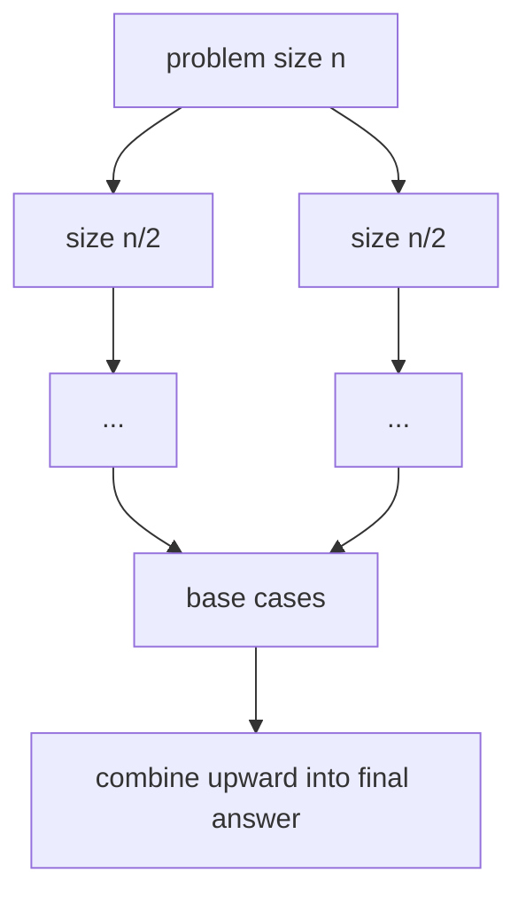

# Divide & Conquer: Break It Down, Solve, Combine

> Builds on [Recursion](../00-Foundations/03.Recursion.md). [Merge sort](../04-Sorting/04.Merge-Sort.md)
> and [quick sort](../04-Sorting/05.Quick-Sort.md) are its most famous instances.

## 🧠 Intuition

A big problem is often just a *combination* of smaller versions of the same problem. Divide &
conquer formalizes that into three steps:

1. **Divide** the problem into smaller subproblems (usually halves).
2. **Conquer** each subproblem recursively (the base case solves the smallest directly).
3. **Combine** the sub-answers into the full answer.

> 💡 **Analogy — counting a stadium crowd.** One person can't count 50,000 quickly. Split the
> stadium into sections, have each section counted (those split further if needed), then **add up
> the section totals**. The "combine" step (adding) is where the real algorithmic insight usually
> lives.

The pattern's power: each split halves the work-per-level, and there are only ~log n levels —
which is how O(n log n) algorithms arise.

## 📐 How It Works



The cost is captured by a **recurrence**, solved by the **Master Theorem**:

`T(n) = a·T(n/b) + O(nᵈ)` — split into `a` subproblems of size `n/b`, with O(nᵈ) combine work.

| Relationship | Result | Example |
|--------------|--------|---------|
| `d < log_b a` | O(n^(log_b a)) | Karatsuba multiplication |
| `d = log_b a` | O(nᵈ log n) | Merge sort (a=2, b=2, d=1 → O(n log n)) |
| `d > log_b a` | O(nᵈ) | combine-dominated |

## 🧾 Pseudocode

```
solve(problem):
    if problem is small: return base answer
    subproblems = divide(problem)
    subAnswers  = [solve(s) for s in subproblems]
    return combine(subAnswers)
```

## 💻 C# Implementation

```csharp
// Maximum subarray sum via divide & conquer (also see DP for the O(n) Kadane version)
int MaxSubArray(int[] a) => Solve(a, 0, a.Length - 1);

int Solve(int[] a, int lo, int hi) {
    if (lo == hi) return a[lo];                          // base case
    int mid = lo + (hi - lo) / 2;
    int left = Solve(a, lo, mid);                        // best fully in left
    int right = Solve(a, mid + 1, hi);                   // best fully in right
    int cross = MaxCrossing(a, lo, mid, hi);             // best straddling the middle
    return Math.Max(Math.Max(left, right), cross);       // combine
}

int MaxCrossing(int[] a, int lo, int mid, int hi) {
    int sum = 0, leftBest = int.MinValue;
    for (int i = mid; i >= lo; i--) { sum += a[i]; leftBest = Math.Max(leftBest, sum); }
    sum = 0; int rightBest = int.MinValue;
    for (int i = mid + 1; i <= hi; i++) { sum += a[i]; rightBest = Math.Max(rightBest, sum); }
    return leftBest + rightBest;
}

// Fast exponentiation: x^n in O(log n) by halving the exponent
long Power(long x, int n) {
    if (n == 0) return 1;
    long half = Power(x, n / 2);
    return n % 2 == 0 ? half * half : half * half * x;
}
```

## ⏱️ Complexity

Depends on the split/combine, via the Master Theorem above:

| Algorithm | Recurrence | Time |
|-----------|-----------|------|
| Merge sort | 2T(n/2) + O(n) | O(n log n) |
| Binary search | T(n/2) + O(1) | O(log n) |
| Fast power | T(n/2) + O(1) | O(log n) |
| Max-subarray D&C | 2T(n/2) + O(n) | O(n log n) |

Stack space is O(log n) (the recursion depth) when splitting in half.

## ⚖️ When to Use It

- **When a problem splits into independent same-shape subproblems** with a meaningful combine
  step: sorting, searching, fast multiplication, closest-pair-of-points, FFT, many tree problems.
- **When subproblems overlap** (the same sub-input recurs), plain D&C recomputes them — switch to
  [dynamic programming](06.Dynamic-Programming.md) (D&C + memoization).
- **Naturally parallel:** independent subproblems can run on different cores.

## 🚫 Common Mistakes

```csharp
// ❌ Forgetting the combine step handles cases that SPAN the split (e.g. crossing subarray)
//    Easy to compute left/right and miss answers straddling the midpoint.

// ❌ Re-solving overlapping subproblems with plain D&C (e.g. naive Fibonacci) → exponential
// ✅ memoize → that's dynamic programming

// ❌ Unbalanced splits (like quicksort's bad pivot) → O(n²) instead of O(n log n)
```

## 🌍 Real-World Applications

- Sorting ([merge](../04-Sorting/04.Merge-Sort.md)/[quick](../04-Sorting/05.Quick-Sort.md)),
  searching ([binary](../05-Searching/02.Binary-Search.md)).
- Big-number and matrix multiplication (Karatsuba, Strassen), FFT in signal processing.
- Computational geometry (closest pair, convex hull); MapReduce-style distributed computing.

## 🎯 Practice (with full solutions)

### 1. Pow(x, n) — `Medium`
**Problem:** Compute `xⁿ` efficiently (n may be negative).
**Approach:** Halve the exponent — `xⁿ = (x^(n/2))²` — for O(log n).
```csharp
double MyPow(double x, int n) {
    long N = n;
    if (N < 0) { x = 1 / x; N = -N; }
    double result = 1;
    while (N > 0) {                       // iterative fast power
        if ((N & 1) == 1) result *= x;
        x *= x; N >>= 1;
    }
    return result;
}
```
**Complexity:** O(log n). **Why this fits:** the cleanest "halve the problem" win, no array
needed.

### 2. Maximum Subarray (D&C view) — `Medium`
**Problem:** Largest sum of a contiguous subarray.
**Approach:** The `MaxSubArray` above — left, right, or crossing the middle. (Kadane's O(n) DP is
better in practice; this teaches the combine step.)
**Complexity:** O(n log n). **Why this fits:** the combine step (crossing sum) is the lesson.

### 3. Merge k Sorted Lists (pairwise D&C) — `Hard`
**Problem:** Merge `k` sorted lists.
**Approach:** Repeatedly merge lists **in pairs** (k → k/2 → k/4 …), halving the count each round
— O(N log k), beating naive sequential merging's O(N·k).
```csharp
ListNode MergeKLists(ListNode[] lists) {
    if (lists.Length == 0) return null;
    int interval = 1;
    while (interval < lists.Length) {
        for (int i = 0; i + interval < lists.Length; i += interval * 2)
            lists[i] = Merge2(lists[i], lists[i + interval]);   // pairwise merge
        interval *= 2;
    }
    return lists[0];
}
ListNode Merge2(ListNode a, ListNode b) {
    var dummy = new ListNode(0); var tail = dummy;
    while (a != null && b != null) {
        if (a.val <= b.val) { tail.next = a; a = a.next; } else { tail.next = b; b = b.next; }
        tail = tail.next;
    }
    tail.next = a ?? b;
    return dummy.next;
}
```
**Complexity:** O(N log k). **Why this fits:** shows divide & conquer beating a linear sequence of
merges — same idea as merge sort's tree.

## ✅ Key Takeaways

- **Divide → conquer → combine.** The combine step (and handling cases that *span* the split) is
  usually where the cleverness lives.
- The **Master Theorem** turns a split/combine recurrence into a complexity class.
- Halving each level gives ~log n levels — the source of many O(n log n)/O(log n) algorithms.
- **Overlapping** subproblems? Add memoization → [dynamic programming](06.Dynamic-Programming.md).
- Subproblems are independent → naturally **parallelizable**.

**Self-check:**
1. What are the three steps, and which one usually carries the insight?
2. Use the Master Theorem to explain why merge sort is O(n log n).
3. When should you switch from divide & conquer to dynamic programming?

---
◀ Prev: [Prefix Sums](02.Prefix-Sums.md) · ▲ [Module index](README.md) · ▶ Next: [Backtracking](04.Backtracking.md)
