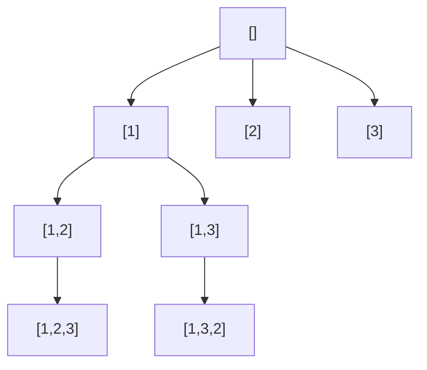

# Backtracking: Try, Recurse, Undo

> Builds on [Recursion](../00-Foundations/03.Recursion.md). It's how you systematically explore
> *all* possibilities.

## 🧠 Intuition

Some problems ask you to *build* a solution piece by piece, where at each step you have several
choices: permutations, combinations, sudoku, placing queens, partitioning a string. Backtracking
explores these by making a choice, **recursing**, and — crucially — **undoing the choice**
before trying the next one. It's depth-first search over a tree of decisions.

> 💡 **Analogy — exploring a maze with a string.** At each junction you pick a path and unspool
> string as you go. Hit a dead end? Follow the string back to the last junction (undo) and try a
> different path. You'll eventually walk every route without getting lost.

The "undo" (backtrack) is what makes it efficient and correct: you reuse the same partial-solution
buffer instead of copying it everywhere, and **pruning** lets you abandon hopeless branches early.

## 📐 How It Works

The decision tree for permutations of `[1,2,3]`:



The universal template:

```
backtrack(state):
    if state is a complete solution: record it; return
    for each choice from state:
        if choice is valid (pruning):
            apply choice            # move forward
            backtrack(new state)    # recurse
            undo choice             # BACKTRACK
```

## 🧾 Pseudocode

```
solve(path, choices):
    if path is complete: output path; return
    for c in choices:
        if not promising(path, c): continue   # prune
        path.add(c)
        solve(path, remaining choices)
        path.removeLast()                      # undo
```

## 💻 C# Implementation

```csharp
// Permutations of distinct numbers
IList<IList<int>> Permute(int[] nums) {
    var result = new List<IList<int>>();
    var used = new bool[nums.Length];
    var path = new List<int>();
    void Backtrack() {
        if (path.Count == nums.Length) { result.Add(new List<int>(path)); return; }  // copy!
        for (int i = 0; i < nums.Length; i++) {
            if (used[i]) continue;            // can't reuse an element
            used[i] = true; path.Add(nums[i]);     // choose
            Backtrack();                            // explore
            used[i] = false; path.RemoveAt(path.Count - 1);   // un-choose (backtrack)
        }
    }
    Backtrack();
    return result;
}

// Combinations: choose k from 1..n (uses `start` to avoid duplicates / enforce order)
IList<IList<int>> Combine(int n, int k) {
    var result = new List<IList<int>>();
    var path = new List<int>();
    void Backtrack(int start) {
        if (path.Count == k) { result.Add(new List<int>(path)); return; }
        for (int i = start; i <= n; i++) {
            path.Add(i);
            Backtrack(i + 1);                 // next picks start AFTER i (no repeats)
            path.RemoveAt(path.Count - 1);
        }
    }
    Backtrack(1);
    return result;
}
```

> Two recurring tricks: a `used[]` array (when order matters / permutations) and a `start` index
> (when order doesn't / combinations & subsets). **Always copy** the path when recording it —
> the buffer keeps mutating.

## ⏱️ Complexity

Backtracking explores a tree, so cost ≈ (number of nodes) × (work per node). Often exponential —
that's inherent to "enumerate all possibilities":

| Problem | Solutions | Rough time |
|---------|-----------|------------|
| Subsets | 2ⁿ | O(n·2ⁿ) |
| Permutations | n! | O(n·n!) |
| Combinations C(n,k) | C(n,k) | O(k·C(n,k)) |
| N-Queens | — | O(n!) with pruning |

**Pruning** doesn't change the worst case but massively cuts real runtime by skipping invalid
branches early. Space is O(depth) for the recursion + path.

## ⚖️ When to Use It

- **"Find all / count all / does any exist"** over a combinatorial space: permutations, subsets,
  combinations, partitions, board placements (N-Queens, sudoku), word search, constraint
  satisfaction.
- **When you can prune** — a validity check that kills branches early makes it practical.
- **Not** when only an *optimal* value is needed and subproblems overlap → [dynamic
  programming](06.Dynamic-Programming.md) is far faster. Backtracking enumerates; DP optimizes.

## 🚫 Common Mistakes

```csharp
// ❌ Recording a reference to the mutating path → all entries end up identical/empty
result.Add(path);                   // bug
result.Add(new List<int>(path));    // ✅ snapshot a copy

// ❌ Forgetting to undo the choice → state leaks into sibling branches
path.Add(x); Backtrack(); /* missing */ 
path.RemoveAt(path.Count - 1);      // ✅ always undo

// ❌ No pruning → exploring obviously-dead branches (slow but not wrong)
```

## 🌍 Real-World Applications

- Constraint solvers, schedulers, puzzle solvers (sudoku, crosswords).
- Parsing/regex engines (try alternatives, backtrack on failure).
- Configuration/test-case generation; combinatorial optimization (with pruning/branch-and-bound).

## 🎯 Practice (with full solutions)

### 1. Subsets — `Medium`
**Problem:** All subsets of a set of distinct integers.
**Approach:** At each index choose include/exclude; `start` enforces order so subsets aren't
duplicated.
```csharp
IList<IList<int>> Subsets(int[] nums) {
    var res = new List<IList<int>>();
    var path = new List<int>();
    void Backtrack(int start) {
        res.Add(new List<int>(path));            // every node is a valid subset
        for (int i = start; i < nums.Length; i++) {
            path.Add(nums[i]);
            Backtrack(i + 1);
            path.RemoveAt(path.Count - 1);
        }
    }
    Backtrack(0);
    return res;
}
```
**Complexity:** O(n·2ⁿ). **Why this fits:** the cleanest backtracking skeleton (record-at-every-node).

### 2. Combination Sum — `Medium`
**Problem:** All combinations of `candidates` (reusable) summing to `target`.
**Approach:** Backtrack with a `remaining` total; prune when it goes negative; pass `i` (not
`i+1`) to allow reuse.
```csharp
IList<IList<int>> CombinationSum(int[] candidates, int target) {
    var res = new List<IList<int>>();
    var path = new List<int>();
    void Backtrack(int start, int remaining) {
        if (remaining == 0) { res.Add(new List<int>(path)); return; }
        for (int i = start; i < candidates.Length; i++) {
            if (candidates[i] > remaining) continue;     // prune
            path.Add(candidates[i]);
            Backtrack(i, remaining - candidates[i]);     // i ⇒ reuse allowed
            path.RemoveAt(path.Count - 1);
        }
    }
    Backtrack(0, target);
    return res;
}
```
**Complexity:** exponential, pruned. **Why this fits:** introduces **pruning** and the reuse-vs-no-reuse
index choice.

### 3. N-Queens — `Hard`
**Problem:** Place `n` queens on an n×n board so none attack each other; count/return solutions.
**Approach:** Place one queen per row; track threatened columns and both diagonals in sets so each
placement is O(1) to validate; backtrack on conflict.
```csharp
int TotalNQueens(int n) {
    var cols = new HashSet<int>();
    var diag = new HashSet<int>();    // r - c
    var anti = new HashSet<int>();    // r + c
    int count = 0;
    void Place(int r) {
        if (r == n) { count++; return; }
        for (int c = 0; c < n; c++) {
            if (cols.Contains(c) || diag.Contains(r - c) || anti.Contains(r + c)) continue; // prune
            cols.Add(c); diag.Add(r - c); anti.Add(r + c);
            Place(r + 1);
            cols.Remove(c); diag.Remove(r - c); anti.Remove(r + c);   // undo
        }
    }
    Place(0);
    return count;
}
```
**Complexity:** O(n!) worst, heavily pruned. **Why this fits:** the showcase constraint-satisfaction
problem — pruning via threat sets is what makes it feasible.

### 4. Word Search — `Medium`
**Problem:** Does a word exist in a grid via adjacent cells (no reuse)?
**Approach:** DFS from each cell, marking visited and **restoring** on backtrack.
```csharp
bool Exist(char[][] board, string word) {
    int rows = board.Length, cols = board[0].Length;
    bool Dfs(int r, int c, int i) {
        if (i == word.Length) return true;
        if (r<0||c<0||r>=rows||c>=cols||board[r][c]!=word[i]) return false;
        char tmp = board[r][c]; board[r][c] = '#';        // mark
        bool found = Dfs(r+1,c,i+1)||Dfs(r-1,c,i+1)||Dfs(r,c+1,i+1)||Dfs(r,c-1,i+1);
        board[r][c] = tmp;                                 // restore (backtrack)
        return found;
    }
    for (int r = 0; r < rows; r++)
        for (int c = 0; c < cols; c++)
            if (Dfs(r, c, 0)) return true;
    return false;
}
```
**Complexity:** O(cells·4^L). **Why this fits:** backtracking on a grid with the
mark-recurse-restore pattern.

## ✅ Key Takeaways

- Backtracking = DFS over a decision tree: **choose → explore → undo**.
- Use **`used[]`** for permutations, a **`start` index** for subsets/combinations.
- **Always snapshot** the path when recording a solution; **always undo** the choice.
- **Pruning** (skipping invalid branches) is what makes exponential search practical.
- Need an *optimum* over overlapping subproblems? Use [DP](06.Dynamic-Programming.md), not backtracking.

**Self-check:**
1. Why must you copy the path before adding it to the results?
2. When do you use a `used[]` array vs a `start` index?
3. What is pruning, and why doesn't it change the worst-case complexity?

---
◀ Prev: [Divide & Conquer](03.Divide-and-Conquer.md) · ▲ [Module index](README.md) · ▶ Next: [Greedy](05.Greedy.md)
