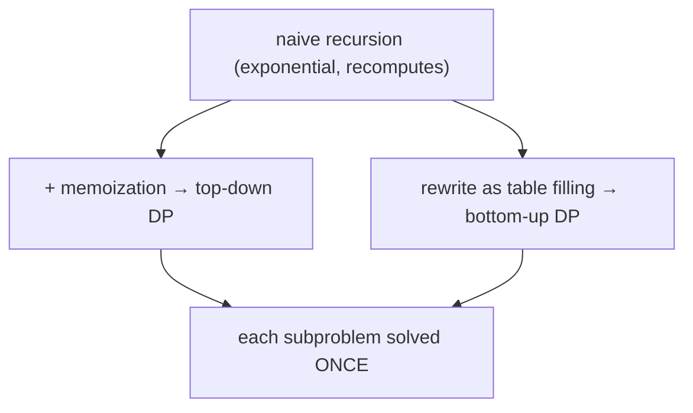

# Dynamic Programming: Don't Solve the Same Subproblem Twice

> The topic people fear most — and it's just **recursion + remembering answers**. Make sure
> [Recursion](../00-Foundations/03.Recursion.md) is solid first.

## 🧠 Intuition

Many problems break into smaller subproblems — but those subproblems **overlap**, so a naive
recursion re-solves the same thing exponentially many times. Dynamic programming (DP) fixes this
by **solving each subproblem once and storing the answer**.

> 💡 **Analogy — climbing stairs.** "How many ways to reach step n?" To reach step n you came from
> step n−1 or n−2, so `ways(n) = ways(n-1) + ways(n-2)` — Fibonacci! Naively recomputing
> `ways(n-2)` over and over is wasteful. Write each answer on a sticky note the first time; next
> time, just read the note. That's DP.

Two requirements (same as [greedy](05.Greedy.md)'s second, plus overlap):
1. **Overlapping subproblems** — the same sub-input recurs (or DP gives no benefit).
2. **Optimal substructure** — the optimal answer is built from optimal sub-answers.

DP isn't a specific algorithm; it's a **technique** for turning exponential recursion into
polynomial time.

## 📐 How It Works

### Two styles (same recurrence, opposite directions)

- **Top-down (memoization):** write the natural recursion, then cache results in a map/array.
  Easy to derive — just add memo to your recursion.
- **Bottom-up (tabulation):** fill a table from the smallest subproblems up to the answer. No
  recursion; often a bit faster and avoids stack overflow.



### A repeatable framework (use this on every DP problem)

1. **Define the state.** What does `dp[i]` (or `dp[i][j]`) *mean*? This is 80% of the work.
2. **Write the recurrence.** How does a state depend on smaller states?
3. **Base cases.** The smallest states you know directly.
4. **Order / memo.** Fill bottom-up in dependency order, or recurse + cache.
5. **Answer.** Which state holds the final result?

## 🧾 Pseudocode

```
# Top-down template
memo = {}
solve(state):
    if state is base: return base value
    if state in memo: return memo[state]
    memo[state] = combine(solve(smaller states))
    return memo[state]

# Bottom-up template
dp[base] = known
for state in increasing order:
    dp[state] = combine(dp[smaller states])
return dp[target]
```

## 💻 C# Implementation

### Fibonacci — both styles, plus space optimization

```csharp
// Top-down (memoized)
long Fib(int n, long[] memo = null) {
    memo ??= new long[n + 1];
    if (n <= 1) return n;
    if (memo[n] != 0) return memo[n];
    return memo[n] = Fib(n - 1, memo) + Fib(n - 2, memo);
}

// Bottom-up (tabulation)
long FibTab(int n) {
    if (n <= 1) return n;
    var dp = new long[n + 1];
    dp[1] = 1;
    for (int i = 2; i <= n; i++) dp[i] = dp[i - 1] + dp[i - 2];
    return dp[n];
}

// Space-optimized — we only ever need the last two values → O(1) space
long FibFast(int n) {
    if (n <= 1) return n;
    long a = 0, b = 1;
    for (int i = 2; i <= n; i++) (a, b) = (b, a + b);
    return b;
}
```

This progression — **naive → memoized → tabulated → space-optimized** — is the path you'll take
on most DP problems.

## ⏱️ Complexity

DP time ≈ **(number of distinct states) × (work per state)**. Space ≈ number of states (often
reducible).

| Problem | States | Time | Space (optimized) |
|---------|--------|------|-------------------|
| Fibonacci / climbing stairs | n | O(n) | O(1) |
| Coin change | amount × coins | O(amount · coins) | O(amount) |
| 0/1 knapsack | items × capacity | O(n · W) | O(W) |
| Longest common subsequence | m × n | O(m·n) | O(min(m,n)) |
| Edit distance | m × n | O(m·n) | O(min(m,n)) |

That first formula is the single most useful DP tool: **count the states, multiply by per-state
work.**

## ⚖️ When to Use It

- **Optimization or counting** over overlapping subproblems: "minimum/maximum…", "number of
  ways…", "is it possible to…" — especially with choices at each step.
- **When [greedy](05.Greedy.md) fails** (no safe local choice) but the problem has optimal
  substructure → DP is the answer (e.g. 0/1 knapsack, coin change with arbitrary coins).
- **Not** when subproblems *don't* overlap (plain [divide & conquer](03.Divide-and-Conquer.md) is
  enough) or there's no optimal substructure.

## 🚫 Common Mistakes

```csharp
// ❌ Wrong/ambiguous state definition → recurrence won't close. Spend time here FIRST.

// ❌ Using 0 as "uncomputed" when 0 is a valid answer → false cache hits
//    use a sentinel like -1 or a separate "computed" flag

// ❌ Filling the table in the wrong order (depending on a not-yet-computed state)
// ✅ ensure every dp[x] is filled before anything that reads it

// ❌ 0/1 knapsack: iterating capacity ASCENDING in the 1D version reuses an item
for (int w = W; w >= weight; w--)   // ✅ DESCENDING prevents reuse (see knapsack below)
```

## 🌍 Real-World Applications

- Text diffing / spell-check (edit distance), DNA sequence alignment.
- Resource allocation, budgeting, scheduling (knapsack family).
- Finance (optimal strategies), NLP (Viterbi), compilers (optimal parenthesization).

## 🎯 Practice (with full solutions)

### 1. Climbing Stairs — `Easy`
**Problem:** Each step take 1 or 2 stairs; how many ways to reach the top of `n`?
**Approach:** `ways(n) = ways(n-1) + ways(n-2)` — Fibonacci. Space-optimized.
```csharp
int ClimbStairs(int n) {
    int a = 1, b = 1;
    for (int i = 2; i <= n; i++) (a, b) = (b, a + b);
    return b;
}
```
**Complexity:** O(n) / O(1). **Why this fits:** the gentlest 1D DP — derive the recurrence from
the choices.

### 2. House Robber — `Medium`
**Problem:** Max sum of non-adjacent elements (can't rob two adjacent houses).
**Approach:** `dp[i] = max(dp[i-1] /*skip*/, dp[i-2] + a[i] /*rob*/)`. Keep two rolling values.
```csharp
int Rob(int[] nums) {
    int prev = 0, curr = 0;       // best up to i-2, best up to i-1
    foreach (int x in nums) {
        int take = prev + x;
        prev = curr;
        curr = Math.Max(curr, take);
    }
    return curr;
}
```
**Complexity:** O(n) / O(1). **Why this fits:** the "take it or skip it" choice — a DP archetype.

### 3. Coin Change — `Medium`
**Problem:** Fewest coins to make `amount` (coins reusable), or -1.
**Approach:** `dp[x]` = fewest coins for amount `x`; `dp[x] = min over coins c of dp[x - c] + 1`.
Bottom-up from 0 to amount. (This is where [greedy](05.Greedy.md) fails — DP is required.)
```csharp
int CoinChange(int[] coins, int amount) {
    var dp = new int[amount + 1];
    Array.Fill(dp, amount + 1);     // "infinity" sentinel
    dp[0] = 0;
    for (int x = 1; x <= amount; x++)
        foreach (int c in coins)
            if (c <= x) dp[x] = Math.Min(dp[x], dp[x - c] + 1);
    return dp[amount] > amount ? -1 : dp[amount];
}
```
**Complexity:** O(amount · coins) / O(amount). **Why this fits:** classic unbounded-choice DP and
the canonical "greedy doesn't work" example.

### 4. 0/1 Knapsack — `Medium`
**Problem:** Maximize value of items in a bag of capacity `W`; each item taken at most once.
**Approach:** `dp[w]` = best value at capacity `w`. For each item, iterate capacity **descending**
so the item isn't reused within the same pass.
```csharp
int Knapsack(int[] weights, int[] values, int W) {
    var dp = new int[W + 1];
    for (int i = 0; i < weights.Length; i++)
        for (int w = W; w >= weights[i]; w--)             // DESCENDING ⇒ 0/1 (no reuse)
            dp[w] = Math.Max(dp[w], dp[w - weights[i]] + values[i]);
    return dp[W];
}
```
**Complexity:** O(n · W) / O(W). **Why this fits:** the foundational 2D-collapsed-to-1D DP; the
iteration direction is a famous subtlety.

### 5. Longest Increasing Subsequence — `Medium`
**Problem:** Length of the longest strictly increasing subsequence.
**Approach (O(n²) DP):** `dp[i]` = LIS ending at `i` = 1 + max(dp[j]) over j<i with a[j]<a[i].
```csharp
int LengthOfLIS(int[] nums) {
    var dp = new int[nums.Length];
    Array.Fill(dp, 1);
    int best = 1;
    for (int i = 0; i < nums.Length; i++) {
        for (int j = 0; j < i; j++)
            if (nums[j] < nums[i]) dp[i] = Math.Max(dp[i], dp[j] + 1);
        best = Math.Max(best, dp[i]);
    }
    return best;
}
// (An O(n log n) version uses patience sorting + binary search — worth learning next.)
```
**Complexity:** O(n²) / O(n). **Why this fits:** "best subsequence ending here" — a pattern that
recurs across DP.

### 6. Edit Distance — `Hard`
**Problem:** Minimum insert/delete/replace operations to turn `a` into `b`.
**Approach:** `dp[i][j]` = edit distance between `a[..i]` and `b[..j]`. If chars match, no cost;
else 1 + min(insert, delete, replace).
```csharp
int MinDistance(string a, string b) {
    int m = a.Length, n = b.Length;
    var dp = new int[m + 1, n + 1];
    for (int i = 0; i <= m; i++) dp[i, 0] = i;       // delete all
    for (int j = 0; j <= n; j++) dp[0, j] = j;       // insert all
    for (int i = 1; i <= m; i++)
        for (int j = 1; j <= n; j++)
            dp[i, j] = a[i-1] == b[j-1]
                ? dp[i-1, j-1]
                : 1 + Math.Min(dp[i-1, j-1], Math.Min(dp[i-1, j], dp[i, j-1]));
    return dp[m, n];
}
```
**Complexity:** O(m·n) / O(m·n). **Why this fits:** the quintessential **2D grid DP** — string
alignment, powering diff and spell-check.

## ✅ Key Takeaways

- DP = **recursion + memoization**: solve each overlapping subproblem **once**.
- Use the **framework**: define the **state**, write the **recurrence**, set **base cases**, fill
  in order, read the answer. Defining the state is the hard part.
- **Top-down** (memoize a recursion) is easy to derive; **bottom-up** (fill a table) is often
  faster and avoids stack overflow.
- **Time ≈ states × work-per-state**; space is often reducible to one or two rows.
- Reach for DP when **[greedy](05.Greedy.md) is unsafe** but optimal substructure exists.

**Self-check:**
1. What two properties must a problem have for DP to apply?
2. What's the difference between memoization and tabulation, and when prefer each?
3. In 1D 0/1 knapsack, why must the capacity loop go *descending*?

---
◀ Prev: [Greedy](05.Greedy.md) · ▲ [Module index](README.md) · ▶ Next module: [07 — String Algorithms](../07-String-Algorithms/01.Pattern-Matching.md)
