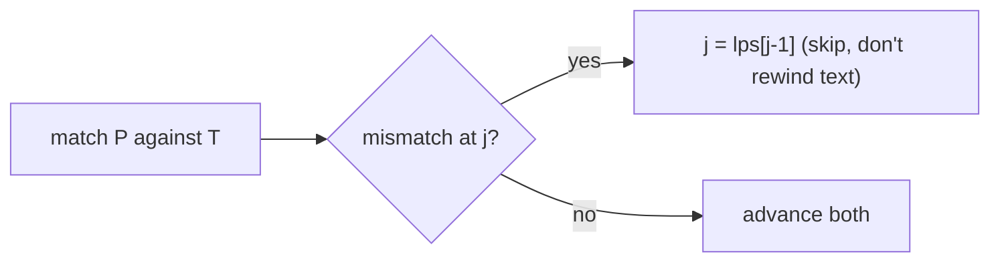

# Pattern Matching: Finding a Needle in a Text, Fast

> Builds on [Strings](../01-Linear-Structures/02.Strings.md) and [Hashing](../01-Linear-Structures/06.Hash-Tables.md).

## 🧠 Intuition

"Does pattern `P` (length m) occur in text `T` (length n), and where?" The naive approach tries
`P` at every position of `T`, re-comparing from scratch after each mismatch — **O(n·m)**. The
algorithms here get it down to **O(n + m)** by *not throwing away* what each comparison already
taught them.

> 💡 **Analogy — searching a bookshelf for a title.** Naively you'd restart reading each spine
> from its first letter every time. But if you've already matched "ALGOR" and the next letter is
> wrong, you *know* something about the letters you just read — you shouldn't re-check all of
> them. Smart matching reuses that knowledge to skip ahead.

Three classic approaches:
- **KMP** — precompute, from the pattern, how far to safely skip on a mismatch (never re-reads
  text). Worst-case linear.
- **Rabin-Karp** — compare a rolling **hash** of each window instead of characters; great for
  multiple patterns. Linear on average.
- **Z-algorithm** — compute, for each position, the longest match with the pattern's prefix; a
  clean linear tool for many prefix problems.

## 📐 How It Works

### Naive (the baseline to beat)

Slide `P` across `T`; at each offset compare up to m chars. A mismatch near the end wastes all
the comparisons → O(n·m).

### KMP — the failure (prefix) function

Precompute `lps[i]` = length of the longest proper prefix of `P[0..i]` that is also a suffix.
On a mismatch at pattern index `j`, instead of restarting, jump `j = lps[j-1]` — the prefix
you've *already matched* lines up, so you skip re-comparison. The text pointer never moves back.



### Rabin-Karp — rolling hash

Hash the pattern and each length-m window of the text. A **rolling hash** updates in O(1) when the
window slides (drop the leaving char, add the entering char). Equal hashes ⇒ verify char-by-char
(to rule out collisions). Average O(n + m); worst O(n·m) with adversarial collisions.

## 🧾 Pseudocode

```
buildLPS(P):
    lps[0] = 0; len = 0; i = 1
    while i < m:
        if P[i] == P[len]: len++; lps[i] = len; i++
        elif len > 0:      len = lps[len-1]      # fall back
        else:              lps[i] = 0; i++

KMP(T, P):
    lps = buildLPS(P); i = j = 0
    while i < n:
        if T[i] == P[j]: i++; j++; if j == m: report match at i-m; j = lps[j-1]
        elif j > 0:      j = lps[j-1]
        else:            i++
```

## 💻 C# Implementation

### KMP

```csharp
int[] BuildLps(string p) {
    var lps = new int[p.Length];
    int len = 0;
    for (int i = 1; i < p.Length; ) {
        if (p[i] == p[len]) lps[i++] = ++len;
        else if (len > 0) len = lps[len - 1];     // fall back within the pattern
        else lps[i++] = 0;
    }
    return lps;
}

IList<int> KmpSearch(string text, string pattern) {
    var result = new List<int>();
    if (pattern.Length == 0) return result;
    var lps = BuildLps(pattern);
    int i = 0, j = 0;
    while (i < text.Length) {
        if (text[i] == pattern[j]) {
            i++; j++;
            if (j == pattern.Length) { result.Add(i - j); j = lps[j - 1]; }  // match
        } else if (j > 0) j = lps[j - 1];          // reuse matched prefix
        else i++;
    }
    return result;
}
```

### Rabin-Karp (rolling hash)

```csharp
IList<int> RabinKarp(string text, string pattern) {
    var result = new List<int>();
    int n = text.Length, m = pattern.Length;
    if (m == 0 || m > n) return result;
    const long BASE = 256, MOD = 1_000_000_007;
    long patHash = 0, winHash = 0, power = 1;
    for (int i = 0; i < m; i++) {
        patHash = (patHash * BASE + pattern[i]) % MOD;
        winHash = (winHash * BASE + text[i]) % MOD;
        if (i < m - 1) power = power * BASE % MOD;   // BASE^(m-1)
    }
    for (int i = 0; i + m <= n; i++) {
        if (patHash == winHash && text.Substring(i, m) == pattern)  // verify (avoid collisions)
            result.Add(i);
        if (i + m < n) {                              // roll the window
            winHash = ((winHash - text[i] * power % MOD + MOD) % MOD * BASE + text[i + m]) % MOD;
        }
    }
    return result;
}
```

## ⏱️ Complexity

| Algorithm | Preprocess | Search | Space | Notes |
|-----------|-----------|--------|-------|-------|
| Naive | — | O(n·m) | O(1) | Fine for tiny inputs |
| KMP | O(m) | **O(n)** | O(m) | Guaranteed linear, no text rewind |
| Rabin-Karp | O(m) | O(n) avg, O(n·m) worst | O(1) | Best for **multiple** patterns |
| Z-algorithm | O(n+m) | O(n+m) | O(n+m) | Versatile prefix tool |

## ⚖️ When to Use It

- **KMP:** single-pattern search with a worst-case linear guarantee; streaming text (never
  rewinds). The safe default for "find P in T."
- **Rabin-Karp:** searching for **many** patterns at once (compare hashes), plagiarism/dup
  detection, 2D pattern search — its hashing shines when you reuse it.
- **Z-algorithm:** prefix-matching problems (longest prefix that's also a suffix, string
  periodicity).
- **Just use `IndexOf`** in production for ordinary needs — these matter when you need the
  guarantee, multi-pattern search, or you're building the primitive yourself.

## 🚫 Common Mistakes

```csharp
// ❌ Rabin-Karp without verifying on a hash match → false positives from collisions
if (patHash == winHash && text.Substring(i, m) == pattern) ...   // ✅ verify

// ❌ KMP that moves the TEXT pointer backward — its whole point is it never does
//    On mismatch, only j falls back via lps; i only ever advances.

// ❌ Rolling hash going negative after subtraction (modular arithmetic)
winHash = ((winHash - ... + MOD) % MOD ...);   // ✅ add MOD before %
```

## 🌍 Real-World Applications

- Text editors / `grep` / search-in-file; intrusion detection (signature matching).
- Plagiarism and duplicate detection (Rabin-Karp fingerprints).
- Bioinformatics (finding motifs in DNA), log analysis, spam filtering.

## 🎯 Practice (with full solutions)

### 1. Implement strStr() — `Easy`
**Problem:** Return the index of the first occurrence of `needle` in `haystack`, or -1.
**Approach:** KMP gives a clean O(n + m) solution (and shows you didn't just call the built-in).
```csharp
int StrStr(string haystack, string needle) {
    var hits = KmpSearch(haystack, needle);
    return hits.Count > 0 ? hits[0] : (needle.Length == 0 ? 0 : -1);
}
```
**Complexity:** O(n + m). **Why this fits:** the foundational substring-search problem.

### 2. Repeated Substring Pattern — `Medium`
**Problem:** Can the string be built by repeating a substring?
**Approach:** Use KMP's `lps`: the string is periodic iff `n % (n - lps[n-1]) == 0` and
`lps[n-1] > 0`. The failure function reveals the smallest repeating unit.
```csharp
bool RepeatedSubstringPattern(string s) {
    int n = s.Length;
    var lps = BuildLps(s);
    int unit = n - lps[n - 1];
    return lps[n - 1] > 0 && n % unit == 0;
}
```
**Complexity:** O(n). **Why this fits:** shows the `lps` array carries deep structural info beyond
matching.

### 3. Find All Anagrams in a String — `Medium`
**Problem:** Start indices of all anagrams of `p` within `s`.
**Approach:** A fixed [sliding window](../06-Algorithm-Paradigms/01.Two-Pointers-and-Sliding-Window.md)
of size `|p|` with character counts — a hashing-by-frequency cousin of Rabin-Karp.
```csharp
IList<int> FindAnagrams(string s, string p) {
    var res = new List<int>();
    if (p.Length > s.Length) return res;
    int[] need = new int[26], win = new int[26];
    foreach (char c in p) need[c - 'a']++;
    for (int i = 0; i < s.Length; i++) {
        win[s[i] - 'a']++;
        if (i >= p.Length) win[s[i - p.Length] - 'a']--;     // slide
        if (i >= p.Length - 1 && win.SequenceEqual(need)) res.Add(i - p.Length + 1);
    }
    return res;
}
```
**Complexity:** O(n). **Why this fits:** window + frequency fingerprint — the practical face of
"hash a window."

## ✅ Key Takeaways

- Naive matching is O(n·m); **KMP/Rabin-Karp reach O(n + m)** by reusing prior comparisons.
- **KMP**'s `lps` (failure function) tells how far to skip on mismatch — the text pointer never
  rewinds.
- **Rabin-Karp**'s rolling hash compares windows in O(1); always **verify** on a hash hit.
- Pick **KMP** for a single-pattern guarantee, **Rabin-Karp** for multi-pattern/fingerprinting.
- The `lps` array also reveals string **periodicity**, not just matches.

**Self-check:**
1. What does KMP's `lps[i]` represent, and how does it avoid re-reading text?
2. Why must Rabin-Karp verify characters after a hash match?
3. When would you choose Rabin-Karp over KMP?

---
◀ Prev module: [06 — Algorithm Paradigms](../06-Algorithm-Paradigms/06.Dynamic-Programming.md) · ▲ [Module index](README.md) · ▶ Next module: [08 — Interview & Patterns](../08-Interview-and-Patterns/01.Problem-Solving-Patterns.md)
