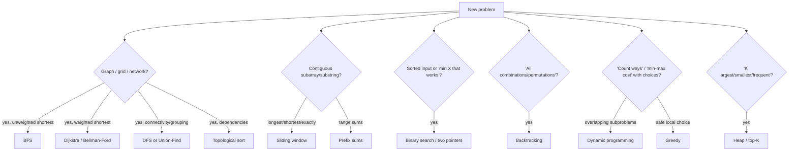

# Problem-Solving Patterns: From Problem Signals to the Right Technique

## 🧠 Intuition

By now you know the structures and paradigms. The meta-skill that separates "I studied DSA" from
"I can solve a new problem" is **pattern recognition**: reading a problem and *immediately*
shortlisting the technique it wants.

> 💡 The secret most strong problem-solvers share: they don't invent solutions from scratch. They
> recognize that a problem is *"a sliding-window problem"* or *"a DP problem"* from a few keywords,
> then adapt a template they already know. This page is the lookup table for that recognition.

Use it two ways: (1) when stuck, scan the **signals** column for words matching your problem;
(2) as a review checklist — for each pattern, can you recall its template and a sample problem?

## 📐 The Pattern Catalog

| Pattern | Signals in the problem | Go-to approach | Lesson |
|---------|------------------------|----------------|--------|
| **Two pointers** | sorted array; pair/triplet; "in place"; palindrome | one index from each end, or fast/slow | [link](../06-Algorithm-Paradigms/01.Two-Pointers-and-Sliding-Window.md) |
| **Sliding window** | *contiguous* subarray/substring; "longest/shortest/exactly k" | expand right, shrink left, track best | [link](../06-Algorithm-Paradigms/01.Two-Pointers-and-Sliding-Window.md) |
| **Prefix sums** | many range-sum queries; "subarray sums to k" | precompute cumulative; hash prefix values | [link](../06-Algorithm-Paradigms/02.Prefix-Sums.md) |
| **Hashing — "seen before"** | "has it appeared"; complements; dedupe | `HashSet`/`Dictionary` of seen items | [link](../01-Linear-Structures/06.Hash-Tables.md) |
| **Hashing — counting** | frequencies; anagrams; "top k frequent" | count map; bucket by count | [link](../01-Linear-Structures/06.Hash-Tables.md) |
| **Binary search** | sorted; "find position"; floor/ceiling | halve the range | [link](../05-Searching/02.Binary-Search.md) |
| **Binary search on answer** | "minimum/maximum X such that it works"; monotonic feasibility | search the answer space | [link](../05-Searching/02.Binary-Search.md) |
| **Stack** | matching/nesting; parsing; "valid" | push openers, pop on close | [link](../01-Linear-Structures/04.Stacks.md) |
| **Monotonic stack** | "next greater/smaller element"; spans | keep increasing/decreasing stack of indices | [link](../01-Linear-Structures/04.Stacks.md) |
| **Heap / top-K** | "k largest/smallest/closest/most frequent"; streaming median | size-k heap, or two heaps | [link](../02-Trees-and-Heaps/04.Heaps-and-Priority-Queues.md) |
| **BFS** | shortest path in *unweighted* graph/grid; "fewest steps"; level-order | queue, expand by rings | [link](../03-Graphs/02.BFS-and-DFS.md) |
| **DFS / flood fill** | connectivity; "number of islands/regions"; explore all | recursion/stack, mark visited | [link](../03-Graphs/02.BFS-and-DFS.md) |
| **Backtracking** | "all permutations/combinations/subsets"; constraint puzzles | choose → recurse → undo | [link](../06-Algorithm-Paradigms/04.Backtracking.md) |
| **Greedy** | "maximize/minimize" with a safe local choice; intervals | sort by the right key, sweep | [link](../06-Algorithm-Paradigms/05.Greedy.md) |
| **Dynamic programming** | "count ways"; "min/max cost"; overlapping subproblems; choices | define state → recurrence → memo/table | [link](../06-Algorithm-Paradigms/06.Dynamic-Programming.md) |
| **Topological sort** | dependencies; ordering; "course schedule" | Kahn's BFS / DFS finish order | [link](../03-Graphs/03.Topological-Sort.md) |
| **Union-Find** | "are these connected"; grouping; merging | DSU with path compression | [link](../02-Trees-and-Heaps/06.Union-Find-DSU.md) |
| **Shortest path (weighted)** | weighted graph; "cheapest/fastest route" | Dijkstra / Bellman-Ford | [link](../03-Graphs/04.Shortest-Paths.md) |
| **Trie** | prefix queries; autocomplete; word lists | prefix tree + DFS | [link](../02-Trees-and-Heaps/05.Tries.md) |
| **Divide & conquer** | "split in half"; sorting; combine sub-answers | recurse halves, combine | [link](../06-Algorithm-Paradigms/03.Divide-and-Conquer.md) |
| **Bit manipulation** | "appears once/twice"; subsets; toggles; powers of two | XOR, masks, bit tricks | [link](../00-Foundations/04.Bit-Manipulation.md) |

## 🧭 A Decision Flow

## 🎯 How to Practice Recognition

For each problem you attempt, **before coding**, write down:
1. What's the **input shape**? (sorted? graph? string? stream?)
2. What's being **asked**? (count / optimize / all solutions / shortest?)
3. Which **2–3 patterns** above match the signals?
4. What's the **brute force**, and which pattern reduces its complexity?

Doing this consciously for ~50 problems wires the recognition into reflex. The
[Study Plan](02.Study-Plan.md) sequences problems to build exactly this.

## 🚫 Common Traps

- **Jumping to code before identifying the pattern** — name the pattern first.
- **Forcing the first pattern you think of** — list 2–3 and pick the best fit.
- **Confusing greedy and DP** — if a local choice isn't provably safe, it's probably DP.
- **Missing the "binary search on the answer" disguise** — "minimum capacity/speed/size such
  that X works" is the tell.

## ✅ Key Takeaways

- Strong solvers **recognize** patterns, not memorize solutions.
- Map **problem signals → technique** using the catalog; shortlist 2–3, then choose.
- State the **brute force first**, then let the matching pattern guide the optimization.
- Practice the recognition step *explicitly* until it's automatic.

**Self-check:** For each, name the pattern:
1. "Longest substring with at most k distinct characters."
2. "Minimum number of conference rooms for these meetings."
3. "Number of ways to climb n stairs taking 1, 2, or 3 at a time."
4. "Cheapest flight from A to B with at most k stops."

*(Answers: sliding window; greedy/heap on intervals; DP; Bellman-Ford / shortest path with hop limit.)*

---
◀ Prev module: [07 — String Algorithms](../07-String-Algorithms/01.Pattern-Matching.md) · ▲ [Module index](README.md) · ▶ Next: [Study Plan](02.Study-Plan.md)
