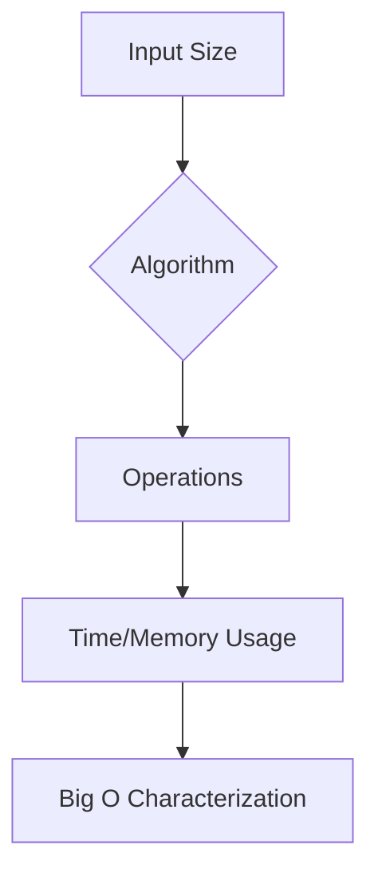

# Big O Notation: The Programmer's Efficiency Compass

## 🌌 What is Big O Notation?

**Big O** is a mathematical notation describing how algorithms **scale** as input size grows.  
It answers: _"How does runtime/memory usage grow when input size approaches infinity?"_

> 💡 **Analogy**: Imagine delivering packages:
>
> - **O(1)**: Same time whether delivering 1 or 1000 packages (magic teleportation)
> - **O(n)**: Time increases linearly (1 package/minute)
> - **O(n²)**: Time explodes (1 minute per package × number of destinations)

## 🔍 Why Developers Care

1. **Predict performance** at scale
2. **Compare algorithms** objectively
3. **Avoid bottlenecks** in critical paths
4. **Communicate efficiency** with team



## 🧮 Mathematical Foundation

For input size `n`:

- **T(n)** = Actual operations count
- **O(g(n))** = Set of functions with upper bound growth ≤ g(n)

**Formal Definition**:  
`T(n) ∈ O(g(n))` if ∃ positive constants `c` and `n₀` such that:  
`0 ≤ T(n) ≤ c·g(n)` for all `n ≥ n₀`

**Plain English**:  
"At large enough input sizes, T(n) grows no faster than g(n)"

---

## 🚀 Common Complexities (From Best to Worst)

### 1. O(1) - Constant Time

```csharp
// Array access by index
int GetFirstElement(int[] arr) => arr[0];
```

**Characteristics**:

- Same speed regardless of input size
- Examples: Hash table lookup, math operations

---

### 2. O(log n) - Logarithmic

```csharp
// Binary search
int BinarySearch(int[] sortedArr, int target)
{
    int left = 0, right = sortedArr.Length - 1;
    while (left <= right)
    {
        int mid = left + (right - left) / 2;
        if (sortedArr[mid] == target) return mid;
        if (sortedArr[mid] < target) left = mid + 1;
        else right = mid - 1;
    }
    return -1;
}
```

**Characteristics**:

- Halves problem size each step
- Common in divide-and-conquer algorithms
- Example: Binary search, balanced tree operations

---

### 3. O(n) - Linear

```csharp
// Simple loop
int SumArray(int[] arr)
{
    int sum = 0;
    foreach (int num in arr) sum += num;
    return sum;
}
```

**Characteristics**:

- Time scales 1:1 with input size
- Examples: Linear search, most simple loops

---

### 4. O(n log n) - Linearithmic

```csharp
// Merge Sort
void MergeSort(int[] arr)
{
    if (arr.Length <= 1) return;
    // Split, sort recursively, merge...
}
```

**Characteristics**:

- Common in efficient sorting algorithms
- Examples: Merge sort, heap sort, FFT

---

### 5. O(n²) - Quadratic

```csharp
// Nested loops
void BubbleSort(int[] arr)
{
    for (int i = 0; i < arr.Length; i++)
        for (int j = 0; j < arr.Length - 1; j++)
            if (arr[j] > arr[j + 1])
                Swap(arr, j, j + 1);
}
```

**Characteristics**:

- Common in naive sorting/searching
- Examples: Bubble sort, selection sort

---

### 6. O(2ⁿ) - Exponential

```csharp
// Recursive Fibonacci
int Fib(int n)
{
    if (n <= 1) return n;
    return Fib(n - 1) + Fib(n - 2);
}
```

**Characteristics**:

- Runtime doubles with each added element
- Examples: Brute-force solutions, some recursive algorithms

---

### 7. O(n!) - Factorial

```csharp
// Permutations
List<string> GeneratePermutations(string str)
{
    // Implementation with n! complexity
}
```

**Characteristics**:

- Worst complexity class
- Examples: Traveling salesman brute force

---

## 🧠 Key Concepts

### 1. Worst-Case Analysis

Big O describes **upper bound** (worst-case scenario):

```csharp
// Linear search: O(n) even if item is first
int LinearSearch(int[] arr, int target)
{
    foreach (int num in arr)
        if (num == target) return num;
    return -1;
}
```

### 2. Dominant Terms

Only keep the **fastest-growing term**:

```
T(n) = 3n³ + 2n² + 100n + 5 => O(n³)
```

### 3. Constants Don't Matter

```
O(5n) => O(n)
O(1000) => O(1)
```

### 4. Space Complexity

Same rules apply to **memory usage**:

```csharp
// O(n) space
int[] DuplicateArray(int[] arr)
{
    int[] copy = new int[arr.Length];
    Array.Copy(arr, copy, arr.Length);
    return copy;
}
```

---

## 🔧 How to Calculate Big O

### Simplification Rules

1. **Drop constants**  
   `O(2n)` → `O(n)`

2. **Drop non-dominant terms**  
   `O(n² + n)` → `O(n²)`

3. **Different variables for different inputs**  
   `O(n + m)` remains if n and m are independent

### Analysis Steps

1. **Identify input size(s)**
2. **Count primitive operations**
3. **Express as function of input size**
4. **Simplify using Big O rules**

---

## 🚫 Common Mistakes

### 1. Confusing Worst/Best Case

```csharp
// Best case O(1), worst case O(n)
int FindIndex(int[] arr, int target)
{
    for (int i = 0; i < arr.Length; i++)
        if (arr[i] == target) return i;
    return -1;
}
```

### 2. Ignoring Hidden Complexities

```csharp
// O(n²) because string concatenation is O(n)
string BuildString(string[] parts)
{
    string result = "";
    foreach (string part in parts) // O(n)
        result += part; // O(n) per operation
    return result;
}
```

### 3. Overlooking Recursion

```csharp
// O(2^n) time, O(n) space
int Fibonacci(int n)
{
    return n <= 1 ? n : Fibonacci(n-1) + Fibonacci(n-2);
}
```

---

## 🏆 Best Practices

1. **Profile before optimizing**  
   Big O matters most at large scales

2. **Space-time tradeoffs**  
   Use more memory to reduce runtime (e.g., caching)

3. **Consider average cases**  
   Hash tables have O(1) average case but O(n) worst case

---

## 🧪 Real-World Case Studies

### Case 1: Array vs Hash Table

| Operation | Array | Hash Table |
| --------- | ----- | ---------- |
| Access    | O(1)  | O(1)       |
| Search    | O(n)  | O(1)       |
| Insert    | O(n)  | O(1)       |

### Case 2: Sorting Algorithms

| Algorithm  | Best       | Average    | Worst      | Space    |
| ---------- | ---------- | ---------- | ---------- | -------- |
| QuickSort  | O(n log n) | O(n log n) | O(n²)      | O(log n) |
| MergeSort  | O(n log n) | O(n log n) | O(n log n) | O(n)     |
| BubbleSort | O(n)       | O(n²)      | O(n²)      | O(1)     |

---

## 📚 Key Takeaways

1. **Focus on growth rate** - not absolute times
2. **Worst-case matters** for critical systems
3. **Constants become irrelevant** at scale
4. **Space complexity** is equally important

---

## 🧰 Big O Cheat Sheet

| Complexity | Name         | Example             |
| ---------- | ------------ | ------------------- |
| O(1)       | Constant     | Array access        |
| O(log n)   | Logarithmic  | Binary search       |
| O(n)       | Linear       | Simple loop         |
| O(n log n) | Linearithmic | Merge sort          |
| O(n²)      | Quadratic    | Bubble sort         |
| O(2ⁿ)      | Exponential  | Recursive Fibonacci |
| O(n!)      | Factorial    | Permutations        |

> ⚠️ **Remember**: Algorithm choice depends on your **specific use case** and **data size**!
