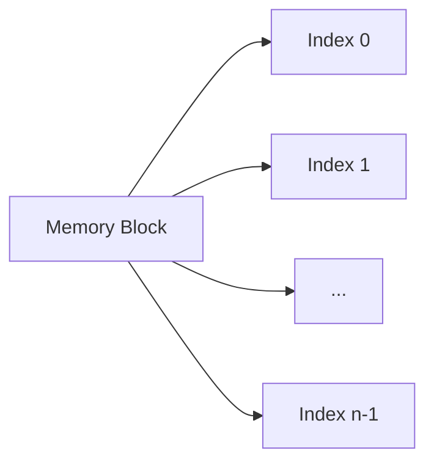
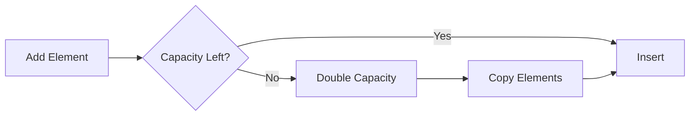

# Arrays: The Foundation of Data Structures

## 🧱 What is an Array?

A **contiguous block of memory** storing elements of the **same type** with:

- **Zero-based indexing** (usually)
- **Fixed capacity** (static arrays)
- **Random access** in constant time



## 🏆 Key Features

1. **Homogeneous Elements**: All elements same type
2. **Constant Access Time**: O(1) for any index
3. **Cache Friendly**: Sequential memory → better performance
4. **Fixed Size**: (Unless using dynamic arrays)

---

## 🔢 Array Types

### 1. Static Arrays

```csharp
// C# Declaration
int[] numbers = new int[5]; // Fixed size of 5
```

### 2. Dynamic Arrays (List<T> in C#)

```csharp
List<int> dynamicNumbers = new List<int>();
dynamicNumbers.Add(10); // Automatically resizes
```

### 3. Multi-dimensional

```csharp
int[,] matrix = new int[3,4]; // 3 rows, 4 columns
```

### 4. Jagged Arrays (Array of arrays)

```csharp
int[][] jagged = new int[3][];
jagged[0] = new int[2];
jagged[1] = new int[3];
```

---

## ⚙️ Core Operations & Complexities

| Operation       | Static Array | Dynamic Array | Code Example                  |
| --------------- | ------------ | ------------- | ----------------------------- |
| Access          | O(1)         | O(1)          | `arr[3]`                      |
| Search          | O(n)         | O(n)          | Linear/Binary search          |
| Insert (end)    | N/A          | O(1)\*        | `list.Add(item)`              |
| Insert (middle) | O(n)         | O(n)          | Shift elements                |
| Delete (end)    | N/A          | O(1)          | `list.RemoveAt(list.Count-1)` |
| Delete (middle) | O(n)         | O(n)          | Shift elements                |
| Resize          | N/A          | O(n)          | Internal capacity doubling    |

\*Amortized constant time for dynamic arrays

---

## 🚀 Performance Optimization

### 1. Cache Locality

```csharp
// Good: Sequential access
for (int i = 0; i < arr.Length; i++)
    sum += arr[i];

// Bad: Random access (cache misses)
int[] indices = GetRandomIndices();
foreach (int i in indices)
    sum += arr[i];
```

### 2. Batch Operations

```csharp
// Copy entire blocks
Array.Copy(source, dest, length);
```

### 3. Pre-allocation

```csharp
// For dynamic arrays
List<int> list = new List<int>(1000); // Initial capacity
```

---

## 🧩 Common Algorithms

### 1. Binary Search (O(log n))

```csharp
int BinarySearch(int[] arr, int target)
{
    int left = 0, right = arr.Length - 1;
    while (left <= right)
    {
        int mid = left + (right - left) / 2;
        if (arr[mid] == target) return mid;
        if (arr[mid] < target) left = mid + 1;
        else right = mid - 1;
    }
    return -1;
}
```

### 2. Two Pointers Technique

```csharp
// Remove duplicates from sorted array
int RemoveDuplicates(int[] nums)
{
    if (nums.Length == 0) return 0;
    int unique = 0;
    for (int i = 1; i < nums.Length; i++)
        if (nums[i] != nums[unique])
            nums[++unique] = nums[i];
    return unique + 1;
}
```

---

## 🚨 Common Mistakes

### 1. Off-by-One Errors

```csharp
// Wrong
for (int i = 0; i <= arr.Length; i++)

// Right
for (int i = 0; i < arr.Length; i++)
```

### 2. Shallow Copying

```csharp
int[] original = {1, 2, 3};
int[] copy = original; // Same reference!
copy[0] = 100; // Modifies both arrays

// Solution: Deep copy
int[] realCopy = new int[original.Length];
Array.Copy(original, realCopy, original.Length);
```

### 3. Capacity Overflow

```csharp
List<int> list = new List<int>();
for (int i = 0; i < 1_000_000; i++)
    list.Add(i); // Multiple resizes → O(n) cost

// Better: Pre-allocate
List<int> optimized = new List<int>(1_000_000);
```

---

## 🌍 Real-World Applications

1. **Image Processing**: Pixel buffer as 2D array
2. **Game Development**: Inventory systems
3. **Machine Learning**: Feature vectors
4. **Database Systems**: Row storage
5. **Operating Systems**: Process tables

---

## 🔄 Dynamic Arrays Internals

### Resizing Strategy (C# List<T>)

1. Initial capacity: 0-4 elements
2. When full: Double capacity
3. Copy elements to new array
4. Amortized O(1) add operation



---

## 🏋️ Practice Problems

1. **Easy**: [Two Sum](https://leetcode.com/problems/two-sum/)
2. **Medium**: [Rotate Array](https://leetcode.com/problems/rotate-array/)
3. **Hard**: [Sliding Window Maximum](https://leetcode.com/problems/sliding-window-maximum/)
4. **Classic**: [Merge Sorted Arrays](https://leetcode.com/problems/merge-sorted-array/)

---

## 📚 Key Takeaways

1. **Fast Access**: Best choice for index-based operations
2. **Memory Efficient**: No per-element overhead
3. **Fixed vs Dynamic**: Choose based on use case
4. **Algorithm Basis**: Foundation for matrices, heaps, etc.

> "Arrays are the building blocks of efficient algorithms." - Unnamed CS Professor
