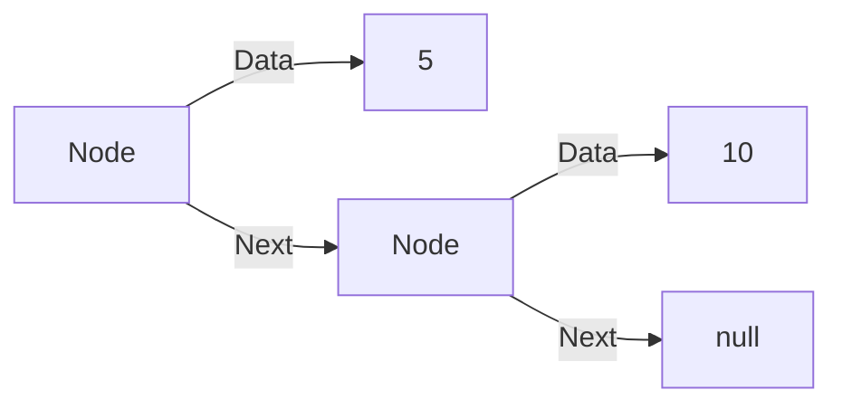
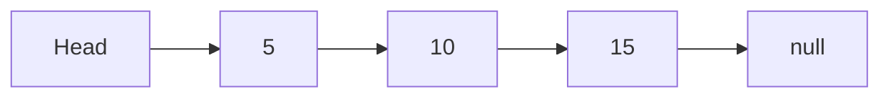
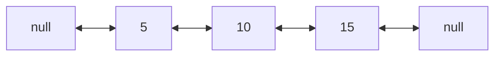
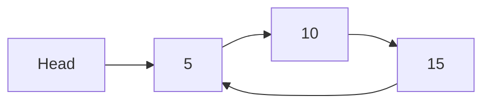
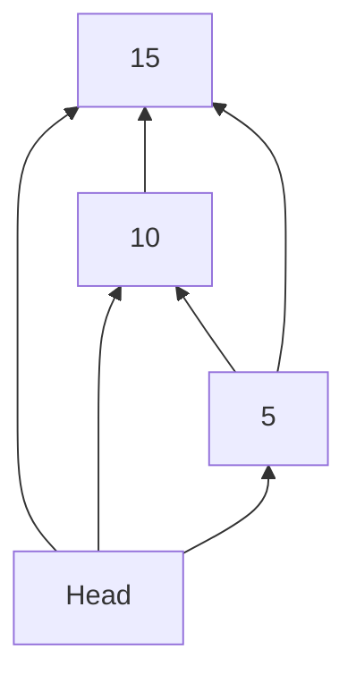

# Linked Lists: The Flexible Chain of Data

## 🧠 What is a Linked List?

A linear data structure where elements are stored in **nodes** containing:

- **Data** field
- **Pointer** to next node (and previous in doubly linked)



## 🆚 Linked Lists vs Arrays

| Feature            | Array      | Linked List    |
| ------------------ | ---------- | -------------- |
| **Memory**         | Contiguous | Non-contiguous |
| **Size**           | Fixed      | Dynamic        |
| **Insert/Delete**  | O(n)       | O(1) at head   |
| **Access**         | O(1)       | O(n)           |
| **Cache Friendly** | Yes        | No             |

---

## 🔗 Types of Linked Lists

### 1. Singly Linked List



### 2. Doubly Linked List



### 3. Circular Linked List



---

## ⚙️ Core Operations & Complexities

| Operation       | Time   | Code Example              |
| --------------- | ------ | ------------------------- |
| Insert at head  | O(1)   | `Prepend(value)`          |
| Insert at tail  | O(1)\* | `Append(value)`           |
| Delete at head  | O(1)   | `RemoveFirst()`           |
| Delete by value | O(n)   | Traverse + pointer update |
| Search          | O(n)   | Linear traversal          |
| Access by index | O(n)   | Traverse to position      |

\*O(1) if maintaining tail pointer

---

## 🧩 Common Algorithms

### 1. Reverse a Linked List

```csharp
public void Reverse()
{
    Node prev = null;
    Node current = Head;
    while (current != null)
    {
        Node next = current.Next;
        current.Next = prev;
        prev = current;
        current = next;
    }
    Head = prev;
}
```

### 2. Detect Cycle (Floyd's Algorithm)

```csharp
public bool HasCycle()
{
    Node slow = Head;
    Node fast = Head;

    while (fast != null && fast.Next != null)
    {
        slow = slow.Next;
        fast = fast.Next.Next;

        if (slow == fast) return true;
    }
    return false;
}
```

---

## 🚀 C# Implementation

### Node Class

```csharp
public class Node<T>
{
    public T Data { get; set; }
    public Node<T> Next { get; set; }

    public Node(T data)
    {
        Data = data;
        Next = null;
    }
}
```

### Linked List Class

```csharp
public class LinkedList<T>
{
    private Node<T> Head { get; set; }

    public void Prepend(T data)
    {
        Node<T> newNode = new Node<T>(data);
        newNode.Next = Head;
        Head = newNode;
    }

    public void Append(T data)
    {
        Node<T> newNode = new Node<T>(data);

        if (Head == null)
        {
            Head = newNode;
            return;
        }

        Node<T> current = Head;
        while (current.Next != null)
        {
            current = current.Next;
        }
        current.Next = newNode;
    }

    public void Delete(T data)
    {
        if (Head == null) return;

        if (Head.Data.Equals(data))
        {
            Head = Head.Next;
            return;
        }

        Node<T> current = Head;
        while (current.Next != null)
        {
            if (current.Next.Data.Equals(data))
            {
                current.Next = current.Next.Next;
                return;
            }
            current = current.Next;
        }
    }
}
```

---

## 🚫 Common Mistakes

### 1. Null Reference Exceptions

```csharp
// Wrong
while (current != null)
{
    Console.WriteLine(current.Data);
    current = current.Next.Next; // May access null.Next
}

// Correct
while (current != null)
{
    Console.WriteLine(current.Data);
    current = current.Next;
}
```

### 2. Memory Leaks (in unmanaged code)

```csharp
// In C++ you need to manually delete nodes
// In C# GC handles it, but be careful with:
public void Clear()
{
    while (Head != null)
    {
        var temp = Head;
        Head = Head.Next;
        temp.Next = null; // Help GC
    }
}
```

### 3. Losing References

```csharp
// Wrong: Loses the list
Head = Head.Next;

// Correct: Use temporary variables
Node temp = Head;
Head = Head.Next;
temp.Next = null;
```

---

## 🌍 Real-World Applications

1. **Music Playlist**: Navigate next/previous tracks
2. **Browser History**: Back/forward navigation
3. **Undo/Redo**: State management in editors
4. **Memory Management**: OS memory allocation
5. **Blockchain**: Connecting transaction blocks

---

## 🔄 Advanced Variations

### 1. Skip List



### 2. XOR Linked List

- Stores XOR of previous and next addresses
- Memory efficient (one pointer instead of two)
- Complex implementation

---

## 🏋️ Practice Problems

1. **Easy**: [Reverse Linked List](https://leetcode.com/problems/reverse-linked-list/)
2. **Medium**: [Add Two Numbers](https://leetcode.com/problems/add-two-numbers/)
3. **Hard**: [Merge k Sorted Lists](https://leetcode.com/problems/merge-k-sorted-lists/)
4. **Classic**: [LRU Cache](https://leetcode.com/problems/lru-cache/)

---

## 📚 Key Takeaways

1. **Dynamic Size**: Grow/shrink as needed
2. **Efficient Modifications**: O(1) at head
3. **Sequential Access**: No random access
4. **Memory Overhead**: Extra pointer storage
5. **Foundation for**: Stacks, Queues, Graphs

> "Linked lists teach us that sometimes flexibility is worth the overhead." - Anonymous Engineer
