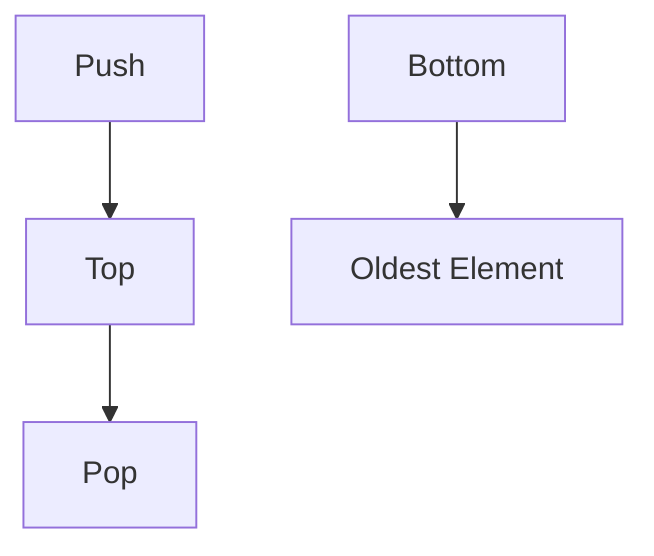

# Stacks: The LIFO Powerhouse

## 🥞 What is a Stack?

A linear data structure following **LIFO** (Last In, First Out) principle.  
Think of it like a stack of cafeteria trays:

- Last tray placed → First tray taken
- Core operations: Push, Pop, Peek



## 🏆 Key Features

1. **LIFO Operations**: Last element added is first removed
2. **O(1) Time Complexity** for core operations
3. **Dynamic Size** (when implemented with linked lists)
4. **No Random Access**: Can only interact with top element

---

## ⚙️ Core Operations & Complexities

| Operation | Description              | Time Complexity | Code Example       |
| --------- | ------------------------ | --------------- | ------------------ |
| Push      | Add to top               | O(1)            | `stack.Push(10)`   |
| Pop       | Remove from top          | O(1)            | `stack.Pop()`      |
| Peek/Top  | View top without removal | O(1)            | `stack.Peek()`     |
| IsEmpty   | Check if stack is empty  | O(1)            | `stack.Count == 0` |

---

## 🚀 C# Implementations

### 1. Array-Based Stack

```csharp
public class ArrayStack<T>
{
    private T[] _items;
    private int _top = -1;

    public ArrayStack(int capacity = 10)
    {
        _items = new T[capacity];
    }

    public void Push(T item)
    {
        if (_top == _items.Length - 1)
            Array.Resize(ref _items, _items.Length * 2);

        _items[++_top] = item;
    }

    public T Pop()
    {
        if (_top == -1)
            throw new InvalidOperationException("Stack underflow");

        return _items[_top--];
    }

    public T Peek() => _top >= 0 ? _items[_top] : throw new InvalidOperationException();
    public bool IsEmpty => _top == -1;
}
```

### 2. Linked List-Based Stack

```csharp
public class LinkedListStack<T>
{
    private class Node
    {
        public T Data { get; }
        public Node Next { get; set; }

        public Node(T data) => Data = data;
    }

    private Node _top;

    public void Push(T item)
    {
        Node newNode = new Node(item)
        {
            Next = _top
        };
        _top = newNode;
    }

    public T Pop()
    {
        if (_top == null)
            throw new InvalidOperationException("Stack underflow");

        T data = _top.Data;
        _top = _top.Next;
        return data;
    }

    public T Peek() => _top != null ? _top.Data : throw new InvalidOperationException();
    public bool IsEmpty => _top == null;
}
```

---

## 🧩 Common Algorithms

### 1. Parenthesis Matching

```csharp
bool IsBalanced(string expression)
{
    Stack<char> stack = new Stack<char>();
    foreach (char c in expression)
    {
        if (c == '(' || c == '{' || c == '[')
            stack.Push(c);
        else
        {
            if (stack.Count == 0) return false;
            char top = stack.Pop();
            if ((c == ')' && top != '(') ||
                (c == '}' && top != '{') ||
                (c == ']' && top != '['))
                return false;
        }
    }
    return stack.Count == 0;
}
```

### 2. Reverse a String

```csharp
string ReverseString(string input)
{
    Stack<char> stack = new Stack<char>();
    foreach (char c in input)
        stack.Push(c);

    return string.Concat(stack);
}
```

### 3. Postfix Evaluation

```csharp
int EvaluatePostfix(string expression)
{
    Stack<int> stack = new Stack<int>();
    foreach (char c in expression)
    {
        if (char.IsDigit(c))
            stack.Push(c - '0');
        else
        {
            int b = stack.Pop();
            int a = stack.Pop();
            stack.Push(c switch
            {
                '+' => a + b,
                '-' => a - b,
                '*' => a * b,
                '/' => a / b,
                _ => throw new ArgumentException()
            });
        }
    }
    return stack.Pop();
}
```

---

## 🌍 Real-World Applications

1. **Undo/Redo Functionality**: Stack of states
2. **Browser History**: Back button implementation
3. **Call Stack**: Function execution tracking
4. **Expression Evaluation**: Compiler operations
5. **Backtracking Algorithms**: Maze solving

---

## 🚫 Common Mistakes

### 1. Stack Underflow

```csharp
// Always check before Pop()
if (stack.IsEmpty)
    throw new InvalidOperationException();
```

### 2. Ignoring Capacity Limits

```csharp
// Array-based implementation needs resizing
if (_top == _items.Length - 1)
    Array.Resize(ref _items, _items.Length * 2);
```

### 3. Wrong Data Structure Choice

```csharp
// Need FIFO? Use Queue instead!
var queue = new Queue<int>();
```

### 4. Recursion Depth

```csharp
// Deep recursion → StackOverflowException
void InfiniteRecursion() => InfiniteRecursion();
```

---

## 📊 Performance Considerations

| Implementation | Push   | Pop  | Memory  | Use Case                 |
| -------------- | ------ | ---- | ------- | ------------------------ |
| Array          | O(1)\* | O(1) | Fixed   | Known maximum size       |
| Linked List    | O(1)   | O(1) | Dynamic | Frequent resizing needed |

\*Amortized O(1) due to occasional resizing

---

## 🏋️ Practice Problems

1. **Easy**: [Valid Parentheses](https://leetcode.com/problems/valid-parentheses/)
2. **Medium**: [Min Stack](https://leetcode.com/problems/min-stack/)
3. **Hard**: [Largest Rectangle in Histogram](https://leetcode.com/problems/largest-rectangle-in-histogram/)
4. **Classic**: [Tower of Hanoi](https://en.wikipedia.org/wiki/Tower_of_Hanoi)

---

## 📚 Key Takeaways

1. **LIFO Principle**: Last in, first out
2. **Essential Operations**: Push, Pop, Peek
3. **Implementation Choices**: Array vs Linked List
4. **Algorithm Foundation**: Crucial for DFS, backtracking
5. **Memory Management**: Watch for overflow/underflow

> "Stacks are the silent workhorses of computer science." - Anonymous
