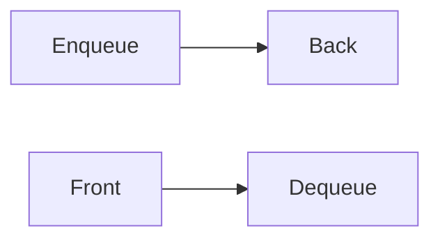
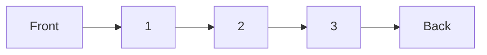
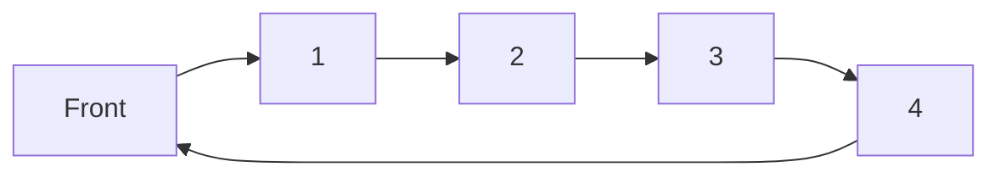
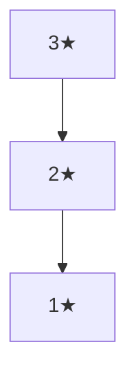
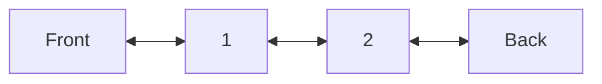

# Queues: The FIFO Workhorse

## 🚶 What is a Queue?

A linear data structure following **FIFO** (First In, First Out) principle.  
Think of it like a line at a grocery store:

- First person in line → First served
- Core operations: Enqueue (add), Dequeue (remove)



## 🆚 vs Stacks

| Feature        | Queue            | Stack     |
| -------------- | ---------------- | --------- |
| **Order**      | FIFO             | LIFO      |
| **Operations** | Enqueue/Dequeue  | Push/Pop  |
| **Use Cases**  | Order processing | Undo/Redo |
| **Access**     | Front/Back       | Top only  |

---

## 🚪 Types of Queues

### 1. Simple Queue



### 2. Circular Queue



### 3. Priority Queue



### 4. Deque (Double-Ended Queue)



---

## ⚙️ Core Operations & Complexities

| Operation | Description                | Time Complexity | Code Example        |
| --------- | -------------------------- | --------------- | ------------------- |
| Enqueue   | Add to back                | O(1)            | `queue.Enqueue(10)` |
| Dequeue   | Remove from front          | O(1)            | `queue.Dequeue()`   |
| Peek      | View front without removal | O(1)            | `queue.Peek()`      |
| IsEmpty   | Check if empty             | O(1)            | `queue.Count == 0`  |

---

## 🚀 C# Implementations

### 1. Array-Based Queue

```csharp
public class ArrayQueue<T>
{
    private T[] _items;
    private int _front;
    private int _rear;
    private int _count;

    public ArrayQueue(int capacity = 10)
    {
        _items = new T[capacity];
        _front = 0;
        _rear = -1;
    }

    public void Enqueue(T item)
    {
        if (_count == _items.Length)
            Array.Resize(ref _items, _items.Length * 2);

        _rear = (_rear + 1) % _items.Length;
        _items[_rear] = item;
        _count++;
    }

    public T Dequeue()
    {
        if (_count == 0)
            throw new InvalidOperationException("Queue underflow");

        T item = _items[_front];
        _front = (_front + 1) % _items.Length;
        _count--;
        return item;
    }

    public T Peek() => _count > 0 ? _items[_front] : throw new InvalidOperationException();
    public int Count => _count;
}
```

### 2. Linked List-Based Queue

```csharp
public class LinkedListQueue<T>
{
    private class Node
    {
        public T Data { get; }
        public Node Next { get; set; }
        public Node(T data) => Data = data;
    }

    private Node _front;
    private Node _rear;

    public void Enqueue(T item)
    {
        Node newNode = new Node(item);

        if (_rear == null)
        {
            _front = _rear = newNode;
        }
        else
        {
            _rear.Next = newNode;
            _rear = newNode;
        }
    }

    public T Dequeue()
    {
        if (_front == null)
            throw new InvalidOperationException("Queue underflow");

        T data = _front.Data;
        _front = _front.Next;

        if (_front == null)
            _rear = null;

        return data;
    }

    public T Peek() => _front != null ? _front.Data : throw new InvalidOperationException();
    public bool IsEmpty => _front == null;
}
```

---

## 🧩 Common Algorithms

### 1. Breadth-First Search (BFS)

```csharp
void BFS(Node root)
{
    Queue<Node> queue = new Queue<Node>();
    queue.Enqueue(root);
    root.Visited = true;

    while (queue.Count > 0)
    {
        Node current = queue.Dequeue();
        Console.WriteLine(current.Value);

        foreach (Node neighbor in current.Neighbors)
        {
            if (!neighbor.Visited)
            {
                neighbor.Visited = true;
                queue.Enqueue(neighbor);
            }
        }
    }
}
```

### 2. Implement Queue using Stacks

```csharp
public class StackQueue<T>
{
    private Stack<T> _input = new Stack<T>();
    private Stack<T> _output = new Stack<T>();

    public void Enqueue(T item) => _input.Push(item);

    public T Dequeue()
    {
        if (_output.Count == 0)
            while (_input.Count > 0)
                _output.Push(_input.Pop());

        return _output.Pop();
    }
}
```

### 3. Recent Counter

```csharp
public class RecentCounter
{
    private Queue<int> _requests = new Queue<int>();

    public int Ping(int t)
    {
        _requests.Enqueue(t);
        while (_requests.Peek() < t - 3000)
            _requests.Dequeue();
        return _requests.Count;
    }
}
```

---

## 🌍 Real-World Applications

1. **Task Scheduling**: CPU process scheduling
2. **Order Processing**: Restaurant ticket systems
3. **Buffering**: Network packet handling
4. **Print Spooling**: Printer job management
5. **Message Brokers**: RabbitMQ, Kafka

---

## 🚫 Common Mistakes

### 1. Queue Underflow

```csharp
// Always check before Dequeue()
if (queue.IsEmpty)
    throw new InvalidOperationException();
```

### 2. Improper Circular Queue Handling

```csharp
// Correct index calculation
_rear = (_rear + 1) % _items.Length;
```

### 3. Priority Queue Misuse

```csharp
// Not suitable for strict FIFO needs
var pq = new PriorityQueue<string, int>();
```

### 4. Thread Safety Issues

```csharp
// Use ConcurrentQueue for multithreading
var safeQueue = new ConcurrentQueue<int>();
```

---

## 📊 Performance Considerations

| Implementation | Enqueue  | Dequeue  | Memory  | Use Case           |
| -------------- | -------- | -------- | ------- | ------------------ |
| Array          | O(1)\*   | O(1)     | Fixed   | Bounded size needs |
| Linked List    | O(1)     | O(1)     | Dynamic | Frequent resizing  |
| Priority Heap  | O(log n) | O(log n) | Dynamic | Ordered processing |

\*Amortized O(1) for dynamic array resizing

---

## 🏋️ Practice Problems

1. **Easy**: [Implement Queue using Stacks](https://leetcode.com/problems/implement-queue-using-stacks/)
2. **Medium**: [Binary Tree Level Order Traversal](https://leetcode.com/problems/binary-tree-level-order-traversal/)
3. **Hard**: [Sliding Window Maximum](https://leetcode.com/problems/sliding-window-maximum/)
4. **Classic**: [Josephus Problem](https://en.wikipedia.org/wiki/Josephus_problem)

---

## 📚 Key Takeaways

1. **FIFO Principle**: First in, first out
2. **Essential Operations**: Enqueue, Dequeue, Peek
3. **Variety of Types**: Circular, Priority, Deque
4. **Algorithm Foundation**: Crucial for BFS, caching
5. **Concurrency Needs**: Use thread-safe versions

> "Queues are the organized to-do lists of computer science." - Anonymous
