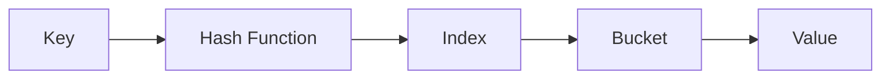

# Hash Tables: The Key-Value Powerhouse

## 🗝️ What is a Hash Table?

A data structure implementing associative arrays via:

- **Key-value pairs**
- **Hash function** mapping keys to buckets
- **Collision resolution** strategies



## 🏆 Key Features

1. **Average O(1)** operations (insert, delete, search)
2. **Dynamic resizing** maintains performance
3. **Collision handling** via chaining/open addressing
4. **Unordered collection** (order not guaranteed)

---

## 🆚 vs Other Structures

| Feature        | Hash Table    | List            | Array           |
| -------------- | ------------- | --------------- | --------------- |
| **Access**     | By key (O(1)) | By index (O(1)) | By index (O(1)) |
| **Search**     | O(1) average  | O(n)            | O(n)            |
| **Order**      | Not preserved | Preserved       | Preserved       |
| **Duplicates** | Unique keys   | Allowed         | Allowed         |

---

## 🚀 C# Implementations

### 1. Built-in Dictionary<TKey,TValue>

```csharp
// Declaration
Dictionary<string, int> ages = new()
{
    ["Alice"] = 30,
    ["Bob"] = 25
};

// Add/Update
ages["Charlie"] = 28; // Insert
ages["Alice"] = 31;   // Update

// Access
if (ages.TryGetValue("Bob", out int bobAge))
    Console.WriteLine($"Bob's age: {bobAge}");

// Remove
ages.Remove("Charlie");

// Iterate
foreach (var kvp in ages)
    Console.WriteLine($"{kvp.Key}: {kvp.Value}");
```

### 2. Built-in HashSet<T>

```csharp
HashSet<string> uniqueNames = new();

// Add
uniqueNames.Add("Alice");
bool added = uniqueNames.Add("Alice"); // false

// Contains
if (uniqueNames.Contains("Bob"))
    Console.WriteLine("Bob exists");

// Set operations
var otherSet = new HashSet<string> { "Alice", "Charlie" };
uniqueNames.UnionWith(otherSet);
```

### 3. Custom Hash Table Implementation

```csharp
public class CustomHashTable<TKey, TValue>
{
    private const int InitialCapacity = 16;
    private const double LoadFactorThreshold = 0.75;

    private LinkedList<KeyValuePair<TKey, TValue>>[] _buckets;
    private int _count;

    public CustomHashTable()
    {
        _buckets = new LinkedList<KeyValuePair<TKey, TValue>>[InitialCapacity];
    }

    public void Add(TKey key, TValue value)
    {
        if (++_count > _buckets.Length * LoadFactorThreshold)
            Resize();

        int index = GetBucketIndex(key);
        _buckets[index] ??= new LinkedList<KeyValuePair<TKey, TValue>>();

        var bucket = _buckets[index];
        foreach (var pair in bucket)
        {
            if (pair.Key.Equals(key))
                throw new ArgumentException("Duplicate key");
        }

        bucket.AddLast(new KeyValuePair<TKey, TValue>(key, value));
    }

    public bool TryGetValue(TKey key, out TValue value)
    {
        int index = GetBucketIndex(key);
        var bucket = _buckets[index];

        if (bucket != null)
        {
            foreach (var pair in bucket)
            {
                if (pair.Key.Equals(key))
                {
                    value = pair.Value;
                    return true;
                }
            }
        }

        value = default;
        return false;
    }

    private int GetBucketIndex(TKey key)
    {
        int hashCode = key.GetHashCode() & 0x7FFFFFFF; // Ensure positive
        return hashCode % _buckets.Length;
    }

    private void Resize()
    {
        var oldBuckets = _buckets;
        _buckets = new LinkedList<KeyValuePair<TKey, TValue>>[oldBuckets.Length * 2];
        _count = 0;

        foreach (var bucket in oldBuckets)
        {
            if (bucket == null) continue;

            foreach (var pair in bucket)
            {
                Add(pair.Key, pair.Value);
            }
        }
    }
}
```

---

## 🧩 Common Algorithms

### 1. Two Sum

```csharp
int[] TwoSum(int[] nums, int target)
{
    Dictionary<int, int> seen = new();

    for (int i = 0; i < nums.Length; i++)
    {
        int complement = target - nums[i];
        if (seen.TryGetValue(complement, out int index))
            return new[] { index, i };

        seen[nums[i]] = i;
    }
    return Array.Empty<int>();
}
```

### 2. First Unique Character

```csharp
int FirstUniqChar(string s)
{
    Dictionary<char, int> counts = new();

    foreach (char c in s)
        counts[c] = counts.ContainsKey(c) ? counts[c] + 1 : 1;

    for (int i = 0; i < s.Length; i++)
        if (counts[s[i]] == 1) return i;

    return -1;
}
```

### 3. Group Anagrams

```csharp
IList<IList<string>> GroupAnagrams(string[] strs)
{
    Dictionary<string, List<string>> groups = new();

    foreach (string s in strs)
    {
        char[] chars = s.ToCharArray();
        Array.Sort(chars);
        string key = new string(chars);

        if (!groups.ContainsKey(key))
            groups[key] = new List<string>();

        groups[key].Add(s);
    }

    return new List<IList<string>>(groups.Values);
}
```

---

## 🌍 Real-World Applications

1. **Database Indexing**: Quick record lookup
2. **Caching Systems**: Memoization, Redis
3. **Compiler Symbol Tables**: Variable tracking
4. **Routers**: MAC address tables
5. **Distributed Systems**: Consistent hashing

---

## 🚫 Common Mistakes

### 1. Mutable Keys

```csharp
Dictionary<List<int>, string> badDict; // List is mutable!
// Use immutable types as keys:
Dictionary<string, int> goodDict;
```

### 2. Hash Collisions

```csharp
// Bad hash function leads to collisions
public override int GetHashCode() => 1; // All objects same bucket
```

### 3. Thread Safety

```csharp
// Regular Dictionary isn't thread-safe
var concurrentDict = new ConcurrentDictionary<string, int>();
```

### 4. Null Handling

```csharp
var dict = new Dictionary<string, int>();
// dict["missing"] throws KeyNotFoundException
if (dict.ContainsKey("missing"))
    var value = dict["missing"];
```

---

## 📊 Performance Considerations

| Factor           | Impact                     | Solution                     |
| ---------------- | -------------------------- | ---------------------------- |
| **Load Factor**  | High → More collisions     | Automatic resizing           |
| **Hash Quality** | Poor → Clustering          | Good hash function           |
| **Collisions**   | Degrades to O(n)           | Balanced resizing strategy   |
| **Bucket Size**  | Large chains → Slow access | Optimized collision handling |

---

## 🏋️ Practice Problems

1. **Easy**: [Two Sum](https://leetcode.com/problems/two-sum/)
2. **Medium**: [LRU Cache](https://leetcode.com/problems/lru-cache/)
3. **Hard**: [Design HashMap](https://leetcode.com/problems/design-hashmap/)
4. **Classic**: [Implement Rabin-Karp](https://en.wikipedia.org/wiki/Rabin–Karp_algorithm)

---

## 📚 Key Takeaways

1. **Fast Access**: Average O(1) operations
2. **Collision Handling**: Critical for performance
3. **Dynamic Nature**: Automatically resizes
4. **C# Implementations**: `Dictionary`, `HashSet`, `ConcurrentDictionary`
5. **Proper Usage**: Immutable keys, good hash functions

> "Hash tables are the Swiss Army knife of data structures." - Programming Proverb
