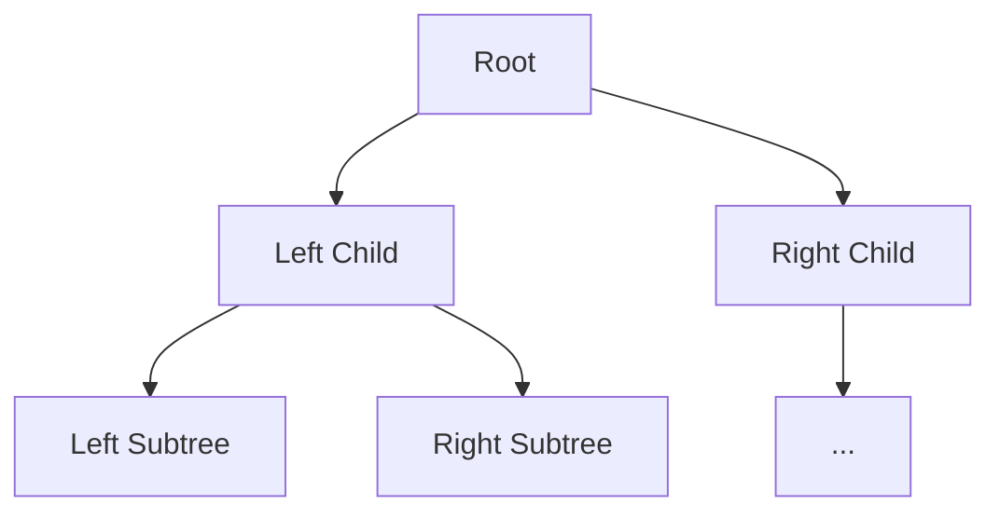
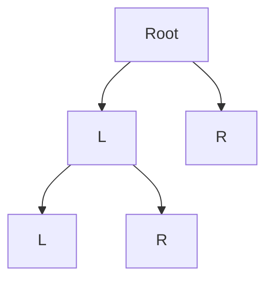
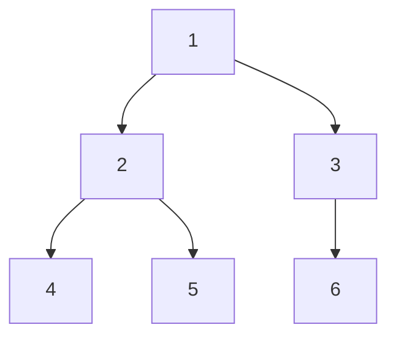
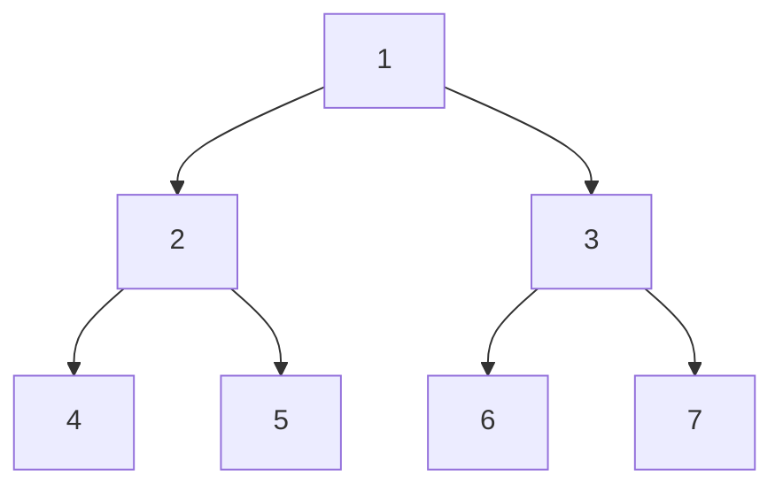
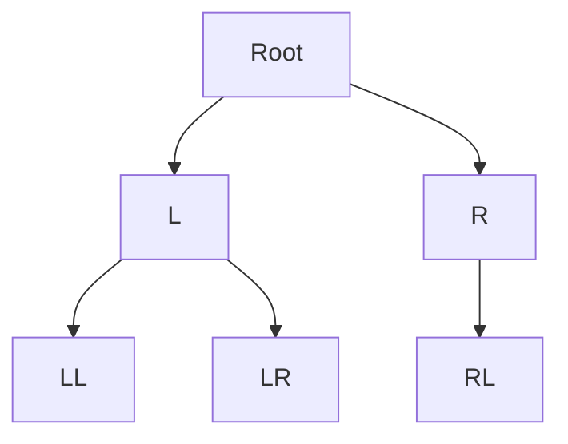
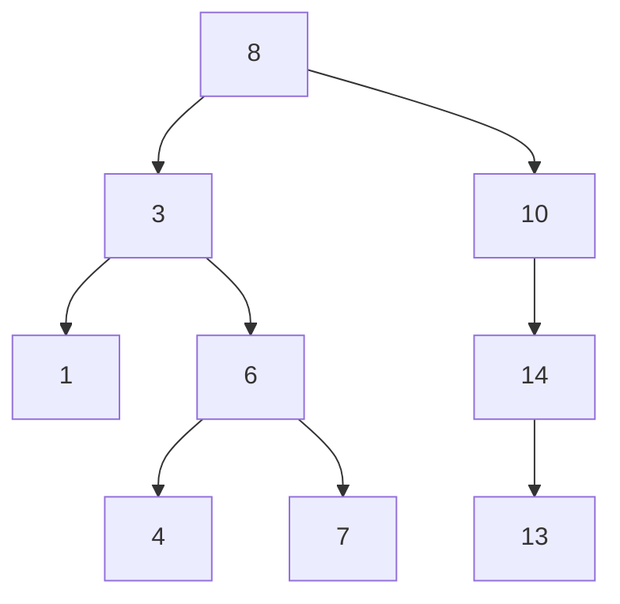

# Binary Trees: The Hierarchical Data Structure

## 🌳 What is a Binary Tree?

A hierarchical data structure where each node has:

- **Value**: Stored data
- **Left Child**: Reference to left subtree
- **Right Child**: Reference to right subtree
- **Parent**: Optional reference to parent node



## 🆚 vs Linear Structures

| Feature           | Binary Tree  | Array/Linked List |
| ----------------- | ------------ | ----------------- |
| **Access**        | O(n)         | O(1)/O(n)         |
| **Search**        | O(n)         | O(n)              |
| **Insert**        | O(1)         | O(n)/O(1)         |
| **Hierarchy**     | Yes          | No                |
| **Relationships** | Parent-Child | Sequential        |

---

## 🌿 Types of Binary Trees

### 1. Full Binary Tree



- Every node has 0 or 2 children

### 2. Complete Binary Tree



- All levels except last are full
- Last level filled left to right

### 3. Perfect Binary Tree



- All interior nodes have 2 children
- All leaves same depth

### 4. Balanced Binary Tree



- Height difference ≤1 between subtrees

### 5. Binary Search Tree (BST)



- Left subtree ≤ Node ≤ Right subtree

---

## 🌱 C# Implementation

### TreeNode Class

```csharp
public class TreeNode<T> where T : IComparable<T>
{
    public T Value { get; set; }
    public TreeNode<T> Left { get; set; }
    public TreeNode<T> Right { get; set; }

    public TreeNode(T value) => Value = value;
}
```

### Binary Tree Class

```csharp
public class BinaryTree<T> where T : IComparable<T>
{
    public TreeNode<T> Root { get; private set; }

    // Insert (Level Order)
    public void Insert(T value)
    {
        if (Root == null)
        {
            Root = new TreeNode<T>(value);
            return;
        }

        Queue<TreeNode<T>> queue = new();
        queue.Enqueue(Root);

        while (queue.Count > 0)
        {
            TreeNode<T> current = queue.Dequeue();

            if (current.Left == null)
            {
                current.Left = new TreeNode<T>(value);
                break;
            }
            else queue.Enqueue(current.Left);

            if (current.Right == null)
            {
                current.Right = new TreeNode<T>(value);
                break;
            }
            else queue.Enqueue(current.Right);
        }
    }
}
```

---

## 🍃 Tree Traversals

### 1. Pre-Order (Root → Left → Right)

```csharp
public void PreOrder(TreeNode<T> node)
{
    if (node == null) return;
    Console.Write(node.Value + " ");
    PreOrder(node.Left);
    PreOrder(node.Right);
}
```

### 2. In-Order (Left → Root → Right)

```csharp
public void InOrder(TreeNode<T> node)
{
    if (node == null) return;
    InOrder(node.Left);
    Console.Write(node.Value + " ");
    InOrder(node.Right);
}
```

### 3. Post-Order (Left → Right → Root)

```csharp
public void PostOrder(TreeNode<T> node)
{
    if (node == null) return;
    PostOrder(node.Left);
    PostOrder(node.Right);
    Console.Write(node.Value + " ");
}
```

### 4. Level-Order (Breadth-First)

```csharp
public void LevelOrder()
{
    if (Root == null) return;

    Queue<TreeNode<T>> queue = new();
    queue.Enqueue(Root);

    while (queue.Count > 0)
    {
        TreeNode<T> current = queue.Dequeue();
        Console.Write(current.Value + " ");

        if (current.Left != null) queue.Enqueue(current.Left);
        if (current.Right != null) queue.Enqueue(current.Right);
    }
}
```

---

## 🌲 Common Algorithms

### 1. Tree Height

```csharp
public int Height(TreeNode<T> node)
{
    if (node == null) return -1;
    return 1 + Math.Max(Height(node.Left), Height(node.Right));
}
```

### 2. Check Balance

```csharp
public bool IsBalanced(TreeNode<T> node)
{
    if (node == null) return true;

    int leftHeight = Height(node.Left);
    int rightHeight = Height(node.Right);

    return Math.Abs(leftHeight - rightHeight) <= 1
        && IsBalanced(node.Left)
        && IsBalanced(node.Right);
}
```

### 3. Serialization (Pre-Order)

```csharp
public string Serialize(TreeNode<T> root)
{
    StringBuilder sb = new();
    SerializeHelper(root, sb);
    return sb.ToString();
}

private void SerializeHelper(TreeNode<T> node, StringBuilder sb)
{
    if (node == null)
    {
        sb.Append("null,");
        return;
    }

    sb.Append(node.Value + ",");
    SerializeHelper(node.Left, sb);
    SerializeHelper(node.Right, sb);
}
```

---

## 🌍 Real-World Applications

1. **File Systems**: Directory structure
2. **Database Indexing**: B/B+ trees
3. **Compilers**: Syntax trees
4. **Networking**: Routing tables
5. **AI**: Decision trees
6. **Game Development**: Scene graphs

---

## 🚫 Common Mistakes

### 1. Infinite Recursion

```csharp
// Wrong parent-child reference
node.Left = node; // Creates loop
```

### 2. Shallow Copy Issues

```csharp
TreeNode<int> copy = original; // Shares references
// Use deep copy:
TreeNode<int> DeepCopy(TreeNode<int> node) =>
    node == null ? null : new TreeNode<int>(node.Value)
    {
        Left = DeepCopy(node.Left),
        Right = DeepCopy(node.Right)
    };
```

### 3. Stack Overflow

```csharp
// Deep unbalanced trees cause stack overflow
// Solution: Use iterative traversal or increase stack size
public void InOrderIterative()
{
    Stack<TreeNode<T>> stack = new();
    TreeNode<T> current = Root;

    while (current != null || stack.Count > 0)
    {
        while (current != null)
        {
            stack.Push(current);
            current = current.Left;
        }

        current = stack.Pop();
        Console.Write(current.Value + " ");
        current = current.Right;
    }
}
```

---

## 📊 Performance Considerations

| Operation     | Time (Average) | Space (Average) |
| ------------- | -------------- | --------------- |
| Insert        | O(n)           | O(n)            |
| Delete        | O(n)           | O(n)            |
| Search        | O(n)           | O(n)            |
| Traversal     | O(n)           | O(n)            |
| Balance Check | O(n²)          | O(n)            |

---

## 🏋️ Practice Problems

1. **Easy**: [Maximum Depth](https://leetcode.com/problems/maximum-depth-of-binary-tree/)
2. **Medium**: [Validate BST](https://leetcode.com/problems/validate-binary-search-tree/)
3. **Hard**: [Serialize and Deserialize](https://leetcode.com/problems/serialize-and-deserialize-binary-tree/)
4. **Classic**: [Lowest Common Ancestor](https://leetcode.com/problems/lowest-common-ancestor-of-a-binary-tree/)

---

## 📚 Key Takeaways

1. **Hierarchical Structure**: Parent-child relationships
2. **Traversal Methods**: Pre/In/Post/Level order
3. **BST Property**: Left ≤ Node ≤ Right
4. **Balance Matters**: Impacts performance dramatically
5. **Recursive Nature**: Natural fit for tree operations

> "Trees are the backbone of hierarchical data representation." - Anonymous
