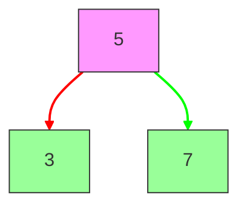
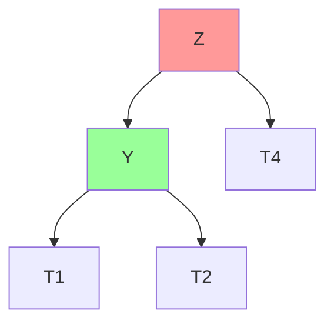
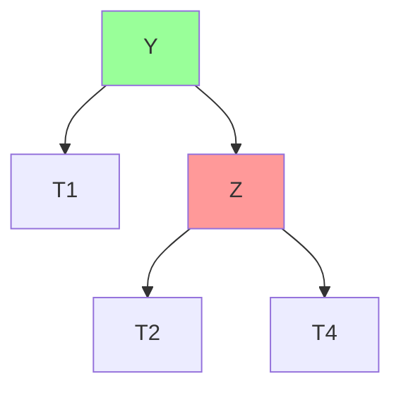
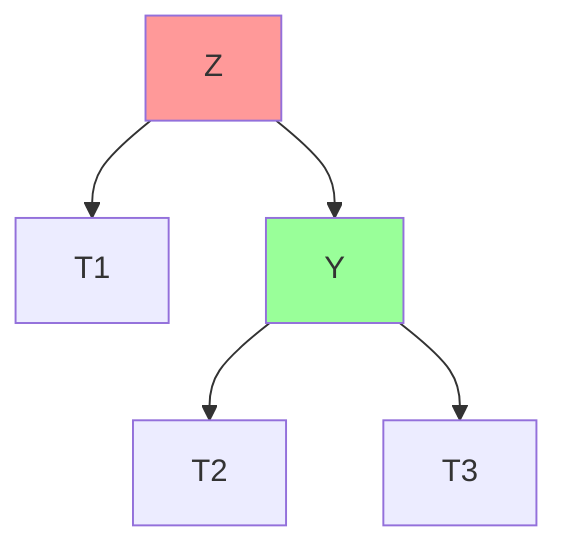
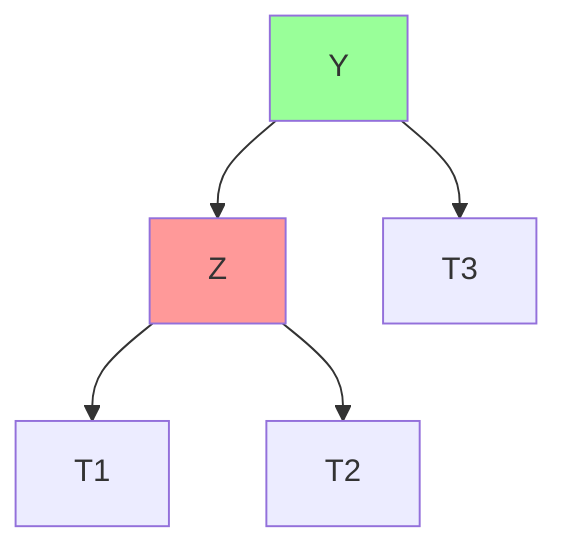
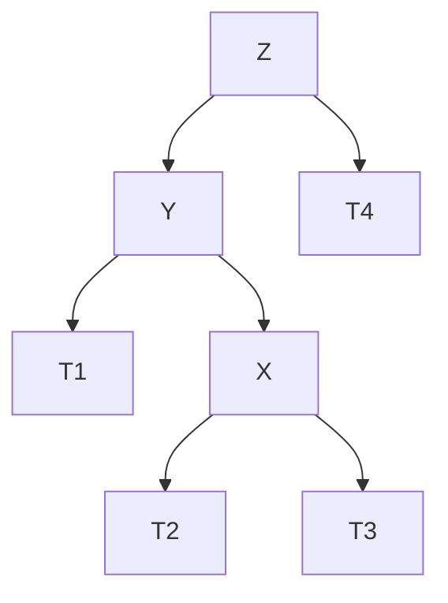
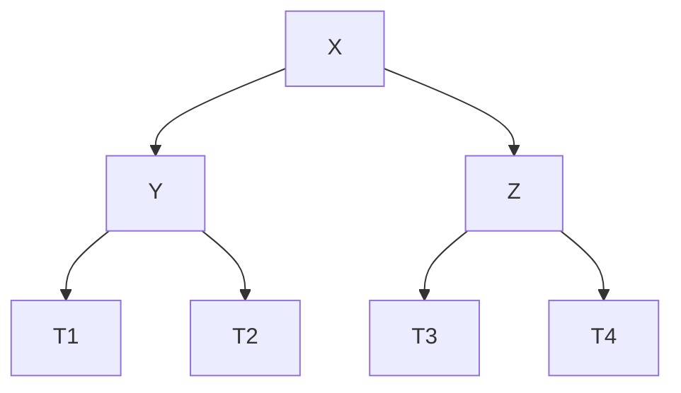
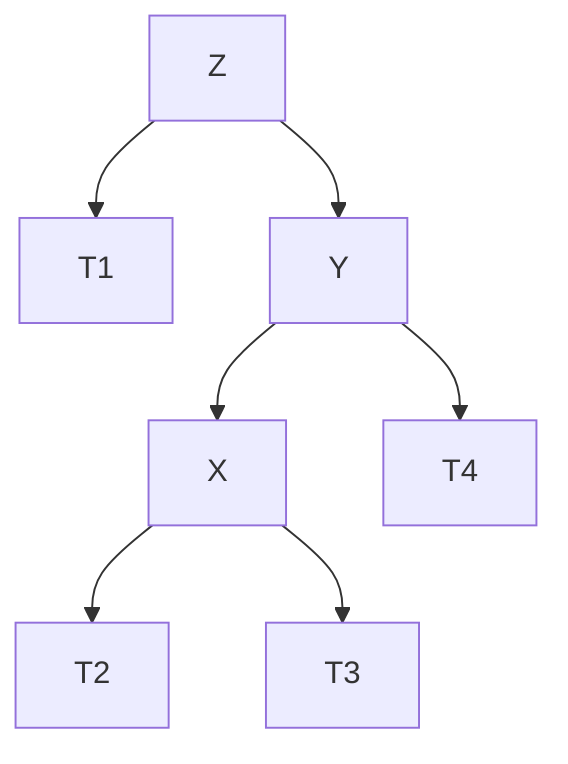
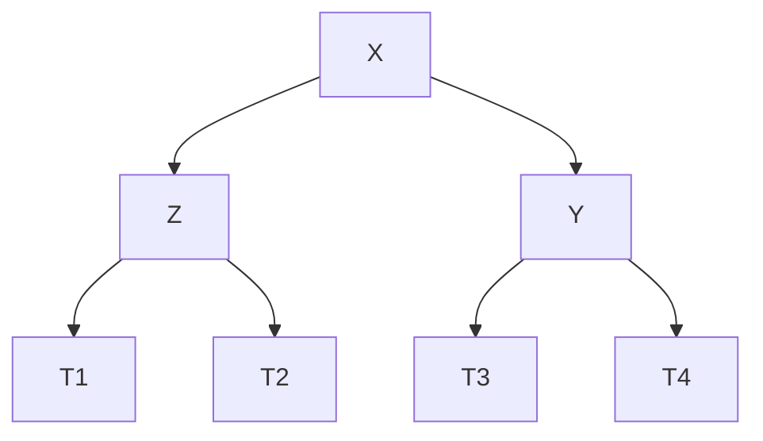

# AVL Trees: The Self-Balancing Binary Search Tree

## 🌳 What is an AVL Tree?

A self-balancing binary search tree where:

- **Balance Factor**: Height difference between left/right subtrees ≤ 1
- **Automatic Rebalancing**: Maintains O(log n) operations via rotations
- **Invented by** Adelson-Velsky and Landis (1962)



## 🏆 Key Features

1. **Balance Factor**: `height(left) - height(right)`
2. **Strict Balance**: Guarantees O(log n) operations
3. **Rotation Operations**: LL, RR, LR, RL
4. **Height Tracking**: Each node stores subtree height

---

## 🔄 Rotation Types

### 1. Left Rotation (LL)



⬇️ Rotation ⬇️



### 2. Right Rotation (RR)



⬇️ Rotation ⬇️



### 3. Left-Right Rotation (LR)



⬇️ Rotation ⬇️



### 4. Right-Left Rotation (RL)



⬇️ Rotation ⬇️



---

## ⚙️ Core Operations & Complexities

| Operation | Time Complexity | Details                        |
| --------- | --------------- | ------------------------------ |
| Insert    | O(log n)        | May require rotations          |
| Delete    | O(log n)        | May require multiple rotations |
| Search    | O(log n)        | Standard BST search            |
| Rotations | O(1)            | Pointer reassignments          |

---

## 🚀 C# Implementation

### AVL Node Class

```csharp
public class AVLNode<T> where T : IComparable<T>
{
    public T Value { get; set; }
    public AVLNode<T> Left { get; set; }
    public AVLNode<T> Right { get; set; }
    public int Height { get; set; } = 1;

    public AVLNode(T value) => Value = value;

    public int BalanceFactor =>
        (Left?.Height ?? 0) - (Right?.Height ?? 0);
}
```

### AVL Tree Class

```csharp
public class AVLTree<T> where T : IComparable<T>
{
    private AVLNode<T> _root;

    public void Insert(T value) => _root = Insert(_root, value);
    public void Delete(T value) => _root = Delete(_root, value);

    private AVLNode<T> Insert(AVLNode<T> node, T value)
    {
        if (node == null) return new AVLNode<T>(value);

        int cmp = value.CompareTo(node.Value);
        if (cmp < 0) node.Left = Insert(node.Left, value);
        else if (cmp > 0) node.Right = Insert(node.Right, value);
        else return node; // Duplicates not allowed

        UpdateHeight(node);
        return Rebalance(node);
    }

    private AVLNode<T> Delete(AVLNode<T> node, T value)
    {
        if (node == null) return null;

        int cmp = value.CompareTo(node.Value);
        if (cmp < 0) node.Left = Delete(node.Left, value);
        else if (cmp > 0) node.Right = Delete(node.Right, value);
        else
        {
            if (node.Left == null || node.Right == null)
                return node.Left ?? node.Right;

            var temp = MinValueNode(node.Right);
            node.Value = temp.Value;
            node.Right = Delete(node.Right, temp.Value);
        }

        UpdateHeight(node);
        return Rebalance(node);
    }

    private AVLNode<T> Rebalance(AVLNode<T> node)
    {
        if (node.BalanceFactor > 1)
        {
            if (node.Left.BalanceFactor < 0)
                node.Left = RotateLeft(node.Left);
            return RotateRight(node);
        }

        if (node.BalanceFactor < -1)
        {
            if (node.Right.BalanceFactor > 0)
                node.Right = RotateRight(node.Right);
            return RotateLeft(node);
        }

        return node;
    }

    private AVLNode<T> RotateRight(AVLNode<T> z)
    {
        var y = z.Left;
        var T3 = y.Right;

        y.Right = z;
        z.Left = T3;

        UpdateHeight(z);
        UpdateHeight(y);

        return y;
    }

    private AVLNode<T> RotateLeft(AVLNode<T> z)
    {
        var y = z.Right;
        var T2 = y.Left;

        y.Left = z;
        z.Right = T2;

        UpdateHeight(z);
        UpdateHeight(y);

        return y;
    }

    private void UpdateHeight(AVLNode<T> node) =>
        node.Height = 1 + Math.Max(
            node.Left?.Height ?? 0,
            node.Right?.Height ?? 0);

    private AVLNode<T> MinValueNode(AVLNode<T> node) =>
        node.Left == null ? node : MinValueNode(node.Left);
}
```

---

## 🌍 Real-World Applications

1. **Database Indexing**: Fast data retrieval
2. **Memory Management**: Allocators need balanced trees
3. **Game Engines**: Scene graph management
4. **Network Routing**: Efficient prefix searches
5. **3D Graphics**: BSP trees for rendering

---

## 🚫 Common Mistakes

### 1. Incorrect Height Update

```csharp
// Wrong: Forgetting to update parent heights
node.Height = 1 + Math.Max(left, right);
```

### 2. Improper Rotation Order

```csharp
// Must check child balance factors before rotation
if (node.Left.BalanceFactor < 0)
    node.Left = RotateLeft(node.Left);
```

### 3. Ignoring Duplicates

```csharp
// Handle duplicates based on use case
if (cmp == 0)
    throw new InvalidOperationException("No duplicates allowed");
```

### 4. Unbalanced Deletion

```csharp
// Must rebalance after deletion
node.Right = Delete(node.Right, temp.Value);
UpdateHeight(node);
return Rebalance(node);
```

---

## 🆚 AVL vs Red-Black Trees

| Feature           | AVL Tree             | Red-Black Tree     |
| ----------------- | -------------------- | ------------------ |
| **Balance**       | Strict               | Relaxed            |
| **Search**        | Faster (more strict) | Slower             |
| **Insert/Delete** | More rotations       | Fewer rotations    |
| **Storage**       | Height per node      | Color bit per node |
| **Use Case**      | Read-heavy           | Write-heavy        |

---

## 🏋️ Practice Problems

1. **Medium**: [Validate AVL Tree](https://leetcode.com/problems/balanced-binary-tree/)
2. **Hard**: [Count Smaller Numbers After Self](https://leetcode.com/problems/count-of-smaller-numbers-after-self/)
3. **Challenge**: [Implement AVL Tree](https://www.geeksforgeeks.org/avl-tree-set-1-insertion/)

---

## 📚 Key Takeaways

1. **Self-Balancing**: Maintains O(log n) operations
2. **Rotation Logic**: Four rotation cases (LL, RR, LR, RL)
3. **Height Tracking**: Critical for balance factor
4. **Complex But Efficient**: Ideal for search-heavy workloads
5. **Implementation Care**: Proper height updates and rebalancing

> "AVL Trees turn the chaotic BST into a disciplined, efficient structure." - CS Wisdom
