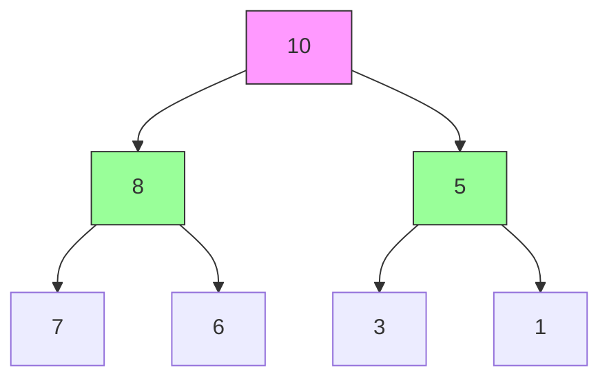
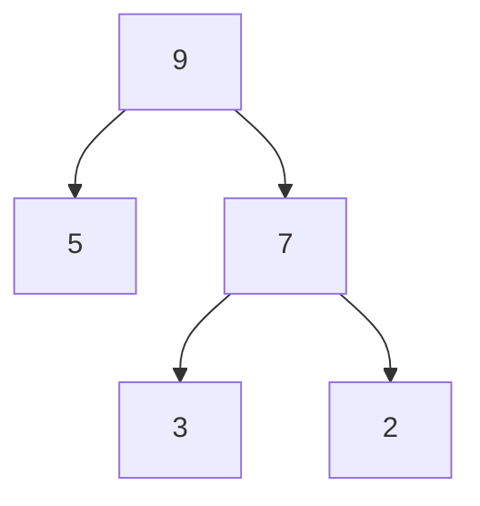
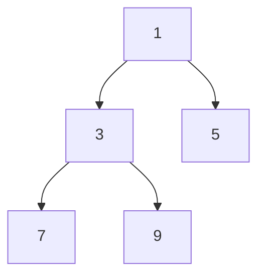

# Heaps: The Priority Champions

## 🏗️ What is a Heap?

A complete binary tree that satisfies the **heap property**:

- **Max-Heap**: Parent ≥ Children
- **Min-Heap**: Parent ≤ Children



## 🏆 Key Features

1. **Complete Binary Tree**: All levels filled except last (left-filled)
2. **Fast Root Access**: O(1) for min/max retrieval
3. **Efficient Insert/Extract**: O(log n) operations
4. **Array Representation**: Memory-efficient storage

---

## 🌐 Types of Heaps

### 1. Max-Heap



- Root = Maximum element

### 2. Min-Heap



- Root = Minimum element

### 3. Binary Heap (Most Common)

- Implemented as array
- Parent at `i` → Children at `2i+1` and `2i+2`

---

## ⚙️ Core Operations & Complexities

| Operation    | Time Complexity | Description                |
| ------------ | --------------- | -------------------------- |
| Insert       | O(log n)        | Add element & heapify up   |
| Extract Root | O(log n)        | Remove root & heapify down |
| Peek         | O(1)            | View root without removal  |
| Build Heap   | O(n)            | Convert array → heap       |
| Heap Sort    | O(n log n)      | Sort using heap operations |

---

## 🚀 C# Implementation (Max-Heap)

### Heap Class

```csharp
public class MaxHeap
{
    private List<int> _heap = new List<int>();

    public void Insert(int value)
    {
        _heap.Add(value);
        HeapifyUp(_heap.Count - 1);
    }

    public int ExtractMax()
    {
        if (_heap.Count == 0)
            throw new InvalidOperationException("Heap is empty");

        int max = _heap[0];
        _heap[0] = _heap[^1];
        _heap.RemoveAt(_heap.Count - 1);
        HeapifyDown(0);
        return max;
    }

    private void HeapifyUp(int index)
    {
        while (index > 0)
        {
            int parentIndex = (index - 1) / 2;
            if (_heap[index] <= _heap[parentIndex]) break;

            (_heap[index], _heap[parentIndex]) = (_heap[parentIndex], _heap[index]);
            index = parentIndex;
        }
    }

    private void HeapifyDown(int index)
    {
        int lastIndex = _heap.Count - 1;
        while (true)
        {
            int leftChild = 2 * index + 1;
            int rightChild = 2 * index + 2;
            int largest = index;

            if (leftChild <= lastIndex && _heap[leftChild] > _heap[largest])
                largest = leftChild;

            if (rightChild <= lastIndex && _heap[rightChild] > _heap[largest])
                largest = rightChild;

            if (largest == index) break;

            (_heap[index], _heap[largest]) = (_heap[largest], _heap[index]);
            index = largest;
        }
    }
}
```

---

## 🧩 Common Algorithms

### 1. Heap Sort

```csharp
void HeapSort(int[] arr)
{
    // Build max-heap
    for (int i = arr.Length/2 - 1; i >= 0; i--)
        Heapify(arr, arr.Length, i);

    // Extract elements
    for (int i = arr.Length-1; i > 0; i--)
    {
        (arr[0], arr[i]) = (arr[i], arr[0]);
        Heapify(arr, i, 0);
    }
}

void Heapify(int[] arr, int n, int i)
{
    int largest = i;
    int left = 2*i + 1;
    int right = 2*i + 2;

    if (left < n && arr[left] > arr[largest])
        largest = left;

    if (right < n && arr[right] > arr[largest])
        largest = right;

    if (largest != i)
    {
        (arr[i], arr[largest]) = (arr[largest], arr[i]);
        Heapify(arr, n, largest);
    }
}
```

### 2. Find Kth Largest Element

```csharp
int FindKthLargest(int[] nums, int k)
{
    var heap = new PriorityQueue<int, int>();
    foreach (int num in nums)
    {
        heap.Enqueue(num, num);
        if (heap.Count > k)
            heap.Dequeue();
    }
    return heap.Dequeue();
}
```

---

## 🌍 Real-World Applications

1. **Priority Queues**: Hospital emergency rooms
2. **Job Scheduling**: OS process management
3. **Graph Algorithms**: Dijkstra's, Prim's
4. **Memory Management**: Dynamic allocation
5. **Median Maintenance**: Streaming data

---

## 🚫 Common Mistakes

### 1. Index Calculation Errors

```csharp
// Wrong child calculation
int leftChild = 2 * index; // Should be 2*i +1

// Correct
int leftChild = 2 * index + 1;
```

### 2. Forgetting Heapify

```csharp
// Missing heapify after insertion
_heap.Add(value);
// Must call HeapifyUp(_heap.Count-1)
```

### 3. Array vs Zero-Based Index

```csharp
// Parent calculation for 1-based index
int parent = i/2; // Wrong for 0-based
```

### 4. Duplicate Priorities

```csharp
// Handle duplicates based on use case
// May need stable priority handling
```

---

## 📊 Performance Considerations

| Scenario           | Heap Advantage                 | Alternative         |
| ------------------ | ------------------------------ | ------------------- |
| Frequent Min/Max   | O(1) access                    | BST: O(log n)       |
| Streaming Data     | Efficient top-K maintenance    | Sorting: O(n log n) |
| Memory Constraints | Array implementation efficient | Pointer-based       |
| Mixed Operations   | Worse for search (O(n))        | Hash Tables: O(1)   |

---

## 🏋️ Practice Problems

1. **Easy**: [Kth Largest Element](https://leetcode.com/problems/kth-largest-element-in-an-array/)
2. **Medium**: [Merge K Sorted Lists](https://leetcode.com/problems/merge-k-sorted-lists/)
3. **Hard**: [Sliding Window Maximum](https://leetcode.com/problems/sliding-window-maximum/)
4. **Classic**: [Implement Heap Sort](https://en.wikipedia.org/wiki/Heapsort)

---

## 📚 Key Takeaways

1. **Heap Property**: Parent-child relationship crucial
2. **Complete Tree**: Enables array storage
3. **Priority Management**: Optimal for min/max operations
4. **Space Efficiency**: No pointer storage overhead
5. **C# Tools**: `PriorityQueue<TElement,TPriority>` class

> "Heaps turn chaos into ordered priority." - Algorithm Enthusiast
