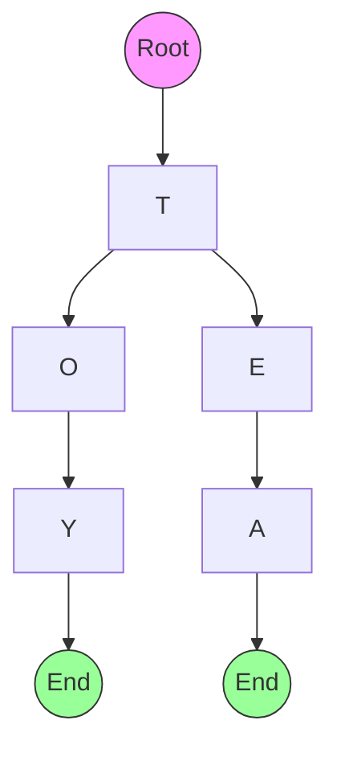
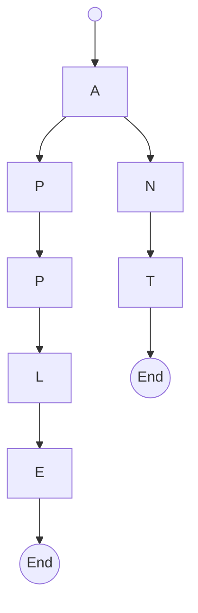
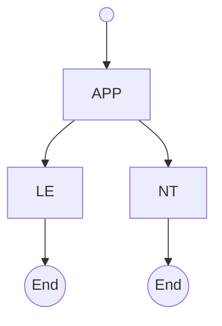
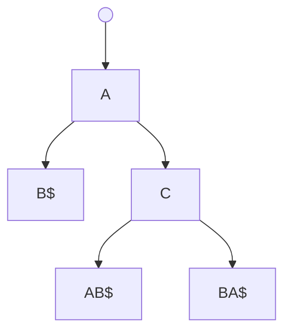

# Tries: The String Search Optimizer

## 🔤 What is a Trie?

A tree-like data structure optimized for **string storage** and **prefix-based search**:

- **Nodes**: Represent characters
- **Edges**: Represent character transitions
- **Root**: Empty starting node
- **Leaf Nodes**: Mark end of words



## 🏆 Key Features

1. **Prefix Search**: Find all words starting with "app"
2. **Space Efficiency**: Shares common prefixes between words
3. **Fast Lookups**: O(L) time for L-length strings
4. **Ordered Traversal**: Alphabetical iteration of stored words

---

## 🌐 Types of Tries

### 1. Standard Trie



- Basic prefix tree structure

### 2. Compressed Trie (Radix Tree)



- Merges single-child nodes for space efficiency

### 3. Suffix Tree



- Stores all suffixes of a string (used in bioinformatics)

---

## ⚙️ Core Operations & Complexities

| Operation      | Time Complexity | Description                  |
| -------------- | --------------- | ---------------------------- |
| Insert         | O(L)            | Add word of length L         |
| Search         | O(L)            | Exact word search            |
| Prefix Search  | O(L)            | Find all words with prefix   |
| Delete         | O(L)            | Remove word                  |
| Longest Prefix | O(L)            | Find longest matching prefix |

---

## 🚀 C# Implementation

### TrieNode Class

```csharp
public class TrieNode
{
    public Dictionary<char, TrieNode> Children { get; } = new();
    public bool IsEndOfWord { get; set; }
}
```

### Trie Class

```csharp
public class Trie
{
    private readonly TrieNode _root = new();

    public void Insert(string word)
    {
        TrieNode current = _root;
        foreach (char c in word)
        {
            if (!current.Children.TryGetValue(c, out TrieNode? node))
            {
                node = new TrieNode();
                current.Children[c] = node;
            }
            current = node;
        }
        current.IsEndOfWord = true;
    }

    public bool Search(string word)
    {
        TrieNode? node = GetNode(word);
        return node != null && node.IsEndOfWord;
    }

    public bool StartsWith(string prefix) => GetNode(prefix) != null;

    private TrieNode? GetNode(string s)
    {
        TrieNode current = _root;
        foreach (char c in s)
        {
            if (!current.Children.TryGetValue(c, out TrieNode? node))
                return null;
            current = node;
        }
        return current;
    }

    public List<string> GetWordsWithPrefix(string prefix)
    {
        List<string> results = new();
        TrieNode? node = GetNode(prefix);
        if (node == null) return results;

        CollectWords(node, prefix, results);
        return results;
    }

    private void CollectWords(TrieNode node, string prefix, List<string> results)
    {
        if (node.IsEndOfWord) results.Add(prefix);

        foreach ((char c, TrieNode child) in node.Children)
            CollectWords(child, prefix + c, results);
    }
}
```

---

## 🧩 Common Algorithms

### 1. Autocomplete System

```csharp
public class AutocompleteSystem
{
    private Trie _trie = new();

    public void AddWords(IEnumerable<string> words)
    {
        foreach (string word in words)
            _trie.Insert(word);
    }

    public List<string> Suggest(string prefix) => _trie.GetWordsWithPrefix(prefix);
}
```

### 2. Longest Common Prefix

```csharp
public string LongestCommonPrefix(string[] words)
{
    Trie trie = new();
    foreach (string word in words) trie.Insert(word);

    StringBuilder prefix = new();
    TrieNode current = trie.Root;

    while (current.Children.Count == 1 && !current.IsEndOfWord)
    {
        char c = current.Children.Keys.First();
        prefix.Append(c);
        current = current.Children[c];
    }

    return prefix.ToString();
}
```

### 3. Word Validation (Scrabble)

```csharp
public bool IsValidWord(string word, Trie dictionary)
{
    return dictionary.Search(word.ToUpper());
}
```

---

## 🌍 Real-World Applications

1. **Search Engines**: Autocomplete suggestions
2. **Spell Checkers**: Dictionary storage
3. **IP Routing**: Longest prefix matching
4. **Genome Analysis**: DNA sequence storage
5. **Contact Lists**: Phone number validation

---

## 🚫 Common Mistakes

### 1. Missing End Markers

```csharp
// Forgetting to set IsEndOfWord
current.IsEndOfWord = true; // Crucial for word boundaries
```

### 2. Case Sensitivity

```csharp
// Mixing cases causes missed matches
Insert("Apple");
Search("apple"); // false
// Solution: Normalize case
```

### 3. Memory Overhead

```csharp
// Use array instead of Dictionary for limited character sets
public class TrieNode
{
    public TrieNode[] Children = new TrieNode[26]; // A-Z only
}
```

### 4. Unbounded Growth

```csharp
// Implement delete to prevent memory bloat
public void Delete(string word) { ... }
```

---

## 📊 Performance Considerations

| Scenario            | Trie Advantage             | Alternative          |
| ------------------- | -------------------------- | -------------------- |
| Prefix Search       | O(L) vs O(n)               | Linear search        |
| Dictionary Storage  | Shared prefixes save space | Hash Table           |
| Ordered Data        | Alphabetical traversal     | Unordered structures |
| Fixed Character Set | Array storage optimization | Dictionary overhead  |

---

## 🏋️ Practice Problems

1. **Medium**: [Implement Trie](https://leetcode.com/problems/implement-trie-prefix-tree/)
2. **Hard**: [Word Search II](https://leetcode.com/problems/word-search-ii/)
3. **Challenge**: [Prefix AutoComplete](https://leetcode.com/problems/design-search-autocomplete-system/)
4. **Classic**: [Suffix Tree Construction](https://en.wikipedia.org/wiki/Suffix_tree)

---

## 📚 Key Takeaways

1. **Prefix Efficiency**: Ideal for autocomplete systems
2. **Memory Tradeoff**: Space vs search speed balance
3. **Character Handling**: Normalize case/encoding
4. **Compression Options**: Radix trees for optimization
5. **Versatile Use**: From search to bioinformatics

> "Tries turn string operations into tree traversals." - Algorithm Enthusiast
