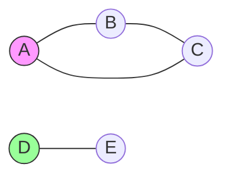

# Undirected Graphs: The Symmetric Connections

## 🤝 What is an Undirected Graph?

A set of vertices/nodes connected by edges with **no direction**:

- **Edges** are bidirectional (A-B ≡ B-A)
- **No arrows** in visual representation
- **Degree**: Number of edges per node



## 🆚 Directed vs Undirected Graphs

| Feature       | Undirected          | Directed                  |
| ------------- | ------------------- | ------------------------- |
| **Edges**     | No direction        | Arrows indicate direction |
| **Adjacency** | Mutual relationship | One-way relationship      |
| **Storage**   | Symmetric matrix    | Asymmetric matrix         |
| **Degree**    | Degree = In+Out     | Separate In/Out           |

---

## 🌐 Fundamental Concepts

### 1. Graph Properties

- **Connected**: Path exists between all node pairs
- **Cycle**: Path starting/ending at same node
- **Tree**: Connected acyclic graph
- **Complete**: Every node connected to every other

### 2. Common Representations

| Method               | Space  | Edge Query | Pros                      |
| -------------------- | ------ | ---------- | ------------------------- |
| **Adjacency List**   | O(V+E) | O(degree)  | Space-efficient           |
| **Adjacency Matrix** | O(V²)  | O(1)       | Fast edge existence check |

---

## 🚀 C# Implementation (Adjacency List)

### Graph Class

```csharp
public class UndirectedGraph
{
    private Dictionary<int, List<int>> _adjacencyList = new();

    // Add node
    public void AddVertex(int vertex)
    {
        if (!_adjacencyList.ContainsKey(vertex))
            _adjacencyList[vertex] = new List<int>();
    }

    // Add edge (both directions)
    public void AddEdge(int v1, int v2)
    {
        AddVertex(v1);
        AddVertex(v2);

        _adjacencyList[v1].Add(v2);
        _adjacencyList[v2].Add(v1);
    }

    // Get neighbors
    public List<int> GetNeighbors(int vertex) =>
        _adjacencyList.TryGetValue(vertex, out var neighbors)
            ? neighbors
            : new List<int>();
}
```

---

## 🧩 Core Algorithms

### 1. Breadth-First Search (BFS)

```csharp
public List<int> BFS(int start)
{
    var result = new List<int>();
    var visited = new HashSet<int>();
    var queue = new Queue<int>();

    queue.Enqueue(start);
    visited.Add(start);

    while (queue.Count > 0)
    {
        int current = queue.Dequeue();
        result.Add(current);

        foreach (int neighbor in GetNeighbors(current))
        {
            if (!visited.Contains(neighbor))
            {
                visited.Add(neighbor);
                queue.Enqueue(neighbor);
            }
        }
    }
    return result;
}
```

### 2. Detect Cycle

```csharp
public bool HasCycle()
{
    var visited = new HashSet<int>();

    foreach (int vertex in _adjacencyList.Keys)
    {
        if (!visited.Contains(vertex) &&
            HasCycleDFS(vertex, -1, visited))
            return true;
    }
    return false;
}

private bool HasCycleDFS(int current, int parent, HashSet<int> visited)
{
    visited.Add(current);

    foreach (int neighbor in GetNeighbors(current))
    {
        if (!visited.Contains(neighbor))
        {
            if (HasCycleDFS(neighbor, current, visited))
                return true;
        }
        else if (neighbor != parent)
            return true;
    }
    return false;
}
```

---

## 🌍 Real-World Applications

1. **Social Networks**: Friend connections
2. **Transport Systems**: Road networks
3. **Circuit Design**: Electrical components
4. **Recommendation Systems**: Product associations
5. **Epidemiology**: Disease spread modeling

---

## 🚫 Common Mistakes

### 1. Direction Assumption

```csharp
// WRONG: Adding edge in one direction only
_adjacencyList[v1].Add(v2);

// Correct for undirected:
_adjacencyList[v1].Add(v2);
_adjacencyList[v2].Add(v1);
```

### 2. Cycle Detection Errors

```csharp
// Forgetting parent check leads to false positives
if (neighbor != parent) // Crucial for undirected graphs
```

### 3. Disconnected Graphs

```csharp
// Must check all components
foreach (int vertex in _adjacencyList.Keys)
{
    if (!visited.Contains(vertex))
        TraverseComponent(vertex);
}
```

---

## 📊 Performance Considerations

| Operation       | Adjacency List | Adjacency Matrix |
| --------------- | -------------- | ---------------- |
| Add Edge        | O(1)           | O(1)             |
| Remove Edge     | O(d)           | O(1)             |
| Check Adjacency | O(d)           | O(1)             |
| Memory          | O(V + E)       | O(V²)            |

---

## 🏋️ Practice Problems

1. **Easy**: [Number of Connected Components](https://leetcode.com/problems/number-of-connected-components-in-an-undirected-graph/)
2. **Medium**: [Graph Valid Tree](https://leetcode.com/problems/graph-valid-tree/)
3. **Hard**: [Longest Consecutive Sequence](https://leetcode.com/problems/longest-consecutive-sequence/)
4. **Classic**: [Minimum Spanning Tree](https://en.wikipedia.org/wiki/Minimum_spanning_tree)

---

## 📚 Key Takeaways

1. **Bidirectional Relationships**: Edges have no direction
2. **Component Analysis**: Essential for disconnected graphs
3. **Cycle Detection**: Requires parent tracking in DFS
4. **Representation Choice**: List vs Matrix depends on use case
5. **Real-World Modeling**: Natural fit for symmetric relationships

> "Undirected graphs reveal the hidden connections that shape our world." - Graph Theorist
