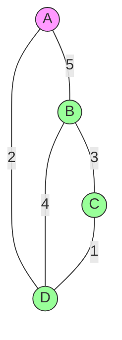
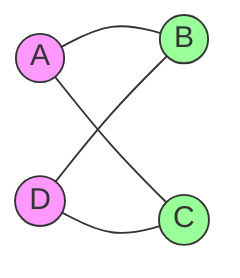
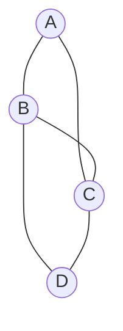

# Undirected Graphs: Advanced Concepts & Algorithms

## 🌉 Minimum Spanning Trees (MST)

A subset of edges connecting all vertices with the **minimum total edge weight**:

- **Properties**:
  - No cycles
  - Exactly `V-1` edges (for `V` vertices)
  - Applications: Network design, clustering

### Kruskal's Algorithm (Greedy Approach)



#### C# Implementation

```csharp
public class KruskalsMST
{
    public List<Edge> FindMST(List<Edge> edges, int vertexCount)
    {
        edges.Sort((a, b) => a.Weight.CompareTo(b.Weight));
        UnionFind uf = new UnionFind(vertexCount);
        List<Edge> mst = new List<Edge>();

        foreach (Edge edge in edges)
        {
            if (uf.Union(edge.U, edge.V))
                mst.Add(edge);

            if (mst.Count == vertexCount - 1)
                break;
        }
        return mst;
    }
}

public class UnionFind
{
    private int[] _parent;
    public UnionFind(int size) { /* Standard Union-Find */ }
}
```

---

## 🎨 Bipartite Graph Check

A graph whose vertices can be divided into **two disjoint sets**:

- No edges between vertices of the same set
- Applications: Dating apps, job assignments



#### C# BFS Check

```csharp
public bool IsBipartite(Dictionary<int, List<int>> graph)
{
    int[] colors = new int[graph.Count]; // 0: uncolored, 1/2: colors
    Queue<int> queue = new Queue<int>();

    foreach (int node in graph.Keys)
    {
        if (colors[node] != 0) continue;

        colors[node] = 1;
        queue.Enqueue(node);

        while (queue.Count > 0)
        {
            int current = queue.Dequeue();
            foreach (int neighbor in graph[current])
            {
                if (colors[neighbor] == colors[current])
                    return false;

                if (colors[neighbor] == 0)
                {
                    colors[neighbor] = 3 - colors[current];
                    queue.Enqueue(neighbor);
                }
            }
        }
    }
    return true;
}
```

---

## 🛤️ Eulerian Paths

A path visiting every edge **exactly once**:

- **Eulerian Circuit**: Starts/ends at same vertex
- **Conditions**:
  - All vertices have even degree (Circuit)
  - Exactly two vertices with odd degree (Path)



#### Fleury's Algorithm (Circuit Finding)

```csharp
public List<int> FindEulerianCircuit(Dictionary<int, List<int>> graph)
{
    // 1. Check all degrees are even
    // 2. Start at any vertex
    // 3. Traverse non-bridge edges first
    // 4. Hierholzer's algorithm alternative
}
```

---

## 🌐 Real-World Case Studies

### 1. Power Grid Optimization

- **Problem**: Connect cities with minimum cable cost
- **Solution**: Kruskal's/Prim's MST algorithm

### 2. Social Network Analysis

- **Problem**: Detect friend groups (connected components)
- **Solution**: DFS/BFS traversal

### 3. Traffic Flow Management

- **Problem**: Find bottleneck edges
- **Solution**: Betweenness centrality

---

## 🚧 Advanced Challenges

### 1. Edge Connectivity

- **Problem**: Minimum edges to remove to disconnect graph
- **Algorithm**: Karger's contraction algorithm

### 2. Vertex Coloring

- **Problem**: Assign colors with no adjacent duplicates
- **Application**: Exam scheduling

### 3. Max Flow/Min Cut

- **Problem**: Find network bottleneck capacity
- **Algorithm**: Ford-Fulkerson (even in undirected graphs)

---

## 🏋️ Advanced Practice Problems

1. **Hard**: [Couples Holding Hands](https://leetcode.com/problems/couples-holding-hands/)
2. **Challenge**: [Critical Connections](https://leetcode.com/problems/critical-connections-in-a-network/)
3. **Expert**: [Minimum Cost to Connect All Points](https://leetcode.com/problems/min-cost-to-connect-all-points/)
4. **Classic**: [Traveling Salesman Problem](https://en.wikipedia.org/wiki/Travelling_salesman_problem)

---

## 📚 Key Takeaways

1. **MST Algorithms**: Kruskal's (Union-Find) vs Prim's (Priority Queue)
2. **Bipartite Applications**: Matchmaking, resource allocation
3. **Eulerian Paths**: Network route optimization
4. **Advanced Metrics**: Connectivity, coloring, flow
5. **Real-World Impact**: From utilities to social networks

> "Undirected graphs model symmetry in complexity." - Network Scientist
